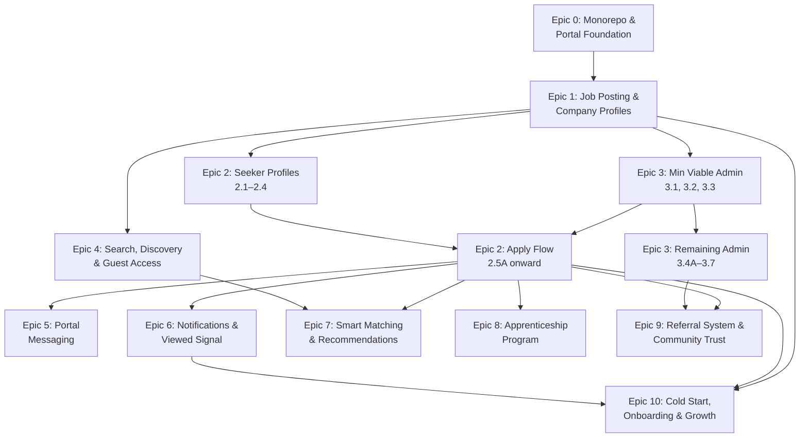

---
stepsCompleted:
  - step-01-validate-prerequisites
  - step-02-design-epics
  - step-03-create-stories
  - step-04-final-validation
inputDocuments:
  - prd-v2.md
  - architecture.md
  - ux-design-specification.md
  - product-brief-igbo-2026-03-29.md
version: "1.0"
lastUpdated: "2026-04-01"
---

# igbo - Epic Breakdown

## Overview

This document provides the complete epic and story breakdown for igbo Job Portal, decomposing the requirements from the PRD v2, UX Design Specification, Architecture, and Product Brief into implementable stories.

## Requirements Reference

> **Canonical source:** All functional requirements (FR1–FR131), non-functional requirements (NFR1–NFR42), and deferred items (DEFERRED-1–DEFERRED-21) are defined in **prd-v2.md**. This document references PRD FR numbers directly — no separate FR inventory is maintained here.
>
> _Reconciled 2026-04-01: Epics-local FR numbering removed. PRD v2 is the single source of truth for requirement definitions._

### Cross-cutting Constraints (addressed across all epics)

- PRD NFR29 (WCAG 2.1 AA) — every epic, every component
- PRD NFR1–NFR7 (Performance) — every page, every API endpoint
- PRD NFR8–NFR17 (Security) — every mutation, every data access
- PRD FR91–FR97 (Data Protection) — each epic handling PII implements export + erasure
- PRD FR42–FR43 (Data Retention) — expired postings, closed applications, resume access revocation

### Architectural Context (from Architecture, UX, Product Brief)

- **Monorepo:** Turborepo + pnpm workspaces (`apps/community/`, `apps/portal/`, `packages/db|auth|config|integration-tests/`)
- **Matching engine:** Pre-computed `job_match_scores` table (batch recompute every 5 min) + real-time scoring on detail pages; 50% skills, 30% location, 20% experience + cultural fit
- **"Viewed by Employer" signal:** PostgreSQL outbox pattern → 1s poller → in-app + push notification; at-least-once delivery with idempotency
- **Role model:** Dual-role (seeker + employer) on single account; session-scoped `activePortalRole`; role switcher in nav
- **Component architecture:** Three-layer (semantic → domain → flow); DensityContext (Comfortable/Compact/Dense); PortalAvatar wraps community Avatar
- **Design system:** Forest Green/Golden Amber/Teal-shift/Sandy Tan; Inter + JetBrains Mono; 8px grid; progressive density by role
- **ATS pipeline:** Kanban board (desktop) / Tabs (mobile) with drag-and-drop stage gates
- **Apply flow:** One-click with auto-fill; cover letter employer opt-in only
- **Salary:** Required field with "Prefer not to disclose" option

## Epic List

### Epic 0: Monorepo Migration & Portal Foundation (Phase 0)
Developers can work in a monorepo structure with shared packages (@igbo/db, @igbo/auth, @igbo/config), and users can seamlessly navigate between community and portal via cross-subdomain SSO. Portal app scaffolded at job.[domain].
**PRD FRs:** FR87 (SSO), FR113 (portal roles), FR114 (bidirectional nav)
**Key deliverables:** Turborepo + pnpm workspaces, shared packages extracted, cross-subdomain SSO (incl. Safari ITP), portal Next.js app scaffold, CI pipeline with cross-app test gates, 4795+ existing tests passing, test migration strategy (mock path validation)
**Architectural spikes:** File upload reuse confirmation, messaging data model decision (extend chatConversations with applicationId + type discriminator)
**Standalone:** Yes — community platform remains fully operational throughout and after migration

### Epic 1: Job Posting & Company Profiles (Phase 1a)
Employers can create company profiles, post jobs with rich descriptions and Igbo cultural context, manage posting lifecycle (draft → active → filled/expired), preview before submission, switch between seeker/employer roles, and share postings to the community feed. Includes first-visit employer onboarding flow.
**PRD FRs:** FR1–FR20 (posting + company profiles), FR95 (salary required), FR104 (rich text), FR107 (cultural tags), FR115 (bilingual), FR110–FR112 (dual-role + role switcher), FR119 (preview), FR123 (analytics per posting), FR8–FR9 (close with outcome), FR1+FR12 (deadline + expiry)
**Key deliverables:** Portal foundational schema (portal_ namespace, shared enums), company profiles with trust signals, job posting CRUD with lifecycle, role model (activePortalRole + switcher), DensityContext, employer onboarding, Tiptap editor (copy from community), bilingual descriptions
**Dependency:** Epic 0

### Epic 2: Seeker Profiles & Job Applications (Phase 1a)
Job seekers can create professional profiles with community trust data, upload CVs, set visibility and matching consent, apply to jobs, track application status through a formally defined lifecycle, and view a timeline of their applications. Employers get a basic ATS pipeline view with stage management, notes, and bulk actions.
**PRD FRs:** FR21–FR32 (seeker profiles + resume + apply + tracking), FR34 (hard delete apps), FR35–FR39 (ATS pipeline + notes + dashboard), FR98 (trust signals), FR109 (duplicate prevention), FR118 (confirmation emails), FR124 (seeker analytics), FR126 (consent), FR37 (state machine), FR131 (basic CSV export per posting)
**Key deliverables:** Seeker profiles (auto-fill from community), CV upload (reuse platformFileUploads), consent toggles (matching + employer visibility), apply flow with confirmation, application state machine (submitted → hired/rejected with transition rules + timestamps), basic ATS pipeline (drag-and-drop stages), employer notes, bulk actions, seeker analytics counters, CSV export for single posting, first-visit seeker onboarding
**Dependency:** Epic 0, Epic 1. **Structural dependency on Epic 3 (min viable):** Stories 2.1–2.4 (seeker profiles, state machine) can run parallel with E3. Stories 2.5A+ (apply flow) require E3 min viable (3.1, 3.2, 3.3) because postings cannot reach `active` without admin approval (Approval Integrity Rule).
**Note:** Large epic (~16 FRs). Basic ATS stories scheduled after seeker-facing functionality to prioritize Week 6 validation critical path.

### Epic 3: Job Admin Review & Quality Assurance (Phase 1a)
JOB_ADMINs can review pending job postings, approve/reject with feedback comments, flag policy violations, verify employers, and monitor platform-wide metrics — ensuring every live posting meets community quality standards.
**PRD FRs:** FR76–FR83 (admin review queue + approve/reject + fast-lane + flag), FR96 (content screening), FR116 (fraudulent reporting), FR117 (employer verification), FR125 (admin analytics)
**Key deliverables:** Admin review queue with filters/sorting, approve/reject workflow with feedback, automated content screening, employer verification (document upload + admin review), fraudulent posting reports, platform analytics dashboard (postings, applications, time-to-fill, active users)
**Dependency:** Epic 1

### Epic 4: Search, Discovery & Guest Access (Phase 1a)
Anyone — guest or authenticated member — can browse, search, and filter job listings. Job detail pages are SEO-optimized for Google for Jobs. Guests see a clear path to register when they try to apply. Authenticated seekers see match percentages and can save searches with alerts.
**PRD FRs:** FR49–FR55 (search + filters + discovery + badges + fallback), FR70–FR75 (guest access + SEO + JSON-LD + sitemap + social meta), FR46 (explainability tags), FR99 (portal homepage), FR130 (saved searches MVP-lite)
**Key deliverables:** PostgreSQL full-text search (tsvector + GIN), faceted filters (location, salary, type, industry, remote), job discovery with categories, server-rendered detail pages, JSON-LD structured data, Open Graph/social meta tags, sitemap.xml, guest browsing with conversion flow, saved searches with daily email alerts (MVP-lite — no push, no advanced logic)
**Dependency:** Epic 1

### Epic 5: Portal Messaging (Phase 1a)
Employers and candidates can communicate in real-time through application-linked message threads with file sharing and read receipts. Typing indicators deferred post-MVP.
**PRD FRs:** FR59–FR61 (messaging + threads + application context), FR88 (shared messaging infra), FR128 (read receipts), FR129 (file sharing in messages)
**Key deliverables:** Application-scoped message threads (extend chatConversations with applicationId + type discriminator), portal Socket.IO namespace, file sharing in messages (CV/portfolio documents — required for platform containment), read receipts with timestamps (aligns with "Viewed by Employer" confidence-signal philosophy)
**Dependency:** Epic 2

### Epic 6: Notifications & "Viewed by Employer" Signal (Phase 1a/1b)
Users receive timely multi-channel notifications (email, push, in-app) for critical portal events. Seekers see when their application has been viewed by an employer — the platform's defining emotional moment — delivered within 1 second via outbox pattern. Phase 1b adds daily/weekly digest for low-priority events.
**PRD FRs:** FR62–FR65 (notifications + digest + "Viewed by Employer" + idempotency), FR33 (viewed by employer date), FR89 (shared notification system)
**Key deliverables:** Portal notification types in shared pipeline, email/push/in-app delivery for applications/status changes/messages, per-category notification preferences, "Viewed by Employer" outbox pattern (transactional INSERT, 1s poller, SKIP LOCKED, warm confirmation animation), shared notification system across community + portal, daily/weekly digest (Phase 1b)
**Dependency:** Epic 2

### Epic 7: Smart Matching & Recommendations (Phase 1b)
Seekers see personalized "Jobs for You" recommendations; employers see ranked candidate suggestions per posting. Match scores use skills, experience, location, salary, and community trust signals, with quality thresholds suppressing low-quality matches and tier labels (Strong/Good/Fair) for transparency.
**PRD FRs:** FR44–FR48 (matching formula + recommendations + explainability + never-exclude + anti-discrimination), FR41 (qualified application flag), FR103 (shared skill library)
**Key deliverables:** job_match_scores table (batch recompute every 5 min), weighted scoring (50% skills, 30% location, 20% experience + cultural fit bonus), real-time score on detail pages, quality threshold (configurable min, default 30%), tier bucketing (Strong 75%+, Good 50-74%, Fair 30-49%), "Jobs for You" dashboard section, employer candidate ranking, skill endorsement weight from community
**Dependency:** Epic 2, Epic 4
**Note:** Requires test strategy spike before implementation (pre-computed + real-time + threshold = 3 test layers)

### Epic 8: Apprenticeship Program (Phase 1b)
Community members can discover and apply for structured apprenticeship opportunities — a modern revival of Igba Odibo — with mentorship fields, learning goals, milestone tracking, and community mentor matching.
**PRD FRs:** FR56–FR58 (apprenticeship postings + business/individual-led + featured section), FR127 (motivation statement + learning goals)
**Key deliverables:** Apprenticeship as distinct job type with additional fields (mentorship structure, duration, stipend), motivation statement + learning goals on application, community mentor availability display, milestone definition and progress tracking, featured apprenticeship section
**Dependency:** Epic 2

### Epic 9: Referral System & Community Trust Integration (Phase 1b)
Community members can refer candidates for specific job postings with full tracking through to hire outcome. Trust signals (verification, badges, points, membership duration) flow visibly from community to portal.
**PRD FRs:** FR66–FR69 (share + named referral + referral badge + referred candidate notification), FR98 (community trust signals)
**Key deliverables:** Referral submission (link sharing + named referral), referral tracking (submitted → hired), referrer notifications on status changes, referral count and success rate on community profiles, referral source + trust level visible to employers, community trust signals surfaced throughout portal
**Dependency:** Epic 2, Epic 3

### Epic 10: Cold Start, Onboarding & Growth (Phase 1b)
The platform launches successfully with curated seed content, featured employer partnerships, and progressive onboarding. Includes employer brand pages, community event cross-promotion, and response time tracking.
**PRD FRs:** FR84–FR86 (browse without profile + progressive nudges + inline company creation), FR120–FR122 (seed postings + featured employers + skills survey)
**Key deliverables:** Curated seed postings for launch period, featured employer program (early adopter incentives), community skills survey to bootstrap seeker profiles, employer brand pages with custom content, community event cross-promotion (career fairs, networking), employer response time tracking ("usually responds within 2 days")
**Dependency:** Epic 1, Epic 2, Epic 6

### Epic Dependency Overview



**Critical Path:** E0 → E1 → E3(min: 3.1, 3.2, 3.3) → E2(apply: 2.5A+) → E6 (notifications complete the core feedback loop)
**Key Structural Dependency:** Postings cannot reach `active` without admin approval (Approval Integrity Rule). E3 minimum viable (review queue + approve/reject + screening) MUST complete before the apply flow in E2 is usable. Without E3, the posting lifecycle has a broken transition (`pending_review` → `active` has no actor).
**Parallel Workstreams after E1:** E2 seeker stories (2.1–2.4) || E3 min viable (3.1–3.3) || E4 — all three run concurrently
**Parallel Workstreams after E2 apply flow:** E5, E6, E7, E8, E9 can progress in parallel. E3 remaining (3.4A–3.7) can run parallel with E2 apply.
**Phase 1a (Epics 0–6):** Core hiring loop — post, approve, apply, review, search, message, notify
**Phase 1b (Epics 7–10):** Intelligence, culture, trust, growth

---

## Epic 0: Monorepo Migration & Portal Foundation

Developers can work in a monorepo structure with shared packages (@igbo/db, @igbo/auth, @igbo/config), and users can seamlessly navigate between community and portal via cross-subdomain SSO. Portal app scaffolded at job.[domain].

### Story 0.1: Monorepo Structure & @igbo/config

As a developer,
I want the igbo project restructured into a Turborepo + pnpm workspaces monorepo with a shared @igbo/config package,
So that both the community and portal apps can share environment variables, type definitions, and constants without duplication.

**Acceptance Criteria:**

**Given** the existing igbo community platform codebase
**When** the monorepo structure is initialized
**Then** the directory structure contains `apps/community/`, `apps/portal/` (empty scaffold), and `packages/config/`
**And** Turborepo is configured with `turbo.json` defining `build`, `dev`, `test`, and `lint` pipelines
**And** pnpm workspaces are configured in `pnpm-workspace.yaml`

**Given** shared environment variables, TypeScript type definitions, and constants exist in the community app
**When** they are extracted to `@igbo/config`
**Then** the package exports env validation (e.g., Zod schemas), shared TypeScript types, and constant values
**And** the community app imports from `@igbo/config` instead of local files
**And** no environment variable or constant is duplicated between the package and the community app

**Given** the monorepo structure is complete
**When** `pnpm install` and `pnpm build` are run from the root
**Then** all packages resolve correctly and the community app builds without errors
**And** all 4795+ existing tests pass with zero regressions

### Story 0.2A: @igbo/db Extraction (Read Layer)

As a developer,
I want the database schema definitions, query functions, and connection setup extracted into a shared @igbo/db package,
So that both apps can access the shared PostgreSQL database through a single source of truth.

**Acceptance Criteria:**

**Given** the existing `src/db/` directory in the community app with schema files, query modules, and `drizzle.config.ts`
**When** the read layer is extracted to `@igbo/db`
**Then** all schema files (`auth-users.ts`, `community-posts.ts`, etc.) are in `packages/db/src/schema/`
**And** all query functions are in `packages/db/src/queries/`
**And** the database connection setup (`db/index.ts`) is in `packages/db/src/`
**And** the package exports all schemas and queries via named exports

**Given** the community app previously imported from `@/db/*`
**When** imports are updated to `@igbo/db/*`
**Then** all existing functionality works identically
**And** no `@/db/` import paths remain in the community app source code

**Given** test files mock `@/db/*` paths
**When** mock paths are updated to `@igbo/db/*`
**Then** all 4795+ existing tests pass
**And** no test file references stale `@/db/` import paths

**Given** the `@igbo/db` package is published in the monorepo
**When** the portal app (future) adds it as a dependency
**Then** it can import schemas and queries without any community-app-specific coupling

### Story 0.2B: Migration System & Journal

As a developer,
I want the database migration system extracted into @igbo/db with timestamp-based naming and an auto-idx journal script,
So that both apps can contribute migrations to a single ordered pipeline without conflicts.

**Acceptance Criteria:**

**Given** the existing migrations in `src/db/migrations/` with sequential numbering (0001–0049+)
**When** the migration system is extracted to `packages/db/src/migrations/`
**Then** all existing SQL migration files are moved with their content intact
**And** the `meta/_journal.json` is moved and remains valid
**And** `drizzle.config.ts` is in `packages/db/` and points to the new migration directory

**Given** the architecture specifies timestamp-based migration naming
**When** a new migration is created
**Then** it uses a timestamp-based filename format (e.g., `20260401120000_description.sql`)
**And** an auto-idx script generates the correct `_journal.json` entry automatically
**And** the script calculates `idx`, `version`, `when`, `tag`, and `breakpoints` fields

**Given** both apps may need to create migrations
**When** migrations from different apps target different tables
**Then** the migration pipeline applies them in timestamp order regardless of which app created them
**And** no manual journal editing is required

**Given** the migration system is extracted
**When** `pnpm db:migrate` is run from the monorepo root
**Then** all existing migrations apply successfully to a fresh database
**And** the community app boots and functions correctly against the migrated schema

### Story 0.3A: @igbo/auth Extraction

As a developer,
I want the Auth.js v5 configuration, session utilities, and permission helpers extracted into a shared @igbo/auth package,
So that both apps share a single authentication system and role definitions.

**Acceptance Criteria:**

**Given** the existing auth setup in the community app (`auth.ts`, `lib/admin-auth.ts`, `services/permissions.ts`, session types)
**When** the auth layer is extracted to `@igbo/auth`
**Then** `packages/auth/` contains Auth.js configuration, session utilities, and permission helpers
**And** the package exports `auth()`, `requireAuthenticatedSession()`, `requireAdminSession()`, and session types
**And** the community app imports all auth functions from `@igbo/auth`

**Given** the portal will introduce new roles (JOB_SEEKER, EMPLOYER, JOB_ADMIN)
**When** the role definitions are in `@igbo/auth`
**Then** the role enum is extensible — portal roles are defined alongside community roles (MEMBER, ADMIN, MODERATOR)
**And** the `authRoles` table schema supports both community and portal roles
**And** existing community role checks continue to function without modification

**Given** auth is extracted
**When** a user logs in to the community app
**Then** the authentication flow works identically to pre-extraction
**And** sessions are created and validated correctly
**And** all auth-related tests pass (session mocks updated to `@igbo/auth` paths)

### Story 0.3B: Cross-Subdomain SSO

As a community member,
I want to be automatically authenticated on the job portal when I'm logged into the community platform,
So that I don't need to log in separately when switching between community and portal.

**Acceptance Criteria:**

**Given** a user is authenticated on the community platform at `[domain]`
**When** they navigate to the job portal at `job.[domain]`
**Then** they are automatically authenticated without a login prompt
**And** their session includes both community and portal role information

**Given** the SSO implementation uses apex-domain cookies
**When** the auth cookie is set during community login
**Then** the cookie `Domain` is set to `.[domain]` (apex domain)
**And** the cookie attributes include `Secure`, `HttpOnly`, and `SameSite=Lax`
**And** both subdomains can read the session cookie

**Given** a user is authenticated on the portal
**When** they navigate back to the community platform
**Then** their session is valid and they remain authenticated
**And** no additional token exchange or redirect is required

**Given** a session is about to expire
**When** the user is active on either subdomain
**Then** a silent token refresh extends the session transparently
**And** no visible interruption occurs in the user experience

**Given** SSO is implemented
**When** automated tests validate cross-subdomain authentication
**Then** login on community → portal access, login on portal → community access, and logout on either → logout on both all pass

### Story 0.3C: Safari ITP Compatibility

As a user on Safari (macOS and iOS 17+),
I want cross-subdomain SSO to work reliably despite Intelligent Tracking Prevention,
So that I have the same seamless experience as users on other browsers.

**Acceptance Criteria:**

**Given** Safari's ITP partitions or blocks third-party cookies and limits first-party cookie lifetimes
**When** a user authenticated on `[domain]` visits `job.[domain]` in Safari
**Then** the SSO workaround ensures the session is recognized on the portal
**And** the user is authenticated without a visible redirect or login prompt

**Given** Safari iOS 17+ in both browser and PWA (Home Screen) contexts
**When** a user navigates between community and portal
**Then** SSO functions correctly in both Safari browser and PWA mode
**And** no session loss occurs after backgrounding and returning to the PWA

**Given** ITP restrictions may evolve across Safari versions
**When** the workaround is implemented
**Then** the approach is documented with the specific ITP behavior it addresses
**And** a fallback path exists (e.g., silent redirect-based token exchange) if cookie-based SSO fails
**And** the fallback completes within 200ms with no visible UI flash

**Given** cross-browser SSO compatibility is required
**When** SSO is tested across Chrome, Firefox, Safari (macOS), Safari (iOS 17+ browser), and Safari (iOS 17+ PWA)
**Then** all five environments pass authentication round-trip tests

### Story 0.4: Portal App Scaffold & Navigation

As a community member visiting the job portal,
I want a functional portal app with navigation back to the community and my portal role reflected in the UI,
So that I can orient myself and begin using portal features in the correct context (seeker or employer).

**Acceptance Criteria:**

**Given** the portal app scaffold does not yet exist
**When** `apps/portal/` is created
**Then** it is a Next.js 16.1.x App Router application with TypeScript strict mode
**And** it imports `@igbo/config`, `@igbo/db`, and `@igbo/auth` from the monorepo
**And** it uses next-intl with a `Portal.*` i18n namespace (messages in shared `messages/en.json` and `messages/ig.json`)
**And** shadcn/ui is initialized with the portal's design tokens (copied from community, not shared via @igbo/ui)

**Given** a user is authenticated via SSO and has portal roles
**When** they visit the portal
**Then** their `activePortalRole` is injected into the session context (defaulting to JOB_SEEKER if they have both roles)
**And** the portal layout reflects the active role (seeker vs employer navigation)
**And** a role indicator is visible in the UI (to be expanded into a full role switcher in Epic 1)

**Given** a user is on the portal
**When** they look at the navigation
**Then** a clearly visible link/button navigates back to the community platform
**And** the community platform has a corresponding link to the portal (PRD FR114 — bidirectional navigation)

**Given** a guest (unauthenticated) user visits the portal
**When** the portal loads
**Then** they see public portal pages (placeholder for Epic 4's guest access)
**And** protected routes redirect to the community login page with a `returnTo` parameter pointing back to the portal

**Given** the portal app scaffold is complete
**When** `pnpm dev` is run from the monorepo root
**Then** both community (localhost:3000) and portal (localhost:3001 or configured port) start successfully
**And** hot module reload works independently for each app

### Story 0.5: CI Pipeline & Cross-App Test Gates

As a developer,
I want the CI pipeline to enforce that shared package changes don't break either app,
So that regressions are caught before merging and both apps remain stable.

**Acceptance Criteria:**

**Given** a PR modifies files in `packages/config/`, `packages/db/`, or `packages/auth/`
**When** CI runs
**Then** tests for BOTH `apps/community/` AND `apps/portal/` are executed
**And** the PR cannot merge unless both test suites pass

**Given** a PR modifies files only in `apps/community/`
**When** CI runs
**Then** only `apps/community/` tests are executed (Turborepo detects no shared package changes)
**And** `apps/portal/` tests are skipped for efficiency

**Given** a PR modifies files only in `apps/portal/`
**When** CI runs
**Then** only `apps/portal/` tests are executed
**And** `apps/community/` tests are skipped for efficiency

**Given** the test migration from Story 0.2A updated mock paths
**When** a CI verification job runs
**Then** it scans for any remaining stale `@/db/`, `@/auth/`, or `@/config/` import paths in test files
**And** fails if any stale paths are found

**Given** the CI pipeline is configured
**When** the full suite runs on main branch
**Then** all 4795+ community tests pass
**And** portal scaffold tests pass (at minimum: app renders, auth integration, SSO smoke test)
**And** build artifacts for both apps are produced successfully

### Story 0.6: Redis & Event Bus Foundation

As a developer,
I want the portal to connect to the shared Redis instance and EventBus infrastructure,
So that portal services can use caching, pub/sub, and event-driven patterns from day one.

**Acceptance Criteria:**

**Given** the community platform uses Redis for caching, rate limiting, and real-time features
**When** the portal connects to the same Redis instance
**Then** portal keys use a distinct prefix namespace via `createRedisKey()` (e.g., `portal:*`)
**And** no key collisions occur between community and portal data
**And** the `createRedisKey()` utility is in `@igbo/config` (or shared location) and supports both namespaces

**Given** the community platform uses an EventBus for decoupled service communication
**When** the portal emits or subscribes to events
**Then** portal event types are registered in the shared EventBus type system (e.g., `portal.job.created`, `portal.application.submitted`)
**And** community event handlers are not triggered by portal events (namespace isolation)
**And** portal event handlers are not triggered by community events

**Given** the portal will use Socket.IO for real-time features (messaging, notifications)
**When** the Socket.IO server configuration is reviewed
**Then** a portal-specific namespace (`/portal`) is configured on the shared Socket.IO server
**And** authentication middleware on the portal namespace validates portal sessions
**And** community namespace (`/`) continues to function without changes

**Given** the shared infrastructure is configured
**When** integration smoke tests run
**Then** portal can SET/GET a Redis key with portal prefix
**And** portal can emit an event and a portal-scoped handler receives it
**And** portal Socket.IO namespace accepts authenticated connections
**And** community Redis keys, events, and Socket.IO connections are unaffected

---

## Epic 1: Job Posting & Company Profiles

Employers can create company profiles, post jobs with rich descriptions and Igbo cultural context, manage posting lifecycle (draft → active → filled/expired), preview before submission, switch between seeker/employer roles, and share postings to the community feed. Includes first-visit employer onboarding flow.

### Story 1.1A: Portal Schema Foundation & Role Model

As a developer,
I want portal-specific database tables and a role model with activePortalRole in the session,
So that the portal has a data foundation and users are scoped to the correct context (seeker or employer) for permission checks.

**Acceptance Criteria:**

**Given** the portal needs its own data structures
**When** the portal schema migration is created
**Then** `portal_company_profiles` table exists with columns: id, owner_user_id (FK to auth_users), name, logo_url, description, industry, company_size, culture_info, trust_badge (boolean, derived from community verification), created_at, updated_at
**And** `portal_job_postings` table exists with columns: id, company_id (FK to portal_company_profiles), title, description_html, requirements, salary_min, salary_max, salary_competitive_only (boolean), location, employment_type (enum: full_time, part_time, contract, internship, apprenticeship), status (enum: draft, pending_review, active, paused, filled, expired, rejected), cultural_context_json, description_igbo_html, application_deadline, expires_at, created_at, updated_at
**And** `portal_applications` stub table exists with columns: id, job_id (FK), seeker_user_id (FK), status (enum: submitted, under_review, shortlisted, interview, offered, hired, rejected, withdrawn), created_at, updated_at
**And** all tables use the `portal_` namespace prefix
**And** appropriate indexes are created on foreign keys and commonly queried columns (status, company_id, seeker_user_id)

**Given** the portal introduces new roles
**When** the role enum in `@igbo/auth` is extended
**Then** JOB_SEEKER, EMPLOYER, and JOB_ADMIN roles are added alongside existing community roles (MEMBER, ADMIN, MODERATOR)
**And** the `authRoles` table supports assigning portal roles to users
**And** a user can hold both community and portal roles simultaneously (dual-role support)
**And** existing community role checks continue to function without modification

**Given** a user has portal roles
**When** they access the portal
**Then** `activePortalRole` is stored in the session (defaulting to JOB_SEEKER if the user holds both JOB_SEEKER and EMPLOYER)
**And** API permission checks are scoped to the active role (employer endpoints reject JOB_SEEKER, seeker endpoints reject EMPLOYER)
**And** attempting an action outside the active role returns a 403 with a `PORTAL_ERRORS.ROLE_MISMATCH` error code

**Given** the portal error codes namespace is defined
**When** portal API endpoints return errors
**Then** all portal-specific errors use the `PORTAL_ERRORS.*` namespace (e.g., `PORTAL_ERRORS.ROLE_MISMATCH`, `PORTAL_ERRORS.NOT_FOUND`)
**And** the error pattern is consistent with existing community error handling

### Story 1.1B: Role Switcher & Portal Navigation

As a user with both seeker and employer roles,
I want to switch between my seeker and employer context via a role switcher in the portal navigation,
So that I can access the appropriate features for each role without logging out.

**Acceptance Criteria:**

**Given** a user has both JOB_SEEKER and EMPLOYER roles
**When** they view the portal navigation
**Then** a role switcher component is visible showing the current active role
**And** clicking the switcher presents the available roles (JOB_SEEKER, EMPLOYER)
**And** selecting a different role updates `activePortalRole` in the session
**And** the portal layout updates to reflect the new role context (different navigation items for seeker vs employer)

**Given** a user has only one portal role (e.g., only JOB_SEEKER)
**When** they view the portal navigation
**Then** the role switcher is not displayed (or is displayed as read-only showing their single role)
**And** the navigation reflects their single role context

**Given** the portal layout is role-aware
**When** the active role is EMPLOYER
**Then** navigation shows: Dashboard, Company Profile, Job Postings, Applications, Messages
**And** when the active role is JOB_SEEKER
**Then** navigation shows: Dashboard, My Profile, Job Search, My Applications, Messages

**Given** a user switches roles
**When** the role change completes
**Then** they are redirected to the dashboard for the new role context
**And** the transition is smooth with no full page reload (client-side state update)

### Story 1.2: Company Profile Creation & Management

As an employer,
I want to create and manage a company profile with logo, description, industry, size, and culture information,
So that job seekers can learn about my company and see trust signals from the community platform.

**Acceptance Criteria:**

**Given** an authenticated user with the EMPLOYER role
**When** they navigate to the company profile creation page
**Then** they see a form with fields: company name (required), logo upload, description (text area), industry (select), company size (select: 1-10, 11-50, 51-200, 201-500, 500+), and culture info (text area)
**And** the logo upload reuses the existing `platformFileUploads` infrastructure from the community platform

**Given** a valid company profile form is submitted
**When** the profile is saved
**Then** a `portal_company_profiles` record is created linked to the authenticated user
**And** the profile is immediately visible at its detail URL
**And** a success confirmation is shown to the employer

**Given** an employer already has a company profile
**When** they navigate to the company profile section
**Then** they see their existing profile with an edit option
**And** they can update any field and save changes
**And** the updated_at timestamp is refreshed on save

**Given** a company profile exists for a verified community member
**When** a job seeker views the company profile
**Then** community trust signals are displayed: verification badge (if verified), membership duration, and community points
**And** trust signals are fetched from community data via `@igbo/db/queries/cross-app.ts`
**And** all active job postings by this company are listed on the profile page

**Given** an employer has not yet created a company profile
**When** they attempt to create a job posting
**Then** they are redirected to create a company profile first with a message explaining the requirement

### Story 1.3A: Job Posting Creation with Rich Text

As an employer,
I want to create job postings with a rich-text description, requirements, salary range, location, and employment type,
So that I can attract qualified candidates with detailed, well-formatted job listings.

**Acceptance Criteria:**

**Given** an employer with a company profile
**When** they navigate to "Create Job Posting"
**Then** they see a form with: title (required, max 200 chars), description (Tiptap rich-text editor), requirements (Tiptap rich-text editor), salary minimum (numeric), salary maximum (numeric), salary "Prefer not to disclose" toggle (required — employer must either provide min/max or check this toggle; when checked, hides range and shows "Competitive" label), location (text with autocomplete), employment type (select: full-time, part-time, contract, internship), and application deadline (optional date picker)
**And** the Tiptap editor is copied from the community platform implementation with portal-specific styling

**Given** the employer fills in the job posting form with valid data
**When** they save the posting
**Then** a `portal_job_postings` record is created with status `draft`
**And** the posting is linked to the employer's company profile
**And** a success message is shown with options to preview, edit, or submit for review

**Given** salary range fields are provided
**When** the posting is displayed to seekers
**Then** salary shows as a range (e.g., "₦500,000 – ₦750,000") if both min and max are set
**And** if only one bound is set, it shows appropriately (e.g., "From ₦500,000" or "Up to ₦750,000")
**And** if "competitive" toggle is on, salary shows as "Competitive" regardless of range values

**Given** the employer is creating a posting
**When** they enter the description in the Tiptap editor
**Then** formatting options include: headings, bold, italic, bullet lists, numbered lists, and links
**And** the rendered HTML is sanitized before storage (XSS prevention)
**And** the description supports a reasonable length (up to 50,000 characters of HTML)

### Story 1.3B: Igbo Cultural Context & Bilingual Descriptions

As an employer,
I want to add Igbo cultural context fields and provide bilingual job descriptions (English + Igbo),
So that job postings reflect the community's cultural values and are accessible to Igbo-speaking candidates.

**Acceptance Criteria:**

**Given** an employer is creating or editing a job posting
**When** they see the cultural context section of the form
**Then** toggle fields are available: "Diaspora-Friendly" (boolean), "Igbo Language Preferred" (boolean), "Community Referred" (boolean)
**And** each toggle has a brief tooltip explaining its meaning
**And** cultural context values are stored in the `cultural_context_json` column

**Given** the employer wants to provide an Igbo-language description
**When** they toggle "Add Igbo Description"
**Then** a second Tiptap rich-text editor appears for the Igbo description
**And** the Igbo description is stored in `description_igbo_html`
**And** the Igbo editor has the same formatting options as the English editor

**Given** a job posting has both English and Igbo descriptions
**When** a seeker views the job detail page
**Then** a language toggle (EN / IG) is prominently displayed near the description
**And** switching the toggle swaps the description content without a page reload
**And** the default language matches the user's portal language preference (from next-intl)

**Given** a job posting has only an English description (no Igbo)
**When** a seeker views the job detail page
**Then** the language toggle is not displayed
**And** only the English description is shown

**Given** cultural context fields are set on a posting
**When** the posting appears in search results or listing cards
**Then** active cultural context tags are displayed as small badges (e.g., "Diaspora-Friendly", "Igbo Preferred")

### Story 1.4: Job Posting Lifecycle & Management

As an employer,
I want to manage my job postings through their lifecycle (draft → active → filled/expired) and preview before submission,
So that I have full control over my listings and can ensure quality before they go live.

**Acceptance Criteria:**

**Given** a job posting is in `draft` status
**When** the employer clicks "Preview"
**Then** a full preview of the posting is shown exactly as it will appear to job seekers
**And** the preview includes all fields: title, description, salary, location, cultural context, and company info
**And** the preview is clearly marked as "Preview — Not Yet Published"

**Given** a job posting is in `draft` status
**When** the employer clicks "Submit for Review"
**Then** the posting status changes to `pending_review`
**And** the employer sees a confirmation that the posting is awaiting admin review
**And** the posting is not visible to job seekers while pending

**Given** a job posting is in `active` status
**When** the employer edits the posting
**Then** the edits are saved and the posting status changes back to `pending_review` (re-triggers admin review)
**And** the employer is informed that edits to active postings require re-approval

**Given** a job posting is in `active` status
**When** the employer clicks "Pause"
**Then** the posting status changes to `paused` and it is hidden from search results and browsing
**And** existing applications remain accessible
**And** the employer can click "Unpause" to return it to `active` status without re-review

**Given** a job posting is in `active` or `paused` status
**When** the employer clicks "Close Posting"
**Then** a modal asks for the outcome: "Filled via Portal", "Filled Internally", or "Cancelled"
**And** the posting status changes to `filled` (or remains closed) with the outcome recorded
**And** the posting is removed from active listings

**Given** a job posting has been rejected by an admin
**When** the employer views their postings list
**Then** the rejected posting shows the admin's feedback comment
**And** the employer can edit and resubmit the posting (returns to `pending_review`)

**Given** an employer views their job postings dashboard
**When** the page loads
**Then** all their postings are listed with status, title, creation date, and application count
**And** postings can be filtered by status (all, draft, active, paused, pending_review, filled, expired, rejected)

### Story 1.5: Job Posting Expiry, Auto-Archive & Templates

As an employer,
I want postings to auto-expire with notifications, and I want templates for common role types to speed up posting creation,
So that stale listings are automatically cleaned up and I can create postings faster.

**Acceptance Criteria:**

**Given** a job posting has an `expires_at` date set
**When** the current date passes `expires_at`
**Then** a background job changes the posting status to `expired`
**And** the posting is removed from active listings and search results
**And** an email notification is sent to the employer informing them of the expiry
**And** the notification includes options to extend or close the posting

**Given** a posting has an `application_deadline` date
**When** a seeker views the posting and the deadline is in the future
**Then** a countdown is displayed (e.g., "3 days left to apply")
**And** when the deadline passes, the "Apply" button is disabled with a message "Application deadline has passed"

**Given** expired postings accumulate over time
**When** the configurable grace period elapses (default: 30 days after expiry)
**Then** a background job archives the posting (soft delete / archive flag)
**And** archived postings are excluded from all employer dashboard queries by default

**Given** an employer starts creating a new job posting
**When** they click "Use Template"
**Then** a list of common role templates is shown (e.g., "Software Engineer", "Marketing Manager", "Sales Representative", "Customer Support", "Administrative Assistant")
**And** selecting a template pre-fills the title, description skeleton, and requirements with role-appropriate content
**And** all pre-filled content is editable by the employer

**Given** a posting has expired
**When** the employer receives the expiry notification
**Then** they can click "Extend" to set a new expiry date (posting returns to `active` if it was previously active)
**And** they can click "Close" to mark the outcome and finalize

### Story 1.6: Employer Onboarding & DensityContext

As a first-time employer on the portal,
I want a guided onboarding flow that walks me through creating a company profile and first job posting,
So that I can get started quickly and understand the portal's features.

**Acceptance Criteria:**

**Given** a user with the EMPLOYER role visits the portal for the first time (no company profile exists)
**When** they land on the employer dashboard
**Then** an onboarding flow is triggered showing a step indicator (Step 1: Company Profile → Step 2: First Job Posting → Step 3: Done)
**And** Step 1 presents the company profile creation form (from Story 1.2)
**And** completing Step 1 advances to Step 2

**Given** the employer completes their company profile (Step 1)
**When** Step 2 is shown
**Then** they see the job posting creation form (from Story 1.3A) with a note "Create your first job posting — you can save as draft and edit later"
**And** they can either create a posting or skip Step 2
**And** completing or skipping Step 2 advances to Step 3 (completion summary)

**Given** the employer completes or skips all onboarding steps
**When** Step 3 is shown
**Then** a summary displays what they've set up and links to key features (edit profile, create posting, view dashboard)
**And** the onboarding is marked as complete in the user's portal metadata (not shown again)

**Given** the portal needs density-aware layouts for different user contexts
**When** the DensityContext provider is implemented
**Then** three density modes are available: Comfortable (default for seekers), Compact, and Dense (default for employer data views)
**And** the density mode is stored in a portal-only React context (DensityContext)
**And** components consuming DensityContext adjust spacing, font sizes, and layout density accordingly
**And** users can override the default density in their portal preferences (future story can add UI toggle)

### Story 1.7: Application Analytics & Community Feed Sharing

As an employer,
I want to see analytics for each job posting (views, applications, conversion rates) and share postings to the community feed,
So that I can understand posting performance and increase visibility through the community.

**Acceptance Criteria:**

**Given** a job posting is in `active` status
**When** a user (seeker or guest) views the job detail page
**Then** a view count is incremented (deduplicated per user per 24-hour window using Redis)
**And** the view count is stored and retrievable for analytics

**Given** an employer views a specific job posting's detail page in their dashboard
**When** the analytics section loads
**Then** it displays: total views, total applications, and conversion rate (applications / views as percentage)
**And** analytics data is presented clearly with the portal's semantic color scheme
**And** data refreshes on page load (no real-time streaming required at this stage)

**Given** an employer has an active job posting
**When** they click "Share to Community"
**Then** a formatted post is created in the community feed with the job title, company name, location, employment type, and a link to the portal job detail page
**And** the community post is attributed to the employer's community account
**And** the shared post includes an "Igbo Jobs" or "Job Portal" tag/category in the community feed

**Given** a posting is shared to the community feed
**When** community members see the shared post
**Then** they can click through to the job detail page on the portal
**And** if they are not authenticated on the portal, the SSO flow seamlessly authenticates them

**Given** a posting has been closed, expired, or paused
**When** the employer views the analytics
**Then** the analytics remain accessible as a historical record
**And** the "Share to Community" button is disabled for non-active postings

---

## Epic 2: Seeker Profiles & Job Applications

Job seekers can create professional profiles with community trust data, upload CVs, set visibility and matching consent, apply to jobs, track application status through a formally defined lifecycle, and view a timeline of their applications. Employers get a basic ATS pipeline view with stage management, notes, and bulk actions.

### Story 2.1: Seeker Profile Creation & Community Trust Data

As a job seeker,
I want to create a professional profile that auto-fills from my community platform data and displays my community trust signals,
So that employers can see my qualifications alongside my community reputation without me re-entering information.

**Acceptance Criteria:**

**Given** an authenticated user with the JOB_SEEKER role navigates to "Create Profile"
**When** the profile creation page loads
**Then** a `portal_seeker_profiles` table exists with columns: id, user_id (FK to auth_users), headline, summary, skills (text array), experience_json (structured array of {title, company, start_date, end_date, description}), education_json (structured array of {institution, degree, field, graduation_year}), created_at, updated_at
**And** the form pre-fills available fields from the user's community profile (display name, bio → summary) via `@igbo/db/queries/cross-app.ts`
**And** the user can edit all pre-filled values before saving

**Given** the seeker saves their profile
**When** the profile is persisted
**Then** a `portal_seeker_profiles` record is created linked to the user
**And** a success confirmation is shown
**And** the profile is viewable at its detail URL

**Given** a seeker profile exists for a community member
**When** an employer views the seeker's profile (via an application or candidate list)
**Then** community trust signals are displayed: verification level, membership duration, community points, endorsement count, and badges
**And** trust data is read from community tables via cross-app queries (not duplicated)
**And** trust signals use warm-tone colors consistent with the UX design specification

**Given** a seeker already has a profile
**When** they navigate to their profile section
**Then** they see their current profile with an "Edit" option
**And** they can update any field and save changes
**And** the updated_at timestamp is refreshed on save

### Story 2.2: Seeker Preferences, CV Upload & Visibility

As a job seeker,
I want to set my job preferences, upload CVs, control my profile visibility, and manage my consent for matching,
So that I receive relevant recommendations and control who can see my information.

**Acceptance Criteria:**

**Given** a seeker has a profile
**When** they navigate to the preferences section
**Then** they can set: desired roles (multi-select tags), salary range (min/max), location preferences (text with multi-select), and work mode (remote/hybrid/onsite, multi-select)
**And** preferences are stored in a `portal_seeker_preferences` table linked to the seeker profile
**And** preferences can be updated at any time

**Given** a seeker wants to upload a CV
**When** they navigate to the CV management section
**Then** they can upload PDF or DOCX files (max 10MB each) via the existing `platformFileUploads` infrastructure
**And** they can upload and manage up to 5 CV/resume documents
**And** each CV has a user-defined label (e.g., "Technical CV", "General CV")
**And** they can set one CV as the default (used when applying if no specific CV is selected)
**And** they can delete uploaded CVs

**Given** a seeker wants to control their visibility
**When** they access the visibility settings
**Then** three options are available: Active (visible to employers in search/recommendations), Passive (visible only when they apply), Hidden (profile not visible to employers at all)
**And** the default visibility is Passive for new profiles
**And** changing visibility takes effect immediately

**Given** GDPR consent management is required for matching
**When** the seeker views consent settings
**Then** two consent toggles are available: "Allow matching engine to use my profile" and "Allow employers to view my profile in candidate suggestions"
**And** both default to OFF (opt-in required)
**And** consent changes are logged with timestamp for audit trail
**And** if matching consent is off, the seeker is excluded from match score computation and recommendations

### Story 2.3: Seeker Onboarding Flow

As a first-time job seeker on the portal,
I want a guided onboarding flow that walks me through creating my profile and setting preferences,
So that I can get started quickly and understand how the portal works for me.

**Acceptance Criteria:**

**Given** a user with the JOB_SEEKER role visits the portal for the first time (no seeker profile exists)
**When** they land on the seeker dashboard
**Then** an onboarding flow is triggered showing a step indicator (Step 1: Profile → Step 2: Preferences & CV → Step 3: Ready)
**And** Step 1 presents the profile creation form (from Story 2.1) with community data pre-filled
**And** completing Step 1 advances to Step 2

**Given** the seeker completes their profile (Step 1)
**When** Step 2 is shown
**Then** they see job preferences and CV upload (from Story 2.2) with a note "Set your preferences to get personalized recommendations"
**And** they can set preferences and optionally upload a CV or skip Step 2
**And** completing or skipping Step 2 advances to Step 3

**Given** the seeker reaches Step 3
**When** the completion screen is shown
**Then** a summary displays what they've set up with links to: browse jobs, edit profile, update preferences
**And** if they skipped any optional steps, gentle nudges are shown (e.g., "Upload a CV to apply faster")
**And** the onboarding is marked as complete in the user's portal metadata (not shown again)
**And** the seeker layout uses Comfortable density mode by default (per DensityContext from Story 1.6)

### Story 2.4: Application State Machine & Event Model (Backend)

As a developer,
I want a formally defined application lifecycle state machine with event-based transitions,
So that every application state change is validated, tracked, and emits events that downstream systems (notifications, analytics, matching) can react to.

**Acceptance Criteria:**

**Given** the application lifecycle needs formal definition
**When** the state machine is implemented
**Then** the `portal_applications` table is extended with: current_status (enum), previous_status, transitioned_at, transitioned_by_user_id, transition_reason (optional text)
**And** a `portal_application_transitions` history table exists with: id, application_id (FK), from_status, to_status, actor_user_id, actor_role (JOB_SEEKER or EMPLOYER or JOB_ADMIN), reason (optional), created_at
**And** every state change inserts a row into the transitions table (full audit trail)

**Given** the state machine defines valid transitions
**When** a transition is attempted
**Then** only these transitions are permitted:
- `submitted` → `under_review` (actor: EMPLOYER)
- `submitted` → `rejected` (actor: EMPLOYER)
- `submitted` → `withdrawn` (actor: JOB_SEEKER)
- `under_review` → `shortlisted` (actor: EMPLOYER)
- `under_review` → `rejected` (actor: EMPLOYER)
- `under_review` → `withdrawn` (actor: JOB_SEEKER)
- `shortlisted` → `interview` (actor: EMPLOYER)
- `shortlisted` → `rejected` (actor: EMPLOYER)
- `shortlisted` → `withdrawn` (actor: JOB_SEEKER)
- `interview` → `offered` (actor: EMPLOYER)
- `interview` → `rejected` (actor: EMPLOYER)
- `interview` → `withdrawn` (actor: JOB_SEEKER)
- `offered` → `hired` (actor: EMPLOYER)
- `offered` → `rejected` (actor: EMPLOYER)
- `offered` → `withdrawn` (actor: JOB_SEEKER)
**And** any transition not in this list returns a `PORTAL_ERRORS.INVALID_TRANSITION` error
**And** the actor's role is validated against the permitted actors for that transition

**Given** a valid state transition occurs
**When** the transition is committed to the database
**Then** an event is emitted to the EventBus with the portal namespace:
- `portal.application.submitted` (new application)
- `portal.application.under_review` (employer begins review)
- `portal.application.shortlisted` (candidate shortlisted)
- `portal.application.interview` (moved to interview stage)
- `portal.application.offered` (offer extended)
- `portal.application.hired` (candidate hired)
- `portal.application.rejected` (candidate rejected)
- `portal.application.withdrawn` (seeker withdrew)
**And** each event payload includes: application_id, job_id, seeker_user_id, employer_user_id, from_status, to_status, actor_user_id, timestamp
**And** events are emitted AFTER the database transaction commits (no events on rollback)

**Given** the state machine is a backend service
**When** any code path needs to change an application status
**Then** it MUST go through the `ApplicationStateMachine.transition()` function
**And** direct UPDATE on the status column is prohibited (enforced by code convention and review)
**And** the function signature is: `transition(applicationId, toStatus, actorUserId, actorRole, reason?)`

**Given** the transitions table exists
**When** queried for a specific application
**Then** the full history is returned in chronological order
**And** each entry shows: from → to, who did it, when, and optional reason

### Story 2.5A: Job Application Submission

As a job seeker,
I want to apply to a job posting quickly using my stored profile and default CV,
So that I can express my interest and present my qualifications to the employer.

**Acceptance Criteria:**

**Given** a seeker with a complete profile views an active job posting
**When** they click "Apply"
**Then** an application drawer/modal opens with fields: CV selection (dropdown of uploaded CVs with default pre-selected), cover letter (optional, plain text area, max 2000 chars — shown only if employer enabled cover letter for this posting), and portfolio links (optional, up to 3 URLs)
**And** the seeker's profile summary and skills are shown as a read-only preview in the drawer
**And** if no optional fields are enabled by the employer, the seeker can submit with one click (profile + default CV only)

**Given** the seeker submits a valid application
**When** the submission is processed
**Then** a `portal_applications` record is created with status `submitted` via the ApplicationStateMachine
**And** the `portal.application.submitted` event is emitted
**And** the selected CV file ID and cover letter are stored with the application
**And** the submission is idempotent — if the request is retried (e.g., network timeout), the same application is returned rather than creating a duplicate

**Given** the seeker tries to apply to a job they've already applied to
**When** the duplicate is detected
**Then** the application is rejected with a clear message: "You have already applied to this position"
**And** no duplicate record is created (unique constraint on job_id + seeker_user_id for non-withdrawn applications)

**Given** the job posting is not in `active` status
**When** the seeker attempts to apply
**Then** the application is rejected with a contextual message:
- Expired: "This job posting has expired"
- Filled: "This position has been filled"
- Paused: "This job posting is currently paused — check back later"
- Draft/Pending/Rejected: posting is not visible (404)
**And** no application record is created

**Given** the job posting has an application deadline that has passed
**When** the seeker attempts to apply
**Then** the application is rejected with "The application deadline for this position has passed"
**And** the Apply button was already disabled on the job detail page (from Story 1.5)

**Given** the seeker does not have a complete profile (no seeker profile record)
**When** they click "Apply"
**Then** they are redirected to the seeker onboarding flow with a message "Complete your profile to apply"
**And** a `returnTo` parameter preserves the job posting URL so they return after onboarding

### Story 2.5B: Application Confirmation & Next-Steps Email

As a job seeker,
I want a satisfying confirmation when I submit an application and a follow-up email with next steps,
So that I feel confident my application was received and know what to expect.

**Acceptance Criteria:**

**Given** an application is successfully submitted
**When** the submission completes
**Then** a confirmation animation plays (Google Pay-inspired micro-interaction — checkmark with satisfying motion)
**And** a confirmation panel shows: "Application Submitted" with the job title, company name, and submission timestamp
**And** the panel includes a link to "View My Applications" and a "Browse More Jobs" button

**Given** the `portal.application.submitted` event is emitted
**When** the notification handler processes the event
**Then** a confirmation email is sent to the seeker with: job title, company name, submission date, and next-steps guidance ("The employer will review your application. You'll be notified of any status changes.")
**And** the email includes a link to track the application status in the portal
**And** the email uses the portal email template (consistent branding)

**Given** the employer receives a new application
**When** the `portal.application.submitted` event is processed
**Then** the employer receives an in-app notification: "New application for [Job Title] from [Seeker Name]"
**And** the notification links to the application detail in the ATS view (Story 2.9)

### Story 2.6: Seeker Application Tracking & Timeline

As a job seeker,
I want to see all my applications with their current status and a timeline of state changes,
So that I can track my progress and know where each application stands.

**Acceptance Criteria:**

**Given** a seeker has submitted one or more applications
**When** they navigate to "My Applications"
**Then** a list of all their applications is displayed with: job title, company name, current status (as a StatusPill component with semantic colors), date applied, and last status change date
**And** applications are sorted by most recently updated first
**And** applications can be filtered by status (all, active, withdrawn, rejected, hired)

**Given** a seeker clicks on a specific application
**When** the application detail view loads
**Then** a timeline visualization shows every state transition in chronological order
**And** each timeline entry displays: status change (e.g., "Submitted → Under Review"), date and time, and actor context (e.g., "Reviewed by employer")
**And** the timeline data is sourced from the `portal_application_transitions` table (from Story 2.4)
**And** the current status is highlighted at the top of the timeline

**Given** an application status changes
**When** the seeker views their applications list
**Then** the updated status is reflected immediately (or on page refresh)
**And** applications with recent status changes show a "New" indicator until the seeker views the detail

**Given** a seeker has no applications yet
**When** they visit "My Applications"
**Then** an empty state is shown with a message "No applications yet" and a CTA to "Browse Jobs"

### Story 2.7: Application Withdrawal

As a job seeker,
I want to withdraw my application with an optional reason,
So that I can remove myself from consideration if my circumstances change.

**Acceptance Criteria:**

**Given** a seeker has an application in a withdrawable state (submitted, under_review, shortlisted, or interview)
**When** they click "Withdraw Application"
**Then** a confirmation dialog appears with: a warning message ("Are you sure you want to withdraw your application for [Job Title]?"), an optional reason text field, and Cancel / Confirm buttons
**And** the dialog clearly states that withdrawal is permanent and cannot be undone

**Given** the seeker confirms the withdrawal
**When** the withdrawal is processed
**Then** the state machine transitions the application to `withdrawn` with the seeker as actor
**And** the optional reason is stored in the transition record
**And** the `portal.application.withdrawn` event is emitted
**And** the employer receives an in-app notification that the candidate withdrew

**Given** an application is in `offered` status
**When** the seeker attempts to withdraw
**Then** an additional warning is shown: "You have a pending offer for this position. Withdrawing will decline the offer."
**And** the seeker must explicitly confirm they want to decline the offer and withdraw

**Given** an application is in a terminal state (`hired`, `rejected`, or already `withdrawn`)
**When** the seeker views the application
**Then** the "Withdraw" button is not shown
**And** attempting the withdrawal via API returns `PORTAL_ERRORS.INVALID_TRANSITION`

**Given** a seeker withdraws an application
**When** they later view the same job posting
**Then** the Apply button is re-enabled (withdrawn applications do not count as active for duplicate prevention)
**And** re-applying creates a new application record (fresh submitted state, new timeline)

### Story 2.8: Seeker Analytics

As a job seeker,
I want to see how many times my profile has been viewed and a summary of my application statuses,
So that I can gauge employer interest and understand my job search progress.

**Acceptance Criteria:**

**Given** a seeker has an active profile
**When** they visit their seeker dashboard
**Then** an analytics summary card shows: total profile views (last 30 days), total applications submitted, applications by status (active, interviews, offers, rejected, withdrawn)
**And** profile view count is tracked when employers view the seeker's profile (deduplicated per employer per 24-hour window using Redis)

**Given** the seeker has application data
**When** the analytics card renders
**Then** status counts use semantic colors matching StatusPill (Forest Green for hired, Golden Amber for pending states, etc.)
**And** the analytics update on page load (no real-time streaming required)

**Given** a seeker has no applications or profile views
**When** the analytics card renders
**Then** zeros are displayed cleanly with a message encouraging action (e.g., "Apply to jobs to see your stats here")

### Story 2.9: ATS Pipeline View & Stage Management

As an employer,
I want to see all candidates for a job posting in a kanban-style pipeline and move them between stages,
So that I can efficiently manage my hiring process with a visual overview of all applicants.

**Acceptance Criteria:**

**Given** an employer views a specific job posting's applicants
**When** the ATS pipeline page loads
**Then** a kanban board is displayed with columns for each active application stage: Submitted, Under Review, Shortlisted, Interview, Offered
**And** each column shows candidate cards with: seeker name, headline, application date, and match score (placeholder until Epic 7)
**And** terminal states (Hired, Rejected, Withdrawn) are shown in a collapsible "Closed" section below the board

**Given** the employer drags a candidate card from one column to another
**When** the card is dropped on a valid target column
**Then** the state machine `transition()` function is called with the employer as actor
**And** only valid transitions are permitted (e.g., Submitted → Under Review, not Submitted → Offered)
**And** if the transition is invalid, the card snaps back with an error tooltip explaining the valid next stages
**And** the `portal_application_transitions` record is created and the corresponding event is emitted

**Given** the employer wants to view a candidate's details from the pipeline
**When** they click on a candidate card
**Then** a side panel opens showing: seeker profile summary, community trust signals, cover letter (if provided), selected CV (downloadable), portfolio links, and application timeline
**And** the side panel does not navigate away from the pipeline view

**Given** a job posting has many applicants
**When** the pipeline loads
**Then** each column shows a count badge (e.g., "Submitted (12)")
**And** columns are scrollable independently
**And** the board uses Dense density mode by default for employer data views

### Story 2.10: Employer Notes & Bulk Actions

As an employer,
I want to add private notes to applications and perform bulk actions on multiple candidates,
So that I can keep track of my evaluation and efficiently manage large applicant pools.

**Acceptance Criteria:**

**Given** an employer is viewing a candidate's application (in pipeline side panel or detail view)
**When** they click "Add Note"
**Then** a text input appears where they can write a private note (max 2000 chars)
**And** notes are saved to a `portal_application_notes` table with: id, application_id (FK), author_user_id (FK), content, created_at
**And** notes are only visible to the employer (and other employer team members in future) — never to the seeker
**And** multiple notes can be added to the same application (chronological list)

**Given** an employer wants to perform bulk actions
**When** they select multiple candidate cards (via checkboxes in the pipeline view)
**Then** a bulk action toolbar appears with options: "Advance" (move all to next valid stage), "Reject" (move all to rejected), "Message" (compose message to all selected — placeholder for Epic 5)
**And** bulk advance only proceeds for candidates whose current stage has a valid "next" transition; others are skipped with a notification
**And** bulk reject prompts for an optional reason that is applied to all selected candidates

**Given** the employer performs a bulk reject
**When** the action completes
**Then** each application is transitioned via the state machine individually (not a raw SQL update)
**And** each transition emits the `portal.application.rejected` event
**And** a summary shows: "X candidates rejected, Y skipped (already in terminal state)"

**Given** an employer views the notes for an application
**When** the notes section loads
**Then** notes are displayed in chronological order (newest last)
**And** each note shows the author name, timestamp, and content
**And** notes cannot be edited or deleted after creation (audit integrity)

### Story 2.11: Bulk Candidate Export

As an employer,
I want to export all candidates for a specific job posting as a CSV file,
So that I can share candidate information with my hiring team or import into external HR systems.

**Acceptance Criteria:**

**Given** an employer is viewing the applicants for a job posting
**When** they click "Export Candidates"
**Then** a CSV file is generated containing: seeker name, email (if consent allows), application date, current status, last status change date, and headline
**And** the CSV is downloaded to the employer's device
**And** the export covers all applicants for that single posting (not across postings)

**Given** consent settings affect data export
**When** a seeker has not consented to employer visibility (from Story 2.2)
**Then** their email is omitted from the CSV (replaced with "—")
**And** other non-PII fields (name, status, dates) are still included

**Given** a posting has no applicants
**When** the employer clicks "Export Candidates"
**Then** a message is shown: "No candidates to export for this posting"
**And** no empty CSV file is generated

**Given** the export is generated
**When** the CSV file is created
**Then** the filename follows the pattern: `{company-name}_{job-title}_candidates_{date}.csv`
**And** the file uses UTF-8 encoding with BOM for Excel compatibility

---

## Epic 3: Job Admin Review & Quality Assurance

JOB_ADMINs can review pending job postings, approve/reject/request changes with feedback, flag policy violations, verify employers, and monitor platform-wide metrics — ensuring every live posting meets community quality standards. The Approval Integrity Rule guarantees no posting reaches `active` without passing automated screening AND receiving explicit admin approval (or meeting verified fast-lane criteria).

### Story 3.1: Admin Review Queue & Dashboard

As a JOB_ADMIN,
I want a review queue showing all pending job postings with priority sorting and an admin confidence indicator,
So that I can efficiently triage and review postings with the highest-risk items surfaced first.

**Acceptance Criteria:**

**Given** a user with the JOB_ADMIN role navigates to the admin dashboard
**When** the review queue loads
**Then** all postings in `pending_review` status are listed with: job title, company name, employer name, submission date, screening result summary (pass/warning/fail + flag count), and revision cycle count
**And** the queue is sorted by priority order: (1) flagged/reported postings, (2) new employer postings (first-time posters), (3) normal queue, (4) fast-lane eligible candidates
**And** the queue supports filtering by: screening status (pass/warning/fail), employer verification status, submission date range, and revision cycle count

**Given** a posting appears in the queue
**When** the admin views the queue row
**Then** an "Admin Confidence Indicator" is displayed showing: employer trust score (from community), violation history count (last 90 days), and active report count against this employer
**And** the indicator uses semantic colors: green (high confidence — verified, no violations), amber (medium — unverified or minor history), red (low — recent violations or multiple reports)

**Given** the admin clicks on a posting in the queue
**When** the review detail page loads
**Then** the full posting content is displayed alongside: screening results with structured flags, employer profile with trust signals, employer's posting history (total postings, approval rate, violation count), and any user reports against this posting

**Given** the admin dashboard loads
**When** the activity summary section renders
**Then** it shows: pending reviews count, reviews completed today, average review time (last 7 days), and approval/rejection/request-changes rate breakdown

### Story 3.2: Approve / Reject / Request Changes Workflow

As a JOB_ADMIN,
I want to approve, reject, or request changes on pending postings with feedback, and have verified employers auto-approved via a guarded fast-lane,
So that quality postings go live quickly, problematic ones are blocked, and employers get actionable feedback to improve their listings.

**Acceptance Criteria:**

**Given** a JOB_ADMIN is reviewing a pending posting
**When** they click "Approve"
**Then** the posting status transitions to `active`
**And** the posting becomes visible in search results and browsing
**And** the employer receives a notification: "Your posting [Title] has been approved and is now live"
**And** the approval is logged in the admin audit log (Story 3.7)

**Given** a JOB_ADMIN is reviewing a pending posting
**When** they click "Reject"
**Then** a modal requires a rejection reason (required, min 20 chars) and category (policy violation, inappropriate content, insufficient detail, other)
**And** the posting status transitions to `rejected`
**And** the employer receives a notification with the rejection reason and category
**And** the rejection is logged in the admin audit log

**Given** a JOB_ADMIN is reviewing a pending posting
**When** they click "Request Changes"
**Then** a modal requires specific change requests (required, min 20 chars) with optional field-level annotations (e.g., "Description needs more detail", "Salary range seems incorrect")
**And** the posting status transitions back to `draft` with a `changes_requested` flag
**And** the employer receives a notification with the requested changes
**And** the revision cycle count is incremented on the posting
**And** the request is logged in the admin audit log

**Given** an employer has received a "Request Changes" decision
**When** they edit and resubmit the posting
**Then** the posting re-enters the review queue with the revision history visible to the admin
**And** the admin can see previous change requests and the employer's modifications

**Given** a posting has reached the maximum revision cycles (3)
**When** the admin reviews it again
**Then** "Request Changes" is disabled with a tooltip: "Maximum revision cycles reached — approve or reject"
**And** the admin must make a final approve or reject decision

**Given** the Approval Integrity Rule
**When** any code path attempts to set a posting status to `active`
**Then** the system validates: (a) automated screening passed (no `fail` status) AND (b) explicit admin approval exists OR fast-lane criteria are ALL met
**And** if either condition fails, the transition is rejected with `PORTAL_ERRORS.APPROVAL_INTEGRITY_VIOLATION`

**Given** a verified employer submits a posting that is fast-lane eligible
**When** the posting enters the review queue
**Then** fast-lane auto-approval occurs ONLY if ALL conditions are met: (1) employer is verified, (2) no violations in the last 60 days, (3) posting passes rule-based screening with status `pass` (no warnings or fails), (4) posting is within normal range (salary within industry percentiles, standard role type)
**And** if any condition fails, the posting enters the normal review queue (fast-lane is a privilege, not a bypass)
**And** fast-lane approvals are logged in the audit log with reason `fast_lane_auto_approved` and the criteria evaluation results

### Story 3.3: Rule-Based Content Screening (MVP)

As the platform,
I want every job posting to be automatically screened against rule-based checks before entering the review queue,
So that obvious violations are caught immediately and admins can focus on nuanced reviews.

**Acceptance Criteria:**

**Given** an employer submits a posting for review (status changes to `pending_review`)
**When** the screening pipeline runs
**Then** it executes these rule-based checks in order:
1. **Required fields**: title, description, employment type are non-empty
2. **Keyword blocklist**: description and title checked against a configurable list of prohibited phrases (discriminatory language, illegal activities, scam indicators)
3. **Salary sanity**: if salary range is provided, min > 0, max > min, range is within 10x bounds (max ≤ 10 × min), and values are within platform-wide percentile bounds (configurable, e.g., ₦50,000–₦50,000,000)
4. **Description quality**: minimum length (100 chars), maximum length (50,000 chars), not all-caps
5. **Contact info leakage**: checks for phone numbers, email addresses, or external URLs in description (potential bypass of portal application flow)

**Given** the screening pipeline completes
**When** results are produced
**Then** the output is a structured object with: `status` (pass / warning / fail), `flags` (array of {rule_id, message, severity: low|medium|high}), and `checked_at` timestamp
**And** `fail` status = any high-severity flag (blocklist hit, salary impossible values)
**And** `warning` status = any medium-severity flag (salary outlier, contact info detected, short description)
**And** `pass` status = no medium or high flags (low-severity informational flags allowed)
**And** the structured result is stored on the posting record (e.g., `screening_result_json` column)

**Given** a posting has `fail` screening status
**When** the posting enters the review queue
**Then** it is visually flagged as "Failed Screening" in the queue with the specific failure flags listed
**And** the admin sees the exact rule violations in the review detail
**And** fast-lane auto-approval is blocked regardless of employer verification status

**Given** the keyword blocklist needs updating
**When** a JOB_ADMIN updates the blocklist
**Then** the blocklist is stored in a configurable location (database table or config file)
**And** changes take effect on new submissions (existing postings are not retroactively rescreened)
**And** the blocklist update is logged in the audit log

**Given** screening is MVP scope
**When** the screening rules are implemented
**Then** the architecture supports adding new rules via a rule registry pattern (each rule is a function with standard input/output)
**And** no AI, NLP, or machine learning is used — all rules are deterministic keyword/regex/threshold checks

### Story 3.4A: Admin Policy Violation Flagging

As a JOB_ADMIN,
I want to flag active postings for policy violations with categorization,
So that I can take moderation action on postings that were approved but later found to be problematic.

**Acceptance Criteria:**

**Given** a JOB_ADMIN identifies a policy issue on an active posting
**When** they click "Flag for Violation"
**Then** a modal requires: violation category (misleading content, discriminatory language, scam/fraud, terms of service violation, other), severity (low, medium, high), and description (required, min 20 chars)
**And** the flag is stored in a `portal_admin_flags` table with: id, posting_id, admin_user_id, category, severity, description, status (open, resolved, dismissed), created_at, resolved_at

**Given** a posting is flagged with high severity
**When** the flag is created
**Then** the posting is automatically paused (status → `paused`) pending review
**And** the employer receives a notification: "Your posting [Title] has been paused for review"
**And** the flag action is logged in the admin audit log

**Given** a posting is flagged with low or medium severity
**When** the flag is created
**Then** the posting remains active but appears in the admin's flagged items queue
**And** the admin can later resolve (take action) or dismiss the flag

**Given** an admin resolves a flag
**When** they select a resolution
**Then** options are: "Request Changes" (posting goes to draft), "Reject" (posting removed), or "Dismiss" (flag was not a real issue, posting stays active)
**And** the resolution is logged with reason in the audit log
**And** the flag status updates to `resolved` or `dismissed` with timestamp

**Given** an admin views a posting's history
**When** the flag history section loads
**Then** all current and historical flags are shown in chronological order with category, severity, status, and resolution

### Story 3.4B: User Reporting & Escalation Queue

As a job seeker or employer,
I want to report suspicious or fraudulent job postings,
So that the platform can investigate and remove harmful content.

**Acceptance Criteria:**

**Given** a user (seeker or employer) views a job posting they believe is suspicious
**When** they click "Report This Posting"
**Then** a report modal appears with: reason category (scam/fraud, misleading information, discriminatory content, duplicate posting, other), and description (required, min 20 chars)
**And** the report is stored in a `portal_posting_reports` table with: id, posting_id, reporter_user_id, category, description, status (open, investigating, resolved, dismissed), priority (normal, elevated, urgent), created_at

**Given** a report is submitted
**When** the report is saved
**Then** the reporter receives a confirmation: "Thank you for your report. Our team will review it."
**And** the report enters the admin report queue (separate from the posting review queue)
**And** a user can only submit one report per posting (deduplication)

**Given** the report queue needs prioritization
**When** reports accumulate for a single posting
**Then** priority auto-escalates based on report volume: 1 report = normal, 3+ reports = elevated, 5+ reports = urgent
**And** urgent-priority postings are automatically paused pending investigation
**And** the report queue is sorted by: (1) urgent, (2) elevated, (3) normal, then by oldest first within each tier

**Given** an admin investigates a report
**When** they open the report detail
**Then** they see: all reports for this posting (aggregated), the posting content, employer profile with trust signals, the admin confidence indicator, and any existing admin flags
**And** the admin can: dismiss all reports (not a violation), flag the posting (escalate to Story 3.4A workflow), or take direct action (request changes / reject)

**Given** a report is resolved
**When** the admin takes action
**Then** all reporters for that posting receive a notification: "Your report has been reviewed and action has been taken" (no specifics disclosed for privacy)
**And** the resolution is logged in the audit log

### Story 3.5: Employer Verification Flow with Tier Impact

As an employer,
I want to verify my business by uploading official documents for admin review,
So that I earn a trust badge, unlock fast-lane approval privileges, and increase my visibility to job seekers.

**Acceptance Criteria:**

**Given** an employer navigates to "Verify Your Business"
**When** the verification page loads
**Then** they see instructions explaining: required documents (business registration certificate, tax ID, or equivalent), the review process, and benefits of verification (trust badge, fast-lane approval, ranking boost)
**And** they can upload 1–3 documents (PDF/image, max 10MB each) via `platformFileUploads`

**Given** the employer submits verification documents
**When** the submission is saved
**Then** a `portal_employer_verifications` record is created with: id, company_id (FK), submitted_documents (file references), status (pending, approved, rejected), admin_notes, submitted_at, reviewed_at, reviewed_by_admin_id
**And** the employer sees "Verification Pending" status on their profile
**And** the submission enters the admin verification queue

**Given** a JOB_ADMIN reviews a verification request
**When** they approve the verification
**Then** the employer's `portal_company_profiles.trust_badge` is set to true
**And** the employer receives a notification: "Your business has been verified!"
**And** the verified status unlocks: fast-lane approval eligibility (subject to guardrail conditions in Story 3.2), trust badge displayed on company profile and all job postings, ranking boost signal (stored as a flag for the matching engine in Epic 7 to consume)
**And** the approval is logged in the audit log

**Given** a JOB_ADMIN rejects a verification request
**When** they reject with a reason
**Then** the employer receives a notification with the rejection reason and guidance to resubmit
**And** the employer can submit new documents (new verification record, previous one marked rejected)

**Given** a verified employer later receives a policy violation
**When** the violation is recorded
**Then** the verification status is not automatically revoked (admin discretion)
**And** the violation is visible in the employer's verification history for future admin review
**And** violations within the last 60 days disqualify the employer from fast-lane approval (but retain the trust badge)

### Story 3.6: Platform-Wide Admin Analytics

As a JOB_ADMIN,
I want to see platform-wide metrics covering postings, applications, hiring outcomes, and user activity,
So that I can monitor platform health and identify trends or issues.

**Acceptance Criteria:**

**Given** a JOB_ADMIN navigates to the analytics dashboard
**When** the dashboard loads
**Then** the following metrics are displayed:
- **Postings**: total active, pending review, rejected (last 30 days), expired (last 30 days)
- **Applications**: total submitted (last 30 days), average applications per posting, application-to-interview conversion rate
- **Hiring**: time-to-fill (median days from posting active to hired), hires completed (last 30 days), offer acceptance rate
- **Users**: active seekers (logged in last 30 days), active employers, new registrations (last 30 days)
- **Review performance**: average review time, approval rate, rejection rate, request-changes rate

**Given** the admin wants to understand trends
**When** they view the metrics
**Then** each metric shows the current value and a directional indicator (up/down/stable compared to previous 30-day period)
**And** the dashboard uses the portal's semantic color scheme for status indicators

**Given** the dashboard displays data
**When** the page loads
**Then** metrics are computed from database aggregations (not pre-cached for MVP)
**And** the page load remains responsive (queries are indexed appropriately)
**And** a "Last updated" timestamp is shown

### Story 3.7: Admin Audit Log & Decision Traceability

As a JOB_ADMIN or platform operator,
I want every admin action logged in a queryable, exportable audit trail,
So that all moderation decisions are traceable, accountable, and reviewable.

**Acceptance Criteria:**

**Given** any admin action occurs in the portal
**When** the action completes
**Then** a record is inserted into `portal_admin_audit_log` with: id, action_type (enum: posting_approved, posting_rejected, posting_changes_requested, posting_flagged, flag_resolved, flag_dismissed, report_resolved, report_dismissed, employer_verified, employer_verification_rejected, fast_lane_approved, blocklist_updated), actor_admin_id (FK), target_type (posting, employer, report, flag), target_id, metadata_json (action-specific details: reason, category, criteria evaluation for fast-lane, etc.), created_at
**And** the log entry is created in the same database transaction as the action (or immediately after commit for event-driven actions)

**Given** a JOB_ADMIN navigates to the audit log
**When** the log page loads
**Then** entries are displayed in reverse chronological order with: timestamp, admin name, action type (human-readable label), target (linked to the posting/employer), and summary of the action
**And** clicking an entry expands to show the full metadata_json details

**Given** the admin wants to search the audit log
**When** they use the filter controls
**Then** the log can be filtered by: admin (specific admin user), employer (all actions affecting a specific employer), job posting (all actions on a specific posting), action type (e.g., show only rejections), and date range
**And** filters are combinable (e.g., "all rejections by Admin X in March 2026")

**Given** the audit log is used for accountability
**When** an admin reviews another admin's decisions
**Then** the log provides complete context: what was decided, who decided it, when, and why (the reason/metadata)
**And** log entries are immutable — they cannot be edited or deleted

**Given** the audit log needs to be shared externally (e.g., compliance review)
**When** the admin clicks "Export Audit Log"
**Then** the filtered log is exported as a CSV file with all visible columns
**And** the export respects the current filters (exports only what's displayed)
**And** the filename follows the pattern: `igbo_admin_audit_log_{date_range}_{date}.csv`

---

## Epic 4: Search, Discovery & Guest Access

Anyone — guest or authenticated member — can browse, search, and filter job listings. Job detail pages are SEO-optimized for Google for Jobs. Guests see a clear path to register when they try to apply. Authenticated seekers see match percentages and can save searches with alerts. All search surfaces share a unified API contract.

### Story 4.1A: Full-Text Search Backend & API Contract

As a developer,
I want a PostgreSQL full-text search backend with a stable, unified API contract that all search surfaces consume,
So that search is fast, filterable, and consistent across the portal.

**Acceptance Criteria:**

**Given** job postings need full-text search capability
**When** the search infrastructure is created
**Then** a `search_vector` tsvector column is added to `portal_job_postings` populated from title + description (plain text extracted from HTML) + requirements + location
**And** a GIN index is created on `search_vector`
**And** the tsvector is updated via a database trigger on INSERT and UPDATE
**And** the GIN index is analyzed and the query planner produces index scans (verified via EXPLAIN ANALYZE)

**Given** the search needs a stable API contract
**When** the search endpoint is defined
**Then** the request contract is:
```
{
  query?: string           // full-text search term
  filters: {
    location?: string[]    // location values (OR within)
    salaryMin?: number     // minimum salary
    salaryMax?: number     // maximum salary
    employmentType?: string[]  // full_time, part_time, contract, internship, apprenticeship
    industry?: string[]    // industry values (OR within)
    remote?: boolean       // remote-friendly filter
    culturalContext?: {    // Igbo cultural filters
      diasporaFriendly?: boolean
      igboPreferred?: boolean
      communityReferred?: boolean
    }
  }
  sort: "relevance" | "date" | "salary_asc" | "salary_desc"
  cursor?: string          // opaque cursor for pagination
  limit: number            // default 20, max 50
}
```
**And** the response contract is:
```
{
  results: JobSearchResult[]  // see below
  facets: {
    location: { value: string, count: number }[]
    employmentType: { value: string, count: number }[]
    industry: { value: string, count: number }[]
    salaryRange: { bucket: string, count: number }[]
  }
  pagination: {
    nextCursor: string | null
    totalCount: number
  }
}
```
**And** this contract is shared across all search surfaces (search page, discovery page, saved search alerts, similar jobs)

**Given** the search endpoint receives a query with filters
**When** results are returned
**Then** only postings with status `active` and not past `application_deadline` are included
**And** results are filtered by ALL specified filter criteria (AND between filter categories, OR within multi-value filters like location[])
**And** full-text search uses `plainto_tsquery` for the query string with English text search configuration
**And** queries use selective projections (id, title, company_name, location, salary_min, salary_max, salary_competitive_only, employment_type, cultural_context_json, application_deadline, created_at) — no overfetching of description_html

**Given** performance budgets must be met (NFR1)
**When** search queries execute
**Then** P95 response time is < 300ms for cached queries (Redis cache with portal-prefixed key, 60-second TTL)
**And** P95 response time is < 800ms for cold queries (no cache, GIN index scan)
**And** cache is invalidated when a posting's status changes or a new posting becomes active

**Given** cursor-based pagination is used
**When** a user pages through results
**Then** the cursor encodes the sort position (e.g., relevance score + id, or created_at + id)
**And** pagination is stable under changing data — no duplicates or skipped results between pages
**And** the cursor is opaque to the client (base64 encoded)

### Story 4.1B: Search UI & Results Page

As a job seeker or guest,
I want a search page with a search bar, filter panel, faceted counts, and sortable results,
So that I can find relevant job listings quickly and refine my search efficiently.

**Acceptance Criteria:**

**Given** a user navigates to the job search page
**When** the page loads
**Then** a search bar is prominently displayed at the top
**And** a filter panel is shown as a sidebar (desktop) or expandable drawer (mobile) with: location (multi-select), employment type (checkboxes), industry (multi-select), salary range (min/max inputs), remote (toggle), and cultural context toggles
**And** each filter shows a faceted count next to each option

**Given** faceted counts are displayed
**When** the user has active filters
**Then** facet counts are computed against the current filter set excluding the facet's own category (e.g., location counts reflect all other active filters but not the location filter itself)
**And** facet options with zero results are shown but grayed out (not hidden)

**Given** search results are displayed
**When** result cards render
**Then** each card shows: job title, company name (linked to company profile), location, employment type, salary range (or "Competitive"), cultural context badges, application deadline countdown (if set), and posting age ("2 days ago")
**And** results can be sorted via a dropdown: Relevance (default when query present), Newest First (default when no query), Salary High to Low, Salary Low to High

**Given** the user scrolls through results
**When** they reach the end of the current page
**Then** a "Load More" button fetches the next page using the cursor from the previous response
**And** new results append below existing results (no page reload)
**And** the total result count is shown at the top ("Showing 20 of 143 results")

**Given** the user adjusts filters or search query
**When** the search parameters change
**Then** the URL query parameters update to reflect the current search state (e.g., `?q=engineer&location=Lagos&type=full_time`)
**And** the URL is shareable and bookmarkable — loading the URL reconstructs the exact search state
**And** results update without a full page reload (client-side fetch)

### Story 4.2: Job Discovery Page & Category Browsing

As a job seeker or guest,
I want a discovery page where I can browse jobs by category and see featured listings,
So that I can explore opportunities without needing a specific search term.

**Acceptance Criteria:**

**Given** a user navigates to the job discovery page
**When** the page loads
**Then** a "Featured Jobs" section shows up to 6 featured/promoted listings (postings marked as featured by employers or admins)
**And** a "Browse by Category" section shows industry categories with job counts (e.g., "Technology (42)", "Healthcare (18)", "Education (11)")
**And** a "Recent Postings" section shows the 10 most recently activated postings

**Given** the user clicks on a category
**When** the category detail loads
**Then** they are redirected to the search page with the industry filter pre-applied (e.g., `/search?industry=technology`)
**And** the search contract from Story 4.1A is used with the industry filter set

**Given** the discovery page needs to load quickly
**When** the page renders
**Then** category counts are cached in Redis (portal-prefixed key, 5-minute TTL)
**And** featured jobs are cached separately (1-minute TTL, invalidated on feature/unfeature actions)
**And** the page meets the < 2 second LCP performance budget (NFR3)

**Given** there are few or no postings in a category
**When** the category section renders
**Then** categories with zero postings are hidden from the browse section
**And** categories are sorted by job count descending

### Story 4.3A: Job Detail Page (Server-Side Rendered)

As a job seeker or guest,
I want to view a job detail page with full posting information and a sticky apply button,
So that I can evaluate the opportunity and take action quickly.

**Acceptance Criteria:**

**Given** a user navigates to a job detail URL (e.g., `/jobs/[slug]`)
**When** the page loads
**Then** the page is server-side rendered (Next.js App Router server component) for fast initial paint and SEO
**And** the page displays: job title, company name and logo (linked to company profile), location, employment type, salary range (or "Competitive"), application deadline with countdown, cultural context badges, posting age, and description (rich HTML)
**And** content is organized in tabs: Description (default), Company Info, Similar Jobs (placeholder for Story 4.7)

**Given** the user is viewing the detail page
**When** they scroll down the description
**Then** a sticky apply CTA bar remains visible at the bottom of the viewport (mobile) or in a fixed sidebar (desktop)
**And** the CTA shows "Apply Now" for authenticated seekers and "Sign In to Apply" for guests
**And** if the seeker has already applied, the CTA shows "Applied" (disabled) with the application date

**Given** the job posting is not in `active` status
**When** a user navigates to its URL
**Then** expired postings show a banner: "This job posting has expired" with a link to search similar jobs
**And** filled postings show: "This position has been filled"
**And** draft/pending/rejected postings return 404

**Given** the page is server-rendered
**When** the HTML is delivered
**Then** the initial render includes all critical content (no layout shift from client-side data loading)
**And** interactive elements (apply button, tabs, language toggle) hydrate client-side
**And** LCP is under 2 seconds on 4G connections (NFR3)

### Story 4.3B: SEO — Structured Data, Meta Tags & Sitemap

As the platform,
I want job detail pages to include JSON-LD structured data, Open Graph meta tags, and a dynamic sitemap,
So that postings are indexed by Google for Jobs and shared effectively on social media.

**Acceptance Criteria:**

**Given** a job detail page is rendered
**When** the HTML head is generated
**Then** a JSON-LD `JobPosting` schema is included with: `title`, `description` (plain text), `datePosted`, `validThrough` (application deadline or expires_at), `employmentType`, `jobLocation` (with `@type: Place` and `address`), `baseSalary` (when salary is disclosed, with `@type: MonetaryAmount`, currency, min/max value), `hiringOrganization` (company name, logo URL, sameAs URL), and `identifier` (posting ID)
**And** only active postings include the JSON-LD block (expired/filled/draft pages omit it)

**Given** social sharing needs
**When** meta tags are generated
**Then** Open Graph tags include: `og:title` (job title + company), `og:description` (first 200 chars of plain-text description), `og:image` (company logo or portal default image), `og:url` (canonical URL), `og:type` = "website"
**And** Twitter Card tags include: `twitter:card` = "summary", `twitter:title`, `twitter:description`, `twitter:image`

**Given** search engines need a sitemap
**When** `/sitemap.xml` is requested
**Then** a dynamically generated sitemap lists all `active` job posting URLs
**And** each entry includes: `<loc>`, `<lastmod>` (posting updated_at), `<changefreq>` = "daily", `<priority>` = "0.8"
**And** expired, filled, rejected, draft, and paused postings are excluded from the sitemap
**And** the sitemap is cached (Redis, 1-hour TTL) and regenerated on cache expiry
**And** `robots.txt` references the sitemap URL

**Given** a posting's status changes from active to any non-active status
**When** the next sitemap regeneration occurs
**Then** the posting is removed from the sitemap
**And** the job detail page returns appropriate signals (410 Gone for expired/filled, 404 for rejected/draft) so search engines de-index promptly

### Story 4.4: Guest Browsing & Conversion Flow

As a guest (unauthenticated) user,
I want to browse and search job listings freely and be guided to register when I try to apply,
So that I can evaluate the portal before committing, and return to my exact context after authenticating.

**Acceptance Criteria:**

**Given** a guest user visits the portal
**When** they access the search page, discovery page, or a job detail page
**Then** all content is accessible without authentication
**And** search, filtering, and pagination work identically to authenticated users
**And** match percentage is not shown (requires profile — blank space or "Sign in to see match")

**Given** a guest clicks "Apply" or "Sign In to Apply" on a job detail page
**When** the conversion flow triggers
**Then** the user is redirected to the community login/register page
**And** a `returnTo` URL parameter is set containing the full portal URL including path and query parameters (e.g., `returnTo=https://job.domain/jobs/software-engineer-lagos?ref=apply`)
**And** the search state is serialized entirely in the URL query parameters (not in-memory or sessionStorage)

**Given** a guest was on the search results page with active filters
**When** they click "Sign In" from the search page
**Then** the `returnTo` URL includes all search state: query, filters, sort, and scroll anchor (e.g., `returnTo=https://job.domain/search?q=engineer&location=Lagos&type=full_time&sort=date&anchor=job-123`)

**Given** the user completes login/registration
**When** they are redirected back via the `returnTo` URL
**Then** the portal page loads with the exact previous state reconstructed from URL parameters
**And** filters are re-applied, sort order is restored, and results re-fetched
**And** if an anchor param is present, the page scrolls to that position (or the nearest result)
**And** if they came from a job detail "Apply" action, the apply drawer opens automatically

**Given** the `returnTo` URL is received
**When** the portal validates it
**Then** only URLs on the portal subdomain (`job.[domain]`) are accepted
**And** any other domain in `returnTo` is rejected (open redirect prevention)

### Story 4.5: Match Percentage in Search Results

As an authenticated job seeker,
I want to see a match percentage on each job listing in search results,
So that I can prioritize jobs that best fit my profile.

**Acceptance Criteria:**

**Given** an authenticated seeker with a profile and matching consent enabled views search results
**When** result cards render
**Then** each card includes a MatchPill component showing the match score (0–100) and tier label (Strong / Good / Fair)
**And** the MatchPill uses tier-specific colors: Strong (75+) = Forest Green, Good (50–74) = Golden Amber, Fair (30–49) = Sandy Tan

**Given** Epic 7's matching engine is not yet built
**When** the match score is computed
**Then** a lightweight placeholder heuristic is used with the following logic:
- `skillsOverlap`: count of seeker skills matching job requirements keywords (case-insensitive), normalized to 0–60 points
- `locationMatch`: seeker preferred location matches job location = 25 points, partial match (same region) = 15 points, no match = 0
- `employmentTypeMatch`: seeker preference matches job type = 15 points, no preference set = 10 points, mismatch = 0
- Total = skillsOverlap + locationMatch + employmentTypeMatch (capped at 100)

**Given** the placeholder must be forward-compatible with Epic 7
**When** the match score is returned
**Then** the response shape is:
```
{
  score: number,        // 0–100
  tier: "strong" | "good" | "fair" | "none",
  signals: {
    skillsOverlap: number,
    locationMatch: boolean,
    employmentTypeMatch: boolean
  }
}
```
**And** this shape is defined as a shared TypeScript type (`MatchScoreResult`) in `@igbo/db` or `@igbo/config`
**And** Epic 7 will replace the computation logic but preserve this response shape exactly
**And** scores below 30 are tier "none" and the MatchPill is not shown (suppressed, consistent with PRD FR47 — never excludes from search, but suppresses from recommendations)

**Given** a seeker does not have a profile or has matching consent disabled
**When** search results render
**Then** no MatchPill is shown
**And** a subtle prompt is displayed once per session: "Complete your profile to see how well you match"

### Story 4.6: Saved Searches & Job Alerts

As a job seeker,
I want to save my search criteria and receive alerts when new matching jobs are posted,
So that I don't miss opportunities that match my interests.

**Acceptance Criteria:**

**Given** an authenticated seeker is viewing search results
**When** they click "Save This Search"
**Then** the current search parameters (query, all filters, sort) are saved to a `portal_saved_searches` table with: id, user_id (FK), search_params_json, alert_frequency (instant, daily, off), last_alerted_at, created_at
**And** a maximum of 10 saved searches per user is enforced
**And** the seeker can name the saved search (optional, default: auto-generated from query + filters)

**Given** a saved search has alert_frequency = "instant"
**When** a new job posting becomes `active` that matches the saved search criteria
**Then** the seeker receives a push/in-app notification: "New job matching your saved search: [Job Title]"
**And** alerts are throttled to a maximum of 5 instant alerts per saved search per day (excess are batched into the next daily digest)
**And** the notification links directly to the job detail page

**Given** a saved search has alert_frequency = "daily"
**When** the daily digest job runs (configurable time, default 8:00 AM user local time)
**Then** the seeker receives a single email listing all new matching jobs since `last_alerted_at`
**And** each job in the digest shows: title, company, location, and a link to the detail page
**And** if no new matches exist, no email is sent (no empty digests)

**Given** alert deduplication is required
**When** an alert run evaluates new postings
**Then** each alert run uses a windowed watermark (`last_alerted_at`) to only consider postings activated after the last alert
**And** a posting is never included in alerts for the same saved search more than once (deduplication by job_id per saved search)
**And** `last_alerted_at` is updated after each successful alert delivery

**Given** the seeker manages their saved searches
**When** they navigate to "My Saved Searches"
**Then** they see a list of all saved searches with: name, search params summary, alert frequency, and last alert date
**And** they can edit the alert frequency, rename, or delete a saved search
**And** clicking a saved search loads the search page with those exact parameters applied

### Story 4.7: "Similar Jobs" Recommendations

As a job seeker or guest,
I want to see similar jobs on a job detail page,
So that I can discover related opportunities I might have missed.

**Acceptance Criteria:**

**Given** a user is viewing a job detail page
**When** the "Similar Jobs" tab loads
**Then** up to 6 similar job cards are displayed below the main job content (or in the Similar Jobs tab)
**And** similar jobs are determined using deterministic criteria (no ML or personalization):
1. Same industry category (required — no results shown if no category match)
2. Overlapping skills/requirements keywords (keyword intersection between this posting and candidates)
3. Same location region (city or metropolitan area)
**And** results are ranked by: (1) skill keyword overlap count descending, (2) same location region (boolean, true first), (3) recency (newer postings first)

**Given** similar jobs are computed
**When** the results are returned
**Then** only `active` postings are included (not expired, filled, or paused)
**And** the current posting is excluded from results
**And** results are stable — the same job detail page returns the same similar jobs for a given point in time (no randomness)

**Given** the similar jobs section renders
**When** result cards display
**Then** each card shows: job title, company name, location, employment type, salary range (or "Competitive"), and posting age
**And** if the user is an authenticated seeker with match scores, the MatchPill is shown on similar job cards too

**Given** a posting has no similar jobs (no category matches)
**When** the Similar Jobs section loads
**Then** a message is shown: "No similar jobs found — try browsing by category"
**And** a link to the discovery page (Story 4.2) is provided

**Given** performance requirements
**When** similar jobs are computed
**Then** the query uses the search index (GIN) with a category + location filter and keyword overlap scoring
**And** results are cached in Redis (portal-prefixed key, 10-minute TTL, invalidated when the source posting changes)
**And** the similar jobs section does not block initial page render (loaded client-side after hydration or via a server component with streaming)

---

## Epic 5: Portal Messaging

Employers and candidates can communicate in real-time through application-linked message threads with file sharing, read receipts, and typing indicators. The Messaging Integrity Rule ensures all messaging occurs within application-scoped conversations — no standalone messaging, no spam, no off-platform behavior.

### Story 5.1A: Messaging Data Model Extension

As a developer,
I want the community chat data model extended to support application-linked portal conversations with role-scoped participants,
So that portal messaging has a clean data foundation that integrates with existing infrastructure without duplication.

**Acceptance Criteria:**

**Given** the community platform has an existing `chatConversations` table
**When** the portal messaging schema is created
**Then** the `chatConversations` table is extended with: `application_id` (nullable FK to `portal_applications`), `conversation_type` (enum: `community` | `application`), and `portal_context_json` (nullable — stores job_id, company_id for quick reference)
**And** a unique constraint is added on `application_id` WHERE `conversation_type = 'application'` (one conversation per application)
**And** existing community conversations are unaffected (`conversation_type` defaults to `community`, `application_id` is null)

**Given** portal conversations have role-scoped participants
**When** participants are added to an application conversation
**Then** the `chatParticipants` table is extended with a `participant_role` column (enum: `employer` | `seeker` | `community_member`)
**And** application conversations have exactly two participants: the employer (company owner) and the seeker (applicant)
**And** participant roles are derived from the application record (not manually assigned)

**Given** the community `chatMessages` table exists
**When** portal messages are stored
**Then** the same `chatMessages` table is reused with no structural changes (message content, sender_id, conversation_id, created_at all apply)
**And** portal messages are distinguished only by their parent conversation's `conversation_type`

**Given** the Messaging Integrity Rule
**When** a conversation is created or a message is sent
**Then** portal conversations MUST have a valid `application_id` linking to an existing `portal_applications` record
**And** attempting to create a portal conversation without an application_id returns `PORTAL_ERRORS.MESSAGING_NO_APPLICATION_CONTEXT`
**And** only participants listed on the conversation can send messages (enforced at the service layer)

### Story 5.1B: Conversation Lifecycle & Application Integration

As the platform,
I want application conversations to be auto-created at the right moment and linked to the application lifecycle,
So that messaging is contextual and available exactly when employer-candidate communication begins.

**Acceptance Criteria:**

**Given** an employer sends the first message to a candidate for a specific application
**When** no conversation exists for that application_id
**Then** a conversation is auto-created with `conversation_type = 'application'`, the `application_id` set, participants added (employer + seeker), and the message is persisted in the new conversation
**And** the conversation creation and first message are in the same database transaction

**Given** a conversation already exists for an application
**When** either participant sends a message
**Then** the message is added to the existing conversation
**And** no duplicate conversation is created (enforced by the unique constraint on application_id)

**Given** an application transitions to a terminal state (`hired`, `rejected`, `withdrawn`)
**When** the application state changes
**Then** the conversation remains accessible in read-only mode (historical record)
**And** new messages are blocked with: "This conversation is closed because the application is no longer active"
**And** the conversation is visually marked as "Closed" in the messaging UI

**Given** an application is in `submitted` status
**When** the seeker attempts to initiate a message
**Then** messaging is not available yet — the seeker sees: "The employer will be able to message you once they review your application"
**And** the employer can initiate the first message at any application state (submitted through offered)

**Given** the conversation lifecycle must be consistent
**When** any code path creates or modifies a conversation
**Then** it MUST go through the `ConversationService` (not direct DB inserts)
**And** the service validates: application exists, participants are correct, application is in a messageable state

### Story 5.2: Real-Time Messaging via Socket.IO

As an employer or job seeker,
I want to send and receive messages in real-time within application-linked conversations,
So that I can communicate efficiently without page refreshes.

**Acceptance Criteria:**

**Given** a user opens a conversation thread
**When** they type a message and click "Send"
**Then** the message is FIRST persisted to the database via the API (source of truth)
**And** AFTER successful persistence, a `portal.message.sent` event is emitted to the portal Socket.IO namespace
**And** the recipient receives the message in real-time via their Socket.IO connection
**And** the message appears in the sender's thread immediately (optimistic UI with confirmation)

**Given** real-time delivery fails (recipient offline or Socket.IO disconnected)
**When** the recipient reconnects or opens the conversation
**Then** the message is loaded from the database (persistence is the source of truth, real-time is enhancement)
**And** no messages are lost regardless of connection state

**Given** the portal Socket.IO namespace (`/portal`)
**When** a user connects
**Then** authentication middleware validates their portal session (from `@igbo/auth`)
**And** the user joins rooms scoped to their active conversations (room ID = conversation_id)
**And** the user only receives messages for conversations they are a participant of

**Given** a conversation thread is opened
**When** messages load
**Then** messages are fetched from the database in reverse chronological order with cursor-based pagination (newest first, load older on scroll up)
**And** each message shows: sender name, content, timestamp, and delivery/read status
**And** the thread auto-scrolls to the most recent message on open

**Given** message delivery reliability
**When** the system processes messages
**Then** messages have a `status` field: `sent` (persisted), `delivered` (recipient's client acknowledged via Socket.IO), `read` (recipient opened/viewed)
**And** status updates flow: sent → delivered → read (never backwards)
**And** message status is distinct from application "Viewed by Employer" (separate signal systems per Story 5.3)

### Story 5.3: Read Receipts & Typing Indicators

As an employer or job seeker,
I want to see when my messages have been read and when the other person is typing,
So that I have real-time feedback on communication progress.

**Acceptance Criteria:**

**Given** a recipient opens a conversation containing unread messages
**When** the messages are rendered in the viewport
**Then** a `portal.message.read` event is emitted via Socket.IO with the message IDs
**And** the message status updates from `delivered` to `read` in the database
**And** the sender sees a read indicator on the message (e.g., double checkmark or "Read" label with timestamp)
**And** read receipt updates are batched (if multiple messages become visible, a single event covers all)

**Given** a user is typing in a conversation
**When** they begin entering text
**Then** a `portal.typing.start` event is emitted to the conversation room via Socket.IO
**And** the other participant sees a "typing..." indicator below the message thread
**And** the typing indicator auto-dismisses after 3 seconds of inactivity (no `typing.stop` needed as explicit event — timeout-based)
**And** typing events are throttled to 1 per 2 seconds per user (no flooding)

**Given** the distinction between message read receipts and application viewed signals
**When** the two features coexist
**Then** message "read" means: the recipient viewed the message in the chat thread
**And** application "Viewed by Employer" (Epic 6) means: the employer viewed the application detail/profile
**And** these are completely separate signal systems — reading a message does NOT trigger "Viewed by Employer"
**And** the UI clearly differentiates: read receipts appear in the chat thread, "Viewed" appears on the application timeline

**Given** a user is offline
**When** the other participant sends a message
**Then** the message is persisted with status `sent`
**And** when the offline user reconnects and the message is delivered to their client, status updates to `delivered`
**And** when they open the conversation and the message is visible, status updates to `read`

### Story 5.4: File Sharing in Messages

As an employer or job seeker,
I want to share files (CVs, portfolio documents) within message threads,
So that I can exchange relevant documents in the context of our conversation.

**Acceptance Criteria:**

**Given** a user is composing a message in a conversation
**When** they click the file attachment button
**Then** a file picker opens allowing selection of files from their device
**And** allowed file types are: PDF (.pdf), Word (.doc, .docx), images (.png, .jpg, .jpeg), and plain text (.txt)
**And** maximum file size is 10MB per file
**And** maximum 3 files per message

**Given** the user selects a valid file
**When** the file is uploaded
**Then** the file is uploaded via the existing `platformFileUploads` infrastructure (no new storage logic)
**And** the file reference is stored with the message record (message type: `file`, content includes file metadata: name, size, type, upload_id)
**And** the file upload and message persistence are in the same transaction (or the upload completes before the message is created)

**Given** a message with file attachments is displayed
**When** the recipient views the message
**Then** each file shows: filename, file size, file type icon, and a "Download" button
**And** PDF and image files show an inline preview (thumbnail or first page) when clicked
**And** downloading a file requires authentication (no public file URLs)

**Given** file type or size constraints are violated
**When** the user attempts to upload an invalid file
**Then** a clear error message is shown: "File type not supported" or "File exceeds 10MB limit"
**And** the message is not sent — the user can remove the invalid file and retry

**Given** file uploads must be safe
**When** a file is uploaded via platformFileUploads
**Then** the existing upload pipeline's validation runs (file type verification via magic bytes, not just extension)
**And** virus/malware scanning is deferred to the platform's existing scanning capability (if available) or flagged as a future enhancement
**And** files are stored with a non-guessable key (UUID-based path, not sequential)

### Story 5.5: Messaging Entry Points & Access Control

As an employer or job seeker,
I want clear, contextual entry points to message the other party about a specific application,
So that I can initiate or continue conversations from wherever I'm working in the portal.

**Acceptance Criteria:**

**Given** an employer is viewing the ATS pipeline (Story 2.9)
**When** they click "Message" on a candidate card
**Then** the messaging drawer opens with the conversation for that application
**And** if no conversation exists yet, the first message the employer sends creates it (per Story 5.1B)

**Given** an employer is viewing a candidate's application detail (side panel)
**When** a "Message Candidate" button is displayed
**Then** clicking it opens the messaging drawer scoped to that application's conversation
**And** the button shows an unread count badge if there are unread messages in that thread

**Given** a seeker is viewing their application detail (Story 2.6)
**When** the application has a conversation (employer has initiated)
**Then** a "Message Employer" button is displayed
**And** clicking it opens the messaging drawer scoped to that application's conversation
**And** if no conversation exists yet (employer hasn't messaged), the button is not shown and a note reads: "The employer will be able to message you once they review your application"

**Given** a user receives a message notification
**When** they click the notification
**Then** they are navigated to the messaging view with the correct conversation open
**And** the conversation loads with the new message visible and scrolled into view

**Given** the user navigates to a top-level "Messages" page
**When** the page loads
**Then** all their application conversations are listed with: other party's name, job title, last message preview, timestamp, and unread count
**And** conversations are sorted by most recent message first
**And** clicking a conversation opens the full thread

**Given** access control rules
**When** a user attempts to access a conversation
**Then** only the two participants (employer and seeker for that application) can view or send messages
**And** attempting to access another user's conversation returns 403
**And** JOB_ADMINs cannot access application conversations (privacy — unless a future moderation feature is added)

### Story 5.6: Message Notifications Integration

As an employer or job seeker,
I want to be notified of new messages via push and in-app notifications with unread counts,
So that I don't miss important communications from the other party.

**Acceptance Criteria:**

**Given** a new message is persisted in a conversation
**When** the `portal.message.sent` event is processed by the notification handler
**Then** the recipient receives an in-app notification: "[Sender Name] sent you a message about [Job Title]"
**And** the notification links directly to the conversation
**And** if the recipient is online (Socket.IO connected), the in-app notification appears in real-time
**And** if the recipient is offline, the notification is queued for delivery on next connection

**Given** push notifications are configured for the user
**When** a new message arrives and the user is not actively on the portal
**Then** a push notification is sent with: sender name, "New message about [Job Title]", and a truncated preview (first 50 chars)
**And** push notifications are throttled: if multiple messages arrive within 30 seconds, they are batched into a single notification ("X new messages from [Sender Name]")

**Given** unread message counts need to be tracked
**When** the user has unread messages across conversations
**Then** a global unread count badge is shown on the "Messages" navigation item
**And** per-conversation unread counts are shown in the conversation list
**And** unread counts decrement when the user opens a conversation and messages are marked as `read` (per Story 5.3)
**And** unread counts are computed from database state (not Socket.IO-dependent — survives reconnection)

**Given** the user has notification preferences (to be expanded in Epic 6)
**When** message notifications are processed
**Then** the default for message notifications is: in-app = ON, push = ON, email = OFF (messages are time-sensitive, email is too slow)
**And** users can override these defaults in Epic 6's notification preferences
**And** regardless of preferences, unread counts always update (they are UI state, not notifications)

---

## Epic 6: Notifications & "Viewed by Employer" Signal

Users receive timely multi-channel notifications (email, push, in-app) for critical portal events. Seekers see when their application has been viewed by an employer — the platform's defining emotional moment — delivered within 1 second via outbox pattern. All notifications flow through a unified routing pipeline with priority hierarchy, per-user preferences, and noise guards.

**Notification Truth Rule:** Notification state must always reflect the source system state (applications, messages). Notifications are projections, not sources of truth. If the source entity changes (e.g., application withdrawn after notification sent), the notification UI must reflect the current source state, not the stale notification payload. This prevents inconsistencies, stale UI, and trust issues.

### Story 6.1A: Notification Event Types & Contracts

As a developer,
I want all portal notification event types defined with strict payload schemas,
So that every downstream consumer (routing, delivery, digest, analytics) has a single source of truth for event structure.

**Acceptance Criteria:**

**Given** the portal needs a notification event catalog
**When** event types are defined
**Then** the following portal notification events are registered with typed payload schemas:

| Event Type | Payload Fields |
|---|---|
| `portal.application.submitted` | applicationId, jobId, jobTitle, seekerUserId, seekerName, employerUserId, companyName, timestamp |
| `portal.application.status_changed` | applicationId, jobId, jobTitle, fromStatus, toStatus, actorUserId, actorRole, timestamp |
| `portal.application.viewed` | applicationId, jobId, jobTitle, seekerUserId, employerUserId, timestamp |
| `portal.message.received` | conversationId, applicationId, jobTitle, senderUserId, senderName, messagePreview (50 chars), timestamp |
| `portal.job.approved` | jobId, jobTitle, companyName, employerUserId, timestamp |
| `portal.job.rejected` | jobId, jobTitle, companyName, employerUserId, reason, timestamp |
| `portal.job.changes_requested` | jobId, jobTitle, companyName, employerUserId, changeDetails, timestamp |
| `portal.job.expired` | jobId, jobTitle, companyName, employerUserId, expiredAt, timestamp |
| `portal.referral.status_changed` | referralId, jobId, jobTitle, referrerUserId, seekerName, newStatus, timestamp |
| `portal.match.new_recommendations` | seekerUserId, jobIds[], matchScores[], timestamp |
| `portal.saved_search.new_results` | savedSearchId, seekerUserId, searchName, newJobIds[], timestamp |

**And** each event type has a corresponding TypeScript interface exported from a shared location (e.g., `@igbo/config/notifications`)
**And** event payloads are validated at emission time (runtime type check — invalid payloads throw, not silently swallowed)

**Given** events need a priority classification
**When** each event type is registered
**Then** it includes a priority tier:
- **System-critical** (cannot be disabled by user): `application.submitted` (employer side), `application.viewed`, `job.rejected`
- **High-priority** (default ON, user can disable): `application.status_changed`, `message.received`, `job.approved`, `job.changes_requested`, `job.expired`, `referral.status_changed`
- **Low-priority** (default to digest): `match.new_recommendations`, `saved_search.new_results`

**Given** events are defined once
**When** any system component needs to emit or consume a portal notification
**Then** it references the shared event catalog — no inline event type strings or ad-hoc payloads

### Story 6.1B: Notification Routing Pipeline

As the platform,
I want a routing pipeline that determines which channels (in-app, push, email) deliver each notification based on event type, priority, and user preferences,
So that users receive notifications through the right channels without being overwhelmed.

**Acceptance Criteria:**

**Given** a portal notification event is emitted
**When** the routing pipeline processes it
**Then** the pipeline executes in order: (1) resolve user's notification preferences, (2) apply priority rules (system-critical overrides preferences), (3) apply noise guard throttling, (4) determine delivery channels, (5) dispatch to channel-specific handlers

**Given** the routing pipeline determines delivery channels
**When** channel selection runs
**Then** the default channel matrix is:
- System-critical: in-app = always, push = always, email = always (user cannot disable)
- High-priority: in-app = ON, push = ON, email = ON (user can toggle each)
- Low-priority: in-app = ON, push = OFF, email = digest-only (user can upgrade to instant)
**And** user preferences from Story 6.4 override the defaults for non-system-critical events

**Given** rapid events can create noise
**When** the noise guard evaluates an event
**Then** per-event-type throttle windows are applied:
- `message.received`: 30-second window — batch into single notification ("X new messages")
- `application.status_changed`: 60-second window per application — only latest status delivered
- `match.new_recommendations`: 1-hour window — batch all new recommendations
- `saved_search.new_results`: governed by saved search frequency (instant or daily, per Story 4.6)
**And** throttled events are queued and delivered as a single batched notification at window expiry

**Given** the routing pipeline completes
**When** channel dispatchers are called
**Then** each channel handler receives: event type, resolved payload, recipient user_id, and delivery priority
**And** channel handlers are independent — failure in one channel does not block others (e.g., push failure doesn't prevent in-app delivery)
**And** the pipeline emits a `notification.routed` internal event for observability (not user-facing)

### Story 6.2: Email Notifications

As a portal user,
I want to receive email notifications for important portal events,
So that I'm informed of critical updates even when I'm not actively using the portal.

**Acceptance Criteria:**

**Given** the routing pipeline determines email delivery for an event
**When** the email handler processes the notification
**Then** an email is sent using the portal email template with: portal branding (logo, colors), event-specific subject line, event-specific body content with action link, and an unsubscribe/preferences link in the footer

**Given** email subject lines and body templates are needed
**When** emails are generated
**Then** templates exist for each event type:
- Application submitted (to employer): "New application for [Job Title]"
- Application status changed (to seeker): "Update on your application for [Job Title]"
- Job approved (to employer): "Your job posting [Title] is now live"
- Job rejected (to employer): "Your job posting [Title] was not approved"
- Changes requested (to employer): "Changes requested for [Title]"
- Job expired (to employer): "[Title] has expired"
- Application viewed (to seeker): "[Company] viewed your application for [Title]"
**And** each email includes a prominent CTA button linking to the relevant portal page
**And** emails are sent via the existing community email infrastructure (shared email service)

**Given** email delivery may fail
**When** a send attempt fails
**Then** the email is retried up to 3 times with exponential backoff (1s, 5s, 30s)
**And** after 3 failures, the notification is marked as `failed` in the notification store (Story 6.7)
**And** in-app and push channels are not affected by email failure

### Story 6.3: Push & In-App Notifications with Delivery Guarantees

As a portal user,
I want real-time push and in-app notifications for portal events,
So that I'm immediately aware of important updates while using the portal or my device.

**Acceptance Criteria:**

**Given** the routing pipeline determines push delivery for an event
**When** the push handler processes the notification
**Then** a push notification is sent to the user's registered device(s) with: title (event-specific), body (summary text), and a deep link to the relevant portal page
**And** push delivery uses the existing community push infrastructure (shared push service, web push API)

**Given** push delivery fails (device offline, token expired, service unavailable)
**When** the push send returns an error
**Then** the notification is retried up to 2 times with exponential backoff (2s, 10s)
**And** if push delivery ultimately fails, an in-app notification is guaranteed as fallback (in-app is always delivered)
**And** if the push token is invalid/expired, it is removed from the user's registered devices

**Given** the routing pipeline determines in-app delivery for an event
**When** the in-app handler processes the notification
**Then** the notification is persisted to the notification store (Story 6.7)
**And** if the user is online (Socket.IO connected on portal namespace), a real-time event delivers the notification to the client immediately
**And** the client displays a toast/banner notification with: event summary and a link to the relevant page
**And** the toast auto-dismisses after 5 seconds (or on user interaction)

**Given** multiple notifications arrive in rapid succession
**When** the client receives them
**Then** notifications stack with a maximum of 3 visible toasts at once (older ones collapse into the notification center badge)
**And** the notification center badge shows the total unread count

### Story 6.4: Notification Preferences with Priority Hierarchy

As a portal user,
I want to control which notifications I receive and through which channels,
So that I get the information I need without being overwhelmed.

**Acceptance Criteria:**

**Given** a user navigates to notification preferences in their portal settings
**When** the preferences page loads
**Then** notification categories are displayed grouped by priority tier:
- **System-Critical** (shown but toggles disabled with tooltip "Required for platform integrity"): Application submitted (employer), Application viewed (seeker), Job rejected
- **High-Priority** (toggles enabled, default ON): Application status changes, New messages, Job approved, Changes requested, Job expired, Referral updates
- **Low-Priority** (toggles enabled, default digest): New job recommendations, Saved search alerts

**Given** each notification category in high-priority and low-priority tiers
**When** the user views the category
**Then** three channel toggles are shown: In-App, Push, Email
**And** the user can independently enable/disable each channel per category
**And** at least one channel must remain enabled for high-priority events (cannot fully mute)

**Given** the user updates their preferences
**When** they save
**Then** preferences are stored in a `portal_notification_preferences` table with: user_id, event_type, channel_in_app (boolean), channel_push (boolean), channel_email (boolean)
**And** preferences take effect immediately for new notifications (no restart required)
**And** a default row is not stored — absence of a preference row means "use system defaults"

**Given** a system-critical notification is routed
**When** user preferences are checked
**Then** system-critical events bypass user preferences entirely (always delivered on all channels)
**And** this is by design and disclosed in the preferences UI

### Story 6.5: "Viewed by Employer" Signal (Outbox Pattern)

As a job seeker,
I want to know when an employer has intentionally viewed my application,
So that I feel seen and encouraged that my application is being considered — this is the platform's defining emotional moment.

**Acceptance Criteria:**

**Given** an employer opens a candidate's application detail (side panel in ATS or full detail page)
**When** the application content has been visible for at least 2 seconds (dwell threshold — intentional attention, not incidental exposure)
**Then** the client emits a "viewed" signal to the API
**And** the API inserts a record into the `portal_outbox` table within the same database transaction: `{ id, event_type: 'portal.application.viewed', payload: { applicationId, jobId, seekerUserId, employerUserId, timestamp }, status: 'pending', created_at }`
**And** the outbox insert is transactional with the application's `viewed_at` timestamp update

**Given** the "viewed" signal must be idempotent
**When** the same employer views the same application multiple times
**Then** only the FIRST view generates an outbox event and notification
**And** subsequent views update the `viewed_at` timestamp but do NOT create new outbox entries or notifications
**And** idempotency is enforced via a unique constraint or check on (application_id, employer_user_id) in a `portal_application_views` deduplication table

**Given** the outbox poller runs
**When** it queries for pending events
**Then** it uses `SELECT ... FROM portal_outbox WHERE status = 'pending' ORDER BY created_at FOR UPDATE SKIP LOCKED LIMIT 100`
**And** the poller runs every 1 second (configurable interval)
**And** for each event, it: (1) delivers the in-app notification to the seeker, (2) emits the `portal.application.viewed` event to the routing pipeline, (3) updates the outbox record status to `processed`
**And** the total delivery latency from employer view to seeker notification is within 1 second (NFR34)

**Given** the seeker receives the "Viewed by Employer" notification
**When** the notification arrives
**Then** a warm confirmation animation plays in the in-app notification (the defining emotional moment — gentle glow or warm pulse, not aggressive)
**And** the seeker's application timeline (Story 2.6) shows a "Viewed by [Company Name]" entry with timestamp
**And** the application card in "My Applications" shows a "Viewed" indicator badge

**Given** outbox reliability
**When** the poller processes an event but delivery fails
**Then** the outbox record remains `pending` and is retried on the next poll cycle
**And** a `retry_count` column tracks attempts (max 10 retries before marking as `failed`)
**And** failed events are logged for manual investigation
**And** the outbox table is periodically cleaned (processed events older than 7 days are archived/deleted)

### Story 6.6: Daily/Weekly Digest

As a job seeker,
I want to receive a periodic digest summarizing my job recommendations and activity,
So that I stay informed about opportunities without being interrupted by individual notifications.

**Acceptance Criteria:**

**Given** a user has low-priority notifications configured for digest delivery
**When** the digest job runs at the user's preferred time (daily at 8:00 AM local, or weekly on Monday 8:00 AM local)
**Then** a single digest email is generated summarizing all pending low-priority notifications since the last digest
**And** the digest groups content by category: "New Job Recommendations" (from matching), "Saved Search Results" (from alerts), "Activity Summary" (application status changes, profile views)

**Given** the digest must avoid repetition
**When** items are included in the digest
**Then** each item (job recommendation, search result, activity event) appears at most once per digest
**And** deduplication is by target entity: one entry per jobId for recommendations, one entry per applicationId for status changes
**And** items already delivered via instant notification (user upgraded a category to instant) are excluded from the digest

**Given** the digest has no content
**When** the digest job evaluates a user's pending items
**Then** no digest email is sent (no empty digests)
**And** the `last_digest_sent_at` watermark is still updated to prevent items from accumulating indefinitely

**Given** the user can choose digest frequency
**When** they access notification preferences (Story 6.4)
**Then** low-priority categories show a frequency selector: "Instant", "Daily Digest", "Weekly Digest", "Off"
**And** the default is "Daily Digest"
**And** switching from digest to instant takes effect immediately (pending digest items are delivered instantly)

**Given** the digest email is sent
**When** the user opens it
**Then** each section has a "View All" link to the relevant portal page (e.g., "View All Recommendations" links to the seeker dashboard)
**And** individual items have direct links to the job detail or application page
**And** the email includes an unsubscribe/preferences link

### Story 6.7: Notification Store & Read State Management

As a portal user,
I want all my notifications stored in a persistent, queryable notification center with read/unread state,
So that I can review past notifications, clear them, and see an accurate unread count.

**Acceptance Criteria:**

**Given** in-app notifications need persistent storage
**When** a notification is delivered via the in-app channel
**Then** a record is inserted into `portal_notifications` table with: id, user_id (FK), event_type, title, body, link (URL to relevant page), payload_json (full event payload for rendering), read_at (nullable — null = unread), created_at
**And** notifications are indexed on (user_id, read_at, created_at) for efficient queries

**Given** a user opens the notification center (bell icon / notification panel)
**When** the notification list loads
**Then** notifications are displayed in reverse chronological order with: icon (per event type), title, body preview, relative timestamp ("2 min ago"), and read/unread visual indicator
**And** notifications are paginated (cursor-based, 20 per page)
**And** unread notifications are visually distinct (bold text, accent dot)

**Given** a user clicks on a notification
**When** the notification is opened
**Then** the notification is marked as read (`read_at` set to current timestamp)
**And** the user is navigated to the notification's link URL
**And** the unread count badge decrements

**Given** a user wants to manage notifications in bulk
**When** they use notification management controls
**Then** a "Mark All as Read" button marks all unread notifications as read in a single operation
**And** individual notifications can be dismissed (soft delete — `dismissed_at` timestamp, excluded from list but retained for analytics)
**And** dismissed notifications cannot be recovered by the user

**Given** the unread count must be accurate and resilient
**When** the unread count is computed
**Then** it is derived from database state: `COUNT(*) WHERE user_id = ? AND read_at IS NULL AND dismissed_at IS NULL`
**And** the count is cached in Redis (portal-prefixed key, invalidated on read/dismiss/new notification)
**And** the count survives page refreshes, reconnections, and multi-device access

**Given** the Notification Truth Rule requires consistency with source systems
**When** a notification is rendered in the notification center or as a toast
**Then** the notification links to the current source entity (application, job, conversation)
**And** if the source entity's state has changed since the notification was created (e.g., application withdrawn, job expired), the notification reflects the current state — not the stale snapshot
**And** implementation: notification rendering resolves the link target at display time; if the target is no longer accessible (deleted, permission revoked), the notification shows "This item is no longer available" instead of a broken link
**And** notifications are never the source of truth — they are read-only projections of events that occurred in the source systems

**Given** notifications accumulate over time
**When** retention policies apply
**Then** notifications older than 90 days are automatically archived (excluded from default queries, retained in archive table for compliance)
**And** the archive job runs daily as a background task

---

## Epic 7: Smart Matching & Recommendations

Seekers see personalized "Jobs for You" recommendations; employers see ranked candidate suggestions per posting. Match scores use skills, experience, location, salary, and community trust signals, with quality thresholds suppressing low-quality matches and tier labels (Strong/Good/Fair) for transparency. The system uses a hybrid computation model — batch for bulk recompute, event-driven for immediate freshness on profile/job changes.

**Matching Consistency Rule:** The same scoring logic must produce consistent results across all surfaces: search result cards, job detail pages, seeker recommendations, and employer candidate views. One scoring function, multiple execution modes. No surface-specific scoring logic.

### Story 7.1: Match Score Table, Scoring Engine & Storage Contract

As a developer,
I want a match scoring engine with a well-defined storage contract and weighted scoring algorithm,
So that all matching surfaces consume scores from a single source with consistent structure.

**Acceptance Criteria:**

**Given** match scores need persistent storage
**When** the score table is created
**Then** `portal_job_match_scores` table exists with:
```
{
  id: uuid PK,
  seeker_user_id: FK → auth_users,
  job_id: FK → portal_job_postings,
  score: integer (0–100),
  tier: enum ('strong' | 'good' | 'fair' | 'none'),
  signals: jsonb {
    skillsOverlap: { count: number, matched: string[], weight: number },
    locationMatch: { exact: boolean, regional: boolean, weight: number },
    experienceMatch: { levelDelta: number, weight: number },
    salaryOverlap: { overlapPercent: number, weight: number },
    culturalFitBonus: { endorsementBoost: number, verificationBoost: number }
  },
  stale: boolean (default false),
  computed_at: timestamp,
  UNIQUE(seeker_user_id, job_id)
}
```
**And** indexes exist on: (seeker_user_id, score DESC), (job_id, score DESC), (stale, computed_at)

**Given** the scoring engine computes a match
**When** it evaluates a seeker-job pair
**Then** the scoring function `computeMatchScore(seekerProfile, jobPosting): MatchScoreResult` applies these weights:
- **Skills overlap (50%)**: count of seeker skills matching job requirements (case-insensitive, stemmed), normalized to 0–50 points
- **Location match (20%)**: exact location match = 20, same region = 12, remote-friendly job = 15 (if seeker prefers remote), no match = 0
- **Experience level (15%)**: level delta between seeker experience years and job expected range, 0 delta = 15, each year off = -3 (min 0)
- **Salary overlap (10%)**: overlap percentage between seeker desired range and job salary range, normalized to 0–10 points
- **Cultural fit bonus (5%)**: community endorsement boost (Story 7.6) + verification bonus, normalized to 0–5 points
- Total capped at 100

**Given** the scoring engine produces output
**When** the result is returned
**Then** the response shape matches the `MatchScoreResult` type defined in Story 4.5:
```
{
  score: number,
  tier: "strong" | "good" | "fair" | "none",
  signals: {
    skillsOverlap: number,
    locationMatch: boolean,
    employmentTypeMatch: boolean
  }
}
```
**And** this is the SAME type consumed by search results (Story 4.5), job detail (Story 7.3), recommendations (7.4), and employer views (7.5)
**And** the scoring function is a single shared module — all execution modes (batch, event-driven, real-time) call this same function

**Given** the scoring engine replaces the Story 4.5 placeholder heuristic
**When** the engine is deployed
**Then** the placeholder heuristic in Story 4.5 is replaced by calling `computeMatchScore` — no UI changes required because the response shape is identical

### Story 7.2: Quality Threshold & Tier Bucketing

As the platform,
I want match scores below a configurable threshold suppressed from recommendations, with tier labels for transparency,
So that users only see meaningful matches and understand score quality at a glance.

**Acceptance Criteria:**

**Given** match scores need quality thresholds
**When** thresholds are configured
**Then** a configuration object defines thresholds per surface:
```
{
  global_default: 30,
  surfaces: {
    search_results: 25,         // lower — broader discovery
    seeker_recommendations: 40, // higher — curated quality
    employer_candidates: 35,    // moderate — don't miss potential
    job_detail: 30              // standard
  }
}
```
**And** thresholds are stored in a configuration table (or @igbo/config) and editable by JOB_ADMIN
**And** each surface applies its own threshold when filtering scores

**Given** tier bucketing is defined
**When** a score is classified
**Then** tiers are: Strong (75–100), Good (50–74), Fair (threshold–49), None (below threshold)
**And** tier boundaries are consistent across all surfaces (only the minimum threshold varies)
**And** tier labels are displayed alongside scores on all surfaces using the MatchPill component

**Given** a score is below the surface-specific threshold
**When** results are rendered on that surface
**Then** the match is suppressed (not shown) — the item may still appear but without a MatchPill
**And** on search results: the job card appears (it's still a valid result) but no match score is shown
**And** on recommendations: the job is excluded entirely (recommendations are curated)
**And** on employer candidate views: the candidate appears but with a "Low Match" indicator instead of a score

**Given** thresholds are configurable
**When** a JOB_ADMIN updates threshold values
**Then** changes take effect on the next page load / API call (no cache busting required — thresholds are read at query time)
**And** threshold changes do not trigger score recomputation (scores remain the same, only visibility changes)

### Story 7.3: Real-Time Score on Job Detail Page

As a job seeker,
I want to see my match score computed in real-time when I view a job detail page,
So that I see the freshest possible score reflecting my latest profile.

**Acceptance Criteria:**

**Given** an authenticated seeker with matching consent views a job detail page
**When** the page loads
**Then** the match score is computed on-demand by calling the shared `computeMatchScore` function (same engine as batch — Matching Consistency Rule)
**And** the score is displayed in the MatchPill component near the job title
**And** the signals breakdown is shown in an expandable section: "Why this score?" with skill overlap details, location match, experience match

**Given** a pre-computed score exists in `portal_job_match_scores`
**When** the score is not stale (`stale = false` and `computed_at` within the last 5 minutes)
**Then** the pre-computed score is returned (no on-demand recomputation) for performance
**And** the response includes `source: "cached"` in metadata

**Given** the pre-computed score is stale or missing
**When** on-demand computation runs
**Then** the score is computed fresh, returned to the client, and the `portal_job_match_scores` row is upserted (updates the cache for future reads)
**And** computation completes within 500ms (NFR2)
**And** the response includes `source: "computed"` in metadata

**Given** the seeker does not have matching consent enabled or has no profile
**When** the detail page loads
**Then** no match score is shown
**And** a prompt is displayed: "Complete your profile and enable matching to see how well you fit this role"

### Story 7.4: Seeker "Jobs for You" Recommendations

As a job seeker,
I want personalized job recommendations on my dashboard based on my match scores,
So that I can discover the best opportunities for my profile without searching.

**Acceptance Criteria:**

**Given** a seeker with matching consent visits their dashboard
**When** the "Jobs for You" section loads
**Then** up to 10 job recommendations are displayed, sourced from `portal_job_match_scores` where the seeker's score meets the `seeker_recommendations` threshold (default 40)
**And** recommendations are ranked by: (1) score descending, (2) posting created_at descending (recency), (3) job_id ascending (deterministic tie-breaker)
**And** ranking is stable between page refreshes (same order given same data)

**Given** recommendations are displayed
**When** job cards render
**Then** each card shows: job title, company name, location, salary range, MatchPill with score and tier, and posting age
**And** a "Why recommended" expandable shows the top 2 matching signals (e.g., "5 skill matches", "Location: Lagos")

**Given** the seeker has already applied to a recommended job
**When** the recommendation list renders
**Then** applied jobs are deprioritized (shown at the bottom with an "Applied" badge) or excluded based on user preference
**And** expired, filled, or paused jobs are excluded entirely

**Given** the seeker has no recommendations (no scores above threshold, or no profile)
**When** the "Jobs for You" section loads
**Then** an empty state shows: "Complete your profile and preferences to get personalized recommendations"
**And** a link to the profile/preferences page is provided

**Given** recommendations need to stay fresh
**When** the dashboard loads
**Then** recommendations are sourced from the scores table (pre-computed), not computed on-demand
**And** stale scores (from Story 7.7) are excluded from recommendations until recomputed

### Story 7.5: Employer Ranked Candidate Suggestions

As an employer,
I want to see ranked candidate suggestions for each of my job postings,
So that I can proactively identify strong candidates beyond those who have applied.

**Acceptance Criteria:**

**Given** an employer views a job posting's "Suggested Candidates" section
**When** the suggestions load
**Then** up to 20 candidates are displayed, sourced from `portal_job_match_scores` where: the job matches the employer's posting, the seeker has visibility set to "Active" (not Passive or Hidden), the seeker has matching consent enabled, and the score meets the `employer_candidates` threshold (default 35)
**And** candidates are ranked by: (1) score descending, (2) profile updated_at descending (recently active), (3) user_id ascending (deterministic tie-breaker)

**Given** candidate suggestion cards render
**When** the employer views the list
**Then** each card shows: seeker name, headline, top skills (up to 5), community trust badge (if verified), MatchPill with score and tier, and profile freshness ("Updated 2 days ago")
**And** a "View Profile" link opens the seeker's profile detail
**And** a "Message" action (if the candidate has applied) or "Invite to Apply" placeholder (future feature) is shown

**Given** a candidate has already applied to this posting
**When** they appear in suggestions
**Then** they are shown with an "Already Applied" badge and deprioritized in the ranking (applied candidates are managed in the ATS, not suggestions)

**Given** the employer has no suggestions above threshold
**When** the section loads
**Then** an empty state shows: "No strong candidate matches yet — try broadening your job requirements or checking back later"

### Story 7.6: Skill Endorsement Weight from Community

As the platform,
I want community skill endorsements to provide a scoring bonus in the matching algorithm,
So that community-validated skills carry more weight than self-reported skills.

**Acceptance Criteria:**

**Given** a seeker has skill endorsements from the community platform
**When** the scoring engine computes the cultural fit bonus
**Then** each endorsed skill that matches a job requirement adds a bonus: +2% per endorsement (capped at +5% total for the cultural fit component)
**And** endorsement data is read from community tables via `@igbo/db/queries/cross-app.ts`
**And** the endorsement boost is a simple numeric modifier — no complex graph weighting or social network analysis for MVP

**Given** a seeker is a verified community member
**When** the scoring engine computes the cultural fit bonus
**Then** verification adds a flat +1% bonus to the cultural fit component
**And** the total cultural fit bonus (endorsements + verification) is capped at 5 points (the cultural fit weight)

**Given** endorsement data changes in the community platform
**When** a new endorsement is added or removed
**Then** the affected seeker-job scores are marked as stale (Story 7.7) for recomputation
**And** the endorsement change does not trigger immediate recomputation (handled by the event-driven recompute pipeline)

**Given** endorsements are a modifier for MVP
**When** the scoring engine runs
**Then** endorsements affect only the cultural fit bonus component (5% weight), not the core skills overlap component (50% weight)
**And** a seeker with zero endorsements is not penalized — the cultural fit bonus simply starts at 0

### Story 7.7: Match Score Invalidation & Recompute Triggers

As the platform,
I want match scores automatically invalidated and recomputed when relevant data changes,
So that scores are always fresh and users never see stale recommendations.

**Acceptance Criteria:**

**Given** a seeker updates their profile (skills, experience, location, preferences)
**When** the profile update is saved
**Then** all `portal_job_match_scores` rows for that seeker are marked as `stale = true`
**And** a `portal.match.recompute_seeker` event is emitted with the seeker_user_id
**And** the recompute worker picks up the event and recomputes scores for all active jobs × this seeker
**And** recomputation completes within 30 seconds (NFR33) for up to 500 active postings

**Given** an employer updates a job posting (requirements, skills, location, salary)
**When** the posting update is saved
**Then** all `portal_job_match_scores` rows for that job are marked as `stale = true`
**And** a `portal.match.recompute_job` event is emitted with the job_id
**And** the recompute worker picks up the event and recomputes scores for all eligible seekers × this job
**And** recomputation completes within 30 seconds for up to 5,000 eligible seekers

**Given** a new job posting becomes active
**When** the posting status transitions to `active`
**Then** a `portal.match.compute_new_job` event is emitted
**And** the recompute worker computes scores for all eligible seekers (with matching consent + active/passive visibility) × this new job

**Given** a seeker's community data changes (new endorsement, verification status change)
**When** the community event is received
**Then** the affected seeker's scores are marked as stale and enqueued for recomputation
**And** community events are processed with lower priority than direct profile/job updates

**Given** the batch recompute job runs as a safety net
**When** the scheduled job executes (every 5 minutes)
**Then** it recomputes any remaining stale scores that were not handled by event-driven triggers
**And** it also computes scores for any new seeker-job pairs that don't have a score yet (e.g., missed events)
**And** the batch job processes in chunks (100 pairs per batch) to avoid blocking the database

**Given** recompute workers must be resilient
**When** a recompute event is processed
**Then** failed recomputations are retried up to 3 times with exponential backoff
**And** after 3 failures, the score remains marked as `stale` for the next batch cycle to pick up
**And** recompute workers are idempotent — processing the same event twice produces the same result without side effects

---

## Epic 8: Apprenticeship Program

Community members can discover and apply for structured apprenticeship opportunities — a modern revival of Igba Odibo — with mentorship fields, learning goals, milestone tracking, and community mentor matching. Apprenticeships are a cultural cornerstone of the platform.

**Apprenticeship = Job Variant Rule:** Apprenticeships must reuse the job posting system, application pipeline, messaging system, and notification system. An apprenticeship is an employment type variant of a job posting with additional fields — not a separate entity system. No parallel infrastructure.

### Story 8.1: Apprenticeship Job Type & Schema Extension

As an employer,
I want to create apprenticeship postings as a distinct job type with mentorship structure, duration, stipend, and learning objectives,
So that I can offer structured learning opportunities that reflect the Igba Odibo tradition.

**Acceptance Criteria:**

**Given** the `portal_job_postings` table already supports an `employment_type` enum
**When** the apprenticeship type is added
**Then** the `employment_type` enum is extended to include `apprenticeship`
**And** a `portal_apprenticeship_details` table is created with: id, job_id (FK to portal_job_postings, unique), duration_months (integer, required), stipend_amount (numeric, optional), stipend_frequency (enum: monthly, weekly, one_time, none), learning_objectives (text array, required, min 1 / max 10), mentorship_structure (text — description of how mentoring works), prerequisites (text — what the apprentice should already know)
**And** the apprenticeship details are only created when `employment_type = 'apprenticeship'` (enforced at service layer)

**Given** an employer creates a posting with `employment_type = 'apprenticeship'`
**When** the creation form renders
**Then** additional fields appear: duration (months selector), stipend (amount + frequency), learning objectives (dynamic list — add/remove items), mentorship structure (text area), and prerequisites (text area)
**And** learning objectives are required (at least 1) — the form validates before submission
**And** all other standard job posting fields remain (title, description, location, cultural context, etc.)

**Given** an apprenticeship posting is displayed in search results or discovery
**When** the job card renders
**Then** an "Apprenticeship" badge is prominently shown (distinct from other employment types)
**And** duration and stipend are displayed on the card (e.g., "6 months · ₦50,000/mo")
**And** apprenticeship postings appear in standard search results (filtered by `employment_type = 'apprenticeship'`)

**Given** the discovery page (Story 4.2) exists
**When** the page loads
**Then** a "Featured Apprenticeships" section is displayed alongside "Featured Jobs" (if apprenticeship postings exist)
**And** the section shows up to 4 apprenticeship listings with the apprenticeship badge, duration, and stipend
**And** if no apprenticeship postings exist, the section is hidden

**Given** apprenticeship postings use the same job system
**When** the posting goes through its lifecycle
**Then** the same lifecycle states apply (draft → pending_review → active → etc.)
**And** the same admin review, screening, and approval integrity rules apply
**And** the same search, SEO, and notification systems handle apprenticeship postings identically

### Story 8.2: Apprenticeship Application with Extended Fields

As a job seeker,
I want to apply to an apprenticeship with a motivation statement and learning goals in addition to the standard application fields,
So that I can express my passion for learning and what I hope to achieve.

**Acceptance Criteria:**

**Given** a seeker clicks "Apply" on an apprenticeship posting
**When** the application drawer opens
**Then** the standard application fields are shown (CV selection, optional cover letter if employer-enabled, portfolio links — from Story 2.5A)
**And** two additional fields appear: motivation statement (required, text area, max 3000 chars, prompt: "Why are you interested in this apprenticeship?") and learning goals (required, dynamic list, min 1 / max 5 items, prompt: "What do you hope to learn?")
**And** the additional fields are stored in a `portal_apprenticeship_applications` table: id, application_id (FK to portal_applications, unique), motivation_statement, learning_goals (text array)

**Given** the seeker submits the apprenticeship application
**When** the submission is processed
**Then** it goes through the same `ApplicationStateMachine.transition()` pipeline as standard applications
**And** the `portal.application.submitted` event is emitted (same event, apprenticeship context is in payload metadata)
**And** the confirmation flow (Story 2.5B) runs identically
**And** duplicate prevention applies identically (one active application per apprenticeship per seeker)

**Given** an employer views an apprenticeship application in the ATS pipeline
**When** they open the candidate detail
**Then** the motivation statement and learning goals are displayed alongside the standard application fields (CV, cover letter if provided, portfolio)
**And** the apprenticeship-specific fields are shown in a distinct section: "Apprenticeship Application"

**Given** the application is for a non-apprenticeship posting
**When** the apply flow renders
**Then** the motivation statement and learning goals fields are NOT shown
**And** no `portal_apprenticeship_applications` record is created

### Story 8.3: Community Mentor Availability & Display

As a job seeker,
I want to see mentor information on apprenticeship listings,
So that I know who will guide me and what mentorship to expect.

**Acceptance Criteria:**

**Given** an employer creates an apprenticeship posting
**When** they fill in the mentorship section
**Then** they can add 1–3 mentors with: name (required), role/title (required), and optional community profile link (if the mentor is a community member)
**And** mentor data is stored in a `portal_apprenticeship_mentors` table: id, apprenticeship_detail_id (FK), name, role_title, community_user_id (nullable FK — links to community profile if applicable)
**And** mentors are a role within the apprenticeship, not an independent entity system

**Given** a seeker views an apprenticeship detail page
**When** the mentor section renders
**Then** each mentor is displayed with: name, role/title, and community trust badge (if linked to a community profile)
**And** if a mentor is a community member, their verification level and membership duration are shown
**And** clicking a linked community profile navigates to the community platform (via SSO)

**Given** no mentors are added to the apprenticeship
**When** the detail page renders
**Then** the mentor section shows: "Mentorship details will be shared upon application"
**And** the mentorship_structure text from Story 8.1 is displayed as fallback context

**Given** mentors are scoped to the posting
**When** the employer edits the posting
**Then** they can add, edit, or remove mentors
**And** mentor changes follow the same edit-triggers-review rule as other posting edits (if the posting is active)

### Story 8.4: Apprenticeship Progress Tracking (Lightweight Milestones)

As an employer managing an active apprenticeship,
I want to define milestones and track the apprentice's progress with a simple checklist,
So that both parties have visibility into the learning journey without needing a full learning management system.

**Acceptance Criteria:**

**Given** an apprenticeship application reaches `hired` status (apprentice is accepted)
**When** the employer views the apprenticeship management page
**Then** a milestone editor is available where the employer can define milestones with: title (required, max 200 chars), description (optional, max 500 chars), and optional target date
**And** up to 20 milestones can be defined per apprenticeship
**And** milestones are stored in a `portal_apprenticeship_milestones` table: id, application_id (FK — the hired application), title, description, target_date, status (enum: not_started, in_progress, completed), completed_at, sort_order

**Given** the employer updates a milestone's status
**When** they change the status (not_started → in_progress → completed)
**Then** the status is updated in the database
**And** `completed_at` is set when status changes to `completed`
**And** a `portal.apprenticeship.milestone_updated` event is emitted (for notification purposes)
**And** the apprentice receives a notification: "Milestone updated: [Title] is now [Status]"

**Given** the apprentice views their apprenticeship
**When** the progress page loads
**Then** a simple checklist view shows all milestones with: title, description, target date (if set), status indicator (icon/color), and completion date (if completed)
**And** milestones are displayed in sort_order
**And** the apprentice can see progress but cannot edit milestones (employer-managed)
**And** an overall progress bar shows: "X of Y milestones completed"

**Given** progress tracking is MVP-scoped
**When** the feature is implemented
**Then** the following are explicitly OUT OF SCOPE: scoring/grading, assignments, feedback threads, course content, file attachments on milestones, apprentice self-assessment
**And** the milestone system is a lightweight status tracker, not a learning management system

### Story 8.5: Apprenticeship Lifecycle & Completion

As an employer,
I want to formally complete or discontinue an apprenticeship and optionally mark it as certified,
So that the apprenticeship has a clean ending and the apprentice's achievement is recorded.

**Acceptance Criteria:**

**Given** an active apprenticeship (application in `hired` status with apprenticeship details)
**When** the employer clicks "Complete Apprenticeship"
**Then** a completion dialog appears with: completion status (completed successfully, discontinued), optional completion notes (max 1000 chars), and a "Certificate Awarded" toggle (boolean — simple flag, not actual certificate generation)
**And** the completion record is stored in a `portal_apprenticeship_completions` table: id, application_id (FK), completion_status (enum: completed, discontinued), notes, certificate_awarded (boolean), completed_at, completed_by_user_id

**Given** the employer marks the apprenticeship as "completed successfully"
**When** the completion is saved
**Then** the application status transitions to a terminal state (remains `hired` — completion is a separate record, not a state machine transition)
**And** the apprentice receives a notification: "Congratulations! Your apprenticeship at [Company] has been completed"
**And** if certificate_awarded is true, the apprentice's community profile can display "Completed Apprenticeship at [Company]" (via cross-app data)

**Given** the employer discontinues the apprenticeship
**When** the discontinuation is saved
**Then** the completion record is created with status `discontinued`
**And** the apprentice receives a notification: "Your apprenticeship at [Company] has ended"
**And** the reason is stored in notes (not publicly visible)

**Given** an apprenticeship has no completion record and milestones exist
**When** the employer views the apprenticeship
**Then** the "Complete Apprenticeship" and "Discontinue" options are available
**And** a warning is shown if milestones are incomplete: "X of Y milestones are not yet completed"

**Given** an apprenticeship is completed or discontinued
**When** the management page is viewed
**Then** the milestone checklist and completion record are visible as a read-only historical record
**And** the messaging conversation (if any) follows the standard closure rules from Story 5.1B

---

## Epic 9: Referral System & Community Trust Integration

Community members can refer candidates for specific job postings with full tracking through to hire outcome. Trust signals (verification, badges, points, membership duration) flow visibly from community to portal. This epic amplifies the platform's moat: community trust as a hiring signal.

**Referral = Application Attachment Rule:** A referral must always be linked to a specific job application. Referrals do not have an independent lifecycle — their status is derived from the linked application's state. No standalone referrals, no orphaned data.

### Story 9.0: Referral Submission Flow

As a community member,
I want to refer a candidate for a specific job posting by sharing a referral link or submitting a named referral,
So that I can help people in my community find opportunities and employers can see trusted endorsements.

**Acceptance Criteria:**

**Given** an authenticated community member views an active job posting
**When** they click "Refer Someone"
**Then** two referral methods are available:
1. **Share Referral Link**: generates a unique URL (e.g., `job.[domain]/jobs/[slug]?ref=[referral_code]`) that the referrer can share with the candidate. When the candidate clicks the link and applies, the referral is automatically attached to their application.
2. **Named Referral**: the referrer enters the candidate's name and email, and an invitation email is sent with the referral link. If the candidate registers and applies, the referral is attached.
**And** the referral link encodes: referrer_user_id, job_id, and an expiry (30 days)

**Given** a candidate applies via a referral link
**When** the application is submitted
**Then** a `portal_referrals` record is created with: id, application_id (FK to portal_applications, required), job_id (FK), referrer_user_id (FK), candidate_user_id (FK), referral_method (enum: link, named), created_at
**And** the referral is linked to the application — one referral per application (unique constraint on application_id)
**And** the referrer receives a notification: "Your referral [Candidate Name] applied for [Job Title]"

**Given** a candidate applies to a job without a referral link
**When** the application is submitted
**Then** no referral record is created
**And** the application proceeds normally through the standard pipeline

**Given** a referral link has expired (past 30 days)
**When** a candidate clicks it
**Then** they are redirected to the job detail page normally (no referral attached)
**And** the job is still accessible — only the referral tracking is lost

**Given** a referrer tries to refer themselves
**When** the referral is processed
**Then** it is rejected — a user cannot be both referrer and candidate on the same application

### Story 9.1: Referral Model & Application-Derived Status

As the platform,
I want referral status derived from the linked application's lifecycle,
So that referral tracking is consistent and requires no separate state management.

**Acceptance Criteria:**

**Given** a referral is linked to an application
**When** the application status changes (via the ApplicationStateMachine from Story 2.4)
**Then** the referral's effective status is derived from the application status:
- Application `submitted` → Referral status: "Applied"
- Application `under_review` / `shortlisted` → Referral status: "In Review"
- Application `interview` → Referral status: "Interviewing"
- Application `offered` / `hired` → Referral status: "Successful"
- Application `rejected` → Referral status: "Not Selected"
- Application `withdrawn` → Referral status: "Withdrawn"
**And** there is NO separate status column on the referral table — status is always computed from the application

**Given** the referral status is derived
**When** any API endpoint returns referral data
**Then** the response includes the derived status computed at query time via a JOIN on `portal_applications.status`
**And** no batch job or event handler is needed to "sync" referral status

**Given** the referral model is queried
**When** an employer views an application with a referral
**Then** the referral data is accessible via the application relationship
**And** an application without a referral simply has no referral record (nullable join)

### Story 9.2: Referral Notifications & Status Updates

As a referrer,
I want to be notified when my referral's application status changes,
So that I stay informed about the outcome of my recommendation.

**Acceptance Criteria:**

**Given** an application with a linked referral changes status
**When** the `portal.application.status_changed` event is emitted
**Then** a notification handler checks if the application has a referral
**And** if a referral exists, the referrer receives a notification: "Update on your referral: [Candidate Name]'s application for [Job Title] is now [Derived Referral Status]"
**And** the notification uses the `portal.referral.status_changed` event type (defined in Story 6.1A)

**Given** the referrer receives notifications
**When** the application reaches a terminal state (hired, rejected, withdrawn)
**Then** a final notification is sent: "Your referral for [Job Title] has concluded: [Outcome]"
**And** no further notifications are sent for this referral

**Given** notification preferences apply
**When** referral notifications are routed
**Then** they follow the standard routing pipeline (Story 6.1B) with high-priority classification
**And** the referrer can adjust referral notification preferences in Story 6.4

### Story 9.3: Referral Metrics on Community Profiles

As a community member,
I want my referral count and success rate displayed on my community profile,
So that my track record as a connector is visible and builds my reputation.

**Acceptance Criteria:**

**Given** a community member has made referrals
**When** their community profile is viewed (on the community platform)
**Then** a "Referrals" section shows: total referrals made, successful referrals (application reached `hired`), and success rate (successful / total, as percentage)
**And** referral metrics are computed via cross-app query from `portal_referrals` joined with `portal_applications`

**Given** the referral metrics need to be performant
**When** the community profile loads
**Then** metrics are cached in Redis (portal-prefixed key, 1-hour TTL, invalidated when any of the referrer's referrals change application status)
**And** the cache key includes the referrer_user_id

**Given** a community member has no referrals
**When** their profile is viewed
**Then** the referrals section is hidden (not shown with zeros)

**Given** referral metrics are displayed
**When** the UI renders
**Then** only the aggregate numbers are shown (count + rate) — individual referral details are NOT listed on the public profile (privacy)

### Story 9.4: Referral Source & Trust Level on Applications

As an employer,
I want to see who referred a candidate and the referrer's trust level when reviewing applications,
So that I can factor community endorsement into my hiring decisions.

**Acceptance Criteria:**

**Given** an employer views an application that has a linked referral
**When** the application detail renders (ATS side panel or full detail)
**Then** a "Referred By" section displays: referrer name, referrer community trust signals (max 3: verification badge, membership duration, referral success rate), and referral date
**And** trust signals are prioritized by relevance: (1) verification badge, (2) referral success rate, (3) membership duration

**Given** the referrer's trust data
**When** trust signals are displayed
**Then** they use the same warm-tone trust signal colors as the rest of the portal (consistent with UX specification)
**And** a tooltip on the trust badge explains: "This referrer has been verified by the community" or "X successful referrals"

**Given** an application has no referral
**When** the application detail renders
**Then** the "Referred By" section is not shown
**And** no visual placeholder or "No Referral" label clutters the UI

**Given** the employer views the ATS pipeline
**When** candidate cards render
**Then** referred candidates show a small "Referred" badge on their card
**And** the badge is subtle — it informs but does not dominate the card layout

### Story 9.5: Global Trust Signal System

As the platform,
I want community trust signals (verification, badges, points, membership duration) surfaced consistently across all relevant portal surfaces,
So that community reputation is visible and valuable throughout the hiring experience.

**Acceptance Criteria:**

**Given** trust signals need to appear across multiple portal surfaces
**When** trust data is displayed
**Then** a maximum of 3 trust signals are shown per surface to prevent UI overload
**And** signals are prioritized by relevance per context:
- **Seeker profile (viewed by employer)**: (1) verification badge, (2) community points tier, (3) membership duration
- **Company profile (viewed by seeker)**: (1) verification badge, (2) community activity score, (3) membership duration
- **Referrer display**: (1) verification badge, (2) referral success rate, (3) membership duration
- **Application card**: (1) verification badge only (space-constrained)

**Given** trust signals are rendered
**When** the TrustSignalBar component displays them
**Then** a shared `TrustSignalBar` component is used across all surfaces with a `context` prop that determines priority ordering
**And** the component fetches trust data via `@igbo/db/queries/cross-app.ts` (single query for all signals per user)
**And** trust signal data is cached per user (Redis, portal-prefixed, 5-minute TTL)

**Given** a user has no community presence (new account, no verification, no activity)
**When** trust signals are rendered
**Then** no trust signals are shown (no "empty" badges or zeros)
**And** the space collapses cleanly (no visual gap)

**Given** trust signals appear on both community and portal
**When** the same user is viewed in both contexts
**Then** the trust data is identical (single source of truth in community tables)
**And** portal never writes to community trust tables — it only reads

---

## Epic 10: Cold Start, Onboarding & Growth

The platform launches successfully with curated seed content, featured employer partnerships, and progressive onboarding. Includes employer brand pages, community event cross-promotion, and response time tracking.

**Launch vs Growth split:** Stories 10.1 and 10.3 are launch-critical (required for day-one marketplace viability). Stories 10.2, 10.4, 10.5, 10.6 are growth-phase (enhance retention and engagement post-launch). Story 10.7 ties the first-time experience together.

### Story 10.1: Curated Seed Postings

As a JOB_ADMIN,
I want to create and manage curated seed job postings for the launch period,
So that early visitors see a populated marketplace rather than an empty portal.

**Acceptance Criteria:**

**Given** the portal needs content before organic employers post
**When** a JOB_ADMIN creates a seed posting
**Then** seed postings are created through the standard job posting flow (same schema, same lifecycle, same screening)
**And** seed postings are tagged with a `source` field: `seed` (vs normal postings which are `organic`)
**And** seed postings are displayed with a "Featured" badge (not "Seed" — users should not know they are curated)
**And** seed postings pass the same admin review and screening rules as organic postings (Approval Integrity Rule applies)

**Given** seed postings exist
**When** they are displayed in search results and discovery
**Then** they appear alongside organic postings with no visual distinction other than the "Featured" badge
**And** they follow the same lifecycle (draft → active → expired) and are subject to the same expiry rules
**And** the JOB_ADMIN can set seed postings to auto-expire after a configurable period (default: 60 days)

**Given** the JOB_ADMIN manages seed content
**When** they view the admin dashboard
**Then** a "Seed Content" section shows: count of active seed postings, seed vs organic ratio, and links to manage seed postings
**And** the admin can bulk-create seed postings from a CSV template (title, description, company, location, type, salary range)

**Given** organic postings grow over time
**When** the organic-to-seed ratio exceeds a threshold (e.g., 5:1)
**Then** the admin receives a suggestion to retire remaining seed postings
**And** seed postings can be retired (status → expired) without the standard employer notification (since there is no real employer)

### Story 10.2: Featured Employer Program

As the platform,
I want to feature early-adopter employers with prominent placement and a badge,
So that committed employers get visibility and the portal demonstrates marketplace activity.

**Acceptance Criteria:**

**Given** the featured employer program exists
**When** a JOB_ADMIN designates an employer as "Featured"
**Then** a `featured` flag is set on the employer's `portal_company_profiles` record with a `featured_until` date
**And** featured status is based on criteria: (1) verified employer, (2) at least 1 active posting, (3) responsive (response time data if available from Story 10.6)
**And** featured status is NOT purchasable — it is earned through activity and trust (prevents pay-to-win perception)

**Given** an employer is featured
**When** the discovery page (Story 4.2) loads
**Then** featured employers appear in a "Featured Employers" section with: company name, logo, industry, active posting count, and a "Featured" badge
**And** up to 6 featured employers are shown, rotated by `featured_until` (soonest expiry first, then oldest featured first)

**Given** the featured badge appears
**When** the employer's company profile is viewed
**Then** a "Featured Employer" badge is displayed on the profile
**And** their job postings show a subtle "Featured Employer" indicator in search results

**Given** featured status expires
**When** `featured_until` passes
**Then** the featured flag is automatically cleared by a background job
**And** the employer is notified: "Your featured status has ended — keep posting to maintain visibility"

### Story 10.3: Community Skills Survey

As a community member,
I want to complete a skills survey that bootstraps my seeker profile,
So that I can start receiving job recommendations without manually building a full profile.

**Acceptance Criteria:**

**Given** the portal needs seeker profile data for matching to work at launch
**When** a community member visits the portal for the first time
**Then** the seeker onboarding (Story 2.3) includes an optional "Quick Skills Survey" step
**And** the survey presents: skill selection (multi-select from a curated list of 50–100 common skills, plus free-text), experience level (junior, mid, senior), preferred work mode (remote/hybrid/onsite), and preferred location (text with suggestions)

**Given** the user completes the survey
**When** the results are saved
**Then** survey responses directly populate the seeker profile fields: skills → profile skills array, experience level → experience_json (simplified entry), work mode → preferences, location → preferences
**And** the populated data feeds directly into the matching engine (Story 7.1) — survey improves match quality immediately
**And** the user can edit all survey-populated fields later through the full profile editor

**Given** the user skips the survey
**When** they dismiss it
**Then** their profile remains incomplete and matching is limited (no penalty, just fewer recommendations)
**And** the survey can be accessed later from the profile page ("Complete Quick Survey")

**Given** the curated skill list needs management
**When** a JOB_ADMIN manages skills
**Then** the skill list is stored in a configuration table (or `@igbo/config`) and can be updated
**And** skills are categorized by industry for easier selection (e.g., "Technology", "Business", "Creative")

### Story 10.4: Employer Brand Pages

As an employer,
I want a brand page with custom content sections beyond my basic company profile,
So that I can showcase my company culture, values, and team to attract talent.

**Acceptance Criteria:**

**Given** an employer has a company profile (Story 1.2)
**When** they navigate to "Brand Page" settings
**Then** they can add custom content sections: "About Us" (rich text), "Our Culture" (rich text + optional image), "Benefits & Perks" (list), and "Team" (up to 6 team member cards with name, role, and optional photo)
**And** content is stored in a `portal_employer_brand_content` table: id, company_id (FK), section_type, content_json, sort_order, created_at, updated_at

**Given** the brand page content exists
**When** a seeker views the company profile
**Then** brand page sections are displayed below the standard company info
**And** sections are rendered in the employer's configured sort_order
**And** empty sections are hidden (not shown with placeholders)

**Given** the brand page is optional
**When** an employer has not created any brand content
**Then** the company profile displays only the standard fields (from Story 1.2)
**And** no "Brand Page" section or empty shell is shown

### Story 10.5: Community Event Cross-Promotion

As the platform,
I want career fairs and networking events from the community linked in the portal,
So that portal users discover community events that support their career goals.

**Acceptance Criteria:**

**Given** the community platform has events (career fairs, networking, meetups)
**When** events are tagged with career-related categories in the community
**Then** a portal "Events" section on the discovery page shows up to 4 upcoming career-tagged events
**And** event data is read from community tables via `@igbo/db/queries/cross-app.ts`
**And** each event card shows: event name, date, location (or "Virtual"), and a link to the community event page

**Given** a user clicks on an event
**When** they are navigated to the community platform
**Then** SSO ensures they are authenticated on the community side (seamless transition)

**Given** no career-tagged events exist
**When** the portal discovery page loads
**Then** the events section is hidden

### Story 10.6: Employer Response Time Tracking

As the platform,
I want to track and display how quickly employers respond to applications,
So that seekers can set expectations and responsive employers are rewarded with visibility.

**Acceptance Criteria:**

**Given** an employer responds to an application (first status change from `submitted` to any other status)
**When** the response is recorded
**Then** the response time is calculated: `first_response_at - application.created_at` in hours
**And** the response time is stored or derivable from the `portal_application_transitions` table

**Given** an employer has response time data
**When** their response time is calculated
**Then** it is computed as the median response time across their last 20 applications (or all if fewer than 20)
**And** a minimum sample size of 5 applications is required before displaying
**And** the computed value is cached in Redis (portal-prefixed key, 1-hour TTL)

**Given** the employer meets the minimum sample size
**When** their company profile or job postings are viewed
**Then** a response time indicator is displayed: "Usually responds within [X] days" (or "within 24 hours" for fast responders)
**And** the indicator uses semantic colors: green (< 2 days), amber (2–5 days), no indicator (> 5 days — don't shame slow responders)

**Given** the employer has fewer than 5 applications responded to
**When** the response time section renders
**Then** no response time indicator is shown
**And** no placeholder or "Not enough data" message is displayed

### Story 10.7: First-Time User Experience (Cold Start UX)

As a first-time portal visitor (seeker or employer),
I want a cohesive first-time experience that guides me from arrival to first meaningful action,
So that I understand the portal's value and take my first step quickly.

**Acceptance Criteria:**

**Given** a first-time seeker arrives on the portal (authenticated, no seeker profile)
**When** they land on the portal
**Then** the journey is: (1) Welcome screen explaining the portal ("Find jobs in the Igbo community"), (2) Quick Skills Survey (Story 10.3) or "Skip to browse", (3) Seeker onboarding (Story 2.3) if survey completed, or discovery page if skipped, (4) First job detail view with contextual nudge: "Complete your profile to apply"
**And** each step has a clear CTA and a "skip" option
**And** the experience is tracked via a `portal_user_onboarding_state` record to ensure steps are not repeated

**Given** a first-time employer arrives on the portal (authenticated, no company profile)
**When** they land on the portal
**Then** the journey is: (1) Welcome screen explaining employer features, (2) Employer onboarding (Story 1.6) — company profile → first posting, (3) Dashboard with contextual guidance: "Your posting is under review — here's what to expect"
**And** each step has a clear CTA and a "skip" option

**Given** a guest (unauthenticated) arrives on the portal
**When** they land on the portal
**Then** the discovery page loads with: featured jobs, featured apprenticeships (if available), featured employers, and a prominent "Join the Community" CTA
**And** the guest can browse and search without barriers (Story 4.4)
**And** conversion prompts appear only at action boundaries (apply, save search, message)

**Given** the first-time experience must connect with existing onboarding flows
**When** the welcome screens are implemented
**Then** they defer to the existing onboarding stories (2.3 for seekers, 1.6 for employers) for the detailed flows
**And** Story 10.7 provides only the entry point and welcome context — no duplicate onboarding logic
**And** completion of the first-time experience sets a `portal_first_visit_completed` flag on the user's portal metadata
