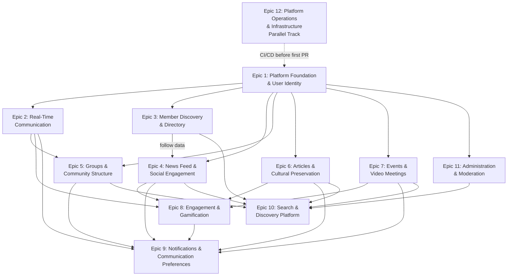

---
stepsCompleted:
  - step-01-validate-prerequisites
  - step-02-design-epics
  - step-03-create-stories
inputDocuments:
  - prd.md
  - architecture.md
  - ux-design-specification.md
version: "1.2"
lastUpdated: "2026-02-21"
---

# igbo - Epic Breakdown

## Overview

This document provides the complete epic and story breakdown for igbo, decomposing the requirements from the PRD, UX Design, and Architecture into implementable stories.

### Epic Dependency Overview

> **Note:** Epic 12 (Platform Operations & Infrastructure) runs as a **parallel track** alongside Epics 1-11. Story 12.1 (CI/CD) **must** be operational before the first PR on Epic 1 is merged. Story 12.3 (Monitoring) **must** be live before the first production deployment. Stories 12.1–12.5 have no feature dependencies on other epics and should begin implementation concurrently with Epic 1. However, Story 12.6 (Load Testing) requires Epics 2, 4, and 7 to be deployed for meaningful test coverage (WebSocket, feed, event spike scenarios), and Story 12.7 (Accessibility Testing) requires Epics 1–7 and 11 for full E2E user flow coverage. These two stories should be scheduled after their dependent epics ship.

> **Launch Blockers:**
>
> 1. **GDPR legal review for data export (Story 1.13):** Qualified legal counsel must review the received-message exclusion policy in the data export feature before it can ship to production. This is explicitly flagged as a blocker within Story 1.13 — track as a separate backlog item.
> 2. **Admin bootstrap account (Story 1.1a):** The initial admin account must exist before any admin workflow (Story 1.6 membership approval, Story 1.10 tier management, Story 11.x moderation) can function. Story 1.1a includes an admin seed script that must run on first deployment.

## Requirements Inventory

### Functional Requirements

#### Member Registration & Onboarding

- FR1: Guest visitors can browse public content (articles, blog, events calendar, about page) without authentication
- FR2: Guest visitors can view a three-column splash page with options to explore as guest, apply to join, or log in
- FR3: Prospective members can submit a membership application via contact form with personal information, cultural connection details, location, reason for joining, and optional member referral
- FR4: The system can auto-detect applicant location from IP address and pre-fill location fields
- FR5: Newly approved members can complete a profile setup wizard including bio, photo, location, interests, and languages
- FR6: New members can acknowledge community guidelines as part of onboarding
- FR7: New members can take a guided feature tour of the platform
- FR8: The system can send automated welcome emails and in-platform welcome messages to new members

#### Authentication & Security

- FR9: Members can log in using email/username and password with mandatory two-factor authentication
- FR10: Members can manage their active sessions and revoke access from specific devices
- FR11: The system can lock accounts after repeated failed login attempts
- FR12: Members can reset their password through a secure recovery flow
- FR13: Members can link multiple social media accounts (Facebook, LinkedIn, Twitter/X, Instagram) to their profile

#### Member Profiles & Directory

- FR14: Members can create and edit their profile with name, photo/avatar, bio, location, interests, cultural connections, and languages spoken
- FR15: Members can control their profile visibility (public to members, limited, or private)
- FR16: Members can choose to show or hide their location on their profile
- FR17: Members can search the member directory by name, location, skills, interests, and language
- FR18: The system can suggest members at broader geographic levels (state, country) when no members are found at the searched city level
- FR19: Members can view other members' profiles including verification badge, bio, interests, and engagement indicators

#### Membership Tiers & Permissions

- FR20: The system can enforce three membership tiers (Basic, Professional, Top-tier) with distinct capability sets
- FR21: Basic members can participate in chat, join public groups, view articles, attend general meetings, and use the member directory
- FR22: Professional members can do everything Basic members can, plus publish 1 article per week (members-only visibility), create general events, and access enhanced features
- FR23: Top-tier members can do everything Professional members can, plus create and manage groups, publish 2 articles per week (guest or member visibility), create general and group events, and assign group leaders
- FR24: Admins can assign, upgrade, and downgrade member tiers
- FR25: The system can enforce tier-based article publishing limits that increase with points accumulation (up to 7 articles/week maximum). Article limits (FR25) and general feed post limits (FR51) are tracked independently with separate counters.

#### Verification & Points

- FR26: Admins can assign verification badges (Blue, Red, Purple) to qualifying members
- FR27: The system can apply points multipliers based on verification badge level (Blue: 3x, Red: 6x, Purple: 10x) to likes received
- FR28: Members can earn points through receiving likes on content and through activity-based engagement (event attendance, project participation, mentoring)
- FR29: Members can view their points balance and earning history on their dashboard
- FR30: The system can display verification badges on member profiles and content

#### Real-Time Communication

- FR31: Members can send and receive direct messages to/from other members in real-time
- FR32: Members can participate in group direct messages (3+ people)
- FR33: Members can send messages with rich text formatting, file attachments, and emoji reactions
- FR34: Members can edit and delete their own messages
- FR35: Members can see typing indicators and read receipts in conversations
- FR36: Members can reply to specific messages in threads
- FR37: Members can @mention other members in messages to trigger notifications
- FR38: Members can search their message history
- FR39: Members can block or mute other members
- FR40: Members can set notification preferences per conversation and enable Do Not Disturb mode

#### Groups & Channels

- FR41: Top-tier members can create groups with a name, description, banner image, and visibility setting (public, private, or hidden)
- FR42: Group creators can configure join requirements (open or approval-required), posting permissions, commenting permissions, and member limits
- FR43: Group creators can assign group leaders (Professional or Top-tier members) with moderation capabilities
- FR44: Members can discover and join public groups through the group directory
- FR45: Members can request to join private groups; group leaders can approve or reject requests
- FR46: Groups can have dedicated chat channels, a group news feed, file repositories, and a member list
- FR47: Group leaders can post pinned announcements within their group
- FR48: Members can belong to up to 40 groups simultaneously (configurable via `platform_settings` — admin-adjustable without code changes, default: 40)

#### News Feed & Content

- FR49: Members can view a personalized news feed with posts from their groups, followed members, and platform announcements
- FR50: Members can create posts with rich media (images, videos, links), text formatting, and category tags
- FR51: The system can enforce role-based general feed posting permissions (Basic: no general feed posts; Professional: 1 general feed post/week; Top-tier: 2 general feed posts/week). These limits are separate from article publishing limits defined in FR22/FR23/FR25.
- FR52: Members can like, react to, comment on, and share posts within the platform
- FR53: Members can save/bookmark posts for later reference
- FR54: Admins can pin announcements to the top of the news feed
- FR55: Members can toggle between algorithmic and chronological feed sorting
- FR56: The system can display a separate "Announcements Only" feed for official communications

#### Articles & Cultural Content

- FR57: Authorized members can write and submit articles using a rich text editor with multimedia support
- FR58: The system can route submitted articles through an admin approval queue before publication
- FR59: Admins can mark approved articles as "Featured" for prominent news feed placement
- FR60: Top-tier members can choose article visibility (guest-accessible or members-only)
- FR61: Articles can be published in English, Igbo, or both languages
- FR62: Members can comment on published articles
- FR63: Guest visitors can read guest-accessible articles without authentication
- FR64: The system can display reading time estimates and related article suggestions

#### Events & Video Meetings

- FR65: Professional and Top-tier members can create general events; group leaders (Professional or Top-tier) can create group events. Event fields include: title, description, date/time, duration, event type (general/group), registration limit, and recurrence settings. Basic members cannot create events.
- FR66: Members can RSVP to events with automatic waitlist when registration limits are reached
- FR67: The system can generate video meeting links for events using an integrated video SDK
- FR68: Members can join video meetings with screen sharing, in-meeting chat, breakout rooms, and waiting room capabilities
- FR69: Members can receive event reminder notifications at configurable intervals before the event
- FR70: Members can view past events with details, attendance records, and highlights
- FR71: Top-tier members can access archived meeting recordings

#### Notifications

- FR72: Members can receive in-app notifications for direct messages, @mentions, group activity, event reminders, post interactions, and admin announcements
- FR73: Members can receive email notifications for important platform activity
- FR74: Members can receive push notifications via Web Push API (Lite PWA) when the browser is closed
- FR75: Members can customize which notification types they receive and through which channels
- FR76: Members can configure digest options (daily/weekly summaries) as an alternative to real-time notifications
- FR77: Members can set quiet hours/Do Not Disturb schedules

#### Search & Discovery

- FR78: Members can perform global search across members, posts, articles, groups, events, and documents
- FR79: The system can provide autocomplete suggestions as users type in search
- FR80: Members can filter search results by content type, date range, author, category, location, and membership tier
- FR81: The system can display up to 5 recommended groups on the member dashboard and group directory, ranked by interest overlap and shared group membership with the member's connections
- FR82: The system can suggest members to connect with based on shared interests, location, or skills

#### Administration & Moderation

- FR83: Admins can review, approve, request more information on, or reject membership applications
- FR84: Admins can review and approve or reject submitted articles and flagged content through a moderation queue
- FR85: The system can automatically flag text content containing blocklisted terms (admin-configurable keyword blocklist for English and Igbo)
  with a false-positive rate below 5% and detection rate above 80% for blocklisted terms, routing flagged content to the moderation queue
- FR86: Members can report posts, comments, messages, or other members with categorized reasons
- FR87: Admins can issue warnings, temporary suspensions, or permanent bans through a progressive discipline system
- FR88: Admins can review flagged conversations for dispute resolution
- FR89: Admins can view an analytics dashboard showing DAU, MAU, growth trends, geographic distribution, tier breakdown, and engagement metrics
- FR90: Admins can view comprehensive audit logs of all administrative actions
- FR91: Admins can manage community guidelines, constitution, and governance documents in a document repository
- FR92: Members can view and download governance documents (read-only)

#### Bilingual Support

- FR93: Members can toggle the platform UI between English and Igbo
- FR94: The system can display all navigation, labels, buttons, and system messages in the selected language
- FR95: Content creators can publish articles in English, Igbo, or both with language tags

#### Guest Experience & SEO

- FR96: The system can server-side render all guest-facing pages for search engine discoverability
- FR97: Guest pages can display clear call-to-action prompts encouraging visitors to apply for membership
- FR98: The system can generate structured data, Open Graph tags, and sitemaps for public content
- FR99: Guest visitors cannot access member profiles, chat, group discussions, or interactive features

**Total: 99 Functional Requirements**

### Non-Functional Requirements

#### Performance

- NFR-P1: Page load time for guest-facing SSR pages < 2 seconds (global, via CDN)
- NFR-P2: Page load time for authenticated SPA pages (subsequent navigation) < 1 second
- NFR-P3: First Contentful Paint (FCP) < 1.5 seconds
- NFR-P4: Largest Contentful Paint (LCP) < 2.5 seconds
- NFR-P5: Cumulative Layout Shift (CLS) < 0.1
- NFR-P6: First Input Delay (FID) < 100ms
- NFR-P7: Chat message delivery (send to receive) < 500ms
- NFR-P8: API response time (p95) < 200ms
- NFR-P9: Member directory search response < 1 second for results display
- NFR-P10: Concurrent WebSocket connections supported: 500+ simultaneous at launch
- NFR-P11: Video meeting join time < 5 seconds from click to connected
- NFR-P12: Image optimization: All images served as WebP/AVIF with responsive srcset

#### Security

- NFR-S1: All data encrypted in transit (TLS 1.2+ on all connections)
- NFR-S2: All sensitive data encrypted at rest (AES-256 server-side encryption)
- NFR-S3: Two-factor authentication enforced (100% of member accounts)
- NFR-S4: Password policy enforcement (minimum 8 characters, complexity requirements, industry-standard hashing)
- NFR-S5: Account lockout on failed attempts (lock after 5 consecutive failures, unlock after 15 minutes or admin action)
- NFR-S6: Session management (configurable timeout, max concurrent sessions per member)
- NFR-S7: Content Security Policy headers (CSP, X-Frame-Options, X-Content-Type-Options on all responses)
- NFR-S8: File upload security (file type validation via magic byte verification and extension whitelisting on all uploads; full antivirus scanning via ClamAV enabled when member count exceeds 500 or admin opts in via `ENABLE_CLAMAV=true`; size limits enforced on all uploads)
- NFR-S9: GDPR compliance (cookie consent, data processing consent, right to deletion, breach notification within 72 hours)
- NFR-S10: Input validation and sanitization (all user inputs validated server-side; protection against XSS, CSRF, SQL injection)
- NFR-S11: Audit logging coverage (100% of admin actions logged with timestamp, actor, and action details)
- NFR-S12: Chat architecture E2E migration readiness (service abstraction layer supports future E2E encryption without data model changes)

#### Scalability

- NFR-SC1: User growth support: system handles 10x user growth (500 to 5,000 members) with < 10% performance degradation
- NFR-SC2: Concurrent user capacity: 500 concurrent users at launch, scalable to 2,000 without infrastructure redesign
- NFR-SC3: Event traffic spikes: platform handles 3x normal traffic during virtual events (200+ simultaneous attendees)
- NFR-SC4: Chat message throughput: system processes 100+ messages per second across all channels
- NFR-SC5: Database query performance: all user-facing queries execute within 100ms at 10,000 member scale
- NFR-SC6: Static asset delivery: CDN serves static assets from edge locations globally
- NFR-SC7: Horizontal scalability readiness: application architecture supports horizontal scaling of API and WebSocket servers

#### Accessibility

- NFR-A1: WCAG 2.1 AA compliance across all pages
- NFR-A2: Keyboard navigation: all interactive elements reachable and operable via keyboard
- NFR-A3: Screen reader compatibility: full compatibility with VoiceOver (macOS/iOS) and NVDA (Windows)
- NFR-A4: Color contrast ratios: minimum 4.5:1 for normal text, 3:1 for large text
- NFR-A5: Minimum touch/click target size: 44x44px minimum for all interactive elements
- NFR-A6: Minimum body text size: 16px minimum for body text
- NFR-A7: Reduced motion support: respect prefers-reduced-motion media query; no critical information conveyed solely through animation
- NFR-A8: High contrast mode: optional high-contrast mode toggle for low-vision users
- NFR-A9: Semantic HTML structure: all pages use proper heading hierarchy, landmarks, and ARIA labels

#### Integration

- NFR-I1: Video SDK reliability: video meetings connect successfully 99%+ of attempts
- NFR-I2: Video SDK latency: audio/video lag < 300ms for participants on standard broadband
- NFR-I3: Email delivery reliability: transactional emails delivered within 5 minutes; 98%+ inbox placement rate
- NFR-I4: Web Push notification delivery: push notifications delivered within 30 seconds of trigger
- NFR-I5: CDN cache hit ratio: 90%+ cache hit ratio for static assets
- NFR-I6: Social media linking: OAuth flows complete within 10 seconds; graceful degradation if provider unavailable

#### Reliability & Availability

- NFR-R1: Platform uptime: 99.5%+ monthly uptime
- NFR-R2: Planned maintenance window: maximum 2 hours per month during lowest-traffic period
- NFR-R3: Data backup frequency: daily automated backups with 30-day retention
- NFR-R4: Recovery time objective (RTO): < 4 hours for full platform recovery from backup
- NFR-R5: Recovery point objective (RPO): < 24 hours of data loss in worst-case scenario
- NFR-R6: WebSocket reconnection: automatic reconnection within 5 seconds on network interruption; no message loss
- NFR-R7: Graceful degradation: platform remains usable (read-only mode) if chat or video services are temporarily unavailable

**Total: 53 Non-Functional Requirements**

### Additional Requirements

#### From Architecture:

- Starter template: `create-next-app` (Next.js 16.1.x) with `shadcn/ui` init — greenfield scaffold
- Two-container deployment: Web container (Next.js) + Realtime container (Socket.IO server) communicating via Redis pub/sub
- Database: PostgreSQL with Drizzle ORM, hybrid single schema with domain-prefixed table names (`auth_*`, `community_*`, `chat_*`, `platform_*`)
- Migration strategy: `drizzle-kit push` for dev, `drizzle-kit generate` + `drizzle-kit migrate` for staging/production
- Auth: Auth.js v5 (next-auth@beta) with database sessions cached in Redis for instant revocation
- Registration flow: Two-gate (email verification then admin approval)
- RBAC: Next.js middleware (coarse route protection) + centralized `PermissionService` (fine-grained tier/limit checks)
- Rate limiting: Layered — Cloudflare edge (DDoS/brute-force) + Redis app-level (per-user, per-endpoint sliding window)
- API design: Server Actions + REST `/api/v1/*` hybrid; REST versioned for future mobile apps
- Error handling: RFC 7807 Problem Details format for all REST endpoints
- Real-time: Socket.IO with two namespaces (`/chat`, `/notifications`), Redis adapter for multi-instance scaling. The `/notifications` namespace also handles live event updates (attendee changes, status changes, reactions) — a dedicated `/events` namespace is unnecessary given the low event frequency
- MessageService abstraction layer for E2E encryption migration readiness (Phase 2)
- File uploads: Presigned URLs to Hetzner Object Storage, ClamAV virus scanning sidecar, image optimization (sharp: WebP/AVIF)
- State management: TanStack Query (server state), Socket.IO + TanStack Query invalidation (real-time), React Context (auth/UI), no Redux/Zustand
- Testing: Vitest + Testing Library (unit/component), Playwright (E2E) — deviation from PRD's Jest + Cypress
- CI/CD: GitHub Actions pipeline (lint, type-check, test, build, Lighthouse CI) with staging auto-deploy and production manual gate
- Infrastructure: Docker Compose on Hetzner (launch), Kubernetes migration path when approaching 2,000 concurrent users
- Monitoring: Sentry (errors), Prometheus + Grafana (infra metrics), stdout JSON logs, UptimeRobot (uptime)
- Backup: Daily pg_dump + WAL archiving to Hetzner Object Storage, 30-day retention
- EventBus pattern: In-process event emitter for decoupled service-to-service communication (points, notifications, audit)
- Feature-based co-location: `src/features/*/` modules with barrel exports; never import from internal feature paths
- Naming conventions: `snake_case` (DB), `camelCase` (JS/TS/API), `PascalCase` (components/types), `kebab-case` (non-component files)
- All anti-patterns documented: no `any`, no `console.log`, no inline SQL, no `useEffect` + `fetch`, no hardcoded strings

#### From UX Design:

- Mobile-first responsive design: Mobile (< 768px), Tablet (768-1024px), Desktop (> 1024px)
- Bottom tab bar (mobile): 5 tabs — Home, Chat, Discover, Events, Profile
- Top navigation bar (desktop): Logo, nav items, search, notifications, chat icon, profile avatar
- Cultural visual identity: OBIGBO brand with Deep Forest Green (`#2D5A27`) primary, Warm Sandy Tan secondary, Golden Amber accent
- Typography: Inter font family with Igbo diacritic support, 16px minimum body text, 1.6 line height
- Card system: Standard, Elevated, Flat, Interactive variants with 12px border radius
- Geographic fallback discovery: Animated expanding rings (city to state to country) with warm fallback messaging
- Progressive image loading: Blurred placeholder (LQIP) to full image transition
- Skeleton loading states: Warm grey pulse animation for all content loading
- Empty states: Always include warm messaging and next-action suggestions — never "No results" dead ends
- Personalized greetings: Igbo language greetings on dashboard ("Nno, [Name]")
- Community stories row: Casual content sharing at top of mobile feed
- Chat interface: WhatsApp-meets-Slack hybrid with conversation sidebar, DM/Channel tabs, typing indicators, read receipts
- Admin dashboard: Dark sidebar navigation, queue summary cards, application table with keyboard shortcuts
- Bilingual toggle: Persistent, always-visible language switch (not buried in settings)
- Accessibility: Color-blind safe (never color-only for information), reduced motion support, elder-friendly defaults (large text, clear labels, 44px targets)
- Offline/error states: Subtle offline banner with cached content below, graceful degradation for all features
- Video events: One-click join embedded in platform, no external downloads required
- Micro-animations: Count-up on member discovery, points earned glow, reaction feedback — all respecting `prefers-reduced-motion`

### Descoped Items (Phase 2 Candidates)

The following items were considered during epic design and explicitly descoped from Phase 1. Each is documented here to prevent scope creep and to provide a starting backlog for Phase 2 planning.

- **Community Stories row** (Instagram/WhatsApp-style casual content sharing at top of mobile feed) — referenced in UX Design specification but explicitly descoped from Phase 1 epics. Candidate for Phase 2 enhancement once core feed and content features are stable.
- **Native mobile applications** (iOS/Android) — the platform launches as a Lite PWA (Story 1.3) with `display: standalone` and home screen installation. Native apps are deferred until user demand and platform stability justify the development investment. The REST `/api/v1/*` versioning strategy (Story 1.1) is designed to support future mobile clients.
- **Automated content translation** (machine translation between English and Igbo) — bilingual support (Story 1.11) requires manual authoring in both languages. Automated translation was considered but descoped due to limited quality of Igbo machine translation models and the cultural sensitivity of community content. Candidate for Phase 2 when translation quality improves.
- **End-to-end encryption for chat** — the MessageService abstraction layer (Story 2.1, NFR-S12) is designed for future E2E encryption migration, but Phase 1 uses plaintext storage (`PlaintextMessageService`). E2E encryption introduces significant UX complexity (key management, multi-device sync, message search limitations) that is inappropriate for a launch-phase community platform.
- **Offline-first content access** — the Lite PWA (Story 1.3) provides cache-first for static assets and a graceful offline fallback page, but does not enable full offline content browsing or offline message queuing. True offline-first requires significant client-side storage architecture (IndexedDB, sync queue) that adds complexity disproportionate to the launch user base.
- **Advanced feed algorithm with social signals** — the Phase 1 feed (Story 4.1) uses a two-factor scoring model (recency + engagement). A four-factor model adding group relevance and connection strength is documented as a Phase 2 enhancement when the member base exceeds 1,000 active users and produces meaningful social signal data.
- **Content recommendation engine** — related article suggestions (Story 6.3) use basic tag matching. ML-based content recommendations (collaborative filtering, topic modeling) are deferred to Phase 2.
- **Payment processing / premium tier monetization** — membership tiers (Story 1.10) are admin-assigned, not paid. Stripe/payment integration for premium tiers is a Phase 2 consideration pending community governance decisions on monetization.
- **Ring-voting detection & alt-account IP correlation** — these anti-gaming measures (closed-loop graph analysis in Redis with points escrow, and IP-based alt-account signals) are deferred to Phase 2 (when member count exceeds 1,000). At launch scale (< 500 members), organic interaction patterns between friends and household members produce unacceptable false-positive rates that resemble the fraud signals these measures detect.

### FR Coverage Map

#### Epic 1: Platform Foundation & User Identity

- FR1: Guest public content browsing
- FR2: Three-column splash page
- FR3: Membership application form
- FR4: IP-based location auto-detect
- FR5: Profile setup wizard
- FR6: Community guidelines acknowledgment
- FR7: Guided feature tour
- FR8: Automated welcome emails/messages
- FR9: Login with 2FA
- FR10: Session management
- FR11: Account lockout
- FR12: Password reset
- FR13: Social media account linking
- FR14: Profile creation/editing
- FR15: Profile visibility controls
- FR16: Location visibility toggle
- FR20: Three membership tiers
- FR21: Basic tier capabilities
- FR22: Professional tier capabilities
- FR23: Top-tier capabilities
- FR24: Admin tier management
- FR83: Membership approval workflow
- FR93: UI language toggle
- FR94: Bilingual system messages
- FR95: Bilingual content publishing
- FR96: SSR for guest pages
- FR97: Guest CTAs
- FR98: Structured data/OG tags/sitemaps
- FR99: Guest access restrictions
- FR72: In-app notifications (core infrastructure — table, service, and Socket.IO delivery). Note: FR72's functional completeness for group activity, event reminders, and post interaction notifications depends on Epics 4, 5, and 7 being deployed. Epic 1 provides the notification infrastructure; full FR72 coverage is progressive across epics.

#### Epic 2: Real-Time Communication

- FR31: Direct messaging
- FR32: Group direct messages
- FR33: Rich messaging (formatting, attachments, reactions)
- FR34: Message edit/delete
- FR35: Typing indicators/read receipts
- FR36: Threaded replies
- FR37: @mentions
- FR38: Message search
- FR39: Block/mute
- FR40: Per-conversation notification preferences

#### Epic 3: Member Discovery & Directory

- FR17: Member directory search
- FR18: Geographic fallback suggestions
- FR19: Member profile viewing
- FR49 (partial): Member following mechanism (Story 3.4)
- FR82: Member suggestions

#### Epic 4: News Feed & Social Engagement

- FR49: Personalized news feed (uses follow data from Story 3.4)
- FR50: Post creation with rich media
- FR51: Role-based posting permissions
- FR52: Reactions/comments/shares
- FR53: Bookmarks
- FR54: Pinned admin announcements
- FR55: Feed sorting toggle
- FR56: Announcements-only feed

#### Epic 5: Groups & Community Structure

- FR41: Group creation
- FR42: Group configuration
- FR43: Group leader assignment
- FR44: Group discovery/joining
- FR45: Private group requests
- FR46: Group channels/feed/files/members
- FR47: Pinned announcements
- FR48: Group membership limit (40)

#### Epic 6: Articles & Cultural Preservation

- FR57: Article editor
- FR58: Article approval queue
- FR59: Featured articles
- FR60: Article visibility control
- FR61: Bilingual article publishing
- FR62: Article comments
- FR63: Guest article access
- FR64: Reading time/related articles

#### Epic 7: Events & Video Meetings

- FR65: Event creation
- FR66: RSVP with waitlist
- FR67: Video meeting link generation
- FR68: Video meeting features
- FR69: Event reminders
- FR70: Past events archive
- FR71: Meeting recordings

#### Epic 8: Engagement & Gamification

- FR25: Points-based posting limits
- FR26: Verification badge assignment
- FR27: Points multipliers by badge
- FR28: Points earning mechanisms
- FR29: Points balance and history
- FR30: Badge display

#### Epic 9: Notifications & Communication Preferences

- FR73: Email notifications
- FR74: Push notifications
- FR75: Notification customization
- FR76: Digest options
- FR77: Quiet hours/DND

#### Epic 10: Search & Discovery Platform

- FR78: Global search
- FR79: Autocomplete suggestions
- FR80: Filtered search
- FR81: Recommended groups

#### Epic 11: Administration & Moderation

- FR84: Content moderation queue
- FR85: Automated content flagging
- FR86: Member reporting system
- FR87: Progressive discipline
- FR88: Flagged conversation review
- FR89: Analytics dashboard
- FR90: Audit logs
- FR91: Governance document management
- FR92: Governance document viewing

**Coverage verification: 99/99 FRs mapped to owning epics.** Note: FR72 (in-app notifications) infrastructure is delivered in Epic 1, but full functional coverage (group activity, event reminders, post interaction notifications) is **progressive** — each feature epic emits EventBus events consumed by the notification service (Story 1.15) as those epics ship. FR72 is not fully satisfied until Epics 4, 5, and 7 are deployed.

### NFR Coverage Map

#### Performance (NFR-P)

- NFR-P1 (SSR page load < 2s): Story 1.4 (guest pages), Story 12.2 (CDN)
- NFR-P2 (SPA nav < 1s): Story 1.3 (layout shell), Story 12.6 (load testing verification)
- NFR-P3 (FCP < 1.5s): Story 1.2 (design system), Story 12.1 (Lighthouse CI)
- NFR-P4 (LCP < 2.5s): Story 1.2, Story 12.1 (Lighthouse CI budget)
- NFR-P5 (CLS < 0.1): Story 1.2, Story 12.1 (Lighthouse CI budget)
- NFR-P6 (FID < 100ms): Story 1.2, Story 12.1 (Lighthouse CI budget)
- NFR-P7 (Chat delivery < 500ms): Story 2.2 (DMs), Story 12.6 (load testing)
- NFR-P8 (API p95 < 200ms): Story 1.1 (API middleware), Story 12.6 (load testing)
- NFR-P9 (Directory search < 1s): Story 3.1 (directory search), Story 10.1 (global search)
- NFR-P10 (500+ concurrent WebSockets): Story 1.15 (Socket.IO server), Story 12.6 (load testing)
- NFR-P11 (Video join < 5s): Story 7.3 (video integration)
- NFR-P12 (Image optimization WebP/AVIF): Story 1.14 (file upload pipeline)

#### Security (NFR-S)

- NFR-S1 (TLS 1.2+ in transit): Story 12.2 (Cloudflare SSL termination)
- NFR-S2 (AES-256 at rest): Story 12.2 (PostgreSQL encryption, Object Storage encryption)
- NFR-S3 (2FA enforced 100%): Story 1.7 (authentication)
- NFR-S4 (Password policy): Story 1.7 (password hashing, complexity)
- NFR-S5 (Account lockout): Story 1.7 (5 failures, 15min lockout)
- NFR-S6 (Session management): Story 1.7 (Redis-cached sessions, configurable TTL, max concurrent sessions — 5 default, oldest evicted)
- NFR-S7 (Security headers CSP): Story 1.1 (security headers)
- NFR-S8 (File upload security): Story 1.14 (virus scanning, type whitelisting, size limits)
- NFR-S9 (GDPR compliance): Story 1.13 (consent, deletion, export, breach notification)
- NFR-S10 (Input validation/sanitization): Story 1.1 (shared sanitization utility, Zod), all stories (server-side validation)
- NFR-S11 (Audit logging 100%): Story 11.5 (audit logs), all admin stories (emit audit events)
- NFR-S12 (E2E encryption readiness): Story 2.1 (MessageService abstraction layer)

#### Scalability (NFR-SC)

- NFR-SC1 (10x user growth): Story 12.2 (infrastructure), Story 12.6 (load testing at 10k scale)
- NFR-SC2 (500 concurrent, scalable to 2k): Story 12.2 (Docker Compose → K8s path), Story 12.6 (load testing)
- NFR-SC3 (3x traffic spikes during events): Story 12.6 (event spike load test)
- NFR-SC4 (100+ msg/sec throughput): Story 2.1 (Redis adapter), Story 12.6 (load testing)
- NFR-SC5 (DB queries < 100ms at 10k): Story 12.6 (load testing with 10k synthetic profiles)
- NFR-SC6 (CDN edge delivery): Story 12.2 (Cloudflare CDN)
- NFR-SC7 (Horizontal scaling readiness): Story 12.2 (Kubernetes migration path)

#### Accessibility (NFR-A)

- NFR-A1 (WCAG 2.1 AA): Story 1.4 (guest pages), Story 12.7 (accessibility testing), all UI stories
- NFR-A2 (Keyboard navigation): Story 1.2 (design system), Story 12.7 (verification)
- NFR-A3 (Screen reader VoiceOver/NVDA): Story 12.7 (manual screen reader testing)
- NFR-A4 (Color contrast 4.5:1): Story 1.2 (brand tokens), Story 12.7 (automated testing)
- NFR-A5 (44px touch targets): Story 1.2 (design tokens), all UI stories
- NFR-A6 (16px body text): Story 1.2 (typography)
- NFR-A7 (Reduced motion): Story 1.2 (design system), Story 3.2 (geo fallback), Story 8.2 (points animation)
- NFR-A8 (High contrast mode): Story 1.2 (high-contrast palette)
- NFR-A9 (Semantic HTML): Story 1.3 (layout shell), Story 1.4 (guest pages), all UI stories

#### Integration (NFR-I)

- NFR-I1 (Video 99%+ connect): Story 7.3 (video SDK integration)
- NFR-I2 (Video lag < 300ms): Story 7.3 (video SDK)
- NFR-I3 (Email delivery < 5min, 98%+ inbox): Story 9.2 (email notifications)
- NFR-I4 (Push delivery < 30s): Story 9.3 (push notifications)
- NFR-I5 (CDN 90%+ cache hit): Story 12.2 (Cloudflare caching rules)
- NFR-I6 (OAuth < 10s, graceful degradation): Story 1.9 (social media linking)

#### Reliability & Availability (NFR-R)

- NFR-R1 (99.5% uptime): Story 12.3 (UptimeRobot monitoring)
- NFR-R2 (Maintenance window < 2h/month): Story 12.5 (maintenance mode banner + procedure)
- NFR-R3 (Daily backups, 30-day retention): Story 12.4 (backup sidecar)
- NFR-R4 (RTO < 4h): Story 12.4 (recovery runbook)
- NFR-R5 (RPO < 24h): Story 12.4 (WAL archiving)
- NFR-R6 (WebSocket reconnect < 5s): Story 1.15 (Socket.IO auto-reconnect), Story 12.5 (resilience)
- NFR-R7 (Graceful degradation): Story 12.5 (read-only mode fallback)

**Coverage verification: 53/53 NFRs mapped. No gaps.**

## Epic List

| Epic                                                                                                  | Scope                                                                                                                                                                      | FRs Covered                                |
| ----------------------------------------------------------------------------------------------------- | -------------------------------------------------------------------------------------------------------------------------------------------------------------------------- | ------------------------------------------ |
| [Epic 1: Platform Foundation & User Identity](#epic-1-platform-foundation--user-identity)             | Auth, profiles, tiers, i18n, guest pages, SEO, rate limiting, GDPR, file upload pipeline, Socket.IO realtime server, core notification infrastructure, transactional email | FR1-FR16, FR20-FR24, FR72, FR83, FR93-FR99 |
| [Epic 2: Real-Time Communication](#epic-2-real-time-communication)                                    | DMs, group DMs, rich messaging, Socket.IO                                                                                                                                  | FR31-FR40                                  |
| [Epic 3: Member Discovery & Directory](#epic-3-member-discovery--directory)                           | Directory search, geo-fallback, suggestions, member following                                                                                                              | FR17-FR19, FR49 (partial), FR82            |
| [Epic 4: News Feed & Social Engagement](#epic-4-news-feed--social-engagement)                         | Feed, posts, reactions, comments, bookmarks                                                                                                                                | FR49-FR56                                  |
| [Epic 5: Groups & Community Structure](#epic-5-groups--community-structure)                           | Groups, channels, leadership, moderation                                                                                                                                   | FR41-FR48                                  |
| [Epic 6: Articles & Cultural Preservation](#epic-6-articles--cultural-preservation)                   | Article editor, review queue, bilingual publishing                                                                                                                         | FR57-FR64                                  |
| [Epic 7: Events & Video Meetings](#epic-7-events--video-meetings)                                     | Events, RSVP, video SDK, recordings                                                                                                                                        | FR65-FR71                                  |
| [Epic 8: Engagement & Gamification](#epic-8-engagement--gamification)                                 | Points, badges, multipliers, posting limits                                                                                                                                | FR25-FR30                                  |
| [Epic 9: Notifications & Communication Preferences](#epic-9-notifications--communication-preferences) | Email, push, digest, quiet hours, notification routing                                                                                                                     | FR73-FR77                                  |
| [Epic 10: Search & Discovery Platform](#epic-10-search--discovery-platform)                           | Global search, autocomplete, filters, recommendations                                                                                                                      | FR78-FR81                                  |
| [Epic 11: Administration & Moderation](#epic-11-administration--moderation)                           | Content moderation, discipline, analytics, audit                                                                                                                           | FR84-FR92                                  |
| [Epic 12: Platform Operations & Infrastructure](#epic-12-platform-operations--infrastructure)         | CI/CD, deployment, monitoring, backup, resilience, accessibility testing                                                                                                   | NFRs (no new FRs)                          |

## Epic 1: Platform Foundation & User Identity

Users can discover igbo as guests, apply to join, get admin-approved, log in with 2FA, set up their profile, and experience the platform in English or Igbo.

### Delivery Phases

Epic 1 has 19 stories (1.1a-1.1c, 1.2-1.17) and bottlenecks the entire project. To maximize parallelization, it is broken into three implementation phases. Story 12.1 (CI/CD) should be complete before the first Phase A PR is merged.

> **Risk:** Epic 1's critical path (Phase A → Phase B sequential core) is approximately 13 stories deep before Epic 2 can start. Track Phase A velocity closely — any slip here cascades to the entire project. Consider splitting Epic 1 into two sub-epics (Foundation + Identity) if velocity tracking shows > 20% schedule overrun on Phase A.

- **Phase A — Foundation (Stories 1.1a, 1.1b, 1.1c, 1.2, 1.3):** Sequential. Must complete before anything else. Establishes scaffolding, security, API foundation, EventBus, job runner, design system, layout shell, and PWA. Story 1.3 bootstraps next-intl with skeleton keys — **all subsequent stories must use `useTranslations()` for every user-facing string from day one**. Story 1.11 then completes the full Igbo translation pass and the language toggle UI — it does not retroactively refactor earlier stories.
- **Phase B — Identity & Access (Stories 1.5, 1.6, 1.7, 1.8, 1.9, 1.10, 1.11, 1.16):** Sequential within phase, starts after Phase A. Covers the membership application flow, authentication, profiles, tiers, bilingual support, and member dashboard shell. Story 1.16 (dashboard) can begin once Story 1.8 (onboarding) is complete, but can also be developed in parallel with Stories 1.9-1.11 since it defines the shell structure without requiring profile management or tier enforcement to be functional.
- **Phase C — Platform Services (Stories 1.4, 1.12, 1.13, 1.14, 1.15, 1.17):** Can run **in parallel** with Phase B after Phase A completes. Stories 1.4 (guest pages) and 1.12 (rate limiting) have no dependency on identity/auth stories. Story 1.14 (file uploads) is needed by Epic 2 but not by Phase B stories. Story 1.15 (core notifications) includes standing up the Socket.IO realtime server with the `/notifications` namespace — no dependency on Epic 2. Story 1.17 (transactional email) provides email support needed by Phase B stories.

> **Early Epic 2 start:** Epic 2 depends only on Phase A + Stories 1.7 (auth/sessions), 1.10 (tiers/permissions), and 1.15 (Socket.IO server + notifications namespace) — not all 19 stories. Work on Epic 2 can begin as soon as Phase A, Story 1.7, Story 1.10, and Story 1.15 are complete, while the rest of Phase B and Phase C continue in parallel.

### Story 1.1a: Project Scaffolding & Core Setup

As a developer,
I want the project initialized with Next.js 16.1.x, all core dependencies installed, database and cache configured, linting and formatting enforced, and a health check endpoint available,
So that all subsequent features can be developed on a consistent, working foundation.

#### Acceptance Criteria

- **Given** the project does not yet exist
- **When** the initialization commands are run (`create-next-app`, dependency installation per Architecture doc)
- **Then** the system creates a working Next.js 16.1.x application with TypeScript strict mode, Tailwind CSS v4, App Router, and `src/` directory structure
- **And** all production dependencies are installed (drizzle-orm, postgres, next-auth@beta, next-intl, @serwist/next, serwist, socket.io, socket.io-client, @tanstack/react-query, zod, ioredis)
- **And** all dev dependencies are installed (drizzle-kit, vitest, @testing-library/react, @testing-library/jest-dom, playwright)

- **Given** the project is initialized
- **When** the developer runs `docker compose up`
- **Then** PostgreSQL and Redis containers start and are accessible from the application
- **And** Drizzle ORM connects to PostgreSQL with the connection string from T3 Env validated environment variables

- **Given** code quality enforcement is needed from day one
- **When** ESLint and Prettier are configured
- **Then** ESLint rules enforce all documented anti-patterns: no `any` type, no `console.log`, no inline SQL, no `useEffect` + `fetch`, no hardcoded UI strings, no imports from internal feature module paths
- **And** Prettier is configured with project conventions
- **And** a pre-commit hook (via lint-staged + husky or lefthook) runs lint and format checks on staged files
- **And** TypeScript strict mode is enabled with `noUncheckedIndexedAccess`

- **Given** the platform needs admin-configurable settings from day one
- **When** the database schema is created
- **Then** the migration creates the `platform_settings` table: a key-value JSONB table for admin-configurable platform settings (group membership limit, posting limits thresholds, storage quotas, etc.) with fields: `key` (text, primary key), `value` (JSONB), `description` (text), `updated_by` (FK → `auth_users.id`, nullable), `updated_at` (timestamp)

- **Given** admin workflows require an initial admin account to exist before any admin operations can function (Story 1.6, Story 1.10, Story 11.x)
- **When** the platform is first deployed
- **Then** a database seed script (`src/server/seed/admin-seed.ts`) creates the initial admin account from environment variables (`ADMIN_EMAIL`, `ADMIN_PASSWORD`) — the script is idempotent (skips if admin already exists) and runs as part of the deployment entrypoint before the application starts

- **Given** the database needs connection management for production reliability
- **When** Drizzle ORM connects to PostgreSQL
- **Then** the connection pool is configured via Drizzle ORM's `max` pool size parameter (default 20 per container), documented in `.env.example` as `DATABASE_POOL_SIZE=20`

- **Given** downstream stories require PostgreSQL extensions (Story 3.1 geo-search, Story 10.1 fuzzy text matching)
- **When** the foundation migration runs
- **Then** the migration enables the `cube` and `earth_distance` extensions (required by Story 3.1 for proximity queries) and `pg_trgm` for fuzzy text matching

- **Given** the project needs a health check
- **When** a GET request is made to `/api/health`
- **Then** a JSON response returns with DB connectivity status, Redis connectivity status, and uptime

### Story 1.1b: Security Infrastructure & API Foundation

As a developer,
I want security headers, CSRF protection, HTML sanitization, and the REST API foundation in place from day one,
So that the platform is secure by default and has a consistent API structure for all features.

#### Acceptance Criteria

- **Given** the platform needs security headers from day one
- **When** Next.js middleware and response headers are configured
- **Then** all responses include Content Security Policy (CSP), X-Frame-Options (DENY), X-Content-Type-Options (nosniff), Strict-Transport-Security, and Referrer-Policy headers (NFR-S7)
- **And** CSRF protection is configured via Next.js built-in mechanisms (SameSite cookies, Origin header validation)
- **And** a shared HTML sanitization utility (`src/lib/sanitize.ts`) is created for sanitizing user-generated rich text content (articles, posts, comments, chat messages) to prevent stored XSS (NFR-S10)

- **Given** the platform needs a versioned REST API alongside Server Actions
- **When** the `/api/v1/` route structure is established
- **Then** a shared API middleware at `src/server/api/middleware.ts` handles: session authentication (via Redis-cached session lookup), request tracing (`X-Request-Id` header or generated UUID stored in `AsyncLocalStorage`), and error serialization
- **And** all REST error responses use RFC 7807 Problem Details format: `{ type, title, status, detail, instance }` via a shared `ApiError` class at `src/lib/api-error.ts`
- **And** the `/api/v1/` prefix establishes URL-based versioning for future mobile app consumption
- **And** a `withApiHandler` wrapper function provides consistent auth, validation, error handling, and rate limiting for all REST route handlers

### Story 1.1c: EventBus, Job Runner & Background Jobs

As a developer,
I want a typed EventBus with Redis pub/sub cross-container delivery and a job runner framework for scheduled background tasks,
So that services communicate through events and platform jobs run reliably on a schedule.

#### Acceptance Criteria

- **Given** services need decoupled communication from day one
- **When** the EventBus service is created at `src/services/event-bus.ts`
- **Then** it implements a typed in-process event emitter (Node.js `EventEmitter`-based) with `domain.action` past-tense event names (`user.created`, `post.published`, `message.sent`, `points.awarded`, `member.banned`)
- **And** all event payloads are defined as TypeScript interfaces in `src/types/events.ts` (e.g., `PostPublishedEvent { postId, authorId, groupId?, timestamp }`)
- **And** consumers register via `eventBus.on('post.published', handler)` with typed handlers
- **And** for cross-container delivery (Web container EventBus → Realtime container Socket.IO), the EventBus publishes to a Redis pub/sub channel (`eventbus:{eventName}`) which the Realtime container subscribes to and forwards to the appropriate Socket.IO namespace
- **And** services never call each other directly — all inter-service communication goes through EventBus (per Architecture constraint)

- **Given** platform features need scheduled background jobs (GDPR retention cleanup, recording expiry, notification digests)
- **When** the job scheduling infrastructure is set up
- **Then** a job runner framework is established at `src/server/jobs/job-runner.ts` with: typed job registration, error handling with Sentry reporting, execution logging, and retry support (configurable per job, default 3 retries with exponential backoff)
- **And** Docker cron configuration is added to both `docker-compose.yml` (dev) and `docker-compose.prod.yml` (production) using the Web container's entrypoint with a cron sidecar process (or `supercrond` / `ofelia` scheduler)
- **And** a `crontab` configuration file at `docker/crontab` defines the schedule for all platform jobs (initially empty, populated as jobs are added in Stories 1.13, 7.4, 9.4)
- **And** job execution is monitored: each run logs start/end/status to stdout (captured by Docker), and failed jobs emit a `job.failed` event via EventBus for alerting (consumed by monitoring in Story 12.3)

### Story 1.2: Design System & Brand Foundation

As a developer,
I want shadcn/ui initialized with OBIGBO cultural brand tokens and typography configured for Igbo diacritic support,
So that all UI components share a consistent cultural visual identity from the start.

#### Acceptance Criteria

- **Given** the project scaffolding is complete (Story 1.1)
- **When** shadcn/ui is initialized and configured
- **Then** the OBIGBO brand tokens are applied: Deep Forest Green (`#2D5A27`) primary, Warm Sandy Tan (`#D4A574`) secondary, Golden Amber (`#C4922A`) accent, Warm Off-White (`#FAF8F5`) background
- **And** Inter font is configured via `next/font` with Igbo diacritic validation (ụ, ọ, ṅ)
- **And** 12px border radius, 44px minimum interactive element size, and 16px minimum body text are enforced in the design tokens

- **Given** the design system needs reusable primitives
- **When** shadcn/ui components are configured
- **Then** the card system variants (Standard, Elevated, Flat, Interactive) are defined with the 12px border radius
- **And** skeleton loading components use warm grey pulse animation per UX spec
- **And** empty state components include warm messaging and next-action suggestions — never bare "No results" dead ends

- **Given** low-vision users need a high contrast mode (NFR-A8)
- **When** a user activates the high contrast mode toggle (available in the navigation alongside the language toggle)
- **Then** the design tokens switch to a high-contrast palette: increased contrast ratios (7:1+ for all text), thicker focus indicators (3px), and enhanced border visibility
- **And** the preference is persisted via `localStorage` and applied via a CSS class on `<html>` (e.g., `data-contrast="high"`)
- **And** all shadcn/ui component variants respect the high-contrast token set

### Story 1.3: Responsive Layout Shell & PWA Foundation

As a developer,
I want the responsive layout shells built, i18n bootstrapped, and the Lite PWA configured with service worker and offline fallback,
So that all pages render in the correct layout, support bilingual UI from day one, and the app is installable on mobile devices.

#### Acceptance Criteria

- **Given** the design system is ready (Story 1.2)
- **When** a user visits any page on mobile (< 768px) or desktop (> 1024px)
- **Then** the responsive AppShell renders with top navigation bar on desktop (logo, nav placeholder items, search placeholder, notification bell placeholder, profile avatar placeholder)
- **And** bottom tab bar on mobile (5 tabs: Home, Chat, Discover, Events, Profile)
- **And** tablet layout (768-1024px) uses the desktop top navigation bar with the mobile bottom tab bar hidden, but content areas use a condensed single-column or two-column grid (not the full desktop three-column layout)
- **And** the GuestShell renders a separate marketing-style navigation for unauthenticated pages

- **Given** i18n is required from day one
- **When** next-intl is configured
- **Then** English (`en.json`) and Igbo (`ig.json`) message files exist with skeleton keys for navigation, common labels, and system messages
- **And** the locale is detected and persisted per user preference

- **Given** the platform needs Lite PWA capabilities from launch
- **When** Serwist (`@serwist/next`) is configured
- **Then** a `manifest.json` is generated with app name, icons, OBIGBO theme colors, and `display: standalone`
- **And** the service worker implements cache strategies: cache-first for static assets, stale-while-revalidate for public content, network-first for authenticated API calls
- **And** a graceful offline fallback page renders when the user is offline ("You're offline — reconnect to continue") with cached content displayed below when available
- **And** the app is installable on mobile home screens (Android and iOS)

### Story 1.4: Guest Experience & Landing Page

As a guest visitor,
I want to see the igbo splash page with options to explore as guest, apply to join, or log in, and browse public content pages,
So that I understand what igbo is and feel compelled to join the community.

#### Acceptance Criteria

- **Given** an unauthenticated visitor navigates to the root URL
- **When** the splash page loads
- **Then** the system displays a three-column layout with "Explore as Guest," "Contact Us to Join," and "Members Login" options (FR2)
- **And** the page is server-side rendered with < 2 second load time (NFR-P1)
- **And** the OBIGBO brand header with cultural visual identity is prominent
- **And** community stats or social proof elements are visible

- **Given** a guest clicks "Explore as Guest"
- **When** they browse the guest navigation
- **Then** they can access the following guest pages (FR1):
  - **About Us:** A static content page including community mission/vision, cultural context, founding story placeholder, and a prominent CTA to apply for membership. Content is hardcoded in the component with i18n support for initial launch; migrated to the governance document repository (Story 11.5) when it ships.
  - **Articles** (public listing shell): A guest-facing listing of published articles.
  - **Events Calendar** (public listing shell): A guest-facing listing of upcoming events.
  - **Blog:** A guest-facing filtered view of published articles with `visibility: guest`. This is NOT a separate content type — the guest "Blog" page renders the same `community_articles` data from Epic 6, filtered to guest-accessible articles. The label "Blog" is used in guest navigation for SEO-friendly terminology; internally it queries articles.
- **And** each guest page displays clear CTAs encouraging membership application (FR97)

- **Given** a guest-facing page is rendered
- **When** search engines crawl the page
- **Then** proper structured data (JSON-LD), Open Graph tags, Twitter Card meta tags, hreflang tags (EN/IG), and canonical URLs are present (FR98)
- **And** the system generates a sitemap.xml listing all public pages
- **And** robots.txt blocks authenticated areas from indexing

- **Given** a guest attempts to access an authenticated route (chat, profiles, groups, admin)
- **When** the Next.js middleware intercepts the request
- **Then** the guest is redirected to the splash page or shown a "Members Only" message with a CTA to apply (FR99)

- **Given** the guest pages need accessibility
- **When** the system renders any guest page
- **Then** it meets WCAG 2.1 AA: proper heading hierarchy, semantic HTML landmarks, ARIA labels, 4.5:1 contrast ratios, keyboard navigable, 44px tap targets (NFR-A1 through NFR-A9)

### Story 1.5: Membership Application & Email Verification

As a prospective member,
I want to submit a membership application with my details and verify my email address,
So that I can begin the admin approval process to join the community.

#### Acceptance Criteria

- **Given** a guest clicks "Contact Us to Join" on the splash page
- **When** the system displays the application form
- **Then** it includes fields for: name, email, phone number (optional, with country code selector and E.164 format validation — stored for admin reference during application review only, not persisted to the member profile), location (city, state/region, country), cultural connection details, reason for joining, and optional existing member referral (FR3)
- **And** all fields are validated client-side and server-side using Zod schemas (NFR-S10)

- **Given** a guest is filling out the application form
- **When** the system renders the location fields
- **Then** the system auto-detects the applicant's approximate location from IP address and pre-fills the city/state/country fields (FR4)
- **And** the applicant can manually override the pre-filled location

- **Given** a guest submits a valid application
- **When** the form is submitted
- **Then** the system sends an email verification message to the provided email address
- **And** a confirmation page displays: "We've sent a verification email. Please check your inbox to continue your application."
- **And** the system creates the account in `pending_email_verification` state

- **Given** the applicant receives the verification email
- **When** they click the verification link within the email
- **Then** their account transitions to `pending_approval` state
- **And** a confirmation page displays warm messaging: "Your email is verified! A community admin will review your application. Welcome home soon."
- **And** the system sends a status notification email within 24 hours confirming application is in review

- **Given** the verification link has expired (24 hours)
- **When** the applicant clicks an expired link
- **Then** they see a message with an option to resend the verification email

- **Given** the database needs to support applications
- **When** this story is implemented
- **Then** the migration creates the `auth_users` table with fields:
  - `user_id` primary key (UUID)
  - User details and application data
  - Account status enum (`pending_email_verification`, `pending_approval`, `info_requested`, `approved`, `rejected`, `suspended`, `banned`)
  - Soft-delete (`deleted_at`) column
- **And** the `auth_users.id` field serves as the foreign key target for `community_profiles.user_id` and all other user-referencing tables
- **And** the migration creates the `auth_verification_tokens` table for email verification tokens

### Story 1.6: Admin Membership Approval

As an admin,
I want to review membership applications and approve, request more information on, or reject them,
So that the community maintains quality membership with verified cultural connections.

#### Acceptance Criteria

- **Given** an admin navigates to the admin approvals page
- **When** the page loads
- **Then** the system displays a table of pending membership applications showing: applicant name, email, location, cultural connection summary,
  reason for joining, referral (if any), application date, and IP-based location assessment (FR83)
- **And** the page uses the admin layout with dark sidebar navigation per UX spec

- **Given** an admin reviews an application
- **When** they click "Approve"
- **Then** the account status transitions to `approved`
- **And** the system sends a welcome email with login instructions to the applicant
- **And** the applicant appears in the member list
- **And** the system logs the action with timestamp, admin ID, and action details (NFR-S11)

- **Given** an admin needs clarification on an application
- **When** they click "Request More Info" and enter a message
- **Then** the system sends an email to the applicant with the admin's question
- **And** the application status updates to `info_requested`
- **And** the applicant can respond via email or a dedicated response page

- **Given** an admin determines an application should be rejected
- **When** they click "Reject" and optionally enter a reason
- **Then** the account status transitions to `rejected`
- **And** the system sends a respectful notification email to the applicant
- **And** the system logs the action

- **Given** the admin page needs to be protected
- **When** a non-admin member attempts to access `/admin/*` routes
- **Then** they are redirected to the member dashboard with no indication the admin section exists

### Story 1.7: Authentication & Session Management

As an approved member,
I want to log in with email and two-factor authentication, manage my active sessions, and reset my password if forgotten,
So that my account is secure and I can access the platform from multiple devices.

#### Acceptance Criteria

- **Given** an approved member navigates to the login page
- **When** they enter valid email/username and password
- **Then** they are prompted for a two-factor authentication code (FR9)
- **And** upon entering a valid 2FA code, the system creates a session in PostgreSQL and cached in Redis
- **And** they are redirected to the member dashboard

- **Given** a member has not yet set up 2FA
- **When** they log in for the first time after approval
- **Then** they are guided through 2FA setup (authenticator app TOTP as the primary method, with email OTP as a fallback for members who cannot use an authenticator app) before accessing the platform (NFR-S3)
- **And** backup recovery codes are generated and displayed for the member to save

- **Given** a member has lost access to their authenticator app and backup recovery codes
- **When** they click "Can't access your authenticator?" on the 2FA screen
- **Then** they can request an admin-assisted identity verification and 2FA reset
- **And** the request enters the admin queue with the member's application data for identity verification
- **And** the admin can reset the member's 2FA, requiring them to set up a new method on next login

> **Phase 2 candidate:** WebAuthn/passkey support as an additional 2FA method.

- **Given** a user enters incorrect credentials
- **When** they fail login 5 consecutive times
- **Then** the account is locked for 15 minutes (FR11, NFR-S5)
- **And** the user sees a message: "Account temporarily locked. Try again in 15 minutes or contact support."
- **And** the system sends an email notification to the account owner about the lockout

- **Given** a member has forgotten their password
- **When** they click "Forgot Password" and enter their email
- **Then** the system sends a secure password reset link via email (FR12)
- **And** the link expires after 1 hour
- **And** upon setting a new password (meeting complexity requirements per NFR-S4), all existing sessions are invalidated

- **Given** a member wants to manage their sessions
- **When** they navigate to security settings
- **Then** they see a list of active sessions with device info, location, and last active timestamp (FR10)
- **And** they can revoke any individual session
- **And** revoking a session deletes it from Redis for instant effect

- **Given** a member logs in and already has the maximum number of active sessions (configurable, default 5)
- **When** the new session is created
- **Then** the oldest active session is automatically evicted (deleted from Redis and PostgreSQL)
- **And** the member is notified on the evicted device: "You were signed out because you signed in on another device"

- **Given** the session infrastructure is needed
- **When** this story is implemented
- **Then** the migration creates the `auth_sessions` table in PostgreSQL
- **And** session records are cached in Redis with configurable TTL (NFR-S6)
- **And** Auth.js v5 is configured with the database session strategy and Redis cache layer
- **And** passwords are hashed using an industry-standard algorithm (NFR-S4)

### Story 1.8: Member Profile Setup & Onboarding

As a newly approved member,
I want to complete my profile, acknowledge community guidelines, and take a guided tour of the platform,
So that I'm ready to participate in the community and other members can find and connect with me.

#### Acceptance Criteria

- **Given** a newly approved member logs in for the first time (after 2FA setup)
- **When** they land on the platform
- **Then** they are directed to the profile setup wizard, not the main dashboard (FR5)

- **Given** the system displays the profile setup wizard
- **When** the member fills in their profile
- **Then** the wizard collects: display name, profile photo (upload with presigned URL), bio, location (pre-filled from application), interests (multi-select), cultural connections, and languages spoken (FR5)
- **And** all fields are validated with Zod schemas
- **And** photo upload uses the file upload processing pipeline (Story 1.14) with profile photo size limit (5MB) and virus scanning (NFR-S8), followed by image optimization (WebP/AVIF conversion per NFR-P12)

- **Given** the member completes their profile
- **When** they proceed to the next step
- **Then** the system displays the community guidelines in the member's selected language (FR6)
- **And** the member must explicitly acknowledge them (checkbox + confirm button)
- **And** the system records the acknowledgment with timestamp

- **Given** guidelines are acknowledged
- **When** the member proceeds
- **Then** a guided feature tour highlights key platform areas: dashboard, chat, directory, groups, events, articles (FR7)
- **And** the tour can be skipped and revisited later from settings
- **And** the tour focuses on people, not features (per UX principle: "Connection Before Content")

- **Given** the onboarding is complete
- **When** the member reaches the dashboard (Story 1.16)
- **Then** the dashboard shell renders with the personalized greeting and "getting started" empty state
- **And** the system has sent an automated welcome email (FR8)
- **And** an in-platform welcome message appears in their notifications (FR8)

- **Given** the database needs profile data
- **When** this story is implemented
- **Then** the migration creates the `community_profiles` table with fields:
  - `user_id` (FK → `auth_users.id`, unique, not null)
  - Bio, photo URL, location (city, state, country, coordinates)
  - Interests (array), cultural connections, languages
  - Onboarding completion status, and `deleted_at` for GDPR soft-delete

- **Given** a member has been approved but has not completed onboarding
- **When** their profile is queried by admin views or system processes
- **Then** the system handles the null-profile state gracefully: admin lists show the member's name and email from `auth_users` with a "Profile incomplete" indicator, and member-facing views (directory, cards) exclude users without a completed profile

### Story 1.9: Profile Management & Privacy Controls

As a member,
I want to edit my profile, control who can see it, toggle my location visibility, and link my social media accounts,
So that I manage my identity and privacy within the community.

#### Acceptance Criteria

- **Given** a member navigates to their profile settings
- **When** the system displays the edit form
- **Then** they can update all profile fields: name, photo, bio, location, interests, cultural connections, and languages (FR14)
- **And** changes are saved via server action with Zod validation
- **And** the profile page reflects updates immediately (optimistic update via TanStack Query)

- **Given** a member wants to control profile visibility
- **When** they access privacy settings
- **Then** they can set their profile to: "Public to members" (all members can view), "Limited" (only shared group members), or "Private" (only visible to admins) (FR15)
- **And** the system enforces the visibility setting on all profile view endpoints

- **Given** a member wants to hide their location
- **When** they toggle the location visibility setting
- **Then** their city/state/country is hidden from their public profile and member directory results (FR16)
- **And** they still appear in search results by other criteria (name, interests, skills)

- **Given** a member wants to link social media accounts
- **When** they click "Link Account" for Facebook, LinkedIn, Twitter/X, or Instagram
- **Then** the system initiates an OAuth flow with the selected provider for profile enrichment only — this is not an authentication method (FR13)
- **And** the OAuth flow fetches only the public profile URL and display name from each provider
- **And** no long-lived access tokens are stored — only the verified profile URL and display name are persisted
- **And** upon successful authorization, the linked account displays as a clickable icon on their profile
- **And** the member can unlink any connected account at any time
- **And** if a provider is temporarily unavailable, a graceful error message is shown (NFR-I6)

- **Given** the profile page is viewed by another member
- **When** the viewer loads the profile
- **Then** the profile displays: name, photo, bio, location (if visible), interests, cultural connections, languages, verification badge (if any), linked social accounts, and engagement indicators
- **And** the "Message" button is prominently displayed for one-tap connection

### Story 1.10: Membership Tiers & Permission Enforcement

As an admin,
I want the system to enforce three membership tiers with distinct capabilities and to manage tier assignments,
So that features are gated appropriately and members have clear progression paths.

#### Acceptance Criteria

- **Given** the platform has three membership tiers
- **When** a member's tier is evaluated
- **Then** Basic members can: participate in chat, join public groups, view articles, attend general meetings, use the member directory (FR21)
- **And** Professional members can do all Basic capabilities plus: publish 1 article per week (members-only visibility), access enhanced features (FR22)
- **And** Top-tier members can do all Professional capabilities plus: create and manage groups, publish 2 articles per week (guest or member visibility), assign group leaders (FR23)

- **Given** a centralized permission service is needed
- **When** any API route or server action checks permissions
- **Then** it calls `PermissionService` methods (e.g., `canCreatePost(userId)`, `canCreateGroup(userId)`, `canPublishArticle(userId)`)
- **And** the service checks tier, current usage against limits, and returns a clear allow/deny with reason
- **And** the permission matrix is defined as configuration, not scattered conditionals

- **Given** an admin wants to manage a member's tier
- **When** the admin navigates to member management and selects a member
- **Then** they can assign, upgrade, or downgrade the member's tier (FR24)
- **And** the change takes effect immediately (session cache invalidated in Redis)
- **And** the member receives a notification of the tier change
- **And** the system logs the action in the audit trail

- **Given** the RBAC infrastructure is needed
- **When** this story is implemented
- **Then** the migration creates the `auth_roles` and `auth_user_roles` tables
- **And** Next.js middleware enforces coarse route protection (authenticated? admin? banned?)
- **And** the `PermissionService` (`src/services/permissions.ts`) handles fine-grained tier-based business logic
- **And** all new members default to Basic tier upon approval

- **Given** a member attempts an action above their tier
- **When** the action is blocked by PermissionService
- **Then** they see a clear, non-punitive message explaining the tier requirement (e.g., "Group creation is available to Top-tier members. Here's how to reach Top-tier status.")

### Story 1.11: Bilingual Platform Support

As a member,
I want to toggle the platform UI between English and Igbo and see all interface elements in my chosen language,
So that I can use igbo in the language I'm most comfortable with.

#### Acceptance Criteria

- **Given** a member is using the platform
- **When** they click the language toggle
- **Then** the system displays a persistent, always-visible language switch component (not buried in settings, per UX spec) (FR93)
- **And** selecting a language immediately switches all UI elements to that language
- **And** the system persists the preference to the user's profile and survives page reloads

- **Given** a language is selected
- **When** the system renders any page
- **Then** all navigation labels, button text, form labels, placeholder text, error messages, success messages, and system notifications display in the selected language (FR94)
- **And** the HTML `lang` attribute reflects the active language
- **And** hreflang tags are present on guest-facing pages for both EN and IG variants

- **Given** content creators are publishing articles or posts
- **When** they create content
- **Then** they can tag the content with a language: English, Igbo, or Both (FR95)
- **And** bilingual content displays both versions with a clear toggle within the content itself

- **Given** the system displays Igbo text with diacritics
- **When** the system renders any text containing ụ, ọ, ṅ, á, à, é, è, í, ì, ó, ò, ú, ù
- **Then** all diacritics and tone marks render correctly at every font size in the type scale
- **And** line heights accommodate diacritics without clipping

- **Given** the i18n message files are needed
- **When** this story is implemented
- **Then** `en.json` and `ig.json` message files are populated with all existing UI strings organized by feature namespace
- **And** no hardcoded strings exist in any component — all user-facing text uses `useTranslations()` from next-intl
- **And** the system adds the language toggle component to both desktop top nav and mobile navigation

### Story 1.12: Rate Limiting & Abuse Prevention

As a developer,
I want layered rate limiting at both the edge and application level,
So that the platform is protected from abuse, brute-force attacks, and API flooding.

#### Acceptance Criteria

- **Given** the platform is publicly accessible
- **When** Cloudflare edge rules are configured
- **Then** DDoS protection, brute-force login prevention, and IP-based rate limiting are active at the edge before requests reach the application server

- **Given** the application needs per-user rate limiting
- **When** a Redis-based sliding window rate limiter is implemented
- **Then** each API endpoint and server action has a configurable rate limit (per-user, per-endpoint)
- **And** tier-based limits are enforced via PermissionService (posting limits, message rates, API call quotas)
- **And** all rate-limited responses return HTTP 429 Too Many Requests in RFC 7807 Problem Details format
- **And** rate limit headers are included on all API responses: `X-RateLimit-Limit`, `X-RateLimit-Remaining`, `X-RateLimit-Reset`

- **Given** the rate limiter needs infrastructure
- **When** this story is implemented
- **Then** the developer creates the rate limiter service at `src/services/rate-limiter.ts` using Redis sliding window counters
- **And** the rate limiter integrates with Next.js middleware for coarse route-level protection
- **And** fine-grained per-action limits are enforced within server actions and API route handlers

### Story 1.13: GDPR Compliance & Data Privacy

As a member,
I want cookie consent controls, data processing transparency, and the ability to delete my account,
So that my privacy rights are respected in compliance with GDPR (NFR-S9).

#### Acceptance Criteria

- **Given** a visitor (guest or member) loads any page
- **When** the page renders for the first time (no prior consent recorded)
- **Then** a cookie consent banner displays with granular opt-in categories: essential (always on), analytics, and preferences
- **And** the consent choice is persisted and respected across sessions
- **And** no non-essential cookies or tracking scripts load until consent is granted

- **Given** a prospective member submits a membership application (Story 1.5)
- **When** the application form is submitted
- **Then** a data processing consent checkbox is required: "I consent to the processing of my personal data as described in the Privacy Policy"
- **And** the consent is recorded with timestamp, IP address, and consent version for audit purposes

- **Given** a member wants to delete their account
- **When** they navigate to account settings and click "Delete My Account"
- **Then** the system requires password confirmation and displays a warning about data deletion consequences
- **And** a confirmation email is sent with a cancellation link
- **And** a 30-day grace period begins during which the account is deactivated but recoverable
- **And** after 30 days, the system hard-anonymizes all PII (name, email, photo, bio, location replaced with anonymized placeholders)
- **And** soft-deleted records (`deleted_at` set) have their PII scrubbed while preserving non-identifying content for data integrity (e.g., anonymized posts remain visible)
- **And** authored content (posts, articles, comments) displays "Former Member" as the author name with a generic silhouette avatar — no verification badge, no profile link
- **And** group ownership is transferred before anonymization: if the member is a group creator, ownership transfers to the senior-most group leader; if no leaders exist, the group is flagged for admin intervention with a 30-day deadline before the group is archived (read-only)
- **And** event creator references are updated to display "Former Member" — the event itself is preserved
- **And** the `member.anonymizing` EventBus event is emitted _before_ PII scrubbing to allow services (groups, events, articles) to execute ownership transfers and display updates
- **And** a scheduled retention cleanup job (`src/server/jobs/retention-cleanup.ts`) runs daily via Docker cron in the Web container, scanning for accounts past the 30-day grace period and executing the anonymization
- **And** the job logs each anonymization action to the audit trail and emits a `member.anonymized` EventBus event

- **Given** a data breach is detected
- **When** an admin triggers the breach notification procedure
- **Then** the system can generate a list of affected members for notification within 72 hours (NFR-S9)
- **And** an admin-facing breach response page is available at `/admin/breach-response` with: affected member list generation, bulk email notification tool, and incident timestamp logging
- **And** the breach notification procedure is documented as a runbook within this story's implementation (to be migrated to the governance document repository when Story 11.5 is implemented)

- **Given** a member requests their data export (GDPR Article 20 — right to data portability)
- **When** they click "Export My Data" in account settings
- **Then** the system generates a JSON archive containing: profile data (name, bio, location, interests, languages), posts authored, articles authored, comments authored, event RSVPs, points history, and notification preferences
- **And** the export excludes: other members' profile data and admin/moderation data
- **And** for sent messages: the member's own sent message content is included, but recipient names and IDs are replaced with anonymized placeholders (e.g., "Member-1", "Member-2" — consistent within the export so conversation threads remain coherent, but not linkable to real identities). This prevents the export from becoming a vector for extracting other members' conversational context while satisfying GDPR Article 20 data portability for the requesting member's own authored content.
- **And** messages received from other members are excluded entirely — they are the sending member's personal data, not the exporter's
- **And** **Legal review prerequisite (BLOCKER for launch):** The exclusion of received messages is one reasonable interpretation of GDPR Articles 15 and 20. An alternative interpretation holds that messages addressed to the data subject constitute personal data concerning them. **Before the data export feature can ship to production, a legal review task must be completed:** qualified legal counsel must review the data export design and confirm or revise the received-message exclusion policy. This review must be tracked as a separate backlog item that blocks Story 1.13 from being marked "launch-ready." If legal counsel determines received messages must be included, they should be exported with sender identities anonymized (same placeholder approach as sent messages). The implementation should proceed with the exclusion approach as the default, with a feature flag (`INCLUDE_RECEIVED_MESSAGES_IN_EXPORT=false`) that can be toggled after legal review without code changes.
- **And** the export is generated as a background job (via the job runner from Story 1.1), and the member receives an in-app notification with a secure download link when ready
- **And** the download link expires after 48 hours
- **And** export requests are rate-limited to 1 per 7 days per member

### Story 1.14: File Upload Processing Pipeline

As a developer,
I want a centralized file upload processing pipeline with virus scanning, type validation, and size enforcement,
So that all file uploads across the platform are secure, validated, and processed consistently (NFR-S8).

#### Acceptance Criteria

- **Given** any feature requires file upload (profile photos, chat attachments, post media, article images, group banners, governance documents)
- **When** the client requests a presigned upload URL from `/api/upload/presign`
- **Then** the API validates the file metadata (type against whitelist, size against limits) before generating the presigned URL
- **And** allowed file types are: images (JPEG, PNG, WebP, GIF, AVIF), videos (MP4, WebM), documents (PDF), and the whitelist is defined as a configuration constant at `src/config/upload.ts`
- **And** size limits are enforced per category: images max 10MB, videos max 100MB, documents max 25MB, profile photos max 5MB
- **And** the presigned URL includes a content-length condition matching the declared size to prevent bait-and-switch uploads

- **Given** a file is uploaded directly to Hetzner Object Storage via presigned URL
- **When** the client notifies the API of upload completion (POST `/api/upload/confirm` with the object key)
- **Then** the API enqueues a file processing job (`src/server/jobs/file-processing.ts`)
- **And** the file record is created in the `platform_file_uploads` table with status `processing`
- **And** the file is NOT yet accessible to other users — the URL resolves only after processing completes

- **Given** the file processing job runs
- **When** the ClamAV sidecar scans the file
- **Then** the job fetches the file from object storage, streams it to the ClamAV sidecar via TCP (ClamAV `clamd` on port 3310 within the Docker network)
- **And** if the scan passes, the job proceeds to: magic byte file type verification (not just extension), image optimization via sharp (WebP/AVIF conversion, responsive srcset generation per NFR-P12), and CDN cache warming via Cloudflare
- **And** the file record status updates to `ready` and the processed URL is set
- **And** if the scan fails (virus detected), the file is deleted from object storage, the file record status updates to `quarantined`, and the uploader is notified: "Your file could not be uploaded. Please try a different file."
- **And** if the ClamAV sidecar is unreachable, the file record status updates to `pending_scan` and the job schedules a retry — the file is not made available until a clean scan completes

- **Given** the database needs file tracking
- **When** this story is implemented
- **Then** the migration creates the `platform_file_uploads` table with fields: id, uploader_id, object_key, original_filename, file_type, file_size, status enum (`processing`, `pending_scan`, `ready`, `quarantined`, `deleted`), processed_url, created_at
- **And** for launch (< 500 members, invite-only community), virus scanning is **optional**: file type validation via magic byte verification (`file-type` npm package) and extension whitelist enforcement provide the primary security layer without the 1.5GB memory overhead of ClamAV
- **And** the file processing pipeline is designed with a `ScannerService` interface (`src/services/scanner-service.ts`) with two implementations: `MagicByteScannerService` (launch default — validates magic bytes, rejects mismatched extensions, no memory overhead) and `ClamAvScannerService` (production upgrade — full antivirus scanning via ClamAV sidecar)
- **And** the ClamAV sidecar is included in `docker-compose.prod.yml` as an optional service (commented out by default) with memory limit of 1.5GB, `freshclam` updates every 6 hours, and health check — enabled via environment flag `ENABLE_CLAMAV=true`
- **And** when ClamAV is disabled, the degradation strategy and Sentry alerting ACs (ClamAV unavailability) are inactive
- **And** when ClamAV is enabled: a degradation strategy is defined for ClamAV unavailability — if the ClamAV sidecar is unreachable (health check fails or TCP connection refused), file uploads are queued with status `pending_scan` instead of failing, and the processing job retries scanning every 5 minutes until ClamAV recovers — files in `pending_scan` state are not accessible to users until scanning completes
- **And** when ClamAV is enabled: an alert fires via Sentry if ClamAV is unreachable for more than 15 minutes (detected by consecutive scan failures logged by the file processing job)

- **Given** file processing jobs need reliable execution
- **When** the job infrastructure is set up
- **Then** file processing jobs are executed via an in-process job queue (simple async queue for Phase 1, extractable to BullMQ/Redis queue for Phase 2)
- **And** failed jobs retry up to 3 times with exponential backoff
- **And** jobs that fail all retries mark the file as `quarantined` and alert via Sentry

### Story 1.15: Socket.IO Realtime Server & Core Notification Infrastructure

As a member,
I want the real-time server running and to receive in-app notifications for key platform events from day one,
So that I'm informed about activity relevant to me without waiting for the full notification system in Epic 9.

#### Acceptance Criteria

- **Given** the realtime infrastructure does not yet exist
- **When** the Socket.IO server is implemented
- **Then** a standalone Node.js Socket.IO server runs in a separate Docker container (`Dockerfile.realtime`) on port 3001
- **And** the Redis adapter is configured for multi-instance pub/sub (messages published on one instance reach clients on another)
- **And** the server configures two namespaces, each with authentication middleware that validates sessions via Redis:
  - `/notifications` — real-time notifications, presence indicators, unread counts, and live event updates; room design: `user:{userId}` (each user joins their own room on connect), `event:{eventId}` (joined on RSVP or event page visit); events emitted: `notification:new`, `presence:update`, `unread:update`, `event:attendee_update`, `event:status_change`, `event:live_reaction`
  - `/chat` — reserved namespace definition only (authentication middleware, room pattern `conversation:{id}`); full chat implementation deferred to Epic 2 (Story 2.1)
- **And** for cross-container delivery (Web container EventBus → Realtime container Socket.IO), the EventBus publishes to a Redis pub/sub channel (`eventbus:{eventName}`) which the Realtime container subscribes to and forwards to the appropriate Socket.IO namespace

- **Given** the realtime server needs protection from event flooding
- **When** Socket.IO middleware processes incoming events
- **Then** per-connection event rate limiting is enforced: max 60 events/second per client across all event types, with specific limits for `typing:start` (1 per 2 seconds per conversation), `message:send` (30 per minute), and `reaction:add` (10 per 10 seconds)
- **And** exceeding limits triggers a `rate_limit:exceeded` event to the client and drops the offending event
- **And** limits are configurable in `src/config/realtime.ts`

- **Given** a member connects to the Socket.IO server
- **When** their WebSocket connection is established
- **Then** they automatically join their personal notification room (`user:{userId}`)
- **And** their online presence is set in Redis (`user:{id}:online` with 30s TTL + heartbeat)
- **And** connection uses auto-reconnect with message gap sync: client sends last received timestamp; if the gap is ≤ 1 hour, the server replays missed notifications; if the gap exceeds 1 hour, the server returns a `sync:full_refresh` event and the client fetches current state via REST API (`/api/v1/notifications?since=...` with pagination) instead of WebSocket replay

- **Given** the client infrastructure is needed
- **When** the `SocketProvider` React context is implemented
- **Then** it manages the WebSocket connection lifecycle (connect on auth, disconnect on logout)
- **And** it exposes hooks for features to subscribe to events
- **And** Socket.IO client is dynamically imported to avoid loading on non-authenticated pages

- **Given** the notification infrastructure does not yet exist
- **When** this story is implemented
- **Then** the migration creates the `platform_notifications` table with fields:
  - id, user_id
  - type enum (message, mention, group_activity, event_reminder, post_interaction, admin_announcement, system)
  - title, body, link, is_read, created_at

- **Given** platform services emit EventBus events (`message.sent`, `post.reacted`, `post.commented`, `member.approved`, etc.)
- **When** events are emitted
- **Then** a minimal `NotificationService` at `src/services/notification-service.ts` listens to EventBus events, determines recipients, and creates in-app notification records in the `platform_notifications` table
- **And** the service respects block relationships (no notifications from blocked users)

- **Given** block/mute functionality is needed by multiple features from day one (notifications, directory search, member suggestions)
- **When** this story is implemented
- **Then** the migration creates the `platform_blocked_users` table with fields: blocker_user_id, blocked_user_id, created_at (composite unique)
- **And** the migration creates the `platform_muted_users` table with fields: muter_user_id, muted_user_id, created_at (composite unique)
- **And** block checks are available as shared query filters (`src/services/block-service.ts`) for use by all features

- **Given** a notification is created
- **When** the member is connected to the platform
- **Then** the notification is delivered in real-time via the `/notifications` Socket.IO namespace using the `notification:new` event
- **And** the notification bell in the navigation shell displays an unread badge count (updated via `unread:update` event)

- **Given** a member clicks the notification bell
- **When** the notification dropdown opens
- **Then** the system displays notifications in reverse chronological order with: icon, description, timestamp, and read/unread indicator (FR72)
- **And** clicking a notification navigates to the relevant content (message, post, event, etc.)
- **And** notifications can be marked as read individually or all at once

> **Note:** This story stands up the Socket.IO realtime server and the `/notifications` namespace with full functionality. The `/chat` namespace is defined but its implementation (message events, typing indicators, read receipts) is completed in Epic 2 (Story 2.1). Email notifications, push notifications, digest preferences, and quiet hours are implemented in Epic 9 (Stories 9.1-9.4), which extends the `NotificationService` and `platform_notifications` table created here.

### Story 1.16: Member Dashboard Shell

As a member,
I want a well-structured dashboard that serves as my home page after login,
So that I can see relevant community activity, my stats, and quick actions in one place.

#### Acceptance Criteria

- **Given** an authenticated member navigates to the home page
- **When** the dashboard loads
- **Then** the system renders the dashboard layout with defined widget slots:
  - **Greeting header:** Personalized greeting in the selected language ("Nno, [Name]" for Igbo, "Welcome home, [Name]" for English) with the member's avatar and quick stats (points balance, unread notifications count)
  - **Primary content area:** News feed (Story 4.1) or a "getting started" state for new members with zero connections/groups
  - **Sidebar widgets (desktop) / stacked sections (mobile):**
    - "People near you" — member suggestions widget (Story 3.3)
    - "Recommended groups" — group recommendations widget (Story 10.3)
    - "Points" — points balance and recent earnings widget (Story 8.2)
    - "Upcoming events" — next 3 events the member has RSVP'd to (Story 7.2)
    - "Featured article" — hero card for admin-featured article (Story 6.2)

- **Given** the dashboard renders on different screen sizes
- **When** the layout reflows
- **Then** desktop (> 1024px) displays a two-column layout: primary content (left, 65%) + stacked sidebar widgets (right, 35%)
- **And** tablet (768-1024px) displays a single column with widgets collapsed into horizontally scrollable cards below the primary content
- **And** mobile (< 768px) displays a single column with widgets stacked vertically, each collapsible with a section header

- **Given** a new member has just completed onboarding (Story 1.8)
- **When** they see the dashboard for the first time
- **Then** a "getting started" empty state replaces the feed area with warm messaging and next-action suggestions: "Join a group," "Complete your profile," "Explore the member directory"
- **And** widget slots that have no data yet display contextual empty states (e.g., "No upcoming events — browse the events calendar" instead of blank space)

- **Given** widget data loads asynchronously
- **When** the dashboard shell renders
- **Then** the layout shell renders immediately with skeleton loading states for each widget slot (warm grey pulse per UX spec)
- **And** each widget loads independently — a slow widget does not block others
- **And** the developer creates the `features/dashboard` module with: `DashboardShell`, `DashboardGreeting`, `WidgetSlot`, and per-widget wrapper components

- **Given** widget slots whose backing feature has not yet shipped
- **When** the dashboard renders
- **Then** those widget slots are **hidden entirely** (not rendered as empty skeletons) — the dashboard layout adapts to show only available widgets
- **And** as each backing epic ships, its widget appears automatically (feature-flagged by checking if the backing API endpoint/service exists)
- **And** for the initial deployment (Epic 1 only), the dashboard renders: greeting header (always available), getting started empty state (primary content area), and the notification count (from Story 1.15) — no sidebar widgets are shown until their backing epics are complete

> **Note:** This story defines the dashboard shell and widget slots. The actual widget content is implemented in the respective stories (3.3, 4.1, 6.2, 7.2, 8.2, 10.3). Each of those stories should render their widget within the slot defined here. Until a backing story ships, its widget slot is hidden — the dashboard progressively enriches as epics are delivered.

### Story 1.17: Transactional Email Service

As a developer,
I want a basic transactional email service available from day one,
So that membership application, authentication, and onboarding flows can send emails without waiting for the full notification system in Epic 9.

#### Acceptance Criteria

- **Given** multiple Epic 1 stories require sending transactional emails (verification, welcome, password reset, lockout notification)
- **When** this story is implemented
- **Then** the developer creates the email service at `src/services/email-service.ts` with a provider-agnostic interface supporting Resend, Postmark, or SendGrid (configured via environment variable)
- **And** a branded HTML email template foundation is created at `src/templates/email/` with OBIGBO visual identity (logo, brand colors, footer with unsubscribe link)
- **And** all email templates support bilingual rendering (English and Igbo) based on recipient's language preference
- **And** the following transactional email templates are created: email verification, welcome/approval, rejection, request-more-info, password reset, account lockout notification, and application status update
- **And** emails are sent asynchronously via the job runner (Story 1.1c) to avoid blocking request handling
- **And** failed email sends retry up to 3 times with exponential backoff
- **And** email send events are logged (recipient, template, status) but email content is NOT logged (PII protection)

> **Note:** This story provides the foundational email service and transactional templates. Story 9.2 (Epic 9) extends this service with notification routing logic, digest batching, and additional notification-specific templates.

## Epic 2: Real-Time Communication

Members can send direct messages, participate in group DMs, share files and reactions, search message history, and manage conversation preferences — all in real-time.

### Story 2.1: Chat Infrastructure & MessageService

As a developer,
I want the `/chat` namespace fully implemented with the MessageService abstraction layer,
So that all chat features have a reliable real-time foundation with E2E encryption migration readiness.

> **Prerequisite:** The Socket.IO realtime server, Redis adapter, `/notifications` namespace, and `SocketProvider` React context are already operational from Story 1.15. This story adds the `/chat` namespace implementation and chat data model.

#### Acceptance Criteria

- **Given** the Socket.IO realtime server is running (Story 1.15)
- **When** the `/chat` namespace is fully implemented
- **Then** the `/chat` namespace handles: messaging (1:1 and group conversations, group channels) with room design `conversation:{id}`
- **And** authentication middleware validates sessions via Redis (reusing the pattern from Story 1.15)

- **Given** the chat data model is needed
- **When** this story is implemented
- **Then** the migration creates the `chat_conversations` table with fields: id, type enum (`direct`, `group`, `channel`), created_at, updated_at, deleted_at
  - Note: The `channel` type supports group channels implemented in Story 5.3. The type is defined here to avoid a schema migration in Epic 5. **Design-time coupling:** This creates a bidirectional dependency between Epic 2 and Epic 5 — while the runtime dependency flows E2 → E5, the data model in Epic 2 is shaped by Epic 5's requirements. If group channel requirements change (e.g., additional conversation types are needed), the `chat_conversations.type` enum defined here must be revisited.
- **And** the migration creates the `chat_conversation_members` table with fields: conversation_id, user_id, joined_at, last_read_at, notification_preference, role enum (`member`, `admin`)
- **And** the migration creates the `chat_messages` table with fields:
  - id, conversation_id, sender_id, content
  - content_type enum (`text`, `rich_text`, `system`)
  - parent_message_id (for threads), edited_at, deleted_at, created_at
- **And** the migration creates indexes on conversation_id + created_at for efficient message pagination
- **And** a GIN index with `tsvector` is created on `chat_messages.content` for full-text message search (used by Story 2.7)

- **Given** the MessageService abstraction is required for E2E encryption readiness (NFR-S12)
- **When** message read/write operations are performed
- **Then** all operations are routed through the `MessageService` interface in `src/services/message-service.ts`
- **And** the Phase 1 implementation is `PlaintextMessageService` — stores/retrieves plaintext in PostgreSQL
- **And** the interface supports a future `EncryptedMessageService` swap without changing any calling code

- **Given** a member connects to the `/chat` namespace
- **When** their WebSocket connection is established on the chat namespace
- **Then** they automatically join rooms for all their active conversations (`conversation:{id}`)
- **And** connection uses auto-reconnect with message gap sync: client sends last received timestamp; if the gap is ≤ 24 hours, the server replays missed messages (paginated, max 100 per batch); if the gap exceeds 24 hours, the server returns a `sync:full_refresh` event and the client fetches conversation state via REST API instead of WebSocket replay
- **And** the `SocketProvider` (from Story 1.15) is extended with chat-specific hooks for subscribing to conversation events

### Story 2.2: Direct Messaging (1:1 Conversations)

As a member,
I want to send and receive direct messages with other members in real-time,
So that I can have private conversations and build personal connections within the community.

#### Acceptance Criteria

- **Given** a member wants to start a conversation with another member
- **When** they click "Message" on a member's profile or card
- **Then** the system opens the existing 1:1 conversation if one exists, or creates a new `direct` conversation (FR31)
- **And** the chat interface opens (full-screen on mobile, sidebar panel on desktop per UX spec)

- **Given** a member is in a 1:1 conversation
- **When** they type a message and press Send (or Enter)
- **Then** the system delivers the message to the recipient in < 500ms (NFR-P7)
- **And** the system persists the message to PostgreSQL via MessageService
- **And** the message appears immediately in the sender's view (optimistic update)
- **And** the recipient receives the message in real-time via Socket.IO

- **Given** a member opens their chat interface
- **When** the conversation list loads
- **Then** all their conversations are listed with: other member's avatar, name, online indicator, last message preview, timestamp, and unread count
- **And** the system sorts conversations by most recent activity
- **And** the list uses cursor-based pagination for efficient loading

- **Given** a member opens a conversation
- **When** the message history loads
- **Then** the system displays messages in chronological order with sender avatar, name, content, and timestamp
- **And** messages use cursor-based pagination (load older messages on scroll up)
- **And** the view auto-scrolls to the newest message
- **And** sent messages show delivery status (sent tick, delivered double-tick)

- **Given** a member receives a message while in another part of the app
- **When** the message arrives via Socket.IO
- **Then** the chat icon in navigation shows an updated unread badge count
- **And** TanStack Query cache is invalidated to reflect the new message in conversation list

### Story 2.3: Group Direct Messages

As a member,
I want to create and participate in group direct messages with 3 or more members,
So that I can have multi-person private conversations for coordination and social interaction.

#### Acceptance Criteria

- **Given** a member wants to create a group DM
- **When** they select "New Group Message" and add 2+ other members
- **Then** the system creates a new `group` type conversation (FR32)
- **And** all selected members are added as conversation participants
- **And** each participant's Socket.IO connection joins the conversation room

- **Given** a member is in a group DM
- **When** any participant sends a message
- **Then** all other participants receive the message in real-time
- **And** messages display the sender's avatar and name to distinguish authors
- **And** the conversation header shows all participant names/avatars (collapsed if > 3)

- **Given** a group DM exists
- **When** a participant views the conversation info
- **Then** they see the full participant list with online status
- **And** any participant can add new members to the group DM
- **And** any participant can leave the group DM (conversation continues for others)

- **Given** a member is added to an existing group DM
- **When** they join the conversation
- **Then** they can see message history from the point they were added (not prior messages)
- **And** a system message announces "[Name] was added to the conversation"

### Story 2.4: Rich Messaging & File Attachments

As a member,
I want to send messages with rich text formatting, file attachments, and emoji reactions,
So that my conversations are expressive and I can share media and documents with other members.

#### Acceptance Criteria

- **Given** a member is composing a message
- **When** they use formatting options
- **Then** they can apply bold, italic, strikethrough, code inline, code blocks, and links (FR33)
- **And** rich text is rendered correctly in the message bubble for all participants
- **And** a formatting toolbar is available above the input (toggle-able on mobile to save space)

- **Given** a member wants to attach a file
- **When** they click the attachment button and select a file
- **Then** a presigned upload URL is requested from the API
- **And** the file is uploaded directly to Hetzner Object Storage (app server never handles file bytes)
- **And** file type is validated against the whitelist and size limits are enforced (NFR-S8)
- **And** after upload, the file URL is embedded in the message
- **And** images display as inline previews; other files display as download cards with filename, type, and size

- **Given** a member wants to react to a specific message
- **When** they long-press (mobile) or hover (desktop) on a message and select an emoji
- **Then** the emoji reaction appears beneath the message with a count (FR33)
- **And** multiple members can react with the same or different emojis
- **And** tapping an existing reaction toggles it on/off for the current user
- **And** reactions are broadcast in real-time to all conversation participants

- **Given** the database needs to support attachments and reactions
- **When** this story is implemented
- **Then** the migration creates the `chat_message_attachments` table with fields: id, message_id, file_url, file_name, file_type, file_size, created_at
- **And** the migration creates the `chat_message_reactions` table with fields: message_id, user_id, emoji, created_at (composite unique on message_id + user_id + emoji)

### Story 2.5: Message Management & Threading

As a member,
I want to edit and delete my messages, reply to specific messages in threads, and @mention other members,
So that I can correct mistakes, keep conversations organized, and direct messages to specific people.

#### Acceptance Criteria

- **Given** a member wants to edit their own message
- **When** they select "Edit" from the message actions menu
- **Then** the message content becomes editable inline
- **And** upon saving, the message is updated with an "(edited)" indicator and `edited_at` timestamp (FR34)
- **And** the edit is broadcast to all conversation participants in real-time

- **Given** a member wants to delete their own message
- **When** they select "Delete" from the message actions menu and confirm
- **Then** the message is soft-deleted (`deleted_at` set)
- **And** the message displays as "This message was deleted" for all participants (FR34)
- **And** the deletion is broadcast in real-time

- **Given** a member wants to reply to a specific message
- **When** they swipe right on a message (mobile) or click "Reply" (desktop)
- **Then** the system shows the original message as a quoted preview above the input field
- **And** the system sends the reply with `parent_message_id` referencing the original (FR36)
- **And** the reply displays in the main conversation flow with a visual link to the parent message
- **And** clicking the quoted preview scrolls to the original message

- **Given** a member wants to @mention another member
- **When** they type `@` followed by characters in the message input
- **Then** an autocomplete dropdown appears with matching conversation members (FR37)
- **And** selecting a member inserts a formatted mention
- **And** the system emits a `message.mentioned` event via EventBus so the mentioned member receives a notification (notification delivery handled by Epic 9)

### Story 2.6: Typing Indicators, Read Receipts & Presence

As a member,
I want to see when others are typing, when my messages have been read, and who is currently online,
So that conversations feel alive and I know when to expect responses.

#### Acceptance Criteria

- **Given** a member is typing in a conversation
- **When** they start typing
- **Then** the system emits a `typing:start` via Socket.IO to the conversation room (FR35)
- **And** other participants see a typing indicator ("Chidi is typing..." with animated dots)
- **And** the system sends a `typing:stop` event after 3 seconds of inactivity or when the message is sent
- **And** the typing indicator disappears for other participants

- **Given** a member opens a conversation with unread messages
- **When** the system displays the messages on screen
- **Then** the system emits a `message:read` for each newly viewed message (FR35)
- **And** the sender sees read receipts update (single tick → double tick → blue tick when read)
- **And** read state is tracked in `chat_conversation_members.last_read_at` and cached in Redis

- **Given** a member is online
- **When** their presence heartbeat is active
- **Then** the system shows a green online indicator dot on their avatar across the platform (chat, directory, profiles, group members)
- **And** presence is maintained in Redis with 30-second TTL and heartbeat renewal
- **And** when a member disconnects, their presence expires after 30 seconds
- **And** presence changes are broadcast via the `/notifications` namespace

- **Given** reduced motion preferences are set
- **When** typing indicators and presence animations render
- **Then** animations respect `prefers-reduced-motion` — static text instead of animated dots (NFR-A7)

### Story 2.7: Message Search, Block/Mute & Conversation Preferences

As a member,
I want to search my message history, block or mute disruptive members, and control notification preferences per conversation,
So that I can find past information, protect myself from unwanted contact, and manage my attention.

#### Acceptance Criteria

- **Given** a member wants to find a past message
- **When** they open the search interface within chat
- **Then** they can perform full-text search across all their conversations (FR38)
- **And** results display the matching message with conversation context (who said it, when, which conversation)
- **And** clicking a result navigates to that message in its conversation, highlighted
- **And** search results load within 1 second (NFR-P9)

- **Given** a member wants to block another member
- **When** they select "Block" from the member's profile or chat actions
- **Then** the blocked member can no longer send them direct messages (FR39)
- **And** the blocked member does not see the blocker in directory search results
- **And** existing conversations with the blocked member are hidden from the conversation list
- **And** the block is silent — the blocked member is not notified

- **Given** a member wants to mute another member
- **When** they select "Mute" from the member's profile or chat actions
- **Then** notifications from the muted member's messages are suppressed (FR39)
- **And** messages from the muted member still appear in conversations but do not trigger alerts
- **And** the member can unmute at any time

- **Given** a member wants to control notifications for a specific conversation
- **When** they access conversation settings
- **Then** they can set the notification preference to: All messages, Mentions only, or Muted (FR40)
- **And** the system stores the preference per conversation in `chat_conversation_members.notification_preference`
- **And** a Do Not Disturb mode can be enabled to suppress all chat notifications temporarily (FR40)

- **Given** the database already supports blocks (Story 1.15)
- **When** this story is implemented
- **Then** the system reuses the `platform_blocked_users` and `platform_muted_users` tables created in Story 1.15
- **And** block checks are enforced in message sending, conversation creation, and directory search queries

## Epic 3: Member Discovery & Directory

Members can search the directory by location, skills, and interests, experience the geographic fallback discovery, view member profiles, receive member suggestions, and follow other members.

### Story 3.1: Member Directory & Search

As a member,
I want to search the member directory by name, location, skills, interests, and language,
So that I can find and connect with community members who share my interests or live near me.

#### Acceptance Criteria

- **Given** a member navigates to the Discover / Members page
- **When** the directory loads
- **Then** the system displays a search interface with a location field (pre-filled from the member's profile), and filter options for name, skills, interests, language, and membership tier (FR17)
- **And** the page renders with the SSR shell and CSR search results per Architecture rendering strategy

- **Given** a member enters search criteria
- **When** results are returned
- **Then** the system displays member cards showing: avatar, name, location, verification badge (if any), bio snippet, shared interests/groups count, and a prominent "Message" button (FR17)
- **And** results load within 1 second (NFR-P9)
- **And** results use cursor-based pagination with infinite scroll
- **And** card layout reflows responsively: single column on mobile, grid on tablet/desktop

- **Given** a member clicks on a member card
- **When** the profile loads
- **Then** the system displays the full public profile with: name, photo, bio, location (if visible), interests, cultural connections, languages, verification badge and level, linked social accounts, and engagement indicators (FR19)
- **And** the profile respects the viewed member's visibility settings (public/limited/private per Story 1.9)
- **And** a "Message" button is prominently displayed for one-tap connection
- **And** mutual groups and shared interests are highlighted

- **Given** block relationships exist
- **When** search results are returned
- **Then** the system excludes blocked members from the searcher's results
- **And** members who have blocked the searcher do not appear in results

- **Given** the directory needs search infrastructure
- **When** this story is implemented
- **Then** the migration creates PostgreSQL full-text search indexes on the `community_profiles` table for name, bio, interests, and location fields
- **And** the `geo-search` service (`src/services/geo-search.ts`) is created with location-based query logic:
  - The `community_profiles` table stores `latitude` and `longitude` numeric columns alongside city, state, and country text fields
  - Location text inputs (city/state/country) are geocoded to coordinates during profile creation/update using a geocoding API (OpenCage or Nominatim/OpenStreetMap — no Google Maps dependency)
  - Proximity queries use the PostgreSQL `earth_distance` + `cube` extensions (extensions enabled in the Story 1.1a foundation migration; no PostGIS required): `earth_distance(ll_to_earth(lat1, lon1), ll_to_earth(lat2, lon2))` for radius-based searches
  - A B-tree index on `(country, state, city)` supports the tiered geographic fallback queries (city → state → country)
  - The IP-based location auto-detect in Story 1.5 also geocodes the detected location to coordinates
- **And** the developer creates the `features/discover` module with components: `DiscoverSearch`, `MemberGrid`, member card components

### Story 3.2: Geographic Fallback Discovery

As a member,
I want the directory to gracefully expand from my city to state to country when few local members are found,
So that I never see a dead end and always discover my community at wider geographic levels.

#### Acceptance Criteria

- **Given** a member searches for members in a specific city
- **When** results are found at the city level
- **Then** member cards display with a count: "12 community members in Houston" (FR18)

- **Given** a member searches for members in a city with no results
- **When** the city-level query returns zero members
- **Then** the system automatically expands to state level with warm messaging: "Your city is still growing! Here's your community nearby..." (FR18)
- **And** the expansion is visualized with animated concentric rings (city → state) per UX spec — rings appear sequentially with 300ms stagger
- **And** state-level results display with count: "23 members in Texas"
- **And** a subtle prompt shows the next level: "47 members across the United States"

- **Given** the state-level query also returns zero or few results
- **When** expansion continues
- **Then** the system expands to country level, then region level, then global
- **And** each expansion level is shown as an interactive ring that the member can tap to filter to that geographic scope
- **And** the UX never shows "No results found" — there is always a next geographic level with members

- **Given** the first-time onboarding context
- **When** a new member completes their profile (Story 1.8) and is guided to discovery
- **Then** the directory auto-searches their profile location
- **And** if fallback triggers, a brief tooltip explains: "We're showing members in your state since your city is still growing. As more members join, your local community will appear."

- **Given** reduced motion preferences are enabled
- **When** geographic fallback triggers
- **Then** rings and results appear instantly without animation (NFR-A7)
- **And** the expanding text and member cards still display with warm fallback messaging

- **Given** the geographic fallback rings component is needed
- **When** this story is implemented
- **Then** the developer creates the `GeoFallbackIndicator` component in `features/discover`
- **And** each ring is a focusable button with `aria-label="Show [count] members in [location]"` and `aria-pressed` for the active level
- **And** the geo-search service supports tiered query execution (city → state → country → region → all) with configurable thresholds

### Story 3.3: Member Suggestions & Dashboard Widget

As a member,
I want to see suggested members to connect with based on shared interests, location, or skills,
So that I discover community members I might not have searched for directly.

#### Acceptance Criteria

- **Given** a member is on their dashboard
- **When** the dashboard loads
- **Then** a "People near you" widget displays a count of nearby members and a "See all" link to the full directory (FR82)
- **And** up to 5 suggested member cards are shown, prioritized by: same city > same state > shared interests > shared group membership

- **Given** the suggestion algorithm runs
- **When** suggestions are generated for a member
- **Then** suggestions are based on shared interests, geographic proximity, shared skills, and mutual group membership (FR82)
- **And** the system excludes members the user has already messaged or blocked
- **And** suggestions are cached in Redis with a 24-hour TTL and refreshed daily
- **And** suggestions include a brief reason: "Also in Texas" or "Shares your interest in Cultural Heritage"

- **Given** a member views a suggestion card
- **When** they interact with it
- **Then** they can tap the card to view the full profile
- **And** a "Message" button allows one-tap connection directly from the suggestion card
- **And** a "Dismiss" option removes the suggestion and prevents it from reappearing

- **Given** the dashboard widget is viewed on mobile
- **When** the widget renders
- **Then** the system displays suggestion cards in a horizontal scrollable row
- **And** each card meets 44px minimum tap target for all interactive elements (NFR-A5)

### Story 3.4: Member Following

As a member,
I want to follow other members so their posts appear in my news feed,
So that I stay connected to individuals whose content I find valuable.

#### Acceptance Criteria

- **Given** a member views another member's profile or card
- **When** they click the "Follow" button
- **Then** the system creates a follow relationship and the button changes to "Following"
- **And** the followed member's future posts appear in the follower's news feed (Story 4.1)
- **And** the followed member receives a notification: "[Name] started following you"

- **Given** a member wants to unfollow another member
- **When** they click "Following" (which toggles to "Unfollow" on hover)
- **Then** the follow relationship is removed
- **And** the unfollowed member's posts no longer appear in the follower's feed
- **And** the unfollow is silent — no notification sent

- **Given** a member wants to see who they follow
- **When** they navigate to their profile's "Following" tab
- **Then** the system displays a list of followed members with avatar, name, and "Following" toggle
- **And** a "Followers" tab shows members who follow them

- **Given** the database needs follow support
- **When** this story is implemented
- **Then** the migration creates the `community_member_follows` table with fields: follower_id, following_id, created_at (composite unique on follower_id + following_id)
- **And** an index on following_id supports efficient "followers of X" queries
- **And** follow counts are denormalized on `community_profiles` (follower_count, following_count) updated via EventBus (`member.followed`, `member.unfollowed`)

## Epic 4: News Feed & Social Engagement

Members can view a personalized feed, create posts with rich media, react/comment/share, bookmark content, and toggle between algorithmic and chronological views.

### Story 4.1: News Feed & Post Display

As a member,
I want to view a personalized news feed with posts from my groups, followed members, and platform announcements,
So that I stay informed about community activity and feel connected to what's happening.

#### Acceptance Criteria

- **Given** a member navigates to the Home / Feed page
- **When** the feed loads
- **Then** a personalized feed displays posts from the member's groups, followed members, and platform announcements in reverse chronological order by default (FR49)
- **And** the feed uses cursor-based pagination with infinite scroll
- **And** skeleton loading states display during initial load (warm grey pulse per UX spec)
- **And** the SSR shell renders immediately with CSR content streaming in (per Architecture rendering strategy)

- **Given** a member wants to change feed sorting
- **When** they toggle the sort control
- **Then** they can switch between chronological (default) and algorithmic sorting (FR55)
- **And** the system persists the preference per session
- **And** algorithmic sorting uses a launch-appropriate two-factor score: `score = (recency_decay * 0.6) + (engagement_normalized * 0.4)`
  - `recency_decay`: exponential decay from 1.0 (just posted) to 0.0 over 7 days (half-life: 12 hours)
  - `engagement_normalized`: (likes + 2×comments + 3×shares) / max_engagement_in_window, capped at 1.0
  - Cold-start: with < 500 active members, complex social signals (connection strength, group activity patterns) produce statistical noise rather than meaningful personalization — the two-factor model is deliberately simple for launch scale
  - Weights are defined as configuration constants in `src/config/feed.ts` (adjustable without code changes)
  - **Cold-start fallback:** For members with zero follows and zero group memberships (e.g., brand-new members who just completed onboarding), the feed falls back to: (1) admin-pinned announcements, (2) recent posts from the platform ranked by engagement score (platform-wide top content from the last 7 days), and (3) a prompt to "Follow members and join groups to personalize your feed." This ensures new members never see an empty feed. Once the member follows at least one member or joins at least one group, the standard personalized feed takes over.
  - **Platform-level cold-start (< 50 total posts):** When the platform itself is new and engagement scores are near-zero, the fallback ranks by recency only (chronological) and prepends a curated admin welcome post (seeded during deployment via the admin seed script in Story 1.1a). The engagement-based ranking activates once the platform exceeds 50 total posts.
  - **Phase 2 enhancement:** When the platform exceeds 1,000 active members, expand to a four-factor model adding `group_relevance` (active group membership weighting) and `connection_strength` (messaging/interaction recency with author). The feed service interface should accommodate additional scoring factors without structural changes

- **Given** a member wants only official communications
- **When** they select the "Announcements Only" filter
- **Then** the feed displays only admin-pinned announcements and official platform posts (FR56)
- **And** a clear indicator shows they are in filtered mode with a button to return to full feed

- **Given** posts contain rich media
- **When** the system displays posts with images or videos
- **Then** images show with progressive loading (blurred LQIP placeholder → full image per UX spec)
- **And** videos play inline without navigating away, sound off by default, tap for sound
- **And** all media respects image optimization (WebP/AVIF, responsive srcset per NFR-P12)

- **Given** the feed data model is needed
- **When** this story is implemented
- **Then** the migration creates the `community_posts` table with fields:
  - id, author_id, content
  - content_type enum (`text`, `rich_text`, `media`, `announcement`)
  - visibility enum (`public`, `group`, `members_only`), group_id (nullable)
  - is_pinned, like_count, comment_count, share_count
  - deleted_at, created_at, updated_at
- **And** the migration creates the `community_post_media` table with fields: id, post_id, media_url, media_type, alt_text, sort_order
- **And** the developer creates the `features/feed` module with `FeedList`, `FeedItem`, `FeedItemSkeleton` components

### Story 4.2: Post Creation & Rich Media

As a member,
I want to create posts with rich media, text formatting, and category tags,
So that I can share updates, photos, and videos with my community.

#### Acceptance Criteria

- **Given** a member is on the feed page
- **When** they interact with the post composer at the top of the feed
- **Then** a composer opens with "What's on your mind, [Name]?" placeholder text (FR50)
- **And** the composer supports: plain text, rich text formatting (bold, italic, links), photo/video attachments via presigned URL upload, and category tags (Discussion, Announcement, Event)
- **And** on mobile, the composer expands to a full-screen modal; on desktop, it expands inline

- **Given** the member's tier determines general feed posting permissions
- **When** a Basic member attempts to create a general feed post
- **Then** the system blocks the action with a clear message: "General feed posts are available to Professional and Top-tier members. You can still post in group feeds." (FR51)

- **Given** a Professional or Top-tier member creates a general feed post
- **When** they submit the post
- **Then** the system checks their weekly general feed posting limit via PermissionService (FR51). General feed post limits (FR51) are tracked separately from article publishing limits (FR25).
- **And** if within limits, the system creates the post and it appears at the top of the feed (optimistic update)
- **And** if limit reached, a message explains: "You've reached your weekly posting limit. Your limit resets on [date]."
- **And** the system emits a `post.published` via EventBus for downstream services (points, notifications)

- **Given** a member attaches media to a post
- **When** they select photos or videos
- **Then** files are uploaded via presigned URLs to object storage
- **And** images display as a gallery (single image full-width, multiple images in grid)
- **And** videos display with a play button overlay and play inline on tap

### Story 4.3: Reactions, Comments & Sharing

As a member,
I want to like, react to, comment on, and share posts within the platform,
So that I can engage with community content and participate in conversations.

#### Acceptance Criteria

- **Given** a member views a post in the feed
- **When** they tap the reaction button
- **Then** they can select from multiple reaction types (like, love, celebrate, insightful, funny) (FR52)
- **And** the selected reaction appears with a count beneath the post
- **And** tapping an existing reaction toggles it
- **And** reactions are saved immediately (optimistic update) and a `post.reacted` event is emitted

- **Given** a member wants to comment on a post
- **When** they tap "Comment" and type a response
- **Then** the comment appears beneath the post in chronological order (FR52)
- **And** comments support text and emoji (no media attachments in comments)
- **And** nested replies (one level deep) are supported
- **And** the system emits a `post.commented` via EventBus

- **Given** a member wants to share a post
- **When** they tap "Share"
- **Then** they can share to: their own feed (repost with optional comment), a specific group, or a direct message conversation (FR52)
- **And** the original post is embedded in the share with attribution
- **And** the share count on the original post increments

- **Given** the database needs to support interactions
- **When** this story is implemented
- **Then** the migration creates the `community_post_reactions` table with fields: post_id, user_id, reaction_type, created_at (composite unique on post_id + user_id — each member can have only one reaction type per post; changing the reaction type replaces the previous one). **Design note:** Post reactions are intentionally single-select (one reaction per member per post) unlike chat message reactions (multiple emoji per member per message, Story 2.4). This asymmetry is deliberate: post reactions feed the points engine (Story 8.1) where a single countable reaction per member prevents points inflation from multi-reaction stacking, while chat reactions are lightweight social signals with no points implications and follow the multi-emoji convention users expect from messaging apps.
- **And** the migration creates the `community_post_comments` table with fields: id, post_id, author_id, content, parent_comment_id (for nested replies), deleted_at, created_at

### Story 4.4: Bookmarks & Pinned Announcements

As a member,
I want to bookmark posts for later reference and see admin-pinned announcements at the top of my feed,
So that I can save important content and never miss official community communications.

#### Acceptance Criteria

- **Given** a member wants to save a post
- **When** they tap the bookmark icon on a post
- **Then** the system saves the post to their bookmarks collection (FR53)
- **And** the bookmark icon toggles to a filled state
- **And** they can access all bookmarked posts from their profile or a dedicated "Saved" section
- **And** bookmarks are private — only the member can see their saved posts

- **Given** an admin wants to pin an announcement
- **When** they create a post and mark it as "Pinned"
- **Then** the post appears at the top of all members' feeds with a "Pinned" label (FR54)
- **And** pinned posts remain at the top regardless of feed sorting mode
- **And** multiple pinned posts are ordered by pin date (most recent first)
- **And** only admins can pin/unpin posts

- **Given** the database needs bookmark support
- **When** this story is implemented
- **Then** the migration creates the `community_post_bookmarks` table with fields: user_id, post_id, created_at (composite unique)

## Epic 5: Groups & Community Structure

Top-tier members can create and manage groups, members can discover and join groups, groups have dedicated channels and feeds, and group leaders can moderate.

### Story 5.1: Group Creation & Configuration

As a Top-tier member,
I want to create a group with a name, description, banner, and configurable settings,
So that I can build a structured community space for members with shared interests or geography.

#### Acceptance Criteria

- **Given** a Top-tier member navigates to group creation
- **When** they fill out the creation form
- **Then** they can set: group name, description, banner image (uploaded via presigned URL), and visibility (public, private, or hidden) (FR41)
- **And** the system verifies the member's tier via PermissionService before allowing creation

- **Given** a group is created
- **When** the creator configures settings
- **Then** they can set: join requirements (open or approval-required), posting permissions (all members, leaders only, or leaders + approved members), commenting permissions, and member limits (FR42)
- **And** settings are saved and can be modified later by the group creator

- **Given** the database needs group support
- **When** this story is implemented
- **Then** the migration creates the `community_groups` table with fields:
  - id, name, description, banner_url
  - visibility enum (`public`, `private`, `hidden`), join_type enum (`open`, `approval`)
  - posting_permission, commenting_permission, member_limit
  - creator_id, member_count, deleted_at, created_at, updated_at
- **And** the migration creates the `community_group_members` table with fields: group_id, user_id, role enum (`member`, `leader`, `creator`), status enum (`active`, `pending`, `banned`), joined_at

### Story 5.2: Group Discovery & Membership

As a member,
I want to discover and join public groups, request to join private groups, and manage my group memberships,
So that I can find communities of interest and participate in structured group activities.

#### Acceptance Criteria

- **Given** a member navigates to the Groups directory
- **When** the page loads
- **Then** the system displays public groups in a searchable, filterable grid with: group name, banner, description snippet, member count, and a "Join" button (FR44)
- **And** hidden groups do not appear in the directory
- **And** private groups appear with a "Request to Join" button instead of "Join"

- **Given** a member clicks "Join" on an open public group
- **When** the join is processed
- **Then** they are added as a member immediately (FR44)
- **And** they appear in the group's member list
- **And** their Socket.IO connection joins the group's chat room
- **And** a system message announces "[Name] joined the group"

- **Given** a member clicks "Request to Join" on a private group
- **When** the request is submitted
- **Then** the request enters a pending state visible to group leaders (FR45)
- **And** group leaders receive a notification about the pending request
- **And** leaders can approve or reject the request
- **And** the system notifies the requesting member of the decision

- **Given** a member belongs to multiple groups
- **When** the system checks their group count
- **Then** the system enforces the maximum simultaneous group membership limit (default: 40, admin-configurable via `platform_settings`) (FR48)
- **And** if the limit is reached, joining a new group shows: "You've reached the maximum of [limit] groups. Leave a group to join a new one."

- **Given** a member wants to leave a group
- **When** they select "Leave Group" from group settings
- **Then** they are removed from the group and its chat rooms
- **And** a system message announces "[Name] left the group"

### Story 5.3: Group Channels, Feed & Content

As a group member,
I want to participate in group chat channels, view the group news feed, access shared files, and see the member list,
So that I can engage with group activity across multiple formats.

#### Acceptance Criteria

- **Given** a member opens a group
- **When** the group page loads
- **Then** the group displays: header with banner and description, tabs for Feed, Chat, Members, and Files (FR46)
- **And** the group feed shows posts from group members ordered by recency
- **And** the group chat channels are accessible in a Slack-style sidebar within the group

- **Given** a group has chat channels
- **When** a member views the chat section
- **Then** a default "General" channel exists for all groups (FR46)
- **And** group leaders can create additional channels (e.g., "Announcements", "Events", "Off-topic")
- **And** chat in group channels uses the same real-time infrastructure from Epic 2

- **Given** a group has shared files
- **When** a member views the Files tab
- **Then** all files shared in group channels and posts are aggregated (FR46)
- **And** files display with name, type, size, uploader, and date
- **And** members can download files

- **Given** a group leader wants to pin an announcement
- **When** they create a post and mark it as pinned
- **Then** the post appears at the top of the group feed with a "Pinned" label (FR47)
- **And** only group leaders and the creator can pin/unpin posts within the group

- **Given** a member is added to a group by a leader or through any non-self-service path
- **When** the addition is processed
- **Then** the system enforces the 40-group membership limit (FR48) on the target member regardless of who initiates the addition
- **And** if the target member is at 40 groups, the action is blocked with: "[Name] has reached the maximum of 40 groups and cannot be added."

- **Given** the database needs channel support
- **When** this story is implemented
- **Then** the migration creates the `community_group_channels` table with fields: id, group_id, name, description, is_default, created_by, created_at
- **And** each group channel is backed by a `chat_conversations` row with type `channel` (already defined in the `chat_conversations.type` enum from Story 2.1) and a foreign key `channel_id` referencing `community_group_channels.id`
- **And** messages in group channels are stored in `chat_messages` linked to the channel's conversation, reusing all chat infrastructure (reactions, attachments, threading, search) from Epic 2
- **And** Socket.IO room design for channels follows the same pattern: `conversation:{conversationId}` — members join the channel's conversation room when they open the group

### Story 5.4: Group Leadership & Moderation

As a group creator,
I want to assign group leaders and give them moderation capabilities,
So that groups can be managed collaboratively without relying on a single person.

#### Acceptance Criteria

- **Given** a group creator wants to assign a leader
- **When** they select a Professional or Top-tier group member and assign the "Leader" role
- **Then** the member is promoted to group leader (FR43)
- **And** they receive a notification of their new role
- **And** their name appears with a "Leader" badge in the group member list

- **Given** a group leader has moderation capabilities
- **When** they moderate group content
- **Then** they can: remove posts and comments, mute members within the group, ban members from the group, approve join requests for private groups, and create/manage group channels (FR43)
- **And** all moderation actions are logged with timestamp and moderator ID

- **Given** a group member is muted or banned by a leader
- **When** the action is taken
- **Then** a muted member can still read content but cannot post or comment (temporary)
- **And** the banned member is removed from the group and cannot rejoin without leader approval
- **And** the affected member receives a notification explaining the action

- **Given** a group creator's account is deleted (Story 1.13), suspended (Story 11.3), or permanently banned
- **When** the account status change is processed
- **Then** group ownership automatically transfers to the senior-most group leader (earliest `joined_at` with role `leader`)
- **And** if no leaders exist, the system assigns ownership to the longest-tenured active group member and promotes them to leader
- **And** if the group has no remaining active members, the group is archived (read-only, visible but not joinable)
- **And** the new owner receives a notification: "You are now the owner of [Group Name]"
- **And** the transfer is logged in the audit trail

- **Given** a group leader approves a join request for a private group
- **When** the approval is processed
- **Then** the system enforces the 40-group membership limit (FR48) on the requesting member
- **And** if the requesting member is already at 40 groups, the approval is blocked with a message to the leader: "[Name] has reached the maximum of 40 groups. They must leave a group before joining this one."

- **Given** a group is deleted (soft-delete via `deleted_at`) by its creator or an admin
- **When** the deletion is processed
- **Then** the group's status transitions to archived (read-only): the group page remains visible with a banner "This group has been archived" but no new posts, messages, or membership changes are allowed
- **And** all group chat channels are frozen: existing messages remain readable but new messages cannot be sent. The `chat_conversations` rows linked to the group's channels are marked with `deleted_at` to prevent new messages while preserving history.
- **And** files shared in the group remain accessible (read-only, downloadable) for 90 days after archival, after which a cleanup job removes them from object storage
- **And** group members are notified: "The group '[Group Name]' has been archived by [actor]. You can still view past content."
- **And** the group no longer counts toward members' 40-group membership limit (FR48)
- **And** archived groups are excluded from the group directory and search results, but remain accessible via direct URL
- **And** the system emits a `group.archived` EventBus event for downstream services (notifications, search index cleanup)

## Epic 6: Articles & Cultural Preservation

Members can write articles using a rich text editor, publish in English/Igbo/both, submit through admin review, get featured prominently, and guests can read public articles.

### Story 6.1: Article Editor & Submission

As an authorized member,
I want to write and submit articles using a rich text editor with multimedia support and bilingual options,
So that I can share cultural knowledge, stories, and insights with the community.

#### Acceptance Criteria

- **Given** a Professional or Top-tier member navigates to write an article
- **When** the article editor loads
- **Then** the system displays a rich text editor with: formatting toolbar (headings, bold, italic, lists, blockquotes, links), image insertion (via presigned URL upload), video embedding, and multimedia support (FR57)
- **And** the editor renders in a full-width focused writing view per UX spec

- **Given** the author is composing an article
- **When** they set the article metadata
- **Then** they can specify: title, cover image, category tags, and language (English, Igbo, or Both) (FR61)
- **And** if "Both" is selected, the system displays dual editor panes for English and Igbo versions
- **And** the author can save drafts at any time

- **Given** a member's tier determines article permissions
- **When** the system checks their publishing eligibility
- **Then** Professional members can publish up to 1 article per week with members-only visibility
- **And** Top-tier members can publish up to 2 articles per week with guest or member visibility (FR60)
- **And** the weekly limit is checked via PermissionService (limits increase with points per Epic 8)

- **Given** the author submits their article
- **When** they click "Submit for Review"
- **Then** the article enters the admin review queue with status `pending_review` (FR58)
- **And** the author sees a confirmation: "Your article has been submitted for review. You'll be notified when it's published."
- **And** the system emits an `article.submitted` via EventBus

- **Given** the database needs article support
- **When** this story is implemented
- **Then** the migration creates the `community_articles` table with fields:
  - id, author_id, title, slug (unique), content, content_igbo (nullable for bilingual), cover_image_url
  - language enum (`en`, `ig`, `both`)
  - visibility enum (`guest`, `members_only`)
  - status enum (`draft`, `pending_review`, `published`, `rejected`)
  - is_featured (boolean, default false)
  - reading_time_minutes, view_count, like_count, comment_count
  - deleted_at, created_at, updated_at
- **And** the migration creates the `community_article_tags` table with fields: article_id, tag

### Story 6.2: Article Review & Publication

As an admin,
I want to review submitted articles, approve or reject them, and mark articles as Featured,
So that published content meets community standards and the best articles get prominent placement.

#### Acceptance Criteria

- **Given** an admin navigates to the article review section
- **When** the system displays pending articles
- **Then** a queue shows submitted articles with: title, author, language, submission date, and a preview link (FR58)
- **And** the admin can read the full article before making a decision

- **Given** an admin reviews an article
- **When** they approve it
- **Then** the article status changes to `published` and it appears in the articles section and news feed
- **And** the system notifies the author: "Your article '[Title]' has been published!"
- **And** the system emits an `article.published` via EventBus (for points, notifications)

- **Given** an admin wants to feature an article
- **When** they mark an approved article as "Featured"
- **Then** the system sets `is_featured = true` on the article (the article remains in `published` status) and it appears prominently as a hero card on the dashboard and at the top of the articles section (FR59)
- **And** featured articles show a "Featured" badge
- **And** un-featuring an article sets `is_featured = false` without changing the publication status

- **Given** an admin rejects an article
- **When** they click "Reject" and optionally provide feedback
- **Then** the article status changes to `rejected`
- **And** the system notifies the author with the feedback so they can revise and resubmit

### Story 6.3: Article Reading Experience

As a member or guest,
I want to read articles with comments, reading time estimates, and related suggestions,
So that I can engage with cultural content and discover more articles that interest me.

#### Acceptance Criteria

- **Given** a member or guest navigates to a published article
- **When** the article page loads
- **Then** the article displays with: title, cover image, author (avatar, name, verification badge), publication date, language tag (EN/IG), reading time estimate, and the full content (FR64)
- **And** the page is server-side rendered with ISR (60s revalidation) for SEO per Architecture rendering strategy
- **And** hreflang tags are present for bilingual articles
- **And** structured data (JSON-LD for Article type) is included (FR98)

- **Given** a bilingual article is being read
- **When** the article has both English and Igbo versions
- **Then** a language toggle within the article allows switching between versions
- **And** the toggle is distinct from the global platform language toggle

- **Given** a member wants to comment on an article
- **When** they type a comment and submit
- **Then** the comment appears below the article in chronological order (FR62)
- **And** comments support text and emoji
- **And** the system emits a `article.commented` via EventBus

- **Given** a guest visits a guest-accessible article
- **When** the article loads
- **Then** the system displays the full article content without authentication (FR63)
- **And** commenting is disabled with a CTA: "Join the community to join the conversation"
- **And** the article shows engagement indicators (view count, comment count)

- **Given** the reader finishes an article
- **When** they scroll to the end
- **Then** the system displays up to 3 related article suggestions based on shared tags, same author, or similar topics (FR64)
- **And** each suggestion shows: title, cover image, author, and reading time

- **Given** the database needs article comment support
- **When** this story is implemented
- **Then** the migration creates the `community_article_comments` table with fields: id, article_id, author_id, content, parent_comment_id (for nested replies), deleted_at, created_at
- **And** the table follows the same structure as `community_post_comments` (Story 4.3) for consistency
- **And** an index on article_id + created_at supports efficient chronological loading

## Epic 7: Events & Video Meetings

Members can create events with recurrence and registration limits, RSVP with automatic waitlist, join embedded video meetings, receive reminders, and access event archives.

### Story 7.1: Event Creation & Management

As an authorized member,
I want to create events with all necessary details, event types, recurrence settings, and registration limits,
So that I can organize community gatherings both virtual and in-person.

#### Acceptance Criteria

- **Given** a Professional or Top-tier member navigates to create a general event, or a group leader navigates to create a group event
- **When** the system verifies their permissions via PermissionService (`canCreateEvent(userId)`)
- **Then** they can set: title, description, date/time (with timezone), duration, event type (general or group-specific), format (virtual, in-person, hybrid), location or meeting link,
  registration limit, and recurrence settings (none, daily, weekly, monthly) (FR65)
- **And** Basic members cannot create events — they see: "Event creation is available to Professional and Top-tier members."
- **And** the form validates date is in the future and registration limit is a positive integer

- **Given** a group event is created
- **When** the creator selects a group they belong to
- **Then** the event is associated with that group and visible in the group's events section
- **And** only group members can see and RSVP to the event (if group is private)

- **Given** a recurring event is created
- **When** the recurrence pattern is set
- **Then** the system generates individual event instances according to the pattern (FR65)
- **And** each instance can be individually modified or cancelled
- **And** the system displays the series as a connected set in the events calendar

- **Given** the database needs event support
- **When** this story is implemented
- **Then** the migration creates the `community_events` table with fields:
  - id, title, description, creator_id, group_id (nullable)
  - event_type enum (`general`, `group`), format enum (`virtual`, `in_person`, `hybrid`)
  - location, meeting_link, start_time, end_time, duration_minutes
  - registration_limit, attendee_count
  - recurrence_pattern, recurrence_parent_id (nullable)
  - status enum (`upcoming`, `live`, `completed`, `cancelled`)
  - deleted_at, created_at, updated_at
- **And** the migration creates the `community_event_attendees` table with fields: event_id, user_id, status enum (`registered`, `waitlisted`, `attended`, `cancelled`), registered_at

### Story 7.2: RSVP, Waitlist & Event Archive

As a member,
I want to RSVP to events with automatic waitlist management and browse past events,
So that I can attend community gatherings and review what I've missed.

#### Acceptance Criteria

- **Given** a member views an upcoming event
- **When** they click "RSVP"
- **Then** they are registered for the event and their status is `registered` (FR66)
- **And** the attendee count updates in real-time
- **And** the system shows a confirmation: "You're registered! We'll remind you before the event."

- **Given** an event has reached its registration limit
- **When** a new member tries to RSVP
- **Then** they are added to the waitlist with status `waitlisted` (FR66)
- **And** they see: "This event is full. You've been added to the waitlist at position [N]."
- **And** if a registered attendee cancels, the first waitlisted member is automatically promoted to `registered` and notified

- **Given** a member wants to cancel their RSVP
- **When** they click "Cancel RSVP"
- **Then** their registration is cancelled and the attendee count decrements
- **And** if a waitlist exists, the next waitlisted member is promoted

- **Given** a member navigates to the events page
- **When** they view the events listing
- **Then** they see tabs for: Upcoming, My RSVPs, and Past events
- **And** upcoming events display with: title, date/time, format tag (Virtual blue, In-Person green, Hybrid orange per UX spec), attendee count, and RSVP button
- **And** past events show: title, date, attendance count, and highlights/summary if available (FR70)

- **Given** the events page needs to be browsable by guests
- **When** an unauthenticated visitor views the public events calendar
- **Then** upcoming events are visible with basic details but RSVP requires membership

### Story 7.3: Video Meeting Integration

As a member,
I want to join video meetings embedded in the platform with screen sharing, chat, breakout rooms, and waiting rooms,
So that I can attend virtual events without leaving igbo or downloading external software.

#### Acceptance Criteria

- **Given** a virtual or hybrid event is created
- **When** the event is saved
- **Then** the system generates a video meeting link using the integrated video SDK (Daily.co) (FR67)

> **SDK Decision: Daily.co** was selected over Agora for the following reasons: (1) simpler REST-based API for room/meeting management vs. Agora's more complex token-based flow, (2) built-in recording with webhook callbacks and 7-day cloud retention on the Scale plan, (3) native support for breakout rooms and waiting rooms without additional SDK packages, (4) per-minute pricing model better suited to a community platform with infrequent events vs. Agora's per-user-per-minute model. The `VideoService` interface (`src/services/video-service.ts`) abstracts SDK-specific calls behind `createMeeting()`, `getMeetingToken()`, `getRecordingUrl()` methods — if a provider switch is needed, only the `DailyVideoService` implementation changes.

> **Cost estimate:** Daily.co Scale plan: $0.04/participant-minute for video. At launch (500 members, ~4 weekly events averaging 30 participants × 60 minutes each), estimated monthly cost is ~$290. At 2,000 members with 10 weekly events, ~$960/month. The `VideoService` abstraction mitigates vendor lock-in for core operations (create/join/token) but provider-specific features (breakout rooms, waiting room API, recording webhooks) would require reimplementation on provider switch. Budget for 6-8 weeks of engineering effort for a full provider migration.

- **And** the system stores the meeting link with the event and accessible only to registered attendees

- **Given** a registered member clicks "Join Event" during a live event
- **When** the video meeting loads
- **Then** the video SDK is dynamically imported (not loaded on non-event pages) and the member joins within 5 seconds (NFR-P11)
- **And** the meeting interface is embedded within the igbo platform (full-screen on mobile, embedded panel on desktop per UX spec)
- **And** no external download or separate account is required

- **Given** a member is in a video meeting
- **When** they use meeting features
- **Then** they can: share their screen, use in-meeting text chat, be placed in breakout rooms by the host, and wait in a waiting room before being admitted (FR68)
- **And** the event creator (host) can promote registered attendees to co-host during the meeting via the SDK's role management API
- **And** co-hosts can: admit participants from the waiting room, manage breakout rooms, mute participants, and share their screen
- **And** co-host status persists for the duration of the meeting only (not stored in DB)
- **And** if the host disconnects, the first co-host automatically assumes host controls
- **And** audio/video lag is < 300ms (NFR-I2)
- **And** the meeting connects successfully 99%+ of attempts (NFR-I1)

- **Given** bandwidth is poor for a participant
- **When** video quality degrades
- **Then** the SDK automatically adjusts quality and falls back to audio-only if necessary
- **And** a subtle indicator shows connection quality

- **Given** the system needs to track who actually attended an event (FR70)
- **When** a registered member joins the video meeting via the SDK
- **Then** the system automatically transitions their attendee status from `registered` to `attended` upon first SDK join (detected via the video SDK's participant-joined callback)
- **And** the attendee's join timestamp is recorded
- **And** the `event:attendee_update` event is emitted via the `/notifications` Socket.IO namespace to update the live attendee count
- **And** for in-person or hybrid events, the event host/creator can manually mark attendees as `attended` via a check-in interface on the event detail page
- **And** the system emits an `event.attended` EventBus event for each newly attended member (consumed by the points engine in Epic 8)

### Story 7.4: Event Reminders & Recordings

As a member,
I want to receive event reminders before events start and access meeting recordings after events,
So that I never miss an event and can catch up on events I couldn't attend live.

#### Acceptance Criteria

- **Given** a member is registered for an upcoming event
- **When** configurable reminder intervals are reached (e.g., 24 hours, 1 hour, 15 minutes before)
- **Then** reminder notifications are delivered via in-app notifications (Story 1.15 infrastructure) at launch. Multi-channel delivery (email, push) based on member preferences activates when Epic 9 ships — the notification router (Story 9.1) retroactively applies preference-based routing to event reminders without changes to Story 7.4's EventBus event emission. (FR69)
- **And** reminders include: event title, time, and a direct "Join" link for virtual events

- **Given** a virtual event has concluded
- **When** the event had recording enabled (by Top-tier host)
- **Then** Daily.co's cloud recording feature stores the recording on Daily.co's infrastructure (Scale plan provides 7-day cloud retention)
- **And** the system retrieves the recording URL via Daily.co's `recording.ready-to-download` webhook and stores it in a `recording_url` field on the `community_events` table
- **And** recordings are accessible only to Top-tier members who were registered for the event — access is gated by PermissionService (`canAccessRecording(userId, eventId)`) (FR71)
- **And** non-Top-tier members see: "Recordings are available to Top-tier members."
- **And** once the recording URL is available from Daily.co, a background job (`src/server/jobs/recording-mirror.ts`) downloads the recording and mirrors it to Hetzner Object Storage, storing the mirrored URL in a `recording_mirror_url` field on the `community_events` table — this eliminates the single point of failure on Daily.co's cloud
- **And** the mirroring job must execute within 24 hours of the recording URL becoming available from Daily.co — this is critical because Daily.co retains cloud recordings for 7 days on the Scale plan
- **And** if the mirror download fails (Daily.co unavailable, network error), the job retries up to 3 times with exponential backoff and alerts via Sentry if all retries fail
- **And** if all 3 mirror retries fail, the system schedules additional retry attempts every 6 hours for up to 5 days before giving up (must complete before Daily.co's 7-day retention expires)
- **And** if the mirror ultimately fails (Daily.co URL returns 404 or all extended retries exhausted), the system marks the recording as `lost`, sets `recording_url = NULL`, notifies the event creator: "The recording for [Event Title] could not be saved. We apologize for the inconvenience.", and logs the failure to `platform_audit_logs`
- **And** the platform serves recordings from the mirrored URL by default, falling back to the Daily.co URL if the mirror is not yet available
- **And** mirrored recordings are retained for 90 days on Hetzner Object Storage with a lifecycle policy, after which they expire
- **And** event creators (Top-tier) or admins can mark a recording as "Preserve permanently" via the event detail page, which sets `recording_expires_at = NULL` and exempts it from the cleanup job
- **And** a "Download Recording" button is available on the event detail page for Top-tier members, generating a time-limited (1 hour) presigned download URL from Hetzner Object Storage
- **And** permanently preserved recordings count toward a platform-wide storage quota (configurable in `platform_settings`, default 50GB) — when the quota is reached, new preservation requests are blocked with: "Storage quota reached. Contact an admin to increase the limit or remove old preserved recordings."
- **And** a `recording_expires_at` timestamp is stored alongside the URL for expiry tracking
- **And** the recording cleanup job (`src/server/jobs/recording-cleanup.ts`) is registered with the job runner (Story 1.1) and scheduled to run **weekly** via the Docker crontab
- **And** the cleanup job queries `community_events` for rows where `recording_expires_at < NOW()` and `recording_mirror_url IS NOT NULL`, deletes the object from Hetzner Object Storage, sets both `recording_url` and `recording_mirror_url` to NULL, logs the cleanup to `platform_audit_logs`, and emits a `recording.expired` EventBus event
- **And** 14 days before expiration, the system sends a notification to the event creator: "The recording for '[Event Title]' will expire on [date]. Download it before then if you'd like to keep it."
- **And** the pre-expiration warning is triggered by a separate check within the same job run (query for `recording_expires_at BETWEEN NOW() AND NOW() + INTERVAL '14 days'` where no warning notification has been sent yet)

- **Given** an event has been completed
- **When** the event detail page is viewed
- **Then** it shows: event summary, attendance count, duration, and recording link (if available) (FR70)
- **And** attendee list shows who attended (with `attended` status)

## Epic 8: Engagement & Gamification

Members earn points through engagement with badge multipliers, view their balance and history, display verification badges, and unlock increased posting limits.

### Story 8.1: Points Engine & Earning Rules

As a member,
I want to earn points through receiving likes and engaging with the platform,
So that my contributions are recognized and I can unlock additional capabilities.

#### Acceptance Criteria

- **Given** a member's content receives a like or reaction
- **When** the points are calculated
- **Then** base points are awarded for the like (FR28)
- **And** if the member has a verification badge, a multiplier is applied: Blue 3x, Red 6x, Purple 10x (FR27)
- **And** the points calculation is atomic (Redis + Lua scripting for consistency)
- **And** the system records the points award in the ledger

- **Given** a member performs engagement activities
- **When** they attend events, participate in projects, or mentor other members
- **Then** activity-based points are awarded according to predefined rules (FR28)
- **And** each activity type has a configurable point value
- **And** anti-gaming measures are enforced:
  - Self-liking is blocked at the API level — a member cannot react to their own posts, comments, or articles (returns 403)
  - Rapid-fire detection: if a single member sends more than 10 reactions within a 60-second sliding window, subsequent reactions are silently discarded (no points awarded) and the member receives a gentle rate-limit toast: "Slow down — your reactions are going too fast"
  - Repeat-pair detection: if member A reacts to more than 5 posts by member B within a 10-minute window, the interactions are logged for admin review (at < 500 members, heavy interaction between friends is normal and automatic point blocking produces false positives)
  - Content quality gate: posts with fewer than 10 characters that receive reactions do not award points to the author. This prevents low-effort "point farming" posts (e.g., single emoji posts created solely to accumulate likes).
  - All anti-gaming throttle events are logged to `platform_audit_logs` with action_type `points_throttled` for admin review
  - Anti-gaming thresholds are defined as configuration constants in `src/config/points.ts`
  - **Phase 2 anti-gaming (when member count exceeds 1,000):** Ring-voting detection (closed-loop graph analysis in Redis with points escrow) and alt-account IP correlation signals. These measures produce unacceptable false-positive rates at launch scale (< 500 members) where organic interaction patterns resemble the fraud signals they detect.

- **Given** the points engine needs to process events
- **When** a `post.reacted`, `article.published`, `event.attended`, or similar event is emitted via EventBus
- **Then** the points engine subscribes to relevant events and processes point awards asynchronously
- **And** the system updates the member's cached points balance in Redis immediately (write-through cache)

- **Given** the database needs points support
- **When** this story is implemented
- **Then** the migration creates the `platform_points_ledger` table with fields:
  - id, user_id, points, reason
  - source_type (e.g., `like_received`, `event_attended`, `article_published`), source_id
  - multiplier_applied, created_at
- **And** the migration creates the `platform_points_rules` table with fields: id, activity_type, base_points, description, is_active
- **And** the developer creates the points engine service at `src/services/points-engine.ts`

### Story 8.2: Points Dashboard & History

As a member,
I want to view my points balance and earning history on my dashboard,
So that I can track my engagement and understand how I'm earning points.

#### Acceptance Criteria

- **Given** a member views their dashboard
- **When** the points widget loads
- **Then** the system displays their current points balance prominently with the OBIGBO golden amber accent color (FR29)
- **And** a brief earning animation (count-up + glow) plays when points were recently earned (respects `prefers-reduced-motion` per NFR-A7)

- **Given** a member wants to see their earning history
- **When** they navigate to the points detail page
- **Then** the system displays a chronological list of point transactions with: date, points amount, reason, multiplier (if applied), and source (e.g., "Like received on your article 'Village Traditions'") (FR29)
- **And** the list is paginated and filterable by activity type
- **And** a summary shows: total points earned, points this week, points this month

- **Given** the points balance is queried
- **When** any component requests the balance
- **Then** it is served from Redis cache (write-through, updated on every point award)
- **And** cache miss falls back to PostgreSQL aggregation and re-caches

### Story 8.3: Verification Badges & Display

As an admin,
I want to assign verification badges to qualifying members that display across the platform,
So that trusted and active community members are recognized and their contributions carry more weight.

#### Acceptance Criteria

- **Given** an admin wants to assign a badge
- **When** they navigate to member management and select a member
- **Then** they can assign one of three verification badges: Blue (Community Verified), Red (Highly Trusted), or Purple (Elite) (FR26)
- **And** only one badge level can be active per member (upgrading replaces the previous)
- **And** the system logs the assignment in the audit trail

- **Given** a member has a verification badge
- **When** the platform displays their content or profile anywhere on the platform
- **Then** the badge icon appears next to their name on: profile pages, member cards, feed posts, article bylines, chat messages, group member lists, and event attendee lists (FR30)
- **And** the badge uses distinct color + icon shape (not just color) for accessibility (per UX spec)
- **And** hovering or tapping the badge shows a tooltip: "[Badge Level] Verified Member — [multiplier]x points on likes"

- **Given** the database needs badge support
- **When** this story is implemented
- **Then** the migration creates the `community_user_badges` table with fields: user_id, badge_type enum (`blue`, `red`, `purple`), assigned_by, assigned_at
- **And** badge data is included in user profile queries and cached with profile data (5min TTL)

### Story 8.4: Points-Based Posting Limits

As an admin,
I want the system to increase members' posting limits as their points accumulate,
So that engaged members are rewarded with more publishing capacity.

#### Acceptance Criteria

- **Given** the tier-based article publishing limits exist from Epic 1
- **When** a member accumulates points above defined thresholds
- **Then** their weekly article publishing limits increase incrementally up to the maximum of 7 articles per week (FR25). Points-based increases apply only to article limits, not general feed post limits (FR51 — which remain fixed per tier).
- **And** the thresholds and limit increases are defined in the `platform_posting_limits` configuration table with the following default values:

| Tier         | Base Article Limit | Points Threshold | Bonus Articles | Effective Limit |
| ------------ | ------------------ | ---------------- | -------------- | --------------- |
| Professional | 1/week             | 0                | 0              | 1/week          |
| Professional | 1/week             | 500              | +1             | 2/week          |
| Professional | 1/week             | 2,000            | +2             | 3/week          |
| Top-tier     | 2/week             | 0                | 0              | 2/week          |
| Top-tier     | 2/week             | 1,000            | +1             | 3/week          |
| Top-tier     | 2/week             | 3,000            | +2             | 4/week          |
| Top-tier     | 2/week             | 7,500            | +3             | 5/week          |
| Top-tier     | 2/week             | 15,000           | +4             | 6/week          |
| Top-tier     | 2/week             | 30,000           | +5             | 7/week          |

> **Note:** These are launch defaults seeded by the migration. All values are admin-editable via the `platform_posting_limits` table — no code changes required to adjust thresholds. The progression curve is deliberately steep: 7 articles/week is reserved for the most engaged Top-tier members.

- **Given** a member checks their article publishing capacity
- **When** the PermissionService evaluates their limit
- **Then** it queries both their tier baseline article limit AND their points-based bonus
- **And** the combined limit is applied
- **And** the member can see their current limit and progress to the next tier on their dashboard: "You can publish [X] articles this week. Earn [Y] more points to unlock [X+1]."

- **Given** the database needs posting limit configuration
- **When** this story is implemented
- **Then** the migration creates the `platform_posting_limits` table with fields: id, tier, base_limit, points_threshold, bonus_limit, max_limit
- **And** the migration seeds the table with the default values defined above

## Epic 9: Notifications & Communication Preferences

Members receive real-time in-app, email, and push notifications and can customize delivery preferences with digest and quiet hours options.

### Story 9.1: Notification Routing & Channel Delivery

As a member,
I want the notification system to intelligently route notifications across multiple delivery channels (in-app, email, push) based on my preferences,
So that I receive the right notifications through the right channels.

> **Foundation:** This story extends the `platform_notifications` table and `NotificationService` created in Story 1.15 (Core Notification Infrastructure). The table and basic in-app notification service already exist — this story adds multi-channel routing logic, not the base infrastructure.

#### Acceptance Criteria

- **Given** Story 1.15 provides core in-app notification delivery
- **When** the notification routing layer is added
- **Then** the `NotificationService` is extended with a `NotificationRouter` that evaluates each notification against the member's delivery preferences (Story 9.4) and routes to the appropriate channels: in-app (already functional from Story 1.15), email (Story 9.2), and push (Story 9.3)
- **And** the router respects quiet hours, digest preferences, and per-conversation notification overrides

- **Given** a notification-triggering event occurs
- **When** the notification router evaluates delivery
- **Then** each channel receives the notification independently based on the member's preferences matrix
- **And** the service respects block relationships (no notifications from blocked users)
- **And** the routing decision is logged for debugging (which channels were selected and why)

### Story 9.2: Email Notifications

As a member,
I want to receive email notifications for important platform activity,
So that I'm alerted to significant events even when I'm not actively using the platform.

#### Acceptance Criteria

- **Given** a notification-triggering event occurs that warrants email
- **When** the notification service evaluates delivery channels
- **Then** the system generates and sends an email for high-priority events:
  direct messages (first message in a conversation), event reminders (24h before),
  membership application status changes, article publication, and admin announcements (FR73)
- **And** emails are sent via the configured email provider (Resend/Postmark/SendGrid)
- **And** emails are delivered within 5 minutes with 98%+ inbox placement rate (NFR-I3)

- **Given** the email contains platform content
- **When** the system renders the email
- **Then** it uses a branded HTML template with OBIGBO visual identity
- **And** the email includes a clear CTA linking to the relevant content on the platform
- **And** an unsubscribe link is present for GDPR compliance (NFR-S9)
- **And** all email templates are available in both English and Igbo based on the recipient's language preference

- **Given** the email service foundation exists (Story 1.17)
- **When** this story is implemented
- **Then** the developer extends the transactional email service (Story 1.17) with notification-specific routing logic and additional templates
- **And** notification-specific email templates are added for: digest summaries, engagement alerts, group activity summaries, and event follow-ups
- **And** email templates are stored as i18n-aware templates

### Story 9.3: Push Notifications (Web Push API)

As a member,
I want to receive push notifications on my device even when my browser is closed,
So that I'm alerted to important activity in real-time without having the platform open.

#### Acceptance Criteria

- **Given** a member is using the Lite PWA
- **When** they opt in to push notifications
- **Then** the browser requests push notification permission
- **And** upon approval, the system creates and stores a push subscription on the server (FR74)
- **And** VAPID keys are used for Web Push API authentication

- **Given** a notification-triggering event occurs
- **When** the member is not actively on the platform
- **Then** the system delivers a push notification to their device within 30 seconds (NFR-I4)
- **And** the notification displays: title, body preview, and igbo icon
- **And** tapping the notification opens the platform at the relevant content

- **Given** the Serwist service worker is configured (from Story 1.3)
- **When** push events are received
- **Then** the service worker displays the notification and handles click-to-navigate
- **And** notifications are queued and delivered when the device comes back online

- **Given** the database needs push subscription support
- **When** this story is implemented
- **Then** the migration creates the `platform_push_subscriptions` table with fields: id, user_id, endpoint, keys_p256dh, keys_auth, created_at
- **And** the developer creates the push service at `src/services/push-service.ts`

### Story 9.4: Notification Preferences & Digest

As a member,
I want to customize which notifications I receive, through which channels, configure digest summaries, and set quiet hours,
So that I control my attention and don't get overwhelmed by notifications.

#### Acceptance Criteria

- **Given** a member navigates to notification settings
- **When** the preferences page loads
- **Then** they see a matrix of notification types (messages, mentions, group activity, events, post interactions, admin announcements) and delivery channels (in-app, email, push) (FR75)
- **And** each combination can be toggled on/off independently
- **And** defaults are pre-set to reasonable values (all in-app on, email for high-priority only, push for DMs and events)

- **Given** a member prefers digest summaries
- **When** they enable digest mode
- **Then** they can choose daily or weekly digest (FR76)
- **And** individual real-time notifications for the selected types are batched and sent as a single digest email at the configured time
- **And** in-app notifications still appear in real-time regardless of digest setting
- **And** a scheduled digest job (`src/server/jobs/notification-digest.ts`) runs hourly via Docker cron in the Web container
- **And** the job queries members whose digest is due (daily: members whose `quiet_hours_timezone` indicates it's their configured delivery hour; weekly: same, but only on the configured day of week — default Monday 9am in the member's timezone)
- **And** the job aggregates undelivered notifications since the last digest, renders a branded digest email via the email service (Story 9.2), and marks the included notifications as digest-delivered

- **Given** a member wants quiet hours
- **When** they configure a Do Not Disturb schedule
- **Then** they can set start and end times with timezone (FR77)
- **And** during quiet hours, no push notifications or email notifications are sent
- **And** in-app notifications accumulate silently (no sound, no badge flash)
- **And** a DND indicator appears on their profile for other members to see

- **Given** the database needs preferences support
- **When** this story is implemented
- **Then** the migration creates the `platform_notification_preferences` table with fields:
  - user_id, notification_type
  - channel_in_app, channel_email, channel_push
  - digest_mode enum (`none`, `daily`, `weekly`)
  - quiet_hours_start, quiet_hours_end, quiet_hours_timezone, updated_at

## Epic 10: Search & Discovery Platform

Members can perform global search across all content types with autocomplete and filtered results, and see recommended groups.

### Story 10.1: Global Search & Autocomplete

As a member,
I want to search across members, posts, articles, groups, events, and documents from a single search bar,
So that I can quickly find anything on the platform without navigating to specific sections.

#### Acceptance Criteria

- **Given** a member focuses the global search bar (in top nav on desktop, accessible via search icon on mobile)
- **When** they start typing
- **Then** autocomplete suggestions appear within 300ms showing top matches across: members, posts, articles, groups, and events (FR79)
- **And** suggestions are grouped by content type with icons
- **And** the member can select a suggestion to navigate directly to that item

- **Given** a member submits a search query
- **When** results are returned
- **Then** the system displays results in a unified results page organized by content type sections (FR78)
- **And** each section shows the top 3-5 results with a "See all" link to the full filtered view
- **And** results load within 1 second (NFR-P9)

- **Given** the search infrastructure is needed
- **When** this story is implemented
- **Then** the migration creates PostgreSQL full-text search indexes (GIN indexes with `tsvector`) on tables not yet indexed by earlier epics:
  - `community_posts` (content)
  - `community_articles` (title, content)
  - `community_groups` (name, description)
  - `community_events` (title, description)
  - `platform_governance_documents` (title, content, content_igbo)
- **And** the existing full-text search indexes on `community_profiles` (created in Story 3.1) and `chat_messages` (created in Story 2.1) are reused by the unified search API — no duplicate indexes are created
- **And** the system creates a unified search API endpoint at `/api/v1/search` accepting query, content type filter, and pagination parameters

### Story 10.2: Filtered Search Results

As a member,
I want to filter search results by content type, date range, author, category, location, and membership tier,
So that I can narrow down results to find exactly what I'm looking for.

#### Acceptance Criteria

- **Given** a member is viewing search results
- **When** they apply filters
- **Then** they can filter by: content type (members, posts, articles, groups, events), date range (today, this week, this month, custom), author, category/tags, location, and membership tier (FR80)
- **And** filters are applied without full page reload (client-side filtering with API re-query)
- **And** the system displays active filters as dismissible chips
- **And** filter state is preserved in URL search params (shareable, bookmarkable)

- **Given** the system displays filtered results
- **When** the results render
- **Then** each result type displays its appropriate card format (member card, post card, article card, group card, event card)
- **And** the search query terms are highlighted in result text
- **And** results use cursor-based pagination with infinite scroll

### Story 10.3: Recommended Groups

As a member,
I want to see recommended groups on my dashboard and in the group directory,
So that I discover relevant groups I might not have searched for directly.

#### Acceptance Criteria

- **Given** a member views their dashboard or the group directory
- **When** the recommendations widget loads
- **Then** the system displays up to 5 recommended groups (FR81)
- **And** recommendations are ranked by: interest overlap with the member's profile, shared group membership with the member's connections, geographic relevance, and group activity level

- **Given** the recommendation algorithm processes
- **When** recommendations are generated
- **Then** the system excludes groups the member already belongs to
- **And** the system excludes hidden groups
- **And** the system includes private groups but shown with "Request to Join"
- **And** recommendations are cached per member in Redis with a 12-hour TTL

- **Given** a member interacts with a recommended group
- **When** they click the group card
- **Then** they navigate to the group page where they can join or request to join
- **And** a "Dismiss" option removes the recommendation for that member

## Epic 11: Administration & Moderation

Admins can moderate content via automated flagging and manual review, manage progressive discipline, resolve disputes, view analytics and audit logs, and manage governance documents.

### Story 11.1: Content Moderation Queue & Automated Flagging

As an admin,
I want to review flagged content through a moderation queue with automated bilingual keyword detection,
So that harmful content is caught quickly and the community remains safe and respectful.

#### Acceptance Criteria

- **Given** content is created on the platform (posts, comments, articles, profile bios)
- **When** the content passes through the moderation pipeline
- **Then** the system scans text against an admin-configurable keyword blocklist for both English and Igbo (FR85)
- **And** flagged content is routed to the moderation queue with the triggering keyword highlighted
- **And** the false-positive rate is below 5% and detection rate is above 80% for blocklisted terms (FR85)
- **And** cultural sensitivity is considered — community-specific vocabulary is whitelisted to avoid false positives on legitimate cultural discussion topics

- **Given** a chat message is sent in real-time (DMs, group DMs, or group channels)
- **When** the message passes through the moderation pipeline
- **Then** chat messages use a **post-delivery moderation** strategy: messages are delivered in real-time (preserving the < 500ms NFR-P7 target) and scanned asynchronously after delivery
- **And** if the scan detects a blocklisted term, the message is flagged in the moderation queue AND a `message:flagged` Socket.IO event is emitted to the conversation room, which causes the client to replace the message content with "[This message is under review]" for all participants until an admin resolves the flag
- **And** the original message content is preserved in the database for admin review (not deleted by the flag)
- **And** if an admin approves the flagged message, a `message:unflagged` event restores the original content for all participants
- **And** if an admin removes the flagged message, a `message:removed` event replaces the content with "[This message was removed by a moderator]"
- **And** the message sender receives a notification explaining the action taken

> **Design rationale:** Pre-delivery blocking (scanning before sending) was rejected because it would add 50-200ms latency to every message, violating NFR-P7 (< 500ms delivery). Post-delivery moderation with real-time visual redaction provides safety guarantees without sacrificing chat performance. At launch scale (< 500 members, invite-only community), the risk of harmful content spreading before async moderation catches it is low.

- **Given** an admin opens the moderation queue
- **When** the queue loads
- **Then** the system displays flagged items with: content preview, author, content type, flagging reason (automated or reported), flag date, and action buttons (FR84)
- **And** the admin can: approve (remove flag), remove content, or escalate to progressive discipline

- **Given** an admin approves flagged content
- **When** they click "Approve"
- **Then** the system removes the flag and the content remains visible
- **And** the keyword that triggered the false positive can be optionally whitelisted

- **Given** the database needs moderation support
- **When** this story is implemented
- **Then** the migration creates the `platform_moderation_keywords` table with fields: id, keyword, language enum (`en`, `ig`), is_active, created_by, created_at
- **And** the migration creates the `platform_moderation_actions` table with fields: id, content_type, content_id, action enum (`flagged`, `approved`, `removed`, `escalated`), reason, moderator_id, created_at
- **And** the developer creates the moderation service at `src/services/moderation-service.ts`

### Story 11.2: Member Reporting System

As a member,
I want to report posts, comments, messages, or other members with categorized reasons,
So that I can flag inappropriate behavior for admin review and help keep the community safe.

#### Acceptance Criteria

- **Given** a member encounters inappropriate content or behavior
- **When** they select "Report" from the content actions menu
- **Then** a report dialog opens with categorized reasons: harassment, spam, inappropriate content, misinformation, impersonation, other (with free-text field) (FR86)
- **And** the system submits the report and adds it to the admin moderation queue

- **Given** a report is submitted
- **When** the system processes it
- **Then** the reporter receives confirmation: "Thank you for your report. Our moderation team will review it."
- **And** the report is anonymous to the reported member (the reported member does not know who reported them)
- **And** duplicate reports on the same content increment a report count rather than creating separate queue entries

- **Given** the database needs report support
- **When** this story is implemented
- **Then** the migration creates the `platform_reports` table with fields:
  - id, reporter_id
  - content_type enum (`post`, `comment`, `message`, `member`, `article`), content_id
  - reason_category, reason_text
  - status enum (`pending`, `reviewed`, `resolved`, `dismissed`)
  - reviewed_by, reviewed_at, created_at

### Story 11.3: Progressive Discipline & Dispute Resolution

As an admin,
I want to issue warnings, temporary suspensions, or permanent bans through a progressive discipline system and review flagged conversations for disputes,
So that moderation is fair, transparent, and escalates appropriately.

#### Acceptance Criteria

- **Given** an admin determines a member has violated community guidelines
- **When** they take disciplinary action
- **Then** they can issue: a warning (notification to the member), a temporary suspension (configurable duration: 24h, 7d, 30d), or a permanent ban (FR87)
- **And** each action is a step in the progressive discipline chain (warning → suspension → ban)
- **And** the member's discipline history is visible to admins for context

- **Given** a warning is issued
- **When** the member receives it
- **Then** a notification explains the violation and references the specific content
- **And** the member's account remains fully functional
- **And** the system records the warning in their moderation history

- **Given** a temporary suspension is issued
- **When** the suspension takes effect
- **Then** the member's session is immediately invalidated via Redis cache deletion
- **And** on next access attempt, they see: "Your account has been suspended until [date]. Reason: [reason]."
- **And** the suspension lifts automatically at the expiry time

- **Given** a permanent ban is issued
- **When** the ban takes effect
- **Then** the member's session is immediately invalidated
- **And** their account status changes to `banned`
- **And** they cannot log in or create a new account with the same email

- **Given** a dispute involves private messages
- **When** an admin reviews a flagged conversation
- **Then** the admin can view the flagged message exchange in context (enabled by server-side encryption model per Architecture) (FR88)
- **And** admin access to conversation content is logged in the audit trail

### Story 11.4: Analytics Dashboard

As an admin,
I want to view a comprehensive analytics dashboard showing platform health and community metrics,
So that I can monitor growth, engagement, and identify trends or issues.

#### Acceptance Criteria

- **Given** an admin navigates to the analytics page
- **When** the dashboard loads
- **Then** it displays (FR89):
  - Daily Active Users (DAU), Monthly Active Users (MAU), DAU/MAU ratio
  - Growth trends (line chart)
  - Geographic distribution (map or table)
  - Tier breakdown (pie chart)
  - Engagement metrics (messages/user, posts/day, events/week)
- **And** all metrics are computed from platform data with configurable date ranges

- **Given** the admin views member growth
- **When** they select a time period
- **Then** a chart shows: new registrations, approvals, and net member growth over time
- **And** geographic distribution shows member counts by country with drill-down to city level

- **Given** the admin views engagement metrics
- **When** the engagement section loads
- **Then** it shows: messages sent per user per month, posts created per day, articles published per week, events hosted per month, average event attendance, and top content by engagement

- **Given** the dashboard needs real-time indicators
- **When** the dashboard is open
- **Then** key metrics (DAU, currently online users) update periodically (every 60 seconds)
- **And** the dashboard uses CSR (client-only) rendering per Architecture strategy — no SEO needed

- **Given** the analytics dashboard needs efficient metrics computation
- **When** this story is implemented
- **Then** the migration creates the `platform_analytics_snapshots` table with fields: id, metric_type enum (`dau`, `mau`, `registrations`, `posts`, `messages`, `events`, `active_by_tier`, `active_by_country`), metric_date (date), metric_value (integer), metadata (JSONB for breakdowns), created_at
- **And** a scheduled analytics aggregation job (`src/server/jobs/analytics-aggregation.ts`) runs nightly via Docker cron, computing daily snapshots from source tables and inserting into `platform_analytics_snapshots`
- **And** the dashboard queries pre-computed snapshots for historical data (growth trends, engagement over time) and only runs live queries for real-time indicators (currently online users, today's partial DAU)
- **And** the aggregation job is idempotent — re-running for an existing date overwrites the snapshot

### Story 11.5: Audit Logs & Governance Documents

As an admin,
I want to view comprehensive audit logs of all administrative actions and manage community governance documents,
So that there is full accountability for admin decisions and members can access community rules.

#### Acceptance Criteria

- **Given** an admin navigates to the audit log page
- **When** the log loads
- **Then** a chronological table displays all admin actions with: timestamp, admin name, action type, target (member/content), details, and outcome (FR90)
- **And** the log is searchable and filterable by action type, admin, date range, and target
- **And** 100% of admin actions are captured (NFR-S11) including: member approvals/rejections, tier changes, badge assignments, content removals, disciplinary actions, and settings changes

- **Given** an admin wants to manage governance documents
- **When** they navigate to the documents section
- **Then** they can upload, edit, and manage community documents: constitution, community guidelines, code of conduct, and other governance materials (FR91)
- **And** documents support versioning (new version replaces old, history preserved)
- **And** documents can be published in English, Igbo, or both

- **Given** a member wants to view governance documents
- **When** they navigate to the governance/documents section
- **Then** the system displays published documents as a list with: title, last updated date, and language (FR92)
- **And** members can view documents in their preferred language
- **And** documents are read-only for non-admin members
- **And** documents are downloadable as PDF

- **Given** the database needs audit and document support
- **When** this story is implemented
- **Then** the migration creates the `platform_audit_logs` table with fields: id, admin_id, action_type, target_type, target_id, details (JSONB), ip_address, created_at
- **And** the migration creates the `platform_governance_documents` table with fields:
  - id, title, content, content_igbo, version
  - status enum (`draft`, `published`)
  - published_by, published_at, created_at, updated_at
- **And** the developer creates the audit logger service at `src/services/audit-logger.ts` subscribing to relevant EventBus events

- **Given** earlier stories deferred content migrations to the governance document repository
- **When** this story is implemented
- **Then** the hardcoded "About Us" page content from Story 1.4 is migrated into the governance document repository as a published document, and the About Us component is updated to render from the repository instead of hardcoded content
- **And** the GDPR breach notification runbook created in Story 1.13 is migrated into the governance document repository as a published admin-only document
- **And** both migrations are verified: the original hardcoded content is removed and the pages render correctly from the document repository

## Epic 12: Platform Operations & Infrastructure

Developers can build, test, and deploy the platform through an automated CI/CD pipeline, monitor production health, recover from failures, and ensure resilience under load.

### Story 12.1: CI/CD Pipeline

As a developer,
I want an automated CI/CD pipeline that lints, type-checks, tests, builds, and deploys the application,
So that code quality is enforced on every change and deployments are safe and repeatable.

#### Acceptance Criteria

- **Given** a pull request is opened or updated
- **When** GitHub Actions runs the PR pipeline
- **Then** the following checks run in parallel: ESLint + Prettier lint, TypeScript type-check (`tsc --noEmit`), unit tests (Vitest), and build (`next build`)
- **And** after parallel checks pass, E2E tests (Playwright) run against the build
- **And** Lighthouse CI runs with performance budgets (LCP < 2.5s, CLS < 0.1, FID < 100ms)
- **And** the PR is blocked from merging if any check fails

- **Given** code is merged to the `main` branch
- **When** the merge pipeline runs
- **Then** all PR checks run again
- **And** Docker images are built for both Web and Realtime containers
- **And** images are pushed to GitHub Container Registry
- **And** the staging environment is auto-deployed
- **And** production deployment requires a manual approval gate

- **Given** a deployment is triggered
- **When** the deploy step runs
- **Then** the mechanism is SSH + `docker compose pull && docker compose up -d` (launch phase)
- **And** the deploy is verified by health check endpoint returning 200 after rollout
- **And** a failed health check triggers automatic rollback to the previous image

### Story 12.2: Production Deployment & Infrastructure

As a developer,
I want the production infrastructure configured with all required containers, CDN, and storage,
So that the platform runs reliably in production with proper security and performance characteristics.

#### Acceptance Criteria

- **Given** the platform needs production infrastructure
- **When** the production Docker Compose is configured
- **Then** it defines: Web container (Next.js on port 3000), Realtime container (Socket.IO on port 3001), PostgreSQL, Redis, ClamAV sidecar (optional at launch — for file upload virus scanning, enabled via `ENABLE_CLAMAV=true`), and backup sidecar (for automated pg_dump)
- **And** each container has resource limits, health checks, and restart policies defined
- **And** PostgreSQL connection pooling is configured per container (pool size from Story 1.1a, default 20) with monitoring of active/idle connections via Prometheus metrics (Story 12.3). If connection exhaustion is observed, pgBouncer is documented as the scaling path in the Kubernetes migration guide.
- **And** containers communicate via an internal Docker network; only Web and Realtime ports are exposed

- **Given** the platform needs CDN and edge security
- **When** Cloudflare is configured
- **Then** SSL termination, caching rules for static assets, WAF rules, and DDoS protection are active
- **And** the CDN cache hit ratio target is 90%+ for static assets (NFR-I5)
- **And** static assets are served from edge locations globally (NFR-SC6)

- **Given** file storage is needed
- **When** Hetzner Object Storage is configured
- **Then** presigned URL upload and download are functional for file attachments, profile photos, and backups
- **And** bucket lifecycle policies enforce retention rules

- **Given** the platform may outgrow single-server deployment
- **When** concurrent users approach 2,000
- **Then** a documented Kubernetes migration path exists with manifests/Helm charts ready for the Web and Realtime workloads (NFR-SC7)

- **Given** production secrets must be secured
- **When** environment variables are configured
- **Then** secrets are stored in Docker secrets / `.env` files on the server (never committed to version control)
- **And** T3 Env validates all required environment variables at build time

- **Given** sensitive data must be encrypted at rest (NFR-S2)
- **When** the production database and storage are configured
- **Then** PostgreSQL is configured with AES-256 server-side encryption (via full-disk encryption on the Hetzner volume or PostgreSQL TDE)
- **And** Hetzner Object Storage buckets are configured with server-side encryption enabled for all stored objects (file uploads, backups)
- **And** Redis is configured with password authentication and bound to the internal Docker network only (not exposed externally)

### Story 12.3: Monitoring, Logging & Alerting

As a developer,
I want comprehensive monitoring, structured logging, and alerting for the production environment,
So that errors are caught quickly, performance degradation is detected, and outages are minimized.

#### Acceptance Criteria

- **Given** the platform needs error tracking
- **When** Sentry is integrated
- **Then** all unhandled exceptions and rejected promises are captured with stack traces, user context (user ID only — never PII), and release version
- **And** Sentry performance monitoring tracks transaction durations for API routes and server actions

- **Given** the platform needs infrastructure metrics
- **When** Prometheus and Grafana are deployed (self-hosted on Hetzner)
- **Then** the following metrics are collected: CPU, memory, disk usage, network I/O, container health, PostgreSQL query stats, Redis memory and connection stats, and Socket.IO active connection counts
- **And** Grafana dashboards display real-time infrastructure health

- **Given** the platform needs request tracing and structured logging
- **When** the tracing middleware and logger are implemented
- **Then** a request tracing middleware (`src/server/middleware/tracing.ts`) generates a UUID `traceId` for each incoming request (or adopts the `X-Request-Id` header if present) and stores it in Node.js `AsyncLocalStorage` so it is available throughout the request lifecycle without explicit parameter passing
- **And** a structured logger utility (`src/lib/logger.ts`) automatically injects the current `traceId` from `AsyncLocalStorage` into every log entry
- **And** all logs are structured JSON to stdout (captured by Docker) with fields: `timestamp`, `level`, `traceId`, `message`, `context` (service/module name), and optional `error` (stack trace)
- **And** the tracing middleware is registered in Next.js middleware chain and in the Socket.IO server's connection handler
- **And** PII is never logged — user IDs only

- **Given** the platform needs uptime monitoring
- **When** UptimeRobot (or similar) is configured
- **Then** external health checks poll `/api/health` every 60 seconds
- **And** downtime alerts are sent to the ops team via email and/or Slack

- **Given** the team needs proactive alerting
- **When** alert rules are configured
- **Then** alerts fire for: error rate spikes (> 5% of requests in 5min), p95 API latency > 500ms, disk usage > 80%, WebSocket connection count drops > 50% in 1 minute, and health check failures

### Story 12.4: Backup, Recovery & Disaster Recovery

As an admin,
I want automated database backups with point-in-time recovery and verified restore procedures,
So that data is protected and the platform can be recovered within the RTO/RPO targets.

#### Acceptance Criteria

- **Given** the platform needs automated backups
- **When** the backup sidecar container runs
- **Then** a daily `pg_dump` is executed via cron, compressed, and uploaded to Hetzner Object Storage (S3-compatible)
- **And** WAL archiving is enabled for point-in-time recovery (RPO well under 24 hours per NFR-R5)
- **And** a 30-day retention lifecycle policy is enforced on the storage bucket (NFR-R3)

- **Given** backup integrity must be verified
- **When** the monthly automated restore test runs
- **Then** the backup is restored to a temporary database instance
- **And** basic integrity checks pass (table counts, recent data presence)
- **And** the test result is logged and the temporary instance is destroyed

- **Given** a disaster recovery scenario occurs
- **When** the ops team follows the recovery runbook
- **Then** the full platform can be recovered from backup within 4 hours (NFR-R4)
- **And** the runbook documents: backup retrieval, database restore, container restart sequence, DNS failover, and post-recovery verification steps

### Story 12.5: Resilience & Graceful Degradation

As a member,
I want the platform to remain usable during partial outages and recover seamlessly from network interruptions,
So that my experience is minimally disrupted when things go wrong.

#### Acceptance Criteria

- **Given** a member's WebSocket connection drops (network interruption, server restart)
- **When** the connection is lost
- **Then** the Socket.IO client automatically reconnects within 5 seconds (NFR-R6)
- **And** on reconnect, the client sends its last received message timestamp and the server replays any missed messages
- **And** no messages are lost during the reconnection window

- **Given** the chat or video service becomes temporarily unavailable
- **When** the platform detects the outage
- **Then** the platform enters graceful degradation mode: all non-chat/video features remain fully functional (NFR-R7)
- **And** the chat interface shows a subtle banner: "Chat is temporarily unavailable. We're working on it."
- **And** the events page disables "Join Meeting" buttons with: "Video meetings are temporarily unavailable."

- **Given** planned maintenance is scheduled (NFR-R2: maximum 2 hours per month during lowest-traffic period)
- **When** the admin enables maintenance mode via an admin toggle or environment variable
- **Then** a user-facing banner displays with countdown: "Scheduled maintenance in [time]. Expected duration: [duration]."
- **And** during maintenance, Next.js middleware returns a branded maintenance page (HTTP 503 with `Retry-After` header) for all non-admin routes
- **And** admin routes remain accessible for the ops team to verify the maintenance
- **And** the maintenance window duration is tracked: if maintenance exceeds 2 hours, an alert fires via Sentry to prompt the ops team to either resolve or communicate an extension
- **And** a maintenance log records: start time, end time, reason, and admin who initiated — tracked in `platform_audit_logs` for NFR-R2 compliance reporting

- **Given** the platform needs load testing verification
- **When** load tests are executed before launch
- **Then** load testing verification is covered in Story 12.6

### Story 12.6: Load Testing & Performance Verification

As a developer,
I want a load testing suite that verifies the platform meets its scalability and performance targets before launch,
So that we have confidence the system handles production load.

#### Acceptance Criteria

- **Given** the platform needs to verify performance targets before launch
- **When** the load testing infrastructure is set up
- **Then** load test scripts are written using k6 (or Artillery) and stored in `tests/load/`
- **And** test scenarios cover: concurrent WebSocket connections (target: 500+), chat message throughput (target: 100+ msg/sec), API endpoint response times (target: p95 < 200ms), feed pagination under load, and simulated virtual event spikes (200+ simultaneous attendees)

- **Given** load tests need a realistic environment
- **When** the test environment is provisioned
- **Then** a `docker-compose.loadtest.yml` provisions a test environment with production-equivalent configuration
- **And** the database is seeded with synthetic data: 10,000 member profiles, 100,000 posts, 500,000 messages, 1,000 groups for realistic query performance testing

- **Given** load tests need to be runnable
- **When** the developer runs tests
- **Then** load tests can be run manually via `npm run test:load` and optionally in CI as a nightly job (not on every PR — too slow)
- **And** test results are output as a report with pass/fail against the NFR targets (NFR-P7, NFR-P8, NFR-P10, NFR-SC3, NFR-SC4, NFR-SC5)
- **And** performance regression: if any metric degrades >10% from the baseline, the report flags it

### Story 12.7: Accessibility Testing & Verification

As a developer,
I want automated and manual accessibility testing integrated into the development workflow,
So that WCAG 2.1 AA compliance (NFR-A1 through NFR-A9) is verified continuously rather than asserted.

#### Acceptance Criteria

- **Given** the CI pipeline exists (Story 12.1)
- **When** accessibility testing is added
- **Then** `axe-core` is integrated into the Vitest component test suite via `@axe-core/react` or `vitest-axe`, and every component test file includes an accessibility assertion (`expect(container).toHaveNoViolations()`)
- **And** Lighthouse CI (already in Story 12.1) includes an accessibility score budget of >= 90
- **And** Playwright E2E tests include accessibility scans on all critical user flows: guest landing page, login, onboarding wizard, dashboard, chat, member directory, article reading, event pages, and admin dashboard — using `@axe-core/playwright`
- **And** any accessibility violation at the "critical" or "serious" level fails the PR check

- **Given** screen reader compatibility is required (NFR-A3)
- **When** a pre-launch manual testing pass is conducted
- **Then** a documented screen reader testing checklist is created at `docs/accessibility-testing-checklist.md` covering: VoiceOver (macOS/iOS) and NVDA (Windows) testing for all critical flows
- **And** the checklist is executed against all 9 NFR-A requirements with pass/fail results recorded
- **And** any failures are filed as issues and resolved before launch

- **Given** keyboard navigation must be fully functional (NFR-A2)
- **When** Playwright E2E tests run
- **Then** keyboard-only navigation tests verify: all interactive elements are tab-reachable, focus order is logical, focus indicators are visible (3px for high contrast mode per Story 1.2), no keyboard traps exist, and all custom components (dropdowns, modals, chat input) support expected keyboard patterns (Enter, Escape, Arrow keys)

- **Given** color contrast must meet minimums (NFR-A4)
- **When** the design system tokens are validated
- **Then** a contrast ratio validation script runs in CI that checks all foreground/background color token combinations against WCAG 2.1 AA minimums (4.5:1 normal text, 3:1 large text) for both default and high-contrast palettes
