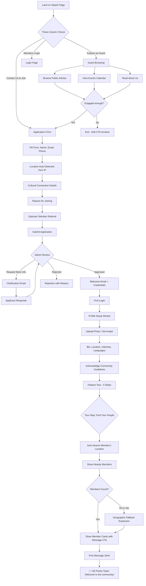
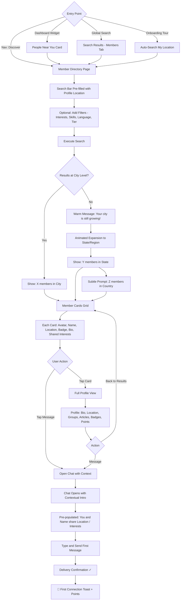
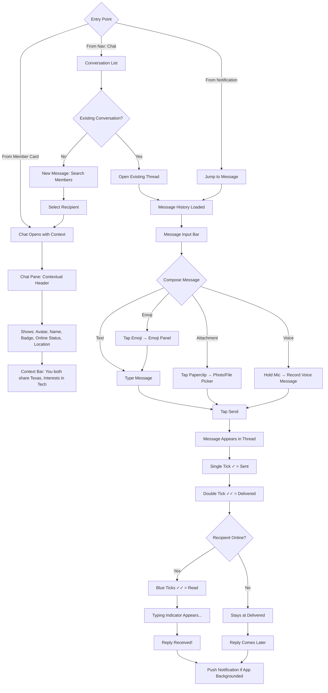
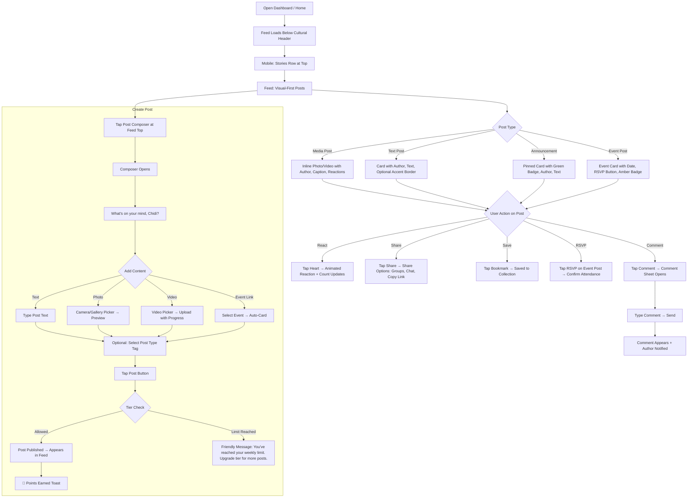
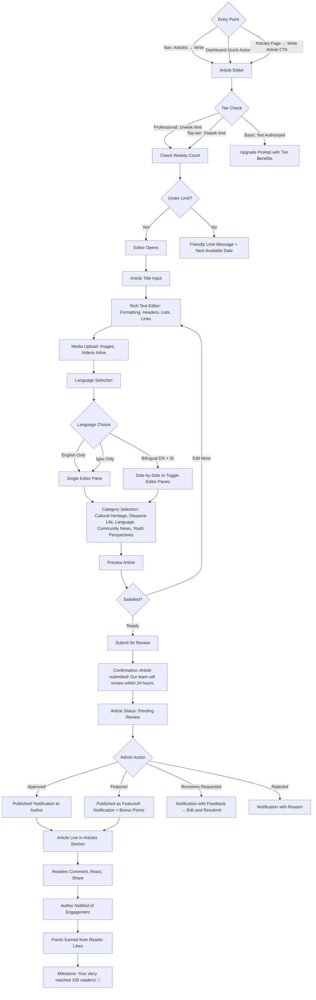
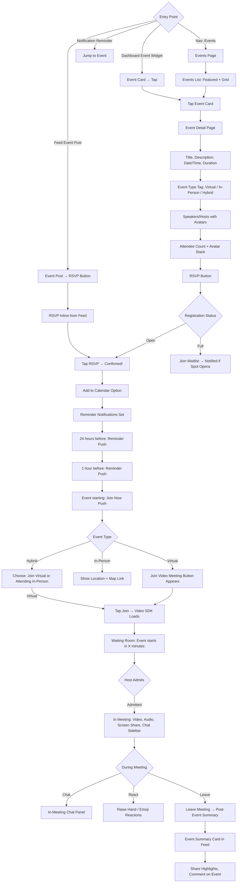
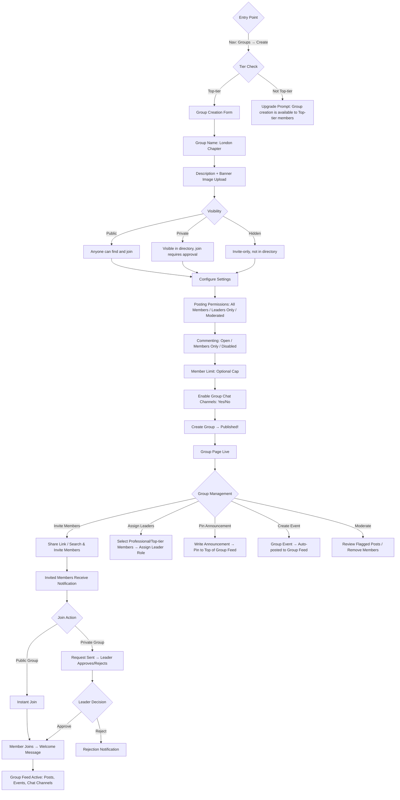
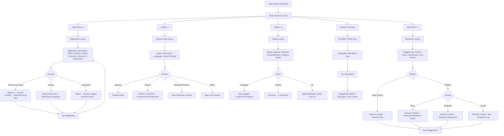

# UX Design Specification — igbo

**Author:** Dev
**Date:** 2026-02-19

---

## Executive Summary

### Project Vision

igbo is the first purpose-built digital home for the Igbo diaspora — a real-time, mobile-first community web platform that makes scattered community members discoverable, connected, and engaged across the globe. The MVP delivers the community core: admin-approved membership, real-time Slack-style chat, member directory with geographic discovery, groups, events with integrated video, bilingual articles for cultural preservation, a points-based engagement system, and comprehensive admin tools. The platform serves a user spectrum from tech-savvy young professionals in Houston to elders in Enugu who need their grandchildren's help to navigate — and the UX must serve both without compromise.

### Target Users

| Persona                                    | Age/Location     | Tech Comfort | Primary UX Need                                         | Device                     |
| ------------------------------------------ | ---------------- | ------------ | ------------------------------------------------------- | -------------------------- |
| **Chidi** — Diaspora Young Professional    | 28, Houston      | High         | Discovery, social feed, chat — "find my people"         | Mobile-first               |
| **Adaeze** — Young Person Back Home        | 22, Lagos        | Medium-High  | Mentorship, career inspiration, articles                | Mobile, variable bandwidth |
| **Chief Okonkwo** — Elder Knowledge Keeper | 67, Enugu        | Low          | Publish cultural content, simple navigation, large text | Assisted mobile/desktop    |
| **Ngozi** — Community Leader               | 45, London       | Medium-High  | Group management, event coordination, announcements     | Desktop + mobile           |
| **Emeka** — New Discoverer                 | 34, Kuala Lumpur | Medium       | Guest browsing, sign-up, member discovery               | Mobile                     |
| **Admin Amaka** — Platform Administrator   | 38, Volunteer    | High         | Queue processing, moderation, analytics — 45 min/day    | Desktop                    |

### Key Design Challenges

1. **Elder-to-Youth Spectrum** — Serving Chief Okonkwo (67, low tech) and Chidi (28, high expectations) on the same platform requires progressive complexity: simple surface, powerful depth
2. **Navigation Overload** — 9+ top-level destinations in MVP; mobile bottom tab bar allows max 5. Information architecture must prioritize ruthlessly
3. **The Empty Room** — Launch with ~500 members across 15+ countries means most city searches return zero. Geographic fallback must transform "no results" into expanding discovery
4. **Chat as Heartbeat** — Leading business metric (20+ messages/user/month) competing against WhatsApp/Slack user expectations. Must coexist clearly with news feed
5. **Intentional Friction** — Admin-approved membership creates up to 48-hour wait. UX must frame this as exclusive welcome, not bureaucratic delay
6. **Bilingual Everything** — English + Igbo toggle affects layouts, typography (diacritics/tone marks), and content authoring across every screen
7. **Global Connectivity Variance** — Members in Lagos, Enugu, KL face inconsistent connectivity. Lite PWA, aggressive image optimization, and graceful degradation are UX-critical

### Design Opportunities

1. **Geographic Discovery as Magic Moment** — Animated search expansion (city → state → country) can feel like watching your people appear. No other platform does this.
2. **Cultural Visual Identity** — Igbo art traditions (uli, nsibidi) can inform a design system that says "built for us" beyond generic blue
3. **Gamification Psychology** — Points + badges (3x/6x/10x multipliers) feeding into governance voting power creates a meaningful engagement loop, not just vanity metrics
4. **Assisted Onboarding** — Explicit "Help someone join" flow for elders supported by family members, turning a limitation into an intergenerational feature
5. **Chat-Feed Convergence** — Group chat messages elevated to feed posts, feed announcements sparking chat threads — bridging synchronous and asynchronous engagement

## Core User Experience

### Defining Experience

**The Core Action is Connection — Not Just Messaging.**

igbo's defining experience is the full arc of community connection: discovering someone from your culture who lives in your city, reaching out, chatting, sharing a photo of your grandmother's recipe or a video of last weekend's cultural festival, commenting on each other's milestones, and eventually meeting face-to-face. Messaging is the tool — connection is the outcome.

The platform's core loop is: **Discover → Connect → Engage → Share → Belong**

- **Discover** — Find community members near you or who share your interests
- **Connect** — Send that first message, join a group, RSVP to an event
- **Engage** — Chat in real-time, comment on posts, attend video meetings
- **Share** — Post photos of family gatherings, videos of festival celebrations, articles preserving cultural knowledge
- **Belong** — Feel the steady pulse of your community alive around you, every day

Every screen, every interaction, every navigation choice must serve this loop. If a feature doesn't help users discover, connect, engage, share, or belong — it doesn't belong in the MVP.

### Platform Strategy

**Mobile-first responsive web (Lite PWA) with desktop excellence.**

- **Primary platform:** Mobile web (Chrome, Safari, Samsung Internet) — community members will check igbo on their phones the way they check WhatsApp today
- **Secondary platform:** Desktop web — power users (Ngozi managing groups, Amaka processing admin queues, Chief Okonkwo composing articles with his granddaughter's help)
- **PWA features:** Installable on home screen, push notifications, smart caching for variable connectivity
- **Offline consideration:** Graceful degradation — cached feed content, queued messages sent on reconnect, offline fallback page
- **Touch-first design:** All interactive elements 44x44px minimum, swipe gestures for common actions, pull-to-refresh patterns
- **Bandwidth sensitivity:** Lazy-loaded images, compressed video thumbnails, progressive image loading, audio-only fallback for video meetings
- **Breakpoints:** Mobile (< 768px), Tablet (768-1024px), Desktop (> 1024px)

### Effortless Interactions

**Everything in the core loop must feel effortless. Zero friction on these critical paths:**

| Interaction                   | Must Feel Like                                                            | Never Feel Like                                                    |
| ----------------------------- | ------------------------------------------------------------------------- | ------------------------------------------------------------------ |
| **Finding members near you**  | Watching your people appear on a map — expansive, hopeful, magical        | Querying a database with no results — cold, dead, empty            |
| **Sending first message**     | Walking up to someone at a community gathering and saying hello           | Filling out a contact form and waiting for a reply                 |
| **Joining a group**           | Being welcomed into a room where people know your name                    | Requesting access and waiting for approval (except private groups) |
| **Watching community videos** | Sitting in your uncle's living room watching festival footage together    | Buffering, loading, "video not available in your region"           |
| **Sharing photos/videos**     | Passing your phone around at a family dinner — "look at this!"            | Uploading to a file manager with metadata fields                   |
| **Reading articles**          | An elder sitting on the veranda telling you a story                       | Scrolling through a blog with ads and pop-ups                      |
| **Attending a video event**   | Walking into a town hall and finding a seat                               | Downloading software, creating accounts, entering meeting codes    |
| **Checking your feed**        | Catching up with the neighborhood — who's doing what, what happened today | Scrolling through an algorithmic void of strangers                 |
| **Commenting/reacting**       | Nodding along, laughing, clapping — natural human responses               | Composing formal written feedback                                  |
| **Switching languages**       | As natural as switching between English and Igbo mid-sentence             | A settings page buried three levels deep                           |

### Critical Success Moments

**Make-or-Break Moments — If These Fail, The Platform Fails:**

1. **The Discovery Moment** — Emeka searches "Kuala Lumpur." If the result is a blank page, he leaves. If the UI gracefully expands to "3 members in Malaysia... 47 in Southeast Asia" with faces, names, and bios — he stays forever. This moment must never feel empty.

2. **The First Message** — Chidi finds a member in Dallas who grew up in the same town. He clicks "Message." If there's any friction — a signup wall, a loading screen, a confusing interface — the moment dies. That first message must go from thought to sent in under 5 seconds.

3. **The Cultural Content Moment** — A diaspora member in London opens igbo and sees a video of a traditional wedding ceremony from home. Their eyes well up. They share it with their group. They comment. They call their mother. This emotional reaction is the platform's deepest engagement driver. Media must load fast, play smoothly, and be easy to share.

4. **The Town Hall Moment** — Ngozi's virtual event with 120 members. If video stutters, if the join process requires a download, if the chat sidebar doesn't work — 120 people have a bad experience and tell others. Video events must "just work."

5. **The Admin Morning** — Amaka opens the admin dashboard at 7 AM. If the queues are unclear, if she can't process 4 applications in 10 minutes, if the moderation tools are clunky — she burns out and stops volunteering. Admin efficiency is community survival.

6. **The Elder's First Article** — Chief Okonkwo's granddaughter submits his story. If the editor is complex, if the bilingual toggle is confusing, if the approval takes days with no feedback — he gives up. And his stories die with him.

### Experience Principles

These five principles guide every UX decision in igbo:

**1. Connection Before Content**
Every screen should show _people_, not just information. Avatars, names, online indicators, member counts, "people you may know" — the platform must feel populated and alive. Content (articles, events, posts) is the _reason_ people connect, but the people are always the focus.

**2. Progressive Complexity**
The surface is simple enough for Chief Okonkwo. The depth is rich enough for Ngozi. New users see a clean feed, a search bar, and a chat icon. Power users discover group management, event creation, analytics, and moderation tools. Complexity reveals itself as users grow — never overwhelms on arrival.

**3. Cultural Warmth Over Corporate Polish**
igbo should feel like a community gathering, not a SaaS product. Warm colors, human language ("Welcome home, Chidi" not "Dashboard"), celebration of milestones ("Your article reached 100 readers!"), and visual identity rooted in Igbo artistic traditions. The design system should make a member in Houston feel a connection to Enugu the moment they open the app.

**4. No Dead Ends**
Every "no results" has a next step. Every empty state has a suggestion. Every completed action has a "what's next." The platform never leaves a user staring at a blank page. Geographic search expands. Empty feeds suggest groups. New profiles prompt "complete your bio." The UX always has momentum.

**5. Effortless Media, Emotional Impact**
Photos and videos of community life — weddings, festivals, gatherings, cultural ceremonies — are the emotional core of the platform. Media sharing must be as frictionless as WhatsApp (tap, select, send), media consumption must be smooth regardless of bandwidth (progressive loading, adaptive quality), and media in the feed must stop the scroll and create feeling.

## Desired Emotional Response

### Primary Emotional Goals

**Discovery + Pride: The Twin Engines of igbo's Emotional Experience**

Every interaction on igbo should amplify two core feelings:

1. **The Excitement of Discovery** — The thrill of finding your people in unexpected places. A community member in your city you never knew existed. A cultural event happening next weekend in your country. An elder's article that explains a tradition you only half-remembered. A group of professionals in your industry who share your heritage. igbo should feel like a treasure chest that keeps revealing new connections, new knowledge, new belonging — every time you open it.

2. **The Pride of Cultural Identity** — The deep, warm pride of seeing your culture celebrated, preserved, and thriving across the globe. Not as a footnote on someone else's platform, but as the _entire purpose_ of the space. When Chidi sees 47 Igbo community members across the United States, he doesn't just feel connected — he feels _proud_ that his people are everywhere, achieving, preserving, building. The platform should make cultural identity feel like a superpower, not a niche.

### Emotional Journey Mapping

| Stage                          | User Moment                                                              | Target Emotion                                                                | Design Implication                                                                                                                                            |
| ------------------------------ | ------------------------------------------------------------------------ | ----------------------------------------------------------------------------- | ------------------------------------------------------------------------------------------------------------------------------------------------------------- |
| **First Visit (Guest)**        | Emeka lands on the splash page from a Twitter link                       | **Curiosity + Recognition** — "This is about _my_ people?"                    | Cultural visual identity in hero section, real member photos, community stats that show global presence                                                       |
| **Browsing as Guest**          | Emeka reads an article about cultural heritage, sees upcoming events     | **Intrigue + FOMO** — "There's a whole world here I'm not part of yet"        | Show enough to create desire, gate enough to create urgency. Gentle CTAs: "Join to connect with 500+ members worldwide"                                       |
| **Application Submitted**      | Emeka fills out the contact form, waits for approval                     | **Anticipation + Validation** — "I'm being welcomed into something exclusive" | Confirmation page with warmth: "We're reviewing your application. Welcome home soon." Status email within 24 hours.                                           |
| **First Login**                | Chidi logs in, completes profile, takes feature tour                     | **Excitement + Orientation** — "There's so much here, and it's all for us"    | Guided onboarding that shows people first (not features), suggests groups by interest, surfaces nearby members immediately                                    |
| **The Discovery Moment**       | Chidi searches Houston, finds members in Texas                           | **Awe + Belonging** — "My people are here. I'm not alone."                    | Geographic fallback with expanding animation, member cards with photos and bios, immediate "Send Message" action                                              |
| **First Message Sent**         | Chidi messages a member from his hometown in Dallas                      | **Connection + Warmth** — "This person _gets_ me"                             | Instant delivery, typing indicator, warm empty state: "Start the conversation — you share a hometown"                                                         |
| **Consuming Cultural Content** | A member watches a video of a traditional wedding ceremony from home     | **Nostalgia + Pride + Joy** — Eyes welling up, heart full                     | Smooth video playback, prominent share button, comments showing emotional reactions from others: "This reminds me of home"                                    |
| **Attending a Virtual Event**  | Adaeze joins a mentorship session, meets a diaspora professional         | **Inspiration + Hope** — "My future is bigger than I thought"                 | Seamless video join, welcoming waiting room, visible attendee count showing community size                                                                    |
| **Publishing an Article**      | Chief Okonkwo's article goes live, comments arrive from around the world | **Legacy + Purpose** — "My stories will live forever"                         | Publication celebration moment, real-time comment notifications, reader count milestone celebrations                                                          |
| **Participating in Community** | Ngozi runs a town hall, sees 120 attendees engaged                       | **Leadership + Impact** — "I'm building something that matters"               | Event analytics showing reach, attendee engagement indicators, post-event summary                                                                             |
| **Returning Daily**            | Chidi opens igbo during morning coffee                                   | **Comfort + Ritual** — "Let me check in with my people"                       | Fresh feed content, unread message indicators, "What's happening today" event prompts                                                                         |
| **When Things Go Wrong**       | Search returns no results, video lags, application takes 2 days          | **Patience + Trust** — "They care, they'll fix it"                            | Human responses: feedback forms that acknowledge, invitations to online meetings to connect with community leaders, "not yet" language instead of "not found" |

### Micro-Emotions

**Critical Micro-Emotion Pairs — Where igbo Must Land on the Right Side:**

| Positive (Target)  | Negative (Avoid) | When It Matters Most                                                   |
| ------------------ | ---------------- | ---------------------------------------------------------------------- |
| **Belonging**      | Isolation        | Member directory search, group discovery, feed browsing                |
| **Pride**          | Embarrassment    | Cultural content sharing, profile display, language toggle             |
| **Confidence**     | Confusion        | Navigation, first-time flows, admin tools                              |
| **Trust**          | Skepticism       | Application process, data privacy, admin decisions                     |
| **Excitement**     | Boredom          | Feed content, event discovery, new member suggestions                  |
| **Accomplishment** | Frustration      | Points earned, article published, event organized                      |
| **Nostalgia**      | Homesickness     | Cultural media (videos, photos), articles about traditions             |
| **Hope**           | Disappointment   | Job/mentorship connections (Phase 2), member discovery in sparse areas |

**The Nostalgia-Hope Balance:** Community media (wedding videos, festival photos) will trigger nostalgia — but igbo must channel that into _hope and action_, not passive homesickness. The design should always pair emotional content with connection opportunities: "Feeling moved? Share this with your group" or "12 members in your area celebrated this festival last year."

### Design Implications

**Emotion → UX Design Connections:**

| Desired Emotion                   | UX Approach                                                                                                                                                                                              |
| --------------------------------- | -------------------------------------------------------------------------------------------------------------------------------------------------------------------------------------------------------- |
| **Discovery excitement**          | Animated geographic search expansion, "People you may know" suggestions, "New members near you" notifications, serendipitous content surfacing                                                           |
| **Cultural pride**                | Visual identity rooted in Igbo art traditions, bilingual UI as a celebration (not just a toggle), cultural category badges on content, heritage-themed empty states and loading screens                  |
| **Belonging warmth**              | Member avatars everywhere, online presence indicators, personalized greetings ("Welcome home, Chidi"), group member counts, "X members are here right now"                                               |
| **Trust + patience**              | Transparent application status, human-written system messages, admin response commitments, feedback loops that acknowledge and follow up, invitation to connect with community leaders when issues arise |
| **Legacy + purpose**              | Article reader counts, "Your story reached members in 8 countries," points milestone celebrations, contributor recognition on profiles                                                                   |
| **Nostalgia channeled to action** | Cultural media paired with share/comment CTAs, "Members near you who also loved this," event suggestions tied to cultural content themes                                                                 |
| **Inspiration + hope**            | Success stories in the feed, mentorship connection prompts, "Members from your city who..." achievements, Adaeze seeing career paths through the diaspora                                                |

### Emotional Design Principles

**1. Home, Not Homepage**
Every returning user should feel like they're walking through their own front door. Personalized greetings in their chosen language, familiar faces in the feed, their groups and conversations waiting. The dashboard isn't a landing page — it's the living room of their digital home.

**2. Pride as a Feature**
Cultural identity isn't a tag or a category — it's the entire reason the platform exists. The visual design, the language, the content organization, the community stats should all make members feel proud to be part of this community. Every screen should whisper: "Your culture is alive, thriving, and global."

**3. Human Friction, Not System Friction**
When something doesn't work, the response is human, not mechanical. "No members in your city yet — but 12 in your country would love to meet you." "Your application is being reviewed by a real person who cares about this community." "Having trouble? Join our weekly community call and tell us." Replace error messages with invitations.

**4. Celebrate the Small Moments**
Don't wait for big milestones. Celebrate the first message sent, the first group joined, the first article read, the first event RSVP'd. Micro-celebrations (subtle animations, warm confirmation messages, points earned) build the habit loop that turns a first visit into a daily ritual.

**5. Nostalgia as a Bridge, Not a Wall**
Cultural content — videos of festivals, photos of ceremonies, articles about traditions — will trigger deep emotional responses. The design must channel that emotion into _connection and action_: sharing, commenting, messaging someone, joining a group. Nostalgia should open doors to community, not leave users sitting alone with their memories.

## UX Pattern Analysis & Inspiration

### Inspiring Products Analysis

igbo's target users currently live in four apps. Each has trained specific UX expectations that igbo must meet or exceed — while delivering something none of them can: a dedicated cultural community home with events, festivals, social gatherings, and diaspora-specific connection.

**1. WhatsApp — The Communication Baseline**

| Aspect                  | What They Do Well                                                                                                                                                            | Relevance to igbo                                                                                                                              |
| ----------------------- | ---------------------------------------------------------------------------------------------------------------------------------------------------------------------------- | ---------------------------------------------------------------------------------------------------------------------------------------------- |
| **Messaging UX**        | Instant, reliable, zero-friction messaging. Tap a contact, type, send. Read receipts (blue ticks), typing indicators, voice messages. The gold standard for "it just works." | igbo's chat must match this baseline. Any added complexity (threads, channels) must layer on top of WhatsApp-level simplicity, not replace it. |
| **Media sharing**       | Tap camera icon, select photo/video, send. Compression happens automatically. Videos play inline.                                                                            | Media sharing in igbo's feed and chat must be this frictionless. No upload forms, no file size warnings — just tap, select, share.             |
| **Group communication** | Simple group creation, group info, participant list, shared media gallery.                                                                                                   | igbo's groups borrow this familiarity but add structure (channels, pinned posts, events) that WhatsApp can't offer.                            |
| **Status/presence**     | Online/last seen indicators, profile photos visible in chat list.                                                                                                            | igbo must show member presence — online dots, "active now" — to make the platform feel alive.                                                  |
| **What they DON'T do**  | No discoverability. No member directory. No events. No content publishing. No governance. You can only connect with people whose phone number you already have.              | This is igbo's core advantage — discovery of people you _don't_ already know.                                                                  |

**2. Facebook — The Social Feed Baseline**

| Aspect                 | What They Do Well                                                                                                                                                                                                                                      | Relevance to igbo                                                                                                                                                 |
| ---------------------- | ------------------------------------------------------------------------------------------------------------------------------------------------------------------------------------------------------------------------------------------------------ | ----------------------------------------------------------------------------------------------------------------------------------------------------------------- |
| **News feed**          | Infinite scroll, mixed content types (text, photos, videos, links, events), reactions (not just likes), comments, shares. Users understand this pattern instinctively.                                                                                 | igbo's dashboard feed should feel immediately familiar to Facebook users. Same patterns: post composer at top, feed below, reactions/comments/share on each post. |
| **Groups**             | Group discovery, join/request flow, group feed, admin tools, member lists, announcements. Facebook Groups is the closest existing model to igbo's groups.                                                                                              | igbo's groups should feel like Facebook Groups but better — with integrated chat channels, events, and cultural context that Facebook Groups lack.                |
| **Events**             | Event creation, RSVP, calendar, reminders, event discussions.                                                                                                                                                                                          | igbo's events follow this pattern but add video meeting integration — something Facebook Events doesn't natively do well.                                         |
| **Notifications**      | Bell icon, categorized notifications, red badge counts, notification preferences.                                                                                                                                                                      | Standard pattern — igbo should follow this exactly. Users expect it.                                                                                              |
| **What they DON'T do** | Generic platform — no cultural focus, no community-exclusive membership, no bilingual support, no governance, no member directory with geographic discovery. Fragmented across dozens of disconnected community groups with no cross-group connection. | igbo unifies what Facebook fragments. One platform, one community, one directory, one identity.                                                                   |

**3. LinkedIn — The Professional Identity Baseline**

| Aspect                  | What They Do Well                                                                                                                                                               | Relevance to igbo                                                                                                                                                                     |
| ----------------------- | ------------------------------------------------------------------------------------------------------------------------------------------------------------------------------- | ------------------------------------------------------------------------------------------------------------------------------------------------------------------------------------- |
| **Profile as identity** | Rich profiles: photo, headline, bio, location, skills, experience, endorsements, connections count. Your profile IS your professional identity.                                 | igbo's profiles should carry this weight — not just a bio, but a full cultural + professional identity: location, languages, interests, cultural connections, badges, points, groups. |
| **Connection model**    | Connect/Message distinction, mutual connections shown, "People you may know" suggestions based on shared connections and interests.                                             | igbo's member discovery should borrow "People you may know" but add geographic and cultural dimensions LinkedIn doesn't have.                                                         |
| **Search & filtering**  | Search by name, location, company, skills with robust filters.                                                                                                                  | igbo's member directory needs this level of filtering — location, interests, skills, language, tier.                                                                                  |
| **What they DON'T do**  | Cold, corporate tone. No cultural warmth. No community events. No real-time chat. No media sharing culture. Professional-only — no space for wedding videos or festival photos. | igbo takes LinkedIn's identity structure but wraps it in cultural warmth and community context.                                                                                       |

**4. Instagram — The Media & Emotion Baseline**

| Aspect                        | What They Do Well                                                                                                                                                                           | Relevance to igbo                                                                                                                                                                                    |
| ----------------------------- | ------------------------------------------------------------------------------------------------------------------------------------------------------------------------------------------- | ---------------------------------------------------------------------------------------------------------------------------------------------------------------------------------------------------- |
| **Visual-first content**      | Photos and videos dominate. Content stops the scroll through visual impact, not text headlines.                                                                                             | igbo's feed should prioritize visual content — especially cultural media (wedding videos, festival photos, community gatherings). Text posts are fine, but media posts should be visually prominent. |
| **Stories/ephemeral content** | Quick, casual, low-pressure sharing. Disappears in 24 hours. Encourages frequent posting.                                                                                                   | Not MVP, but the _spirit_ applies — igbo should make sharing feel casual and low-pressure, not like publishing a formal post.                                                                        |
| **Engagement patterns**       | Double-tap to like, swipe through carousels, tap to expand, heart animations. Engagement is physical and satisfying.                                                                        | igbo's reaction patterns should feel similarly tactile and immediate — tap to react, smooth animations on engagement.                                                                                |
| **Explore/discovery**         | Algorithm-driven discovery of new content and creators based on interests.                                                                                                                  | igbo's "recommended" content and member suggestions should create this serendipitous discovery feeling.                                                                                              |
| **What they DON'T do**        | No community structure. No groups with governance. No events with RSVP. No chat channels. No member directory. No bilingual support. Public by default — no community-exclusive membership. | igbo adds structure, exclusivity, and community purpose to Instagram's emotional, visual-first engagement model.                                                                                     |

**5. Slack — The Chat Architecture Reference (from PRD)**

While igbo's users don't live in Slack personally, the PRD specifies "Slack-style" chat architecture. Key patterns to adopt:

| Aspect                   | What Slack Does Well                                                                          | Relevance to igbo                                                                                   |
| ------------------------ | --------------------------------------------------------------------------------------------- | --------------------------------------------------------------------------------------------------- |
| **Channel organization** | Channels (public/private) + DMs in one sidebar. Clear separation.                             | igbo's chat should organize: DMs, group channels, and general channels in a clear sidebar hierarchy |
| **Threaded replies**     | Reply to a specific message without cluttering the main conversation.                         | Essential for busy group channels — keeps discussions organized                                     |
| **Rich messaging**       | Formatting, file attachments, emoji reactions on specific messages, message editing/deletion. | Match these capabilities for a modern chat experience                                               |
| **Search**               | Full-text search across all messages and channels.                                            | Critical for finding past conversations and shared information                                      |

### Transferable UX Patterns

**Navigation Patterns:**

| Pattern                          | Source                        | Application in igbo                                                                                                                                                 |
| -------------------------------- | ----------------------------- | ------------------------------------------------------------------------------------------------------------------------------------------------------------------- |
| **Bottom tab bar (mobile)**      | Instagram, Facebook           | 5 primary destinations on mobile: Home (feed), Chat, Discover (directory + groups), Events, Profile. Everything else accessible via hamburger or nested navigation. |
| **Top nav bar (desktop)**        | Facebook, LinkedIn            | Full horizontal nav with all primary sections visible. Active state highlighting. Search bar center or right. Profile/notifications far right.                      |
| **Notification bell with badge** | Facebook, LinkedIn, Instagram | Universal pattern — red badge count, dropdown on click, categorized notifications. Users expect this exact behavior.                                                |
| **Sidebar chat panel (desktop)** | Facebook Messenger, Slack     | Persistent chat sidebar on desktop — visible alongside feed, collapsible when not needed. Full-screen on mobile.                                                    |

**Interaction Patterns:**

| Pattern                       | Source                                                    | Application in igbo                                                                                                        |
| ----------------------------- | --------------------------------------------------------- | -------------------------------------------------------------------------------------------------------------------------- |
| **Post composer at feed top** | Facebook                                                  | "What's on your mind, Chidi?" with attachment options (photo, video, event). Familiar, inviting, always visible.           |
| **Inline media playback**     | Instagram, Facebook                                       | Videos play inline in the feed without navigating away. Tap to expand to full-screen. Sound off by default, tap for sound. |
| **Reaction system**           | Facebook (reactions), Instagram (hearts)                  | Multiple reaction types beyond just "like" — culturally relevant reactions could differentiate igbo.                       |
| **Pull-to-refresh**           | Universal mobile                                          | Standard mobile pattern for refreshing feed content. Must be implemented.                                                  |
| **Swipe actions**             | WhatsApp (swipe to reply), Instagram (swipe between tabs) | Swipe to reply in chat, swipe between feed sections on mobile.                                                             |
| **Tap-to-connect/message**    | LinkedIn, WhatsApp                                        | One-tap action to connect with or message a discovered member. Zero friction on the critical action.                       |

**Visual Patterns:**

| Pattern                       | Source                                      | Application in igbo                                                                                            |
| ----------------------------- | ------------------------------------------- | -------------------------------------------------------------------------------------------------------------- |
| **Avatar-first layouts**      | All four apps                               | Every list, every card, every post leads with a face. Members are people, not usernames.                       |
| **Card-based content**        | Facebook, LinkedIn, Instagram               | Content in cards with clear boundaries — post card, event card, group card, member card. Consistent structure. |
| **Status indicators**         | WhatsApp (online dot), LinkedIn (green dot) | Green dot for online, grey for offline. Essential for making the platform feel alive.                          |
| **Progressive image loading** | Instagram                                   | Blurred placeholder → full image. Critical for variable bandwidth users in Nigeria, Malaysia, Vietnam.         |

### Anti-Patterns to Avoid

| Anti-Pattern                          | Why It's Dangerous                                                                                            | How igbo Avoids It                                                                                                                                          |
| ------------------------------------- | ------------------------------------------------------------------------------------------------------------- | ----------------------------------------------------------------------------------------------------------------------------------------------------------- |
| **Facebook's algorithmic opacity**    | Users don't understand why they see what they see. Creates distrust.                                          | igbo offers toggle between chronological and algorithmic feed. Default to chronological — let users _choose_ algorithmic.                                   |
| **LinkedIn's cold formality**         | Professional but soulless. "Congratulate X on their work anniversary" feels robotic.                          | igbo uses warm, culturally resonant language. "Welcome home" not "Welcome to the platform." Celebrations feel genuine, not automated.                       |
| **Instagram's engagement addiction**  | Infinite scroll, dopamine-driven, no natural stopping point. Optimizes for time-on-app, not user wellbeing.   | igbo optimizes for _meaningful_ engagement — messages sent, events attended, articles read — not mindless scrolling. Feed has natural sections and prompts. |
| **WhatsApp's group spam**             | Unmoderated groups devolve into forwards, memes, and noise. No structure, no governance.                      | igbo's groups have moderation tools, posting permissions, pinned announcements, and structured channels. Quality over quantity.                             |
| **Feature overload on first visit**   | Complex apps that show everything on day one overwhelm users (especially Chief Okonkwo).                      | Progressive disclosure — show 5 things on day one, reveal more as users engage. Onboarding wizard focuses on people, not features.                          |
| **Generic empty states**              | "No results found" with no guidance. Kills momentum.                                                          | Every empty state in igbo has a warm message and a next action. "No members in your city yet — here are 12 in your country who'd love to meet you."         |
| **Fragmented identity across groups** | On Facebook, you're in 15 different Igbo groups with 15 different contexts. No unified identity or directory. | igbo = one identity, one profile, one directory. Groups are _within_ the platform, not separate islands.                                                    |
| **Complex event joining**             | Zoom/Teams requiring downloads, accounts, meeting codes.                                                      | igbo events use embedded video SDK — click "Join," you're in. No downloads, no codes, no separate accounts.                                                 |

### Design Inspiration Strategy

**What to Adopt (Use As-Is):**

- WhatsApp's messaging simplicity — tap, type, send, delivered, read
- Facebook's feed + post composer pattern — universally understood
- LinkedIn's rich profile structure — identity matters in community platforms
- Instagram's visual-first content display — media stops the scroll
- Slack's channel organization — DMs + channels in one clear sidebar
- Universal notification bell + badge pattern

**What to Adapt (Modify for igbo):**

- Facebook Groups → igbo Groups with integrated chat channels, video events, and cultural context
- LinkedIn's "People you may know" → igbo's geographic discovery with cultural affinity and fallback expansion
- Instagram's Explore → igbo's member/content discovery with community relevance, not algorithmic virality
- Facebook Reactions → Culturally meaningful reaction options that resonate with Igbo community
- Slack's threading → Simplified threading that doesn't overwhelm less tech-savvy users like Chief Okonkwo

**What to Avoid (Explicitly Reject):**

- Algorithmic-first feeds that hide content from connections
- Cold, corporate UI language and robotic system messages
- Infinite scroll without natural breakpoints or meaningful prompts
- Feature-dense first experiences that overwhelm new users
- Empty states without guidance, warmth, or next steps
- Complex event joining flows requiring external tools or downloads
- Fragmented identity across disconnected groups or contexts

## Design System Foundation

### Design System Choice

**shadcn/ui + Tailwind CSS + Radix UI Primitives**

igbo's design system is built on shadcn/ui — a copy-paste component library that provides professionally engineered, accessible UI components built on Radix UI primitives and styled with Tailwind CSS. This choice gives igbo full ownership of every component (no runtime dependency), deep customizability for cultural visual identity, and WCAG 2.1 AA accessibility out of the box.

### Rationale for Selection

| Factor                     | How shadcn/ui Delivers                                                                                                                                                                          |
| -------------------------- | ----------------------------------------------------------------------------------------------------------------------------------------------------------------------------------------------- |
| **Cultural customization** | Copy-paste ownership means every component can be themed with Igbo-inspired colors, typography, and patterns without fighting a library's design opinion                                        |
| **Accessibility**          | Built on Radix UI primitives — keyboard navigation, screen reader support, focus management, and ARIA attributes are included by default. Critical for Chief Okonkwo and WCAG 2.1 AA compliance |
| **Next.js alignment**      | shadcn/ui is purpose-built for Next.js + React + TypeScript — zero friction with igbo's tech stack                                                                                              |
| **Tailwind CSS native**    | Components are styled with Tailwind utilities — no conflicting CSS-in-JS runtime, no style system clash, no bundle bloat                                                                        |
| **Development speed**      | Pre-built components for buttons, cards, dialogs, dropdowns, tabs, forms, tables, navigation menus, sheets, toasts, and more — accelerates the 4-6 month timeline                               |
| **Bundle performance**     | No library runtime — components are source code in your project. Tree-shaking is automatic. Critical for bandwidth-sensitive users in Nigeria, Malaysia, Vietnam                                |
| **Team scalability**       | Components follow consistent patterns. New developers can read and modify any component without learning a proprietary API                                                                      |
| **Long-term ownership**    | No vendor lock-in. If shadcn/ui stops being maintained tomorrow, your components still work — they're your code                                                                                 |

### Implementation Approach

**Component Architecture:**

```
src/
  components/
    ui/                    # shadcn/ui base components (owned, customized)
      button.tsx
      card.tsx
      dialog.tsx
      input.tsx
      tabs.tsx
      ...
    features/              # igbo-specific composite components
      member-card.tsx
      post-composer.tsx
      event-card.tsx
      chat-message.tsx
      group-card.tsx
      article-card.tsx
      notification-item.tsx
      admin-queue-item.tsx
      ...
    layout/                # Layout components
      nav-bar.tsx
      bottom-tab-bar.tsx
      sidebar.tsx
      page-shell.tsx
      ...
```

**Setup Steps:**

1. Initialize shadcn/ui in the Next.js project with Tailwind CSS
2. Configure design tokens (colors, typography, spacing, radius) in `tailwind.config.ts` to reflect Igbo cultural identity
3. Install base components needed for MVP (button, card, dialog, input, select, tabs, dropdown-menu, sheet, toast, avatar, badge, separator, skeleton, scroll-area, form)
4. Customize base components with igbo's color palette, border radius, font sizes, and spacing
5. Build feature-specific composite components on top of the base layer
6. Establish responsive patterns using Tailwind breakpoints (mobile < 768px, tablet 768-1024px, desktop > 1024px)

**Key shadcn/ui Components for igbo MVP:**

| Component        | igbo Usage                                                                                              |
| ---------------- | ------------------------------------------------------------------------------------------------------- |
| **Button**       | Primary actions (Post, Send, RSVP, Join, Apply), secondary actions, destructive actions (Remove, Ban)   |
| **Card**         | Member cards, post cards, event cards, group cards, article cards, admin queue items                    |
| **Dialog/Sheet** | Post composer modal, confirmation dialogs, mobile navigation sheet, profile quick-view                  |
| **Input + Form** | Registration form, search bars, post composer, article editor, profile edit, admin forms                |
| **Tabs**         | Profile tabs (Posts/Articles/About/Groups), feed filters, admin queue tabs, event views (Calendar/List) |
| **Avatar**       | Member photos everywhere — feed, chat, directory, profiles, group lists                                 |
| **Badge**        | Verification badges (Blue/Red/Purple), tier labels, event type tags, notification counts                |
| **DropdownMenu** | Post actions (edit/delete/report), sort/filter options, user menu                                       |
| **Toast**        | Success confirmations, points earned, error messages, notification toasts                               |
| **Skeleton**     | Loading states for feed, member cards, chat messages — progressive loading for variable bandwidth       |
| **ScrollArea**   | Chat message history, long member lists, notification panels                                            |
| **Separator**    | Visual content separation in feeds, profiles, admin panels                                              |
| **Sheet**        | Mobile slide-out panels for chat, filters, navigation                                                   |

### Customization Strategy

**Design Tokens — igbo Cultural Identity:**

The following design tokens transform generic shadcn/ui components into igbo's cultural visual identity. These are configured in `tailwind.config.ts` and referenced via CSS variables:

**Color Palette:**

| Token                  | Purpose                                             | Direction                                                                                            |
| ---------------------- | --------------------------------------------------- | ---------------------------------------------------------------------------------------------------- |
| `--primary`            | Primary brand color — buttons, links, active states | Warm terracotta or deep indigo inspired by Igbo traditional textiles (moving away from generic blue) |
| `--primary-foreground` | Text on primary backgrounds                         | High contrast white or cream                                                                         |
| `--secondary`          | Secondary actions, subtle backgrounds               | Earth tone — warm sand or clay                                                                       |
| `--accent`             | Highlights, badges, celebration moments             | Rich gold or amber — warmth, pride, achievement                                                      |
| `--destructive`        | Errors, warnings, remove actions                    | Muted red — firm but not alarming                                                                    |
| `--muted`              | Subtle backgrounds, disabled states                 | Warm grey (not cold grey)                                                                            |
| `--card`               | Card backgrounds                                    | Warm white with subtle warmth                                                                        |
| `--background`         | Page backgrounds                                    | Off-white with cultural warmth, not sterile white                                                    |
| `--foreground`         | Primary text                                        | Near-black with warmth                                                                               |
| `--border`             | Borders, dividers                                   | Warm grey, subtle                                                                                    |

**Verification Badge Colors (fixed, per PRD):**

- Blue Badge: `--badge-blue` — Community verified
- Red Badge: `--badge-red` — Highly trusted
- Purple Badge: `--badge-purple` — Top-tier, maximum multiplier

**Event Type Colors (from mocks):**

- Virtual: Blue
- In-Person: Green
- Hybrid: Orange

**Typography:**

| Token                       | Value                                                                   | Usage                                                 |
| --------------------------- | ----------------------------------------------------------------------- | ----------------------------------------------------- |
| `--font-sans`               | Inter or similar clean sans-serif with excellent Igbo diacritic support | Body text, UI labels, navigation                      |
| `--font-heading`            | Slightly bolder weight of primary font, or a complementary display face | Page titles, section headers, hero text               |
| `--text-base`               | 16px minimum                                                            | Body text (elder-friendly, WCAG compliant)            |
| `--text-sm`                 | 14px                                                                    | Secondary text, metadata, timestamps                  |
| `--text-lg`                 | 18px                                                                    | Subheadings, emphasized content                       |
| `--text-xl` to `--text-3xl` | 20-30px                                                                 | Page titles, hero text                                |
| `--leading-relaxed`         | 1.6-1.75 line height                                                    | Body text for readability, especially for elder users |

**Spacing & Layout:**

| Token              | Value                                  | Usage                                                              |
| ------------------ | -------------------------------------- | ------------------------------------------------------------------ |
| `--radius`         | 12px (rounded, warm, not sharp)        | Cards, buttons, inputs — rounded feels approachable, not corporate |
| `--spacing-page`   | 16px mobile, 24px tablet, 32px desktop | Page padding                                                       |
| `--tap-target-min` | 44px                                   | Minimum interactive element size (WCAG, elder-friendly)            |

**Component Overrides:**

- **Buttons**: Rounded corners (radius-lg), generous padding, minimum height 44px for touch targets. Primary buttons use cultural accent color with subtle hover animation.
- **Cards**: Warm background, subtle shadow, rounded corners. Member cards always lead with avatar. Content cards show media prominently.
- **Inputs**: Large text (16px prevents iOS zoom), clear labels above (not placeholder-only), visible focus rings in primary color, generous padding.
- **Toast notifications**: Warm language ("Points earned!" not "Transaction complete"), celebration micro-animations for positive moments, respectful error messages.
- **Avatars**: Circular with subtle border. Online status dot positioned bottom-right. Fallback shows initials in primary color.
- **Badges**: Pill-shaped, culturally colored. Verification badges are distinct and recognizable across all contexts.

**Dark Mode:**

Deferred to post-MVP. The initial design focuses on a warm, light theme that reflects cultural warmth and optimism. Dark mode can be added later by swapping CSS variable values.

**Bilingual Considerations:**

- All component text passed via props/i18n — no hardcoded strings in components
- Layout tested with both English and Igbo text lengths (Igbo text with diacritics may be slightly longer)
- Font stack validated for Igbo diacritic and tone mark rendering
- RTL support not needed (both English and Igbo are LTR)

## Defining Experience

### The One-Sentence Product

**"Find your people — anywhere in the world."**

igbo's defining experience is geographic community discovery with instant connection. A member searches their city and watches their community appear — expanding outward from neighborhood to city to country to continent until they find their people. Then, with one tap, they connect. This is the interaction that makes someone tell a friend. This is the moment that justifies the platform's existence.

No WhatsApp group can do this. No Facebook page. No LinkedIn search. igbo is the only place where a scattered diaspora becomes visible, searchable, and connectable — for the first time.

### User Mental Model

**How users currently solve this problem:**

| Current Approach    | Mental Model                                 | What's Broken                                                                                                                                                            |
| ------------------- | -------------------------------------------- | ------------------------------------------------------------------------------------------------------------------------------------------------------------------------ |
| **WhatsApp groups** | "I'm in a group, so I'm connected"           | You only know people _already_ in the group. No discovery of new members. No directory. No way to find community members in your city who aren't in your specific group. |
| **Facebook groups** | "I search for Igbo groups and join"          | Dozens of fragmented, overlapping groups. No unified directory. No way to search "Igbo members in Houston." You find groups, not people.                                 |
| **Word of mouth**   | "I meet people at events or through friends" | Limited to physical proximity and existing networks. If you move to a new city, you start from zero.                                                                     |
| **LinkedIn**        | "I search for Igbo professionals"            | Cold, professional-only context. No cultural connection. No events. No community media. Finding someone's LinkedIn doesn't mean finding your _community_.                |

**The mental model shift igbo creates:**

- **From:** "I have to find and join groups to connect" → **To:** "I search my location and my community appears"
- **From:** "Connection requires someone's phone number" → **To:** "Connection requires only being a member"
- **From:** "My cultural identity is scattered across platforms" → **To:** "My cultural identity lives in one home"
- **From:** "I don't know if there are community members near me" → **To:** "I can see exactly who's near me, in my country, and around the world"

**Where users might get confused:**

- **Chat vs. Feed:** "Where do I post this — in chat or on the feed?" Solution: Clear distinction — chat is for conversations, feed is for broadcasting. Group activity surfaces in both contexts.
- **Groups vs. Directory:** "How do I find people — in groups or in the directory?" Solution: Both, and they're connected. Directory finds individuals. Groups find communities of interest. Both lead to the same profiles and messaging.
- **Tiers and permissions:** "Why can't I create a group?" Solution: Clear, non-punitive tier explanations. "Group creation is available to Top-tier members. Here's how to reach Top-tier status."

### Success Criteria

**The defining experience succeeds when:**

| Criterion                            | Measurable Signal                                                               | Target                                                     |
| ------------------------------------ | ------------------------------------------------------------------------------- | ---------------------------------------------------------- |
| **Discovery feels magical**          | Time from search to first result displayed                                      | < 2 seconds, with animated expansion                       |
| **No dead ends**                     | Percentage of member searches that return zero results at all geographic levels | < 5% (geographic fallback ensures someone is always found) |
| **First message is instant**         | Time from discovering a member to sending first message                         | < 10 seconds (two taps: view profile → send message)       |
| **Connection leads to conversation** | Percentage of first messages that receive a reply                               | > 60% within 48 hours                                      |
| **Discovery drives retention**       | Members who use directory search in first week return in week 2                 | > 70% retention                                            |
| **Users describe it to friends**     | Organic referral rate driven by discovery stories                               | > 60% of new members join via word of mouth                |
| **Emotional response achieved**      | User reports feeling "not alone" or "found my people"                           | Qualitative feedback in first 90 days                      |

**The experience fails when:**

- A member searches and sees "No results" with no fallback or guidance
- Finding a member requires more than 3 taps from the dashboard
- The first message takes more than 10 seconds to compose and send
- Discovery feels like a database query instead of a human moment
- Members discover people but have no easy path to connect

### Novel UX Patterns

**igbo combines familiar patterns in one novel way:**

| Pattern Type                      | Pattern                           | Novel or Established                                                                                                                                                                                                                              | igbo's Approach |
| --------------------------------- | --------------------------------- | ------------------------------------------------------------------------------------------------------------------------------------------------------------------------------------------------------------------------------------------------- | --------------- |
| **Geographic fallback discovery** | Novel                             | No existing platform gracefully expands search from city → state → country → region when results are sparse. igbo pioneered this for diaspora density challenges. The UI must animate this expansion to feel like _discovery_, not _degradation_. |
| **Member directory search**       | Established (LinkedIn)            | Adopt LinkedIn's filter-based search but add geographic fallback, cultural affinity signals, and warm member cards with avatars and bios.                                                                                                         |
| **One-tap messaging**             | Established (WhatsApp, LinkedIn)  | Adopt — member card shows "Message" button. Tap to open conversation. Pre-populated context: "You and Chidi are both in Texas."                                                                                                                   |
| **Social feed**                   | Established (Facebook)            | Adopt — post composer, mixed content types, reactions, comments, shares. Familiar to every user.                                                                                                                                                  |
| **Real-time chat**                | Established (WhatsApp, Slack)     | Combine WhatsApp's simplicity with Slack's channel organization. DMs feel like WhatsApp. Group channels feel like Slack.                                                                                                                          |
| **Event RSVP + embedded video**   | Adapted (Facebook Events + Zoom)  | Facebook's RSVP flow but with one-click video join embedded in the platform. No external tools.                                                                                                                                                   |
| **Gamification with meaning**     | Adapted (Duolingo + Reddit karma) | Points aren't just vanity — they unlock capabilities (tier upgrades) and will feed governance (voting power). Every point means something.                                                                                                        |
| **Bilingual toggle**              | Adapted                           | Not just a settings toggle — a persistent, always-visible language switch that feels as natural as switching between English and Igbo mid-conversation.                                                                                           |

**Teaching the Novel Pattern (Geographic Fallback):**

Users won't instinctively expect search results to _expand_. The UX must teach this behavior:

1. **Onboarding moment:** During the feature tour, show an animated demo: "Search your city. If we don't find members there yet, we'll show you who's nearby — and growing."
2. **In-context education:** First time a search expands, show a brief tooltip: "We're showing members in your state since your city is still growing. As more members join, your local community will appear."
3. **Visual design:** The expansion should feel like zooming out on a map — widening circles of community. Not like "Error: no results, showing fallback."

### Experience Mechanics

**The Defining Interaction: "Find Your People" — Step by Step**

**1. Initiation — How Discovery Starts:**

| Trigger              | Context                            | Entry Point                                                                                  |
| -------------------- | ---------------------------------- | -------------------------------------------------------------------------------------------- |
| **First login**      | New member just completed profile  | Onboarding wizard: "Let's find community members near you" → auto-searches member's location |
| **Dashboard prompt** | Returning member, dashboard widget | "People near you" widget showing nearby member count + "See all" link                        |
| **Navigation**       | Member actively exploring          | "Members" / "Directory" in main navigation → search page                                     |
| **Search bar**       | Global search                      | Type a city, name, or interest → results include member matches                              |
| **Group context**    | Inside a group                     | "Members in this group near you" sidebar suggestion                                          |

**2. Interaction — What the User Does:**

```
Step 1: Member opens Directory (or is guided there during onboarding)
Step 2: Location is pre-filled from profile (e.g., "Houston, TX")
        → Optional: type a different city, or filter by interests/skills/language
Step 3: Results appear:
        IF members found in city:
           → Show member cards with avatar, name, bio snippet, badge, "Message" button
           → "12 community members in Houston"
        IF no members in city (the fallback moment):
           → Warm message: "Your city is still growing! Here's your community nearby..."
           → Animated expansion: "23 members in Texas" → cards appear
           → Subtle prompt: "47 members across the United States"
           → Expanding circles visual — the community gets bigger as you zoom out
Step 4: Member taps a profile card → sees full profile
Step 5: Member taps "Message" → chat opens with context:
        → "You and [Name] are both in Texas. You share interests in [X]."
Step 6: Member types and sends first message
```

**3. Feedback — What Tells Users It's Working:**

| Moment                     | Feedback                                                               | Type                   |
| -------------------------- | ---------------------------------------------------------------------- | ---------------------- |
| Search initiated           | Skeleton loading cards appear instantly (no blank wait)                | Visual                 |
| Results found              | Member count appears with subtle count-up animation                    | Visual + informational |
| Fallback expansion         | Smooth zoom-out animation, warm explanatory text, expanding result set | Visual + educational   |
| Profile viewed             | "X mutual groups" and "Y shared interests" shown on profile            | Social proof           |
| Message sent               | Delivery confirmation (single tick), then read receipt (blue tick)     | Confirmation           |
| Reply received             | Push notification + chat badge + toast: "Chinedu replied!"             | Celebration            |
| First connection milestone | Toast: "You've connected with your first community member! +50 points" | Gamification           |

**4. Completion — What Happens After:**

| Outcome                  | Next Step                      | UX Prompt                                                                               |
| ------------------------ | ------------------------------ | --------------------------------------------------------------------------------------- |
| **Message sent**         | Conversation continues in chat | Chat thread stays open; member card bookmarked in recent contacts                       |
| **No reply yet**         | Encourage more discovery       | Dashboard: "While you wait, here are 3 more members who share your interests"           |
| **Connection made**      | Deepen engagement              | Suggest mutual groups: "You and Chinedu might enjoy the Texas Chapter group"            |
| **Multiple connections** | Build community habit          | Weekly digest: "You connected with 4 new members this week. Your community is growing!" |
| **Milestone reached**    | Celebrate and motivate         | "You've connected with members in 3 countries! You're a true global community member."  |

## Visual Design Foundation

### Brand Identity

**Brand Name:** OBIGBO
**Logo:** Traditional Igbo obi (reception house) enclosed in a sweeping green circle, symbolizing home, welcome, and cultural embrace. The obi is the heart of an Igbo compound — where guests are received, stories are shared, and community gathers. This is the visual metaphor for the entire platform.

**Brand Voice Keywords:** Home, warmth, pride, discovery, belonging, cultural heritage, global community

### Color System

**Primary Palette — Derived from the OBIGBO Logo:**

| Token                    | Color               | Hex (Approximate) | Usage                                                                                                                     |
| ------------------------ | ------------------- | ----------------- | ------------------------------------------------------------------------------------------------------------------------- |
| `--primary`              | Deep Forest Green   | `#2D5A27`         | Primary brand color — main buttons, active nav states, links, primary CTAs. Drawn from the logo's sweeping circle.        |
| `--primary-hover`        | Darker Forest Green | `#234A1F`         | Hover state for primary actions                                                                                           |
| `--primary-foreground`   | White               | `#FFFFFF`         | Text on primary color backgrounds                                                                                         |
| `--secondary`            | Warm Sandy Tan      | `#D4A574`         | Secondary buttons, subtle backgrounds, warm accents. Drawn from the hut walls.                                            |
| `--secondary-hover`      | Deeper Tan          | `#C4956A`         | Hover state for secondary actions                                                                                         |
| `--secondary-foreground` | Dark Brown          | `#3D2415`         | Text on secondary backgrounds                                                                                             |
| `--accent`               | Golden Amber        | `#C4922A`         | Highlights, celebration moments, points displays, badge accents, achievement notifications. Drawn from the thatched roof. |
| `--accent-foreground`    | White               | `#FFFFFF`         | Text on accent backgrounds                                                                                                |

**Semantic Colors:**

| Token                      | Color                | Hex       | Usage                                                                                                   |
| -------------------------- | -------------------- | --------- | ------------------------------------------------------------------------------------------------------- |
| `--success`                | Leaf Green           | `#38A169` | Success messages, online indicators, completed states                                                   |
| `--warning`                | Warm Amber           | `#D69E2E` | Warning messages, low-stock alerts, pending states                                                      |
| `--destructive`            | Muted Terracotta Red | `#C53030` | Errors, delete actions, ban/remove. Firm but not alarming — culturally, red is not inherently negative. |
| `--destructive-foreground` | White                | `#FFFFFF` | Text on destructive backgrounds                                                                         |
| `--info`                   | Calm Blue            | `#3182CE` | Informational messages, help tooltips, links in text context                                            |

**Neutral Palette:**

| Token                | Color                       | Hex         | Usage                                               |
| -------------------- | --------------------------- | ----------- | --------------------------------------------------- |
| `--background`       | Warm Off-White              | `#FAF8F5`   | Page backgrounds — warm, not sterile clinical white |
| `--foreground`       | Warm Near-Black             | `#1A1612`   | Primary body text — deep brown-black, not pure #000 |
| `--card`             | Warm White                  | `#FFFFFF`   | Card backgrounds, elevated surfaces                 |
| `--card-foreground`  | Warm Near-Black             | `#1A1612`   | Text on card backgrounds                            |
| `--muted`            | Warm Light Grey             | `#F0EDE8`   | Disabled states, subtle backgrounds, divider areas  |
| `--muted-foreground` | Warm Mid Grey               | `#78716C`   | Secondary text, timestamps, metadata, placeholders  |
| `--border`           | Warm Border Grey            | `#E7E2DB`   | Card borders, input borders, dividers               |
| `--ring`             | Primary Green (40% opacity) | `#2D5A2766` | Focus rings on interactive elements                 |

**Verification Badge Colors (per PRD):**

| Badge        | Color             | Hex       | Multiplier |
| ------------ | ----------------- | --------- | ---------- |
| Blue Badge   | Community Blue    | `#3B82F6` | 3x points  |
| Red Badge    | Distinguished Red | `#DC2626` | 6x points  |
| Purple Badge | Elite Purple      | `#8B5CF6` | 10x points |

**Event Type Colors:**

| Type      | Color  | Hex       |
| --------- | ------ | --------- |
| Virtual   | Blue   | `#3B82F6` |
| In-Person | Green  | `#38A169` |
| Hybrid    | Orange | `#DD6B20` |

**Post Type Colors (from dashboard mock):**

| Type         | Color        | Usage                                             |
| ------------ | ------------ | ------------------------------------------------- |
| Discussion   | Grey         | `#6B7280` — Standard community posts              |
| Announcement | Green        | `#2D5A27` — Official announcements (uses primary) |
| Event        | Golden Amber | `#C4922A` — Event-related posts (uses accent)     |

**Section Header Colors (adapted from mocks, aligned to green brand):**

The mocks used different colored headers per section (blue, orange, green, purple). With the green-primary brand, we unify this:

| Section            | Header Treatment                                                            |
| ------------------ | --------------------------------------------------------------------------- |
| **Dashboard/Home** | Primary green gradient header                                               |
| **Groups**         | Primary green, consistent with brand                                        |
| **Articles**       | Primary green with warm tan accent                                          |
| **Events**         | Primary green with golden amber accent                                      |
| **Meetings**       | Golden amber/warm header (distinct, as in current mock — this warmth works) |
| **Chat**           | Clean, minimal — no colored header, focus on conversation                   |
| **Admin**          | Neutral dark header — professional, distinct admin context                  |

**Color Accessibility:**

All color combinations validated against WCAG 2.1 AA requirements:

| Combination                            | Contrast Ratio | Requirement            | Status |
| -------------------------------------- | -------------- | ---------------------- | ------ |
| `--foreground` on `--background`       | > 12:1         | 4.5:1 (AA normal text) | Pass   |
| `--primary-foreground` on `--primary`  | > 7:1          | 4.5:1 (AA normal text) | Pass   |
| `--muted-foreground` on `--background` | > 4.5:1        | 4.5:1 (AA normal text) | Pass   |
| `--accent-foreground` on `--accent`    | > 4.5:1        | 3:1 (AA large text)    | Pass   |

_Note: Exact hex values should be finalized through contrast-ratio testing during implementation. Values above are directional — adjust if any combination falls below 4.5:1 for normal text or 3:1 for large text._

### Typography System

**Font Stack (aligned with mocks):**

| Token            | Font                   | Fallback                             | Usage                                                                                                                                             |
| ---------------- | ---------------------- | ------------------------------------ | ------------------------------------------------------------------------------------------------------------------------------------------------- |
| `--font-sans`    | Inter                  | system-ui, -apple-system, sans-serif | Body text, UI labels, navigation, form inputs. Inter has excellent multi-script support including Igbo diacritics (ụ, ọ, ṅ, etc.) and tone marks. |
| `--font-heading` | Inter (600-700 weight) | system-ui, -apple-system, sans-serif | Page titles, section headers, hero text. Same family, bolder weight for hierarchy.                                                                |
| `--font-mono`    | JetBrains Mono         | ui-monospace, monospace              | Code snippets (if needed), admin IDs, data displays                                                                                               |

**Type Scale:**

| Level       | Size | Weight         | Line Height | Usage                                                                                                          |
| ----------- | ---- | -------------- | ----------- | -------------------------------------------------------------------------------------------------------------- |
| `text-3xl`  | 30px | 700 (Bold)     | 1.2         | Hero headings, splash page title                                                                               |
| `text-2xl`  | 24px | 700 (Bold)     | 1.3         | Page titles ("Articles & Insights", "Community Meetings")                                                      |
| `text-xl`   | 20px | 600 (Semibold) | 1.4         | Section headings, card titles, group names                                                                     |
| `text-lg`   | 18px | 600 (Semibold) | 1.5         | Subheadings, emphasized content, member names in cards                                                         |
| `text-base` | 16px | 400 (Regular)  | 1.6         | Body text, post content, article text, form labels. **Minimum body size — elder-friendly, prevents iOS zoom.** |
| `text-sm`   | 14px | 400 (Regular)  | 1.5         | Secondary text, timestamps, metadata ("5 min read", "2 hours ago"), helper text                                |
| `text-xs`   | 12px | 500 (Medium)   | 1.4         | Badges, tags, notification counts, fine print. **Use sparingly — accessibility limit.**                        |

**Typography Rules:**

- **Never** use text smaller than 12px anywhere in the UI
- **Body text** is always 16px minimum — non-negotiable for elder accessibility and iOS zoom prevention
- **Headings** use semibold (600) or bold (700) — never light weights for headings
- **Line height** for body text is 1.6 minimum — generous for readability, especially for Igbo text with diacritics
- **Letter spacing** is default (0) — Inter is optimized for screen readability at default spacing
- **Igbo diacritics** — font must render ụ, ọ, ṅ, á, à, é, è, í, ì, ó, ò, ú, ù correctly at all sizes. Test during implementation.
- **Truncation** — use ellipsis (…) for long text in cards. Never truncate member names or article titles in their primary display context.

### Spacing & Layout Foundation

**Spacing Scale (8px base unit):**

| Token       | Value | Usage                                                                                   |
| ----------- | ----- | --------------------------------------------------------------------------------------- |
| `space-0.5` | 4px   | Tight spacing — badge padding, icon gaps                                                |
| `space-1`   | 8px   | Compact spacing — between related elements (icon + label), inner card padding on mobile |
| `space-2`   | 16px  | Standard spacing — between form fields, card internal padding, mobile page padding      |
| `space-3`   | 24px  | Comfortable spacing — between card sections, tablet page padding, section gaps          |
| `space-4`   | 32px  | Generous spacing — between major sections, desktop page padding                         |
| `space-6`   | 48px  | Section separation — between page sections on desktop                                   |
| `space-8`   | 64px  | Major breaks — hero section padding, footer separation                                  |

**Layout Grid:**

| Breakpoint          | Columns               | Gutter | Margin | Max Width |
| ------------------- | --------------------- | ------ | ------ | --------- |
| Mobile (< 768px)    | 1 column (full width) | 16px   | 16px   | 100%      |
| Tablet (768-1024px) | 2 columns             | 24px   | 24px   | 100%      |
| Desktop (> 1024px)  | 12-column grid        | 24px   | 32px   | 1280px    |

**Desktop Layout Zones (authenticated):**

```
┌─────────────────────────────────────────────────────┐
│  Top Nav Bar (logo, nav items, search, notifications, profile)  │
├──────────┬──────────────────────────┬───────────────┤
│          │                          │               │
│  Left    │    Main Content          │   Right       │
│  Sidebar │    (feed, articles,      │   Sidebar     │
│  (profile│     directory, etc.)     │   (events,    │
│   summary│                          │    members,   │
│   groups)│                          │    widgets)   │
│          │                          │               │
├──────────┴──────────────────────────┴───────────────┤
│  Chat Sidebar (collapsible, right edge)             │
└─────────────────────────────────────────────────────┘
```

- Left sidebar: ~260px fixed (collapsible on tablet)
- Main content: fluid (fills remaining space)
- Right sidebar: ~300px fixed (hidden on tablet, shown as scrollable widgets below main on mobile)
- Chat sidebar: ~360px (overlay/collapsible, slides in from right)

**Mobile Layout Zones:**

```
┌────────────────────────┐
│  Status Bar             │
├────────────────────────┤
│  Top Bar (logo, icons)  │
├────────────────────────┤
│                         │
│  Main Content           │
│  (full width,           │
│   scrollable)           │
│                         │
│                         │
├────────────────────────┤
│  Bottom Tab Bar         │
│  (Home/Chat/Discover/  │
│   Events/Profile)       │
└────────────────────────┘
```

**Card System:**

| Card Type        | Border Radius     | Shadow                        | Padding                    | Usage                                         |
| ---------------- | ----------------- | ----------------------------- | -------------------------- | --------------------------------------------- |
| Standard Card    | 12px (`--radius`) | `0 1px 3px rgba(0,0,0,0.08)`  | 16px mobile / 24px desktop | Posts, articles, groups, events               |
| Elevated Card    | 12px              | `0 4px 12px rgba(0,0,0,0.12)` | 16px mobile / 24px desktop | Featured content, modals, dropdown panels     |
| Flat Card        | 12px              | None (border only)            | 16px                       | List items, chat messages, notification items |
| Interactive Card | 12px              | Standard + hover elevation    | 16px mobile / 24px desktop | Member cards, group cards (clickable)         |

**Interactive Element Sizes:**

| Element                 | Min Height | Min Width          | Padding   |
| ----------------------- | ---------- | ------------------ | --------- |
| Button (primary)        | 44px       | 120px              | 12px 24px |
| Button (small)          | 36px       | 80px               | 8px 16px  |
| Input field             | 44px       | 100%               | 12px 16px |
| Tab item                | 44px       | —                  | 12px 16px |
| List item (tappable)    | 56px       | 100%               | 12px 16px |
| Bottom tab bar item     | 56px       | equal distribution | 8px       |
| Avatar (feed/list)      | 40px       | 40px               | —         |
| Avatar (profile header) | 96px       | 96px               | —         |
| Avatar (small/inline)   | 32px       | 32px               | —         |

### Accessibility Considerations

**Color Blindness:**

- Never rely on color alone to convey information. Always pair with icons, text labels, or patterns.
- Verification badges use color + distinct icon shapes (not just colored circles)
- Event type indicators use color + text label ("Virtual", "In-Person", "Hybrid")
- Success/error states use color + icon (checkmark/X) + text message

**Reduced Motion:**

- Respect `prefers-reduced-motion` media query
- Geographic fallback animation degrades to instant expansion (no animation)
- Toast notifications appear without slide animation
- Feed content loads without fade-in transitions
- All micro-celebrations (points earned, etc.) are static in reduced-motion mode

**High Contrast Mode:**

- Optional toggle in settings (not MVP-critical but designed for)
- All borders become solid 2px
- Background contrast increased
- Focus indicators become 3px solid outlines

**Elder-Friendly Defaults:**

- 16px minimum body text (already in type scale)
- 44px minimum tap targets (already in element sizes)
- Clear, simple labels — no icon-only buttons for primary actions
- Generous line height (1.6) for readability, especially for Igbo text with diacritics
- High contrast text on backgrounds (12:1+ for body text)
- Focus indicators visible without relying on color alone

## Design Direction Decision

### Design Directions Explored

Eight design directions were generated and evaluated, each exploring a different visual approach while grounded in the OBIGBO brand identity (Deep Forest Green primary, Warm Sandy Tan secondary, Golden Amber accent, Inter typography, shadcn/ui components):

1. **Community Warmth** — Three-column dashboard with hero banner, personal greeting, profile sidebar, community feed, and contextual widgets
2. **Discovery-First** — Geographic member search with expanding fallback rings, member cards with instant messaging
3. **Chat-Dominant** — WhatsApp-meets-Slack layout with conversation sidebar, threaded DMs and channels, typing indicators and read receipts
4. **Cultural Immersive** — Full-width brand header with embedded nav, Igbo greeting, quick-action pills, content grid mixing featured articles and posts
5. **Admin Dashboard** — Dark sidebar navigation, queue summary cards, membership application table, analytics overview
6. **Events & Gatherings** — Warm amber header, featured events with large date displays, RSVP with attendee counts, event type tags
7. **Articles & Knowledge** — Cultural preservation hub with featured hero articles, bilingual toggle, category filters, author-forward cards
8. **Mobile Feed** — Instagram-inspired visual feed with community stories row, inline media, tap-to-react, 5-tab bottom navigation

All directions were generated as interactive HTML mockups at `planning-artifacts/ux-design-directions.html` for visual evaluation.

### Chosen Direction

**"Cultural Home" — A hybrid combining the strongest elements from Directions 1, 2, 3, 4, 5, 6, 7, and 8.**

**Dashboard (Authenticated Home):** Direction 4's cultural immersive layout — full-width green brand header with personalized Igbo greeting ("Nno, Chidi"), community stats, quick-action pills, and a content grid that leads with a featured article hero card followed by a visual-first feed. The dashboard feels like walking into the obi — warm, alive, and full of people.

**Desktop Navigation:** Standard white top navigation bar — OBIGBO logo left, navigation items center (Home, Chat, Discover, Events, Articles, Groups), search bar + notification bell (with badge) + chat icon (with unread count badge) + profile avatar right. Clean, familiar, and non-intrusive.

**Mobile Navigation:** 5-tab bottom bar — Home, Chat (with unread count badge), Discover, Events, Profile. All other destinations accessible via the top bar or nested navigation. Follows the universal mobile pattern users already know.

**Feed & Content:** Instagram visual-first pattern. Media-dominant posts with inline photo/video playback, tap-to-react interactions, and prominent share/comment actions. Text-only posts receive card elevation and optional accent border to maintain visual weight. Community stories row at the top of the mobile feed for casual, low-pressure content sharing.

**Featured Articles:** Prominently displayed on the dashboard as a hero card — article image, bilingual tag (EN/IG), author avatar with verification badge, read time, and read count. Cultural content is elevated, not buried.

**Member Discovery:** Direction 2's geographic search with expanding fallback rings (City → State → Country → Region → All). Member cards show avatar, name, location, verification badge, bio snippet, shared interests/groups, and a prominent "Message" button. The magic moment — watching your people appear.

**Chat:** Direction 3's WhatsApp-meets-Slack hybrid. Conversation sidebar with DM/Channel tabs, search within conversations. Chat pane with typing indicators, read receipts (blue ticks), contextual connection info ("You and Ike are both in Texas"), emoji reactions on messages, and threaded replies.

**Events:** Direction 6's warm amber header with event type filters (All/Virtual/In-Person/My RSVPs/Past). Featured event with large date display, description, speaker info, attendee count, and one-click "RSVP + Join Event" button. Event grid for upcoming events with type tags (Virtual blue, In-Person green, Hybrid orange).

**Articles:** Direction 7's cultural preservation layout. Green header with "Write Article" CTA, bilingual language toggle in navigation, featured hero article with full metadata, category filters, and two-column article card grid with author avatars and read statistics.

**Admin Dashboard:** Direction 5's operations center. Dark sidebar navigation with badge counts on queue items, four summary cards (Applications, Moderation Queue, DAU, Total Members), membership application table with approve/request info/reject actions, and status pills (Pending/Approved/Flagged).

**Mobile Experience:** Direction 8's touch-optimized layout. Green OBIGBO header, community stories row, visual-first feed with inline media, bottom tab bar with badge counts on Chat. All interactive elements meet 44px minimum tap targets. Pull-to-refresh on all scrollable content.

### Design Rationale

**Why this combination works for igbo:**

1. **Cultural identity leads** — The Direction 4 dashboard header with Igbo greeting and cultural warmth immediately communicates "this is built for us," not another generic platform. It aligns with Experience Principle 3 (Cultural Warmth Over Corporate Polish).

2. **Familiar navigation reduces cognitive load** — The standard white top nav bar (desktop) and 5-tab bottom bar (mobile) are patterns every user already knows from Facebook, Instagram, and LinkedIn. Chief Okonkwo doesn't need to learn a new navigation paradigm. This aligns with Experience Principle 2 (Progressive Complexity).

3. **Visual-first feed drives emotional engagement** — Community media (wedding videos, festival photos, cultural gatherings) is igbo's deepest engagement driver. The Instagram pattern makes media stop the scroll, triggering the Nostalgia + Pride emotional response that keeps members coming back. This aligns with Experience Principle 5 (Effortless Media, Emotional Impact).

4. **Geographic discovery as the magic moment** — Direction 2's expanding fallback search is igbo's signature interaction. No other platform does this. The visual design of rings expanding outward transforms "no results in your city" into "your people are everywhere." This aligns with Experience Principle 4 (No Dead Ends).

5. **Chat as the heartbeat** — Direction 3's chat interface matches WhatsApp's simplicity for DMs and Slack's organization for channels. Unread count badges on both desktop nav and mobile tab bar ensure chat is never more than one tap away — critical for the leading success metric (20+ messages/user/month).

6. **Each screen owns its identity** — Events get warm amber. Articles get cultural green. Admin gets professional dark. Chat gets minimal and focused. The design system's color palette supports distinct-but-cohesive screen identities without fragmenting the brand.

### Implementation Approach

**Phase 1 — Build the Foundation:**

- Implement shadcn/ui base components with igbo design tokens (colors, typography, spacing, radius)
- Build the responsive layout shell: top nav (desktop), bottom tab bar (mobile), page container with breakpoints
- Establish the card system: Standard, Elevated, Flat, Interactive variants

**Phase 2 — Core Screens (Launch-Critical):**

- Dashboard with cultural header, featured article card, visual feed
- Chat interface with conversation sidebar, message pane, input bar
- Member directory with geographic search and fallback expansion
- Mobile feed with stories row and bottom tab navigation
- Admin dashboard with queue cards and application table

**Phase 3 — Feature Screens (Week-1 Essential):**

- Events page with featured event, RSVP flow, event grid
- Articles section with hero article, category filters, article cards
- Group pages and group directory
- Profile pages with tabs (Posts/Articles/About/Groups)

**Phase 4 — Polish (Month-1):**

- Micro-animations (geographic expansion, points earned, reaction feedback)
- Progressive image loading (blur placeholder → full image)
- Skeleton loading states for all content areas
- Notification system UI (bell dropdown, toast notifications)
- Bilingual toggle behavior across all screens

## User Journey Flows

### Journey 1: Guest-to-Member Onboarding

**Persona:** Emeka (34, Kuala Lumpur) — discovers igbo through a Twitter link
**Goal:** Browse as guest → apply → get approved → complete profile → find first connection
**Success metric:** Time from landing to first message sent < 48 hours (excluding approval wait)



**Key Decisions:**

- Splash page three-column layout gives clear paths — no ambiguity
- Guest browsing shows enough to create desire, gates enough to create urgency
- Application form uses IP-based location pre-fill to reduce friction
- Feature tour ends with the discovery moment — the emotional hook

**Error Recovery:**

- Application rejected: warm message with specific reason and invitation to reapply
- Location auto-detect fails: manual location picker with city autocomplete
- Profile photo upload fails: skip option with "complete later" prompt, fallback to initials avatar

**Optimization:** The feature tour's final step auto-searches the member's location — the discovery moment happens during onboarding, not after. This ensures every new member experiences the magic moment on day one.

---

### Journey 2: Geographic Member Discovery

**Persona:** Chidi (28, Houston) / Emeka (34, Kuala Lumpur)
**Goal:** Search location → see community appear → find someone to connect with
**Success metric:** Search to first result < 2 seconds; search to message sent < 10 seconds



**Key Decisions:**

- Search pre-fills from profile location — zero typing required for the primary use case
- Geographic fallback uses animated expansion (city → state → country) — feels like discovery, not degradation
- Member cards show "Message" button directly — no need to open full profile first
- Contextual intro in chat ("You and Ike are both in Texas") lowers the barrier to first message

**Error Recovery:**

- Zero results at all geographic levels (extremely rare with 500+ members): "Be the first! Invite community members you know in [location]. Here are members in nearby countries."
- Search timeout: skeleton cards with retry, cached results from last search shown
- Profile not yet complete: gentle prompt on member card "Complete your profile to appear in search"

**Optimization:** The two-tap path — see card → tap Message — must work. Any added friction (confirmation dialog, profile requirement, loading screen) kills the moment. The "Message" button on the member card is the most important button in the entire platform.

---

### Journey 3: First Message & Chat

**Persona:** Chidi messaging Ike (both in Texas)
**Goal:** Open conversation → send message → receive reply → build connection
**Success metric:** Message composed and sent in < 5 seconds from chat open



**Key Decisions:**

- Chat opens with contextual header showing shared attributes — conversation starter built in
- WhatsApp-style read receipts (single tick → double tick → blue ticks) for familiar feedback
- Message input bar has four modes: text, attachment, emoji, voice — all accessible from one bar
- Typing indicator creates anticipation and liveness

**Error Recovery:**

- Message fails to send: red indicator with "Tap to retry" — message stays in compose area
- Network interruption: messages queued locally, sent on reconnect with timestamp correction
- Blocked by recipient: "This member is not accepting messages" — no further detail (privacy)
- Attachment too large: "File is too large. Maximum size: 25MB" with compress option for images

**Optimization:** The chat input bar stays fixed at the bottom. On mobile, the keyboard pushes the input bar up (not obscures it). Auto-focus on the input field when chat opens from a "Message" button — the cursor is ready, the user just types.

---

### Journey 4: Feed Browsing & Posting

**Persona:** Chidi checking his feed during morning coffee / Adaeze posting a mentorship request
**Goal:** Consume content → react/comment → create post → see engagement
**Success metric:** Feed loads in < 1 second; post created in < 30 seconds



**Key Decisions:**

- Feed defaults to chronological (user can toggle to algorithmic via settings)
- Post composer is always visible at top — familiar Facebook pattern
- Media posts display larger than text posts — visual hierarchy rewards photo/video sharing
- Post type tags (Discussion grey, Announcement green, Event amber) provide scan-ability

**Error Recovery:**

- Image upload fails: retry with progress bar; falls back to text-only post option
- Video processing slow: "Your video is processing — post will update when ready" placeholder
- Post rejected by content filter: "Your post is under review" — routed to moderation queue, not deleted
- Feed fails to load: cached previous feed shown with "Pull to refresh" prompt

**Optimization:** On mobile, the post composer starts collapsed (just the avatar + "What's on your mind?" prompt). Tapping expands it to full-screen composer with attachment options. This keeps the feed visible and the composer inviting without competing for space.

---

### Journey 5: Article Publishing

**Persona:** Chief Okonkwo (with granddaughter Amara's help) writing cultural history
**Goal:** Write article → choose language → submit → admin approval → published → engagement
**Success metric:** Article submitted in < 15 minutes; published within 24 hours



**Key Decisions:**

- Bilingual editor offers side-by-side or toggle view — author chooses workflow
- Rich text editor is simple (formatting, headers, images) — not overwhelming for Chief Okonkwo with Amara's help
- Category selection helps readers discover content and enables filtering
- Preview before submit — no surprises after publication

**Error Recovery:**

- Auto-save every 30 seconds — browser crash doesn't lose work
- Image upload fails in editor: placeholder with retry, continue writing without blocking
- Submission fails: draft saved locally with "Try again" option
- Admin revisions: specific inline feedback so author knows exactly what to fix

**Optimization:** The article editor defaults to a clean, focused full-width view — no sidebars, no distractions. This is where Chief Okonkwo's granddaughter types his words. It should feel like a blank page waiting for a story, not a form with fields.

---

### Journey 6: Event RSVP & Video Join

**Persona:** Chidi RSVPing / Ngozi hosting a town hall with 120 attendees
**Goal:** Find event → RSVP → get reminders → join video meeting seamlessly
**Success metric:** RSVP in < 3 taps; video join in < 5 seconds from click



**Key Decisions:**

- RSVP is a single tap — no confirmation dialog for the primary action (de-RSVP is available on the event detail)
- Video join is embedded in the platform — no external links, no download prompts, no meeting codes
- Waiting room provides context ("Event starts in 5 minutes, 47 attendees waiting") — builds anticipation
- Post-event summary card auto-generated in feed — extends the event's reach to those who missed it

**Error Recovery:**

- Video SDK fails to load: audio-only fallback option + "Try refreshing" prompt
- Network drops during meeting: auto-reconnect within 5 seconds, show "Reconnecting..." overlay
- Event cancelled: notification to all RSVP'd members with reason and "See other events" link
- Waitlist never opens: notification 1 hour after event with "Watch the recording" (if Top-tier hosted)

**Optimization:** The "Join" button appears 15 minutes before the event starts — replacing the RSVP button. One tap to join. No meeting codes, no passwords, no external app. This is the difference between igbo and Zoom links in WhatsApp groups.

---

### Journey 7: Group Creation & Management

**Persona:** Ngozi (45, London) creating the London Chapter
**Goal:** Create group → configure → invite members → manage activity → grow
**Success metric:** Group created and first member joined in < 10 minutes



**Key Decisions:**

- Three visibility levels (Public/Private/Hidden) cover all use cases — from open regional chapters to invite-only leadership groups
- Group leaders are Professional or Top-tier members — ensures responsible moderation
- Group chat channels are optional — some groups want feed-only, others want real-time chat
- Pinned announcements stay at top of group feed — Ngozi's most important tool

**Error Recovery:**

- Banner image upload fails: group creates without banner, "Add banner" prompt remains
- Invited member doesn't have an account: "Invite to join igbo" option that sends platform invitation
- Group leader becomes inactive: admin can reassign leader role
- Group approaches member limit: notification to leader at 80% and 95% capacity

**Optimization:** After group creation, immediately prompt "Invite your first members" with a share link and member search. An empty group is a dead group — the UX pushes toward the first join.

---

### Journey 8: Admin Queue Processing

**Persona:** Amaka (38, admin volunteer) processing morning queues
**Goal:** Review applications → moderate content → process articles → check analytics in < 45 minutes
**Success metric:** 4 applications processed in 10 minutes; full queue cleared in 45 minutes



**Key Decisions:**

- Dashboard opens with queue summary cards — Amaka sees the full picture at a glance
- Application review shows all relevant info in one view — no clicking through pages
- Progressive discipline is built into the workflow — warning → suspension → ban with logged escalation
- Article review has four outcomes (approve/feature/revisions/reject) — "Feature" is a distinct positive action

**Error Recovery:**

- Accidental approval: undo option available for 30 seconds after action
- Bulk action fails mid-way: progress indicator shows completed vs. remaining, retry for failed items
- Analytics data delayed: "Data last updated: X minutes ago" timestamp with manual refresh
- Admin session expires: auto-save of current queue position, resume on re-login

**Optimization:** Keyboard shortcuts for power admins — A to approve, R to reject, M for more info, N for next item. Amaka should be able to process 4 applications without touching the mouse. Queue items auto-advance after action — no manual "next" clicking.

---

### Journey Patterns

**Cross-Journey Patterns — Standardized Across All Flows:**

| Pattern                       | Description                                                                                  | Used In                                                                                      |
| ----------------------------- | -------------------------------------------------------------------------------------------- | -------------------------------------------------------------------------------------------- |
| **Single-Tap Primary Action** | The most important action on any screen requires exactly one tap with no confirmation dialog | Discovery → Message, Feed → React, Event → RSVP, Group → Join                                |
| **Contextual Connection**     | System automatically surfaces shared attributes between users                                | Chat context bar, Member cards (shared interests), Group suggestions                         |
| **Progressive Feedback**      | Multi-stage confirmation that shows action progressing                                       | Chat: sent ✓ → delivered ✓✓ → read (blue); Post: publishing → published → points earned      |
| **Warm Empty States**         | Every "no results" has a warm message and a next action                                      | Discovery fallback, empty group, empty chat, no events                                       |
| **Celebratory Moments**       | Micro-celebrations for first-time achievements and milestones                                | First message (+50 pts), first article (toast), 100 readers (milestone), RSVP (confirmation) |
| **Graceful Degradation**      | Features degrade smoothly when conditions aren't ideal                                       | Video → audio-only fallback, images → progressive loading, offline → cached content          |
| **Keyboard Shortcut Power**   | Repetitive workflows support keyboard navigation                                             | Admin queues (A/R/M/N), chat (Enter to send), feed (J/K to scroll posts)                     |
| **Auto-Advance Queues**       | After acting on a queue item, the next item loads automatically                              | Admin applications, moderation, article review                                               |

**Navigation Patterns:**

| Pattern                   | Desktop                                        | Mobile                                     |
| ------------------------- | ---------------------------------------------- | ------------------------------------------ |
| **Primary Navigation**    | White top nav bar with centered items          | 5-tab bottom bar                           |
| **Secondary Navigation**  | Left sidebar (groups, profile)                 | Sheet slide-up or nested page              |
| **Contextual Navigation** | Right sidebar (widgets, suggestions)           | Inline below main content                  |
| **Chat Access**           | Chat icon in top nav + collapsible right panel | Chat tab in bottom bar                     |
| **Admin Context**         | Separate admin nav (dark sidebar)              | Not optimized for mobile (desktop-primary) |

**Feedback Patterns:**

| Moment            | Feedback Type      | Implementation                                                                                         |
| ----------------- | ------------------ | ------------------------------------------------------------------------------------------------------ |
| Action success    | Toast notification | Bottom-right on desktop, top on mobile. Auto-dismiss 4 seconds.                                        |
| Points earned     | Celebratory toast  | Accent color with star icon. Shows points amount.                                                      |
| Error occurred    | Inline error       | Red text below the field/action. Never a modal for recoverable errors.                                 |
| Loading content   | Skeleton screens   | Card-shaped skeletons matching content layout. Never a spinner for content areas.                      |
| Real-time update  | Live indicator     | Green dot for online, typing indicator for chat, count-up for new content.                             |
| Milestone reached | Full-screen moment | Brief overlay: "Your story reached 100 readers!" with dismiss. Rare — only for significant milestones. |

### Flow Optimization Principles

**1. Two-Tap-to-Value Rule**
Every critical action should be reachable in two taps from the dashboard. Find members: Discover → Search. Send message: Chat → Type. RSVP: Events → RSVP. Create post: Composer → Post. If a critical path requires more than two taps, simplify the navigation.

**2. Zero-Wait Perception**
Use skeleton screens, optimistic UI updates, and progressive loading to eliminate perceived wait times. When Chidi taps "Send" on a message, it appears in the thread immediately (optimistic) before server confirmation arrives. The single tick confirms delivery afterward.

**3. Context-as-Conversation-Starter**
Every connection point surfaces shared context. Chat shows shared location and interests. Member cards show mutual groups. Event attendee lists show "3 members you know are attending." The platform does the social work of finding common ground.

**4. Friction-Only-Where-Intentional**
Friction is a tool, not a bug. Admin-approved membership creates intentional friction that builds exclusivity. Content moderation creates friction that protects community quality. Tier-based posting limits create friction that incentivizes engagement. But the core loop (discover → connect → engage) must be frictionless.

**5. Elder-to-Power-User Spectrum**
Every flow works at two levels. Surface level: Chief Okonkwo taps the big green button and it works. Power level: Ngozi uses keyboard shortcuts, filters, and bulk actions to manage 150 members efficiently. The same interface serves both — progressive complexity reveals itself as users grow.

## Component Strategy

### Design System Components

**shadcn/ui Base Layer — 15 components installed and customized with igbo design tokens:**

| Component        | igbo Customization                                                                         | Primary Usage                                                        |
| ---------------- | ------------------------------------------------------------------------------------------ | -------------------------------------------------------------------- |
| **Button**       | Rounded (radius-lg), min-height 44px, primary green, accent amber, destructive muted red   | Every CTA across all journeys                                        |
| **Card**         | Warm white background, 12px radius, subtle warm shadow, border `--border`                  | Post cards, event cards, member cards, widget cards, admin cards     |
| **Dialog**       | 12px radius, warm overlay, centered with max-width 480px                                   | Confirmation dialogs, profile quick-view, report modal               |
| **Sheet**        | Slide from right (desktop chat), slide from bottom (mobile composer, filters)              | Mobile navigation, chat panel, filter panels                         |
| **Input**        | 16px text (prevents iOS zoom), 44px height, label above, green focus ring                  | Search bars, forms, chat input, article editor                       |
| **Form**         | Inline validation, error text below field, success green checkmark                         | Registration, profile edit, group creation, event creation           |
| **Tabs**         | Underline style with primary green active indicator, 44px height                           | Profile tabs, feed filters, chat DM/Channel toggle, admin queue tabs |
| **Avatar**       | Circular, 4 sizes (sm 32px, md 40px, lg 56px, xl 80px), initials fallback in primary color | Every screen — feed, chat, directory, profiles, admin                |
| **Badge**        | Pill-shaped, small (12px text), distinct colors per type                                   | Notification counts, post type tags, event type tags                 |
| **DropdownMenu** | 12px radius, warm shadow, 44px min-height items                                            | Post actions (edit/delete/report), sort options, user menu           |
| **Toast**        | Bottom-right desktop, top mobile, 4s auto-dismiss, warm language                           | Success confirmations, points earned, errors                         |
| **Skeleton**     | Warm grey (`--muted`), card-shaped, pulse animation                                        | Feed loading, member cards loading, chat loading                     |
| **ScrollArea**   | Custom scrollbar (thin, warm grey), smooth scrolling                                       | Chat messages, notification panel, long member lists                 |
| **Separator**    | Warm border grey (`--border`), 1px                                                         | Section dividers in feeds, profiles, sidebars                        |
| **Select**       | 44px height, 16px text, dropdown with search for long lists                                | Language picker, category selection, location picker                 |

### Custom Components

#### People & Identity Components

**1. MemberCard**

**Purpose:** Display a community member in search results, suggestions, and group member lists — the primary unit of human connection on the platform.

**Anatomy:**

```
┌─────────────────────────────────┐
│  ┌──────┐                       │
│  │Avatar│  Name  [Badge]        │
│  │  lg  │  Location             │
│  └──────┘                       │
│  Bio snippet (2 lines max)      │
│  ─────────────────────────────  │
│  🔗 2 shared interests          │
│  [  Message  ]                  │
└─────────────────────────────────┘
```

**Content:** Avatar (lg 56px), full name, verification badge (if any), location, bio snippet (truncated at 2 lines), shared interests/groups count, online indicator.

**Actions:** Tap card → full profile view. Tap "Message" → open chat. Tap badge → badge explanation tooltip.

**States:**

- Default: white background, subtle border
- Hover: border-primary, slight elevation increase, subtle translateY(-2px)
- "That's you" variant: primary-light background, "Edit Profile" button instead of "Message"
- Loading: skeleton with avatar circle + text lines

**Variants:**

- Full (directory grid): avatar-lg, bio, shared interests, Message button
- Compact (sidebar/widget): avatar-md, name + location only, no bio
- Inline (chat context): avatar-sm, name + badge inline

**Accessibility:** Card is a focusable region with `role="article"`. Name is heading level. "Message" button has `aria-label="Send message to [Name]"`. Badge has tooltip on focus.

---

**2. VerificationBadge**

**Purpose:** Display a member's trust level — Blue (community verified, 3x), Red (highly trusted, 6x), Purple (top-tier, 10x).

**Anatomy:** `[✓ Verified]` or `[★ Elder]` — icon + label in colored pill.

**Content:** Badge icon (checkmark or star), label text, background color.

**States:**

- Blue: `bg-blue-50 text-blue-600` — "✓ Verified"
- Red: `bg-red-50 text-red-600` — "✓ Distinguished"
- Purple: `bg-purple-50 text-purple-600` — "★ Elder"
- None: component not rendered

**Variants:**

- Full: icon + text label (profiles, member cards, post headers)
- Icon-only: colored dot only (compact lists, chat sidebar)
- With multiplier: shows "3x" / "6x" / "10x" (points display context)

**Accessibility:** `aria-label="[Badge level] verified member"`. Tooltip on hover/focus explains badge meaning and multiplier.

---

**3. OnlineIndicator**

**Purpose:** Show real-time presence — makes the platform feel alive.

**Anatomy:** 10px green circle with 2px white border, positioned bottom-right of avatar.

**States:**

- Online: solid green (`--success`)
- Offline: not rendered (no grey dot — absence communicates)
- Away (future): amber dot

**Accessibility:** `aria-label="Online"` on the indicator. Screen readers announce "[Name] is online" when indicator is present.

---

**4. PointsDisplay**

**Purpose:** Show a member's points balance — the gamification heartbeat.

**Anatomy:** `★ 1,240 pts` — star icon + formatted number + "pts" label.

**Content:** Star icon in accent color, points value with thousand separator, "pts" suffix.

**States:**

- Default: accent color (`--accent`)
- Earning animation: brief count-up + glow when points just earned
- Zero: "★ 0 pts — Start earning!" with link to how points work

**Variants:**

- Inline: small, single-line (nav bar, profile header)
- Dashboard: large, with "View history" link
- Earning toast: animated, shows "+50 pts" floating up

**Accessibility:** `aria-label="[Number] community points"`. Earning animation respects `prefers-reduced-motion`.

---

**5. StoryCircle**

**Purpose:** Mobile stories row — casual, low-pressure content from community members (Instagram pattern).

**Anatomy:**

```
  ┌─────┐
  │Ring  │
  │Avatar│
  └─────┘
   Name
```

**Content:** 56px avatar inside a 2px ring (primary green if unviewed, grey if viewed), member first name below (10px, truncated).

**States:**

- Unviewed: primary green ring border
- Viewed: grey ring border
- "Your story" variant: "+" overlay on avatar, accent ring
- Loading: pulsing circle skeleton

**Actions:** Tap → view story (full-screen overlay). Tap "Your story" → story composer.

**Accessibility:** `role="button"` with `aria-label="View [Name]'s story"`. Stories auto-advance with pause on tap-and-hold.

---

#### Feed & Content Components

**6. PostCard**

**Purpose:** The primary content unit in the feed — displays posts with media, reactions, and social interactions.

**Anatomy:**

```
┌─────────────────────────────────┐
│ [Avatar] Author [Badge] [Type]  │
│          Location · Time        │
├─────────────────────────────────┤
│ Post body text...               │
│                                 │
│ ┌─────────────────────────────┐ │
│ │    Media (photo/video)      │ │
│ └─────────────────────────────┘ │
├─────────────────────────────────┤
│ ❤️ 24   💬 8   ↗ Share   🔖    │
└─────────────────────────────────┘
```

**Content:** Author avatar (md 40px), author name, verification badge, post type tag, location, relative timestamp, post body text, optional media (photo/video), reaction count, comment count, share action, save action.

**Actions:** Tap react → animated heart + count increment. Tap comment → comment sheet. Tap share → share options (groups, chat, copy link). Tap save → bookmark toggle. Tap media → full-screen viewer. Tap author → profile. Tap "..." → dropdown (edit/delete own, report others).

**States:**

- Default: white card, subtle border
- With media: media fills card width, 16:9 aspect ratio for photos, auto-play muted for videos
- Text-only: optional subtle left accent border (2px primary-light) to maintain visual weight
- Announcement: green post-type badge, slightly elevated shadow
- Event post: amber post-type badge, inline RSVP button
- Pinned: pin label above post header
- Loading: skeleton with avatar circle, text lines, media rectangle

**Variants:**

- Feed post (standard): full width with all elements
- Compact (notification context): avatar-sm, single-line preview, no media
- Group feed post: adds group name/icon above author

**Accessibility:** `role="article"` with `aria-label="Post by [Author]"`. Media has alt text. React/comment/share buttons have clear labels. Video has controls visible on focus.

---

**7. PostComposer**

**Purpose:** Create new posts — the gateway to sharing content with the community.

**Anatomy (collapsed):**

```
┌─────────────────────────────────┐
│ [Avatar] What's on your mind?   │
└─────────────────────────────────┘
```

**Anatomy (expanded — mobile full-screen, desktop modal):**

```
┌─────────────────────────────────┐
│ ✕ Create Post          [Post]   │
├─────────────────────────────────┤
│ [Avatar] Chidi Okafor           │
│          [Post Type ▾]          │
├─────────────────────────────────┤
│ What's on your mind?            │
│                                 │
├─────────────────────────────────┤
│ 📷 Photo  🎥 Video  📅 Event   │
└─────────────────────────────────┘
```

**Content:** Author avatar, author name, post type selector (Discussion/Announcement/Event), text area with placeholder, attachment options (photo, video, event link).

**Actions:** Tap collapsed → expand. Type text. Add media → picker opens. Select post type. Tap "Post" → publish. Tap close → confirm discard if content exists.

**States:**

- Collapsed: single-row, avatar + placeholder text + "Post" button
- Expanded: full composer with text area, attachment bar, post type
- Uploading media: progress bar below media preview
- Posting: "Post" button shows spinner, inputs disabled
- Error: inline error below the problematic element
- Tier limit reached: friendly message replaces "Post" button

**Accessibility:** Text area has `aria-label="Write your post"`. Attachment buttons have clear labels. Post type selector is keyboard-navigable. Focus trapped in expanded modal.

---

**8. ArticleCard**

**Purpose:** Display an article in the articles grid — the cultural preservation showcase.

**Anatomy:**

```
┌─────────────────────────────────┐
│ CULTURAL HERITAGE               │
│ Article Title Here              │
│ Preview text two lines max...   │
├─────────────────────────────────┤
│ [Avatar] Author   5 min · 215  │
│                   [EN/IG]       │
└─────────────────────────────────┘
```

**Content:** Category label (uppercase, primary color), title (bold), body preview (2 lines, truncated), author avatar (24px) + name, read time, read count, bilingual tag if applicable.

**Actions:** Tap card → full article view. Tap author → profile.

**States:**

- Default: white card, border
- Hover: border-primary, subtle elevation
- Featured: accent "★ Featured" badge above category
- Loading: skeleton

**Variants:**

- Grid card: standard two-column layout
- Hero card: full-width with side image (featured article)
- Compact: single-line title + meta (sidebar/widget)

---

**9. ArticleHeroCard**

**Purpose:** Showcase the featured article prominently on dashboard and articles page.

**Anatomy:**

```
┌──────────────┬──────────────────────────┐
│              │ ★ Featured               │
│  Article     │ Title of the Article     │
│  Cover       │ Preview text paragraph   │
│  Image       │                          │
│              │ [Avatar] Author [Badge]  │
│              │ 8 min · 340 reads [EN/IG]│
└──────────────┴──────────────────────────┘
```

**Content:** Cover image (left, 240-340px width), featured badge, title (22px bold), body preview (3-4 lines), author avatar + name + badge, read time, read count, bilingual tag.

**Actions:** Tap card → full article. Tap author → profile.

**States:** Default, hover (elevation), loading (skeleton with image rectangle + text lines).

**Variants:**

- Dashboard hero: smaller, 240px image
- Articles page hero: larger, 340px image
- Mobile: stacked (image on top, content below)

---

**10. EmptyState**

**Purpose:** Warm, human response when content doesn't exist — igbo never shows a blank page.

**Anatomy:**

```
┌─────────────────────────────────┐
│           [Illustration]        │
│                                 │
│   Warm, human message           │
│   Supportive sub-message        │
│                                 │
│        [ Primary CTA ]          │
│        Secondary link           │
└─────────────────────────────────┘
```

**Content:** Contextual illustration or icon, warm primary message, supportive secondary message, primary CTA button, optional secondary link.

**Variants by Context:**

| Context                     | Primary Message                                  | CTA                               |
| --------------------------- | ------------------------------------------------ | --------------------------------- |
| Directory: no local members | "Your city is still growing!"                    | "See members in [State/Country]"  |
| Empty feed                  | "Your feed is waiting for you!"                  | "Join a group" / "Follow members" |
| Empty chat                  | "Start a conversation"                           | "Find members"                    |
| No events                   | "No upcoming events yet"                         | "Suggest an event"                |
| No articles                 | "Be the first to share your story"               | "Write an article"                |
| Search: no results          | "We couldn't find that — try different keywords" | "Browse all [type]"               |
| Empty group                 | "This group is just getting started"             | "Invite members"                  |

**Accessibility:** Message is a heading. CTA button is clearly labeled. Illustration has `aria-hidden="true"` (decorative).

---

#### Chat Components

**11. ConversationItem**

**Purpose:** A single conversation in the chat sidebar — the entry point to every conversation.

**Anatomy:**

```
┌─────────────────────────────────┐
│ [Avatar] Name           2:14 PM │
│  [●]     Last message pre...  3 │
└─────────────────────────────────┘
```

**Content:** Avatar (md 40px) with online indicator, name (bold if unread), timestamp (right-aligned), message preview (1 line, truncated), unread count badge (if any).

**Actions:** Tap → open conversation. Long-press → context menu (mute, pin, archive).

**States:**

- Default: white background
- Unread: name bold, unread count badge (primary green circle)
- Active/selected: primary-light background
- Hover: subtle primary-light background
- Muted: muted-fg text, muted icon
- Typing: preview replaced with "typing..." in italics

**Variants:**

- DM: single avatar
- Group DM: stacked avatars (2-3 overlapping)
- Channel: group icon instead of avatar, channel name prefixed with #

---

**12. ChatMessage**

**Purpose:** An individual message in a conversation thread.

**Anatomy (sent):**

```
                    ┌──────────────────┐
                    │ Message text here │
                    │ 2:20 PM  ✓✓      │
                    └──────────────────┘
```

**Anatomy (received):**

```
┌──────────────────┐
│ Message text here │
│ 2:14 PM          │
└──────────────────┘
```

**Content:** Message text, timestamp, delivery status (sent only), optional: attachment preview, reply-to reference, emoji reactions.

**Actions:** Long-press → context menu (reply, react, copy, delete). Swipe right → reply (mobile). Tap reaction → add/remove reaction. Tap attachment → full viewer.

**States:**

- Sent: primary green background, white text, right-aligned, rounded with flat bottom-right corner
- Received: white background, border, left-aligned, rounded with flat bottom-left corner
- Sending: slight opacity (0.7), single tick appears on send
- Failed: red indicator with "Tap to retry"
- With attachment: image/file preview above text
- With reactions: emoji row below message
- Reply: quoted message above (grey bar left border)
- System message: centered, grey text, no bubble ("You and Ike are both in Texas")

**Variants:**

- Text message (standard)
- Image message: image preview (max 300px wide), tappable to full-screen
- Voice message: waveform visualization with play button, duration
- File message: file icon + name + size, tappable to download

**Accessibility:** Messages are `role="listitem"` in a `role="list"`. Sent/received distinguished by `aria-label`. Delivery status announced. Reactions are buttons with `aria-label="React with [emoji]"`.

---

**13. ChatInputBar**

**Purpose:** Message composition bar — fixed at bottom of chat pane.

**Anatomy:**

```
┌──────────────────────────────────────┐
│ [📎] [  Type a message...  ] [😊] [→]│
└──────────────────────────────────────┘
```

**Content:** Attachment button (paperclip), text input (expanding, max 4 lines), emoji button, send button.

**Actions:** Tap paperclip → file/photo picker. Type → text appears, send button activates. Tap emoji → emoji panel overlay. Tap send → message sent, input clears. Hold mic icon (replaces send when input empty) → voice recording.

**States:**

- Empty: send button hidden or inactive, mic icon shown
- Typing: send button appears (primary green arrow), mic hidden
- Attachment selected: preview above input bar with remove option
- Recording voice: red recording indicator with timer, cancel/send
- Disabled (blocked user): "You cannot message this member" text

**Accessibility:** Input has `aria-label="Type a message"`. Send button has `aria-label="Send message"`. Enter key sends (Shift+Enter for newline). Emoji panel is keyboard-navigable.

---

#### Events & Groups Components

**14. EventCard**

**Purpose:** Display an event in the events grid and dashboard widgets.

**Anatomy:**

```
┌─────────────────────────────────┐
│ [Feb] [Virtual]                 │
│ [22 ]                           │
│ Event Title Here                │
│ Description preview text...     │
│ 👥 45 RSVP'd                    │
└─────────────────────────────────┘
```

**Content:** Date box (EventDateBox), event type tag, title, description (2 lines), attendee count.

**Actions:** Tap card → event detail page. Tap RSVP (if inline) → confirm attendance.

**States:**

- Upcoming: default styling
- Happening now: pulsing green border, "Live Now" badge
- Past: muted styling, "View Recap" instead of RSVP
- Full: "Waitlist" button instead of RSVP
- Loading: skeleton

**Variants:**

- Grid card (events page): compact with date box, title, meta
- Featured card (events page): large with full description, speakers, RSVP button
- Widget card (dashboard): minimal — date, title, type tag, attendee count
- Feed card (news feed): embedded in post with RSVP button

---

**15. EventDateBox**

**Purpose:** Visually prominent date display — calendar-style box.

**Anatomy:**

```
┌─────┐
│ FEB │  (10px uppercase)
│ 22  │  (18px bold or 48px bold for featured)
└─────┘
```

**Content:** Month abbreviation (3 letters, uppercase), day number.

**States:** Color varies by event type — primary-light for virtual, success-light for in-person, accent-light for hybrid.

**Variants:**

- Small (36x36px): grid cards, widgets
- Medium (44x44px): standard event cards
- Large (featured): 120px+ width with weekday added

---

**16. EventFeaturedCard**

**Purpose:** Hero display for the next/most important event on the events page.

**Anatomy:**

```
┌──────────────┬──────────────────────────┐
│              │ [Virtual] · 3 PM GMT     │
│   FEBRUARY   │ Event Title              │
│     22       │ Description paragraph    │
│   Saturday   │ 👥 120 RSVP'd / 200 limit│
│              │ 🎤 3 speakers             │
│              │ [RSVP · Join Event]      │
└──────────────┴──────────────────────────┘
```

**Content:** Large date display (left, branded background), event type tag, time, title (20px bold), full description, meta row (attendees, speakers, duration), RSVP/Join button, "Add to Calendar" secondary action.

**Actions:** RSVP button → single tap confirm. "Join" appears 15 minutes before event start. "Add to Calendar" → .ics download or Google Calendar link.

**States:** Pre-event (RSVP available), near-event (Join button replaces RSVP), live (pulsing "Join Now"), past (recap view).

---

**17. GroupCard**

**Purpose:** Display a group in the group directory and sidebar.

**Anatomy:**

```
┌─────────────────────────────────┐
│ [Icon] Group Name               │
│        156 members · Public     │
│ Description preview text...     │
│        [ Join ]                 │
└─────────────────────────────────┘
```

**Content:** Group icon/banner, group name, member count, visibility type, description (2 lines), join/request button.

**Actions:** Tap card → group page. Tap join → instant join (public) or request sent (private).

**States:**

- Default: white card with border
- Joined: "Joined ✓" badge, no join button, "Open" action
- Private: "Request to Join" button
- Hidden: not rendered in directory (invite-only)
- Full: "Group is full" message
- Loading: skeleton

**Variants:**

- Directory card: full with description and join button
- Sidebar item: compact — icon + name + member count
- Search result: name + member count + snippet

---

#### Admin Components

**18. QueueSummaryCard**

**Purpose:** At-a-glance queue count on the admin dashboard — the first thing Amaka sees.

**Anatomy:**

```
┌─────────────────┐
│ Applications     │
│ 4               │  (28px bold, colored)
│ ↑ 2 since yesterday │
└─────────────────┘
```

**Content:** Queue label, count (large, bold), trend indicator (up/down arrow + context).

**States:**

- Normal: count in foreground color
- Urgent: count in accent or destructive color (moderation queue has items > 24h old)
- Empty: "0" in success color with "All clear!" message
- Loading: skeleton with number placeholder

**Variants:** Four instances — Applications (accent), Moderation (destructive), DAU (foreground), Total Members (foreground).

---

**19. ApplicationRow**

**Purpose:** A membership application in the admin review table.

**Anatomy:**

```
│ [Avatar] Name    │ Location │ Connection │ Status  │ Actions    │
│          Email   │          │ Strong     │ Pending │ [Approve]  │
```

**Content:** Avatar + name + email, location, cultural connection strength (Strong/Unclear/Weak), status pill, action buttons.

**Actions:** Approve → account created + welcome email. Request Info → clarification email. Reject → rejection with reason. View Details → expanded application view.

**States:**

- Pending: amber status pill, all actions available
- Awaiting Info: blue status pill, "Awaiting response" shown
- Approved: green status pill, no actions (completed)
- Rejected: red status pill, no actions (completed)

**Accessibility:** Table row is keyboard-navigable. Action buttons have clear labels. Keyboard shortcuts: A (approve), M (more info), R (reject), N (next).

---

**20. ModerationItem**

**Purpose:** A flagged content item in the moderation queue.

**Anatomy:**

```
┌─────────────────────────────────┐
│ ⚠ Flagged Post by [Author]      │
│ Flag reason: [Category]         │
│ Flagged by: [Reporter/Auto]     │
├─────────────────────────────────┤
│ Content preview...              │
├─────────────────────────────────┤
│ [Approve] [Warn] [Suspend] [Ban]│
└─────────────────────────────────┘
```

**Content:** Flag icon, content author, flag reason category, flag source (member report or auto-filter), content preview, action buttons.

**Actions:** Approve (false positive) → remove flag. Warn → send warning notification. Suspend → temporary suspension dialog (duration selection). Ban → permanent ban confirmation dialog.

**States:** Pending review, in-progress (admin viewing), resolved.

---

#### Layout & Navigation Components

**21. CulturalHeader**

**Purpose:** The branded dashboard header — the first thing members see. "Welcome home."

**Anatomy:**

```
┌─────────────────────────────────────────────┐
│  Nno, Chidi                                 │
│  Your community is active across 14 countries│
│                                             │
│  [💬 Chat] [📅 Events] [🔍 Find] [✏ Write]  │
│                                             │
│  487 Members · 14 Countries · 23 Online     │
└─────────────────────────────────────────────┘
```

**Content:** Personalized greeting (Igbo "Nno" = Welcome) with member's first name, community status message, quick-action pills, community stats row.

**States:**

- Default: primary green gradient background, white text
- First visit: enhanced greeting with "Welcome to the community!" and feature hints
- Event day: "Town hall today at 3 PM!" banner addition

**Variants:**

- Desktop: full-width with stats row and quick actions
- Mobile: compact — greeting + one-line stat, quick actions hidden (accessible via bottom tab)

**Accessibility:** Greeting is heading level 1. Quick action pills are buttons with clear labels. Stats are `aria-live="polite"` for screen readers.

---

**22. BottomTabBar**

**Purpose:** Mobile primary navigation — 5 tabs, always visible, always reachable.

**Anatomy:**

```
┌─────┬─────┬─────┬─────┬─────┐
│ 🏠  │ 💬  │ 🔍  │ 📅  │ 👤  │
│Home │Chat │Disc.│Event│Prof.│
└─────┴─────┴─────┴─────┴─────┘
```

**Content:** 5 tabs — Home, Chat, Discover, Events, Profile. Each has icon (20px) + label (10px).

**Actions:** Tap → navigate to section. Active tab highlighted in primary green.

**States:**

- Active: primary green icon + label, subtle indicator dot or bar
- Inactive: muted-fg icon + label
- Badge: red circle with count (Chat unread count, notification count)
- Hidden: during full-screen experiences (video meetings, article editor)

**Accessibility:** `role="navigation"` with `aria-label="Main navigation"`. Each tab is `role="tab"`. Active tab has `aria-selected="true"`. Badge count announced by screen reader.

---

**23. LanguageToggle**

**Purpose:** Switch between English and Igbo — as natural as code-switching mid-sentence.

**Anatomy:**

```
┌──────────┬──────────┐
│ English  │  Igbo    │
└──────────┴──────────┘
```

**Content:** Two segments — "English" and "Igbo". Active segment highlighted.

**Actions:** Tap inactive segment → UI language switches. On articles page, toggles article content language.

**States:**

- English active: "English" segment highlighted
- Igbo active: "Igbo" segment highlighted
- Loading: brief shimmer while translations load

**Variants:**

- Nav bar toggle: compact, in-line with navigation
- Article toggle: prominent, above article content
- Settings: radio group with description

**Accessibility:** `role="radiogroup"` with `aria-label="Language selection"`. Each option is `role="radio"`. Change announces new language to screen reader.

---

**24. GeographicFallbackRings**

**Purpose:** The signature igbo interaction — expanding search rings that transform "no results" into discovery.

**Anatomy:**

```
  Kuala Lumpur (3)  ←  active, filled
    Malaysia (5)    ←  expandable
  Southeast Asia (12) ← expandable
   All Members (487)  ← expandable
```

**Content:** Horizontal row of pills showing geographic levels with member counts. Active level filled, expanded levels outlined.

**Actions:** Tap a ring → filter results to that geographic level. Animation expands outward when fallback triggers.

**States:**

- Single level (results found locally): only one ring shown, no expansion needed
- Fallback active: active ring filled, outer rings outlined with counts, animated expansion
- All levels: all rings shown when user manually explores

**Animation:** When search returns no city results, rings appear sequentially from center outward (300ms stagger) — feels like sonar discovering community members at wider ranges. Respects `prefers-reduced-motion` (instant display, no animation).

**Accessibility:** `role="toolbar"` with `aria-label="Geographic scope"`. Each ring is a button with `aria-label="Show [count] members in [location]"`. Active ring has `aria-pressed="true"`.

---

### Component Implementation Strategy

**Composition Pattern:**
All 24 custom components are built by composing shadcn/ui base components + igbo design tokens. No custom CSS-in-JS runtime. Everything is Tailwind utility classes + CSS variables.

```
shadcn/ui Base (Button, Card, Avatar, Badge, Input, etc.)
        ↓ composed into
igbo Custom Components (MemberCard, PostCard, ChatMessage, etc.)
        ↓ assembled into
Page Layouts (Dashboard, Chat, Directory, Events, Articles, Admin)
```

**Component Ownership:**

- `src/components/ui/` — shadcn/ui base components (installed, customized with igbo tokens)
- `src/components/features/` — igbo custom composite components (24 components above)
- `src/components/layout/` — page-level layout components (CulturalHeader, BottomTabBar, NavBar, PageShell)

**Naming Convention:**

- PascalCase for all component files and exports
- Feature components prefixed by domain: `MemberCard`, `PostCard`, `ChatMessage`, `EventCard`, `AdminQueueCard`
- Variant props use string unions: `size="sm" | "md" | "lg"`, `variant="default" | "featured" | "compact"`

**State Management in Components:**

- Local state for UI interactions (hover, expanded, focused)
- Server state via TanStack Query for data (member info, post data, event details)
- Real-time state via WebSocket for live updates (online indicators, typing indicators, unread counts)
- Optimistic updates for user actions (send message, react, RSVP)

### Implementation Roadmap

**Phase 1 — Launch-Critical Components (Sprint 1-4):**

| Component                   | Needed For               | Priority |
| --------------------------- | ------------------------ | -------- |
| CulturalHeader              | Dashboard                | P0       |
| BottomTabBar                | Mobile navigation        | P0       |
| PostCard                    | News feed                | P0       |
| PostComposer                | Content creation         | P0       |
| MemberCard (full + compact) | Directory, sidebar       | P0       |
| ConversationItem            | Chat sidebar             | P0       |
| ChatMessage                 | Chat pane                | P0       |
| ChatInputBar                | Message sending          | P0       |
| VerificationBadge           | Everywhere               | P0       |
| OnlineIndicator             | Chat, member cards       | P0       |
| EmptyState                  | All screens              | P0       |
| QueueSummaryCard            | Admin dashboard          | P0       |
| ApplicationRow              | Admin approval           | P0       |
| EventCard                   | Events page              | P0       |
| EventDateBox                | Events                   | P0       |
| EventFeaturedCard           | Events page hero         | P0       |
| ArticleCard                 | Articles section         | P0       |
| ArticleHeroCard             | Dashboard, articles page | P0       |
| GroupCard                   | Groups directory         | P0       |
| GeographicFallbackRings     | Member discovery         | P0       |
| LanguageToggle              | Bilingual UI             | P0       |
| ModerationItem              | Admin moderation         | P0       |

**Phase 2 — Polish Components (Sprint 5-6):**

| Component            | Needed For         | Priority |
| -------------------- | ------------------ | -------- |
| StoryCircle          | Mobile stories row | P1       |
| PointsDisplay        | Gamification       | P1       |
| Component animations | Micro-interactions | P1       |
| Skeleton variants    | All loading states | P1       |

## UX Consistency Patterns

### Button Hierarchy

**Button Types & When to Use:**

| Type            | Visual                                                                          | Usage                                                                                      | Example                                                         |
| --------------- | ------------------------------------------------------------------------------- | ------------------------------------------------------------------------------------------ | --------------------------------------------------------------- |
| **Primary**     | `bg-primary text-primary-foreground` (Deep Forest Green, white text)            | The single most important action on a screen. Only one primary button per visible context. | "Post", "Send Message", "RSVP", "Approve", "Submit Application" |
| **Secondary**   | `bg-secondary text-secondary-foreground` (Warm Sandy Tan, dark brown text)      | Supporting actions that complement the primary.                                            | "Save Draft", "Cancel", "View All", "Add to Calendar"           |
| **Accent**      | `bg-accent text-accent-foreground` (Golden Amber, white text)                   | Celebratory or attention-drawing actions. Use sparingly.                                   | "Join Event", "Write Article", "Upgrade Tier"                   |
| **Destructive** | `bg-destructive text-destructive-foreground` (Muted Terracotta Red, white text) | Actions that delete, remove, or ban. Always require confirmation.                          | "Delete Post", "Ban Member", "Remove from Group"                |
| **Ghost**       | `transparent text-foreground hover:bg-muted`                                    | Tertiary actions, icon-only buttons, or actions within dense UI.                           | "...", share icon, bookmark icon, close (X)                     |
| **Outline**     | `border-border text-foreground hover:bg-muted`                                  | Alternative to secondary where less visual weight is needed.                               | "Request to Join", "View Profile", "More Info"                  |

**Button Rules:**

1. **One primary per context.** A card, a modal, a page section — each gets one green primary button. If there are two important actions, one is primary and one is secondary or accent.
2. **Destructive actions always confirm.** Every destructive button triggers a Dialog with clear description of what will happen. "Delete this post? This action cannot be undone." The confirmation dialog's destructive button is the only exception to rule 1 — both "Cancel" (secondary) and "Delete" (destructive) can coexist.
3. **Minimum tap target: 44px height.** No button smaller than 44px tall on any platform. Small buttons (36px) only in dense admin contexts on desktop.
4. **Loading state on submit.** Every button that triggers a server action shows a spinner inside the button and disables the button during processing. Text changes: "Post" → "Posting..." / "Approve" → "Approving..."
5. **Icon + text for primary actions.** Primary and accent buttons should pair an icon with text. Ghost buttons may be icon-only if the context is clear (toolbar, action row), but must have `aria-label`.
6. **Rounded corners.** All buttons use `radius-lg` (16px) — warmer and more approachable than sharp corners.

**Button States:**

| State          | Visual Change                                                                  |
| -------------- | ------------------------------------------------------------------------------ |
| Default        | Base color as defined above                                                    |
| Hover          | 10% darker background (`--primary-hover`, `--secondary-hover`) + subtle shadow |
| Focus          | 2px focus ring in `--ring` color (primary green at 40% opacity), offset 2px    |
| Active/Pressed | 15% darker background, slight scale-down (0.98)                                |
| Disabled       | 50% opacity, `cursor-not-allowed`, no hover effect                             |
| Loading        | Spinner replaces icon, text updates to progressive form, button disabled       |

### Feedback Patterns

**Toast Notifications:**

| Type              | Visual                                               | Duration                   | Usage                                                                         |
| ----------------- | ---------------------------------------------------- | -------------------------- | ----------------------------------------------------------------------------- |
| **Success**       | Green left border, checkmark icon, warm language     | 4 seconds auto-dismiss     | "Post published!", "Message sent", "RSVP confirmed"                           |
| **Points Earned** | Accent (amber) background, star icon, animated count | 5 seconds auto-dismiss     | "+50 pts — Welcome to the community!", "+10 pts — Post shared"                |
| **Error**         | Red left border, X icon, specific guidance           | Persistent until dismissed | "Upload failed — try a smaller image", "Message couldn't send — tap to retry" |
| **Warning**       | Amber left border, warning icon, actionable message  | 6 seconds or dismiss       | "You've used 4 of 5 weekly posts", "Slow connection detected"                 |
| **Info**          | Blue left border, info icon, neutral message         | 4 seconds auto-dismiss     | "New version available", "3 new members joined today"                         |

**Toast Behavior:**

- **Desktop:** Bottom-right corner, max 3 stacked. Newest on top. Each has close (X) button.
- **Mobile:** Top of screen (below status bar), max 1 visible. Swipe up to dismiss.
- **Queue:** If multiple toasts trigger simultaneously, they queue with 300ms delay between appearances.
- **Undo:** For reversible actions (approve, archive, mute), toasts include an "Undo" action button. Undo window: 5 seconds.
- **Animation:** Slide in from right (desktop) or down from top (mobile). Respects `prefers-reduced-motion` with instant appear/disappear.

**Inline Feedback:**

| Context                     | Feedback Type                                 | Placement                                            |
| --------------------------- | --------------------------------------------- | ---------------------------------------------------- |
| **Form validation error**   | Red text below the field, red border on input | Immediately below the erroring field                 |
| **Form validation success** | Green checkmark inside input (right edge)     | Inside the validated field                           |
| **Character count**         | Muted text below input, turns red at limit    | Below text area (right-aligned)                      |
| **Tier limitation**         | Warm message replacing the action             | In-place where the action button was                 |
| **Network status**          | Subtle banner below nav bar                   | Below top nav (desktop) or below status bar (mobile) |

**Progressive Confirmation (Multi-Stage Feedback):**

| Action                 | Stage 1                                   | Stage 2                             | Stage 3                                        |
| ---------------------- | ----------------------------------------- | ----------------------------------- | ---------------------------------------------- |
| **Send message**       | Message appears in thread (optimistic)    | Single tick ✓ (sent to server)      | Double tick ✓✓ (delivered) → Blue ticks (read) |
| **Publish post**       | "Posting..." spinner                      | Post appears in feed                | "+10 pts" toast                                |
| **RSVP**               | Button changes to "RSVP'd ✓" (optimistic) | Toast: "You're going!"              | Calendar prompt: "Add to calendar?"            |
| **Submit application** | "Submitting..." spinner                   | Confirmation page with warm message | Email confirmation within 1 hour               |
| **Upload media**       | Progress bar (0-100%)                     | "Processing..."                     | Media appears in composer/post                 |

**Milestone Celebrations:**

| Milestone                              | Feedback                                                                  | Frequency         |
| -------------------------------------- | ------------------------------------------------------------------------- | ----------------- |
| **First message sent**                 | Full toast: "You've connected with your first community member! +50 pts"  | Once per user     |
| **First article published**            | Full toast: "Your story is live! The community can now read it."          | Once per user     |
| **100 readers on article**             | Brief modal: "Your story reached 100 readers across 5 countries!"         | Per article       |
| **New tier reached**                   | Full modal: "You've reached Professional tier! Here's what's new..."      | Per tier upgrade  |
| **Points milestone (500, 1000, 5000)** | Toast: "★ 1,000 points! You're in the top 20% of community contributors." | At each threshold |

### Form Patterns

**Input Field Styling:**

| Property    | Value                                                                   | Reason                                        |
| ----------- | ----------------------------------------------------------------------- | --------------------------------------------- |
| Height      | 44px minimum                                                            | Tap target, elder-friendly                    |
| Font size   | 16px                                                                    | Prevents iOS zoom, readable                   |
| Label       | Above input, `text-sm` (14px), `font-medium`                            | Always visible (never placeholder-only)       |
| Placeholder | `text-muted-foreground`, contextual hint                                | "e.g., Houston, TX" not "Enter your location" |
| Border      | `border-border` default, `border-primary` on focus                      | Clear focus indication                        |
| Focus ring  | 2px `--ring` (primary green at 40%)                                     | Visible without overwhelming                  |
| Error       | `border-destructive`, error text below in `text-destructive`, `text-sm` | Clear, specific, actionable                   |
| Success     | Green checkmark inside field (right edge)                               | Positive reinforcement                        |
| Disabled    | `bg-muted` background, 50% opacity                                      | Clearly non-interactive                       |

**Validation Rules:**

1. **Validate on blur, not on keystroke.** Users shouldn't see errors while still typing. Exception: character count updates in real-time.
2. **Validate on submit for the full form.** Scroll to and focus the first erroring field. Show all errors at once (not one at a time).
3. **Error messages are specific and actionable.** "Email is required" not "Invalid input." "Password must be at least 8 characters" not "Password too short."
4. **Success confirmation is immediate.** Green checkmark appears the moment the field passes validation on blur.
5. **Required fields marked with asterisk** (\*) — but most fields should be required. Mark optional fields with "(optional)" instead if fewer.

**Form Layout Patterns:**

| Pattern                       | When to Use                                                   | Implementation                                                          |
| ----------------------------- | ------------------------------------------------------------- | ----------------------------------------------------------------------- |
| **Single column**             | All mobile forms, most desktop forms                          | Full-width fields stacked vertically                                    |
| **Two column (desktop only)** | Related short fields (first name / last name, city / country) | Side-by-side on desktop, stacked on mobile                              |
| **Stepped/wizard**            | Long forms (application, profile setup, event creation)       | Progress indicator at top, one section per step, back/next buttons      |
| **Inline edit**               | Profile fields, settings                                      | Click text to transform into editable field, save/cancel buttons appear |

**Multi-Step Form Pattern:**

```
┌─────────────────────────────────────────┐
│  ● ─── ○ ─── ○ ─── ○                   │ (progress dots, filled = complete)
│  Step 1 of 4: Basic Info                │
├─────────────────────────────────────────┤
│  [Form fields for this step]            │
├─────────────────────────────────────────┤
│  [← Back]              [Next Step →]    │
└─────────────────────────────────────────┘
```

- Progress indicator shows total steps and current position
- "Back" button always available (never loses data)
- Each step validates before allowing "Next"
- Final step has primary action: "Submit" / "Create" / "Publish"
- Data persists across steps (no loss on back navigation)

### Navigation Patterns

**Desktop Navigation:**

```
┌──────────────────────────────────────────────────────────────┐
│ [OBIGBO Logo]  Home  Chat  Discover  Events  Articles  Groups │ 🔍  🔔(3)  💬(5)  [Avatar ▾] │
└──────────────────────────────────────────────────────────────┘
```

- **Position:** Fixed top, white background, subtle bottom border
- **Active state:** Primary green text + underline indicator on active item
- **Hover:** Primary green text (no underline until clicked)
- **Badge counts:** Red circle with white number on notification bell and chat icon
- **Search:** Click search icon → expands to search input (300px), click outside → collapses
- **Profile dropdown:** Avatar click → dropdown with Profile, Settings, Points, Language Toggle, Logout

**Mobile Navigation:**

```
┌─────┬─────┬─────┬─────┬─────┐
│ 🏠  │ 💬  │ 🔍  │ 📅  │ 👤  │
│Home │Chat │Disc.│Event│Prof.│
│     │ (5) │     │     │     │
└─────┴─────┴─────┴─────┴─────┘
```

- **Position:** Fixed bottom, white background, subtle top border, safe-area padding for iOS
- **Active state:** Primary green icon + label, dot indicator above icon
- **Inactive:** `muted-foreground` color
- **Badge:** Red circle with count (max "99+") on Chat tab
- **Hidden during:** Full-screen video meetings, article editor, photo viewer, story viewer

**Navigation Transitions:**

| Transition                   | Animation                   | Duration |
| ---------------------------- | --------------------------- | -------- |
| Tab switch (bottom bar)      | Crossfade content           | 200ms    |
| Push to detail (card → page) | Slide from right            | 250ms    |
| Back from detail             | Slide from left             | 250ms    |
| Modal open                   | Fade in + scale up from 95% | 200ms    |
| Sheet open (mobile)          | Slide from bottom           | 250ms    |
| Sheet open (desktop chat)    | Slide from right            | 250ms    |

All animations respect `prefers-reduced-motion` → instant transitions, no animation.

**Back Button Behavior:**

| Context                                      | Back Action                            | Implementation                                                  |
| -------------------------------------------- | -------------------------------------- | --------------------------------------------------------------- |
| Detail page (profile, article, event)        | Return to previous list/feed position  | Browser back or top-left back arrow. Scroll position preserved. |
| Modal/dialog                                 | Close modal, return to underlying page | Close (X) button or tap outside. Escape key on desktop.         |
| Multi-step wizard                            | Return to previous step                | "Back" button within wizard. Browser back also works.           |
| Nested navigation (group → member → profile) | Breadcrumb trail                       | Breadcrumbs on desktop. Back arrow on mobile.                   |
| Chat → Profile (from chat context bar)       | Return to chat                         | Back arrow. Chat scroll position preserved.                     |

**Deep Linking:**

Every significant view must have a unique URL that can be shared and bookmarked:

- `/dashboard` — Home/dashboard
- `/chat` — Chat list, `/chat/:conversationId` — specific conversation
- `/discover` — Member directory, `/discover?location=Houston` — pre-filtered
- `/events` — Events list, `/events/:eventId` — specific event
- `/articles` — Articles, `/articles/:articleId` — specific article
- `/groups` — Groups, `/groups/:groupId` — specific group
- `/profile/:memberId` — Member profile
- `/admin` — Admin dashboard (authorized users only)

### Modal & Overlay Patterns

**When to Use Each:**

| Pattern                  | When                                                             | Visual                                                | Dismiss                                          |
| ------------------------ | ---------------------------------------------------------------- | ----------------------------------------------------- | ------------------------------------------------ |
| **Dialog (small modal)** | Confirmations, warnings, simple choices                          | Centered, max 480px width, backdrop overlay           | Close (X), click outside, Escape key             |
| **Sheet (bottom/side)**  | Mobile filters, mobile composer, desktop chat panel              | Slides from bottom (mobile) or right (desktop)        | Swipe down (mobile), close button, click outside |
| **Full-screen**          | Photo viewer, video player, mobile post composer, article editor | Covers entire viewport                                | Close (X) button in top corner                   |
| **Dropdown**             | Menus, selects, action menus                                     | Below trigger element, 12px radius, warm shadow       | Click outside, select option, Escape key         |
| **Tooltip**              | Badge explanations, icon clarifications                          | Small popover near trigger, arrow pointing to trigger | Mouse out, tap elsewhere (mobile), Escape        |

**Confirmation Dialog Pattern:**

```
┌─────────────────────────────────────┐
│ Delete this post?                    │
│                                     │
│ This will permanently remove the     │
│ post and all its comments. This     │
│ action cannot be undone.            │
│                                     │
│      [Cancel]    [Delete Post]      │
└─────────────────────────────────────┘
```

**Confirmation rules:**

1. Title clearly states the action as a question
2. Body explains the consequence in plain language
3. Cancel is always the secondary/left button
4. Destructive action is right-aligned, uses destructive color
5. Focus starts on the Cancel button (safe default)
6. Escape key and click-outside trigger Cancel (not the destructive action)

**Sheet Behavior:**

| Platform          | Direction    | Width/Height                            | Snap Points                                 |
| ----------------- | ------------ | --------------------------------------- | ------------------------------------------- |
| Mobile            | Bottom → Up  | Full width, 50% / 75% / 95% height snap | Drag handle at top; swipe down to dismiss   |
| Desktop (chat)    | Right → Left | 360px fixed width                       | Toggle via nav icon; resize handle optional |
| Desktop (filters) | Right → Left | 320px                                   | Close button; click outside dismisses       |

### Empty States & Loading Patterns

**Loading Patterns:**

| Content Type                              | Loading Treatment                                                                              | Never Use                          |
| ----------------------------------------- | ---------------------------------------------------------------------------------------------- | ---------------------------------- |
| **Feed posts**                            | Card-shaped skeletons matching PostCard anatomy (avatar circle + text lines + media rectangle) | Full-page spinner                  |
| **Member cards**                          | Card-shaped skeletons matching MemberCard anatomy                                              | "Loading..." text                  |
| **Chat messages**                         | Message-shaped skeletons (alternating left/right)                                              | Spinner in chat area               |
| **Single item (profile, article, event)** | Content skeleton matching the target layout                                                    | Blank page with spinner            |
| **Action in progress**                    | Spinner inside the triggering button                                                           | Disabled page with overlay spinner |
| **Image loading**                         | Blurred placeholder (LQIP) → full image transition                                             | Broken image icon, empty rectangle |

**Skeleton Rules:**

1. Skeletons match the exact layout of the content they're replacing — same widths, heights, and positions
2. Pulse animation: gentle opacity oscillation (0.4 → 0.7 → 0.4) at 1.5s cycle
3. Color: `--muted` background
4. Skeletons appear immediately on navigation (no 100ms delay for fast loads — skeletons are better than a flash of content)
5. Content replaces skeletons with a subtle fade-in (150ms). Respects `prefers-reduced-motion`.

**Empty State Rules:**

Every empty state follows the EmptyState component pattern (defined in Component Strategy) and must include:

1. **Contextual illustration or icon** — culturally warm, not generic
2. **Warm primary message** — human, encouraging, never "No results found"
3. **Supportive secondary message** — explains why or what to expect
4. **Primary CTA** — the most helpful next action
5. **Optional secondary link** — an alternative path

**Empty State Consistency Table:**

| Screen                       | Illustration             | Primary Message                      | Secondary Message                                          | CTA                             |
| ---------------------------- | ------------------------ | ------------------------------------ | ---------------------------------------------------------- | ------------------------------- |
| Feed (new member)            | Community gathering icon | "Your feed is waiting for you!"      | "Join groups and follow members to see their posts here"   | "Explore Groups"                |
| Chat (no conversations)      | Speech bubbles icon      | "Start a conversation"               | "Find community members and say hello"                     | "Find Members"                  |
| Directory (no local results) | Map pin icon             | "Your city is still growing!"        | "Here are members nearby who'd love to connect"            | "See [State] Members"           |
| Events (none upcoming)       | Calendar icon            | "No upcoming events yet"             | "Check back soon or suggest one to the community"          | "Browse Past Events"            |
| Articles (empty)             | Pen/scroll icon          | "Be the first to share your story"   | "Write about your culture, experiences, or community life" | "Write Article"                 |
| Notifications (empty)        | Bell icon                | "All caught up!"                     | "We'll let you know when something happens"                | (no CTA — this is a good state) |
| Search (no results)          | Magnifying glass icon    | "We couldn't find that"              | "Try different keywords or browse categories"              | "Clear Search"                  |
| Group (no posts yet)         | Group icon               | "This group is just getting started" | "Be the first to share something"                          | "Create Post"                   |

**Offline/Error States:**

| Condition                | User Sees                                                                             | Behavior                                                                            |
| ------------------------ | ------------------------------------------------------------------------------------- | ----------------------------------------------------------------------------------- |
| **No internet**          | Subtle banner: "You're offline. Some features may be limited." + cached content below | Feed shows last cached posts. Chat shows cached messages. New messages queued.      |
| **Slow connection**      | Banner: "Slow connection detected"                                                    | Images load as LQIP. Video shows thumbnail + "Tap to load." Aggressive compression. |
| **Server error (500)**   | "Something went wrong on our end. We're looking into it." + retry button              | Auto-retry after 5 seconds (max 3 retries). Show cached content if available.       |
| **Page not found (404)** | Warm 404: "This page has moved or doesn't exist yet."                                 | Suggest home, popular content, and search.                                          |
| **Session expired**      | Gentle redirect to login: "Your session expired. Please log in again."                | Preserve the URL — redirect back after login.                                       |

### Search & Filtering Patterns

**Global Search:**

| Component           | Behavior                                                                                                       |
| ------------------- | -------------------------------------------------------------------------------------------------------------- |
| **Trigger**         | Click search icon (desktop nav) or search bar (mobile Discover tab)                                            |
| **Input**           | Full-width on mobile, 300px expanding on desktop. Auto-focus on open.                                          |
| **Results**         | Categorized: Members, Groups, Events, Articles. Show top 3 per category with "See all" link.                   |
| **No results**      | "No results for '[query]'" with suggestions: "Try different keywords" + "Browse all members / groups / events" |
| **Recent searches** | Show 5 most recent searches below input when empty. Clear all option.                                          |
| **Keyboard**        | Enter submits, arrow keys navigate results, Escape closes.                                                     |

**Filter Patterns:**

| Context              | Filter UI                                                                                   | Persistence                            |
| -------------------- | ------------------------------------------------------------------------------------------- | -------------------------------------- |
| **Member directory** | Horizontal filter chips below search: Location, Interests, Skills, Language, Tier           | Preserved in URL params during session |
| **Events**           | Tab-style filters: All / Virtual / In-Person / My RSVPs / Past                              | Active tab in URL                      |
| **Articles**         | Category pills: All / Cultural Heritage / Diaspora Life / Language / Community News / Youth | Active category in URL                 |
| **Admin queues**     | Tab-style: Applications / Moderation / Articles / Reports + status filters within           | Preserved during admin session         |

**Filter Behavior Rules:**

1. Filters are always visible (not hidden behind a "Filter" button) when space permits
2. On mobile, if more than 5 filters, show in horizontally scrollable row
3. Active filters show count of results: "23 members" / "8 events"
4. "Clear all" button appears when any filter is active
5. Filters update results immediately (no "Apply" button) — exception: complex multi-field filters on mobile use a sheet with "Apply"
6. URL reflects active filters — shareable, bookmarkable, back-button friendly

**Geographic Search (Unique to igbo):**

| Step | UI Element                             | Behavior                                                                |
| ---- | -------------------------------------- | ----------------------------------------------------------------------- |
| 1    | Location input pre-filled from profile | Editable with city autocomplete                                         |
| 2    | Search executes                        | Skeleton loading cards appear immediately                               |
| 3a   | Results found at city level            | Show "[X] members in [City]" + GeographicFallbackRings with city active |
| 3b   | No results at city level               | Warm message + animated ring expansion to state → country → region      |
| 4    | Geographic rings displayed             | Tappable pills to switch scope. Active scope filled, others outlined.   |
| 5    | Results grid                           | MemberCard components with "Message" as primary action                  |

### Real-Time Communication Patterns

**Presence (Online/Offline):**

| Indicator                     | Where Shown                                                       | Update Frequency        |
| ----------------------------- | ----------------------------------------------------------------- | ----------------------- |
| Green dot (10px, `--success`) | Avatar bottom-right on member cards, chat sidebar, profile header | Real-time via WebSocket |
| "Active now" text             | Profile page, chat header                                         | Real-time               |
| "Last seen [time]"            | Chat header only (not public in directory)                        | On profile view         |
| Member count "23 Online"      | CulturalHeader, group page                                        | Every 30 seconds        |

**Typing Indicators:**

| Context         | Visual                                                                               | Duration                                                      |
| --------------- | ------------------------------------------------------------------------------------ | ------------------------------------------------------------- |
| DM              | Three animated dots in chat pane: "..."                                              | Shows while typing, disappears 3 seconds after last keystroke |
| Group chat      | "[Name] is typing..." text below messages                                            | Shows while typing, disappears 3 seconds after last keystroke |
| Multiple typers | "[Name] and [Name] are typing..." (max 2 names, then "Several people are typing...") | Same timing                                                   |

**Read Receipts:**

| Stage     | Visual                               | Meaning                           |
| --------- | ------------------------------------ | --------------------------------- |
| Sending   | Grey single tick ✓ (0.5 opacity)     | Message sent to server            |
| Sent      | Grey single tick ✓                   | Server received and stored        |
| Delivered | Grey double tick ✓✓                  | Recipient's device received       |
| Read      | Blue double tick ✓✓ (`--info` color) | Recipient opened the conversation |

**Live Updates:**

| Update Type                    | Visual Treatment                                              | Sound                                           |
| ------------------------------ | ------------------------------------------------------------- | ----------------------------------------------- |
| New feed post                  | "X new posts" pill at top of feed. Tap to scroll up and show. | None                                            |
| New message (app open)         | Message appears in real-time. Badge count updates.            | Optional notification sound (user-configurable) |
| New message (app backgrounded) | Push notification with sender name + preview                  | System notification sound                       |
| New notification               | Bell badge increments. Toast if app is open.                  | None (toast is visual-only)                     |
| Member came online             | Green dot appears on their avatar (no announcement)           | None                                            |
| Event starting                 | "Join Now" button replaces RSVP + push notification           | System notification sound                       |

### Tier & Permission Patterns

**How to Communicate Access Levels:**

igbo uses a tier system (Basic → Professional → Top-tier) that gates certain actions. The UX must communicate limitations warmly — never punitively.

**Pattern: Warm Limitation Message**

When a user attempts an action they can't perform at their tier:

```
┌─────────────────────────────────────┐
│ ✨ Article Writing                   │
│                                     │
│ Writing articles is available to     │
│ Professional and Top-tier members.  │
│                                     │
│ You're 120 points from Professional │
│ tier! Here's how to get there:      │
│                                     │
│ • Post in the community (+10 pts)   │
│ • Attend an event (+25 pts)         │
│ • Invite a member (+50 pts)         │
│                                     │
│       [See My Progress]             │
└─────────────────────────────────────┘
```

**Rules:**

1. **Never say "you can't."** Say "this is available to [tier] members."
2. **Always show proximity.** "You're 120 points away" — not just "upgrade required."
3. **Always provide a path.** List specific actions that earn points toward the next tier.
4. **Never block browsing.** Users can always see that features exist — they just can't use them yet.
5. **Celebrate upgrades.** When a user reaches a new tier: full modal celebration with new capabilities listed.

**Tier Visibility in UI:**

| Element      | How Tier Appears                                            |
| ------------ | ----------------------------------------------------------- |
| Profile page | VerificationBadge component (Blue/Red/Purple) + tier name   |
| Member card  | Badge icon next to name                                     |
| Post/article | Badge next to author name                                   |
| Settings     | Current tier + progress bar to next tier + points breakdown |
| Admin view   | Tier column in member tables                                |

### Media Patterns

**Image Display:**

| Context                      | Aspect Ratio                                | Max Width                            | Loading                            |
| ---------------------------- | ------------------------------------------- | ------------------------------------ | ---------------------------------- |
| Feed post (single image)     | Original (max 4:5 portrait, 16:9 landscape) | 100% of card width                   | LQIP blur placeholder → full image |
| Feed post (multi-image grid) | Square crops in 2x2 or 3-grid               | 100% of card width                   | LQIP per image                     |
| Profile avatar               | 1:1 circle                                  | 32/40/56/80px per variant            | Initials fallback → image          |
| Article hero                 | 16:9 landscape                              | 340px (desktop), full-width (mobile) | LQIP → full                        |
| Article inline               | Original                                    | Max 100% of article width            | LQIP → full                        |
| Chat attachment              | Original (max 300px wide)                   | 300px                                | Thumbnail → tap for full           |

**Video Display:**

| Context            | Behavior                                                   | Controls                                                   |
| ------------------ | ---------------------------------------------------------- | ---------------------------------------------------------- |
| Feed inline        | Auto-play muted when 50% visible, pause when scrolled away | Tap for sound toggle, tap for full-screen                  |
| Full-screen viewer | Playing with controls visible                              | Play/pause, progress bar, volume, full-screen exit         |
| Chat attachment    | Thumbnail with play button overlay                         | Tap to play inline                                         |
| Video event        | Embedded SDK player in meeting view                        | Camera toggle, mic toggle, screen share, chat panel, leave |

**Upload Patterns:**

| Step        | UI                                                                 | Feedback                                                            |
| ----------- | ------------------------------------------------------------------ | ------------------------------------------------------------------- |
| Select file | Native picker (camera + gallery on mobile, file picker on desktop) | File type validation before upload begins                           |
| Uploading   | Progress bar (0-100%) below preview thumbnail                      | Percentage text, estimated time for large files                     |
| Processing  | "Processing..." with spinner                                       | Server-side compression/optimization                                |
| Complete    | Preview replaces progress bar, remove (X) button                   | Ready to include in post/message                                    |
| Error       | Red border on preview, "Upload failed" with retry option           | Specific error: "File too large (max 25MB)" or "Unsupported format" |

**Bandwidth-Adaptive Behavior:**

| Connection Speed    | Image Behavior                                 | Video Behavior                                |
| ------------------- | ---------------------------------------------- | --------------------------------------------- |
| Fast (>5 Mbps)      | Full resolution, instant loading               | Auto-play muted in feed, HD in full-screen    |
| Moderate (1-5 Mbps) | Compressed images, progressive loading visible | Thumbnail only, tap to play (no auto-play)    |
| Slow (<1 Mbps)      | Low-quality images, text-first loading         | Poster image only, "Tap to load video" prompt |
| Offline             | Cached images from previous sessions           | "Video unavailable offline" placeholder       |

### Design System Integration

**Integration with shadcn/ui:**

All UX patterns are implemented through the combination of:

1. **shadcn/ui base components** — Button, Dialog, Sheet, Input, Toast, Skeleton, Tabs provide the structural foundation
2. **igbo design tokens** — Colors, typography, spacing, radius applied via Tailwind CSS / CSS variables
3. **igbo custom components** — 24 composite components (MemberCard, PostCard, etc.) that assemble base components with business logic

**Custom Pattern Rules:**

1. **Warm over clinical.** Every system message, every empty state, every error message uses warm, human language. "Your city is still growing!" not "0 results found."
2. **Cultural context first.** The platform's visual identity (OBIGBO green, obi metaphor, Igbo greetings) appears in every significant interaction — not just the dashboard.
3. **Elder-proof by default.** 44px tap targets, 16px minimum text, clear labels, generous spacing. Accessible design isn't an accommodation — it's the baseline.
4. **Progressive, not punitive.** Tier limitations are presented as growth opportunities. Empty states are presented as beginnings. Errors are presented as recoverable moments.
5. **Mobile parity.** Every pattern must work on mobile. Desktop may have richer interactions (keyboard shortcuts, hover states, sidebars), but the core experience is identical.
6. **Animation as communication.** Animations serve a purpose — geographic rings expanding (discovery), toast sliding in (confirmation), skeleton pulsing (loading). Decorative animation is avoided. All animation respects `prefers-reduced-motion`.
7. **Consistency across contexts.** A MemberCard in the directory looks the same as a MemberCard in search results looks the same as a MemberCard in a group's member list. Same component, same behavior, same expectations.

## Responsive Design & Accessibility

### Responsive Strategy

**Design Philosophy: Mobile-First, Desktop-Excellent**

igbo is designed mobile-first because community members will check it on their phones the way they check WhatsApp — during commutes, during morning coffee, at gatherings. Desktop isn't secondary, it's _different_ — it's where Ngozi manages 150-member groups, where Amaka processes admin queues, where Chief Okonkwo's granddaughter helps him write articles.

**Mobile Strategy (< 768px):**

| Aspect              | Approach                                                                                                                           |
| ------------------- | ---------------------------------------------------------------------------------------------------------------------------------- |
| **Navigation**      | 5-tab bottom bar (Home, Chat, Discover, Events, Profile). Top bar simplified: logo left, search + notifications right.             |
| **Layout**          | Single column, full-width. No sidebars. Widgets stack below main content.                                                          |
| **Content density** | One primary content stream. Cards use full width. Generous touch spacing (16px page padding).                                      |
| **Interactions**    | Swipe gestures (swipe to reply in chat, pull-to-refresh on feed). Sheet slide-ups for filters, composers, menus.                   |
| **Media**           | Images fill card width. Videos play inline (muted auto-play or tap-to-play depending on bandwidth). Stories row horizontal scroll. |
| **Typography**      | 16px body minimum. Headings scaled down proportionally (24px page titles, 18px section headings).                                  |
| **Chat**            | Full-screen experience. Conversation list → tap → full-screen conversation. No split view.                                         |
| **Admin**           | Limited to critical actions (approve/reject applications). Full admin experience redirects to desktop.                             |

**Tablet Strategy (768px - 1024px):**

| Aspect              | Approach                                                                                                   |
| ------------------- | ---------------------------------------------------------------------------------------------------------- |
| **Navigation**      | Top nav bar (desktop-style) with all items. No bottom tab bar.                                             |
| **Layout**          | Two-column where beneficial. Feed + sidebar widgets. Directory uses 2-column card grid.                    |
| **Content density** | Medium — more visible content than mobile, less dense than desktop. 24px page padding.                     |
| **Interactions**    | Both touch and pointer supported. Hover states active (for keyboards/trackpads). Swipe gestures preserved. |
| **Chat**            | Split view possible — conversation list (left, 300px) + conversation pane (right, remaining).              |
| **Left sidebar**    | Collapsible. Hidden by default, toggle via hamburger or swipe from left edge.                              |
| **Right sidebar**   | Widgets flow below main content (not a fixed sidebar).                                                     |

**Desktop Strategy (> 1024px):**

| Aspect              | Approach                                                                                                                                  |
| ------------------- | ----------------------------------------------------------------------------------------------------------------------------------------- |
| **Navigation**      | Full top nav bar — all primary destinations visible. Profile dropdown with secondary items.                                               |
| **Layout**          | Three-column: left sidebar (260px, collapsible) + main content (fluid) + right sidebar (300px). Max content width: 1280px, centered.      |
| **Content density** | High — multiple content streams visible simultaneously. Feed, widgets, suggested members, upcoming events all visible. 32px page padding. |
| **Interactions**    | Full keyboard support. Hover states on all interactive elements. Keyboard shortcuts for power users (admin queues, feed navigation).      |
| **Chat**            | Collapsible right panel (360px), slides over right sidebar. Persistent — visible alongside any page content.                              |
| **Admin**           | Full experience — dark sidebar navigation, data tables, analytics charts, bulk actions. Optimized for Amaka's 45-minute morning workflow. |
| **Multi-panel**     | Chat + feed visible simultaneously. Admin queue + detail view side by side. Article editor + preview split view.                          |

**Screen-Specific Layout Adaptation:**

| Screen             | Mobile                                                    | Tablet                                          | Desktop                                                              |
| ------------------ | --------------------------------------------------------- | ----------------------------------------------- | -------------------------------------------------------------------- |
| **Dashboard**      | CulturalHeader (compact) → Stories → Feed (single column) | CulturalHeader → Feed + Sidebar widgets (2-col) | CulturalHeader → Left sidebar + Feed + Right sidebar (3-col)         |
| **Chat**           | Full-screen conversation list OR conversation pane        | Split: list (300px) + pane                      | Split: list (320px) + pane + collapsible thread sidebar              |
| **Directory**      | Full-width search → single-column MemberCards             | Search → 2-column MemberCard grid               | Search + filters (left) → 3-column MemberCard grid                   |
| **Events**         | Featured event → single-column event list                 | Featured event → 2-column event grid            | Featured event (hero width) → 3-column event grid + calendar sidebar |
| **Articles**       | ArticleHeroCard (stacked) → single-column ArticleCards    | ArticleHeroCard (side-by-side) → 2-column grid  | ArticleHeroCard (side-by-side, large) → 2-column grid + sidebar      |
| **Profile**        | Full-width header → tabs → content (single column)        | Header → tabs → 2-column content                | Header → tabs → main content + sidebar (groups, activity)            |
| **Admin**          | Simplified queue cards, one-at-a-time review              | Queue table + action panel                      | Full sidebar nav + queue table + detail panel + analytics            |
| **Article Editor** | Full-screen editor, toolbar fixed top                     | Editor with floating toolbar                    | Split: editor (60%) + live preview (40%)                             |

### Breakpoint Strategy

**Breakpoint Definitions (Tailwind CSS):**

| Breakpoint    | Width     | Tailwind Prefix | Target                                                      |
| ------------- | --------- | --------------- | ----------------------------------------------------------- |
| **xs** (base) | 0 - 374px | (default)       | Small phones (iPhone SE, older Android)                     |
| **sm**        | 375px+    | `sm:`           | Standard phones (iPhone 14, Galaxy S series)                |
| **md**        | 768px+    | `md:`           | Tablets (iPad, Android tablets), landscape phones           |
| **lg**        | 1024px+   | `lg:`           | Small laptops, iPad Pro landscape                           |
| **xl**        | 1280px+   | `xl:`           | Desktop monitors, full-width experience                     |
| **2xl**       | 1536px+   | `2xl:`          | Large monitors (max content width already capped at 1280px) |

**Breakpoint-Driven Component Changes:**

| Component                   | < 768px (Mobile)                      | 768-1024px (Tablet)                      | > 1024px (Desktop)                                   |
| --------------------------- | ------------------------------------- | ---------------------------------------- | ---------------------------------------------------- |
| **TopNavBar**               | Hidden (replaced by BottomTabBar)     | Visible, full                            | Visible, full + search expanded                      |
| **BottomTabBar**            | Visible, 5 tabs                       | Hidden                                   | Hidden                                               |
| **LeftSidebar**             | Hidden                                | Collapsible (toggle)                     | Visible, fixed 260px                                 |
| **RightSidebar**            | Content flows below main              | Content flows below main                 | Visible, fixed 300px                                 |
| **ChatPanel**               | Full-screen page                      | Split view (300px + rest)                | Collapsible overlay 360px                            |
| **MemberCard**              | Full-width, stacked                   | 2-column grid                            | 3-column grid                                        |
| **PostCard**                | Full-width                            | Full-width (max 680px centered)          | Full-width within main column                        |
| **ArticleHeroCard**         | Stacked (image top, text below)       | Side-by-side (240px image)               | Side-by-side (340px image)                           |
| **EventCard**               | Full-width, compact                   | 2-column grid                            | 3-column grid                                        |
| **CulturalHeader**          | Compact: greeting + one stat line     | Medium: greeting + stats + quick actions | Full: greeting + stats + quick actions + description |
| **PostComposer**            | Tap to expand → full-screen sheet     | Tap to expand → modal (max 600px)        | Tap to expand → modal (max 600px)                    |
| **Dialog**                  | Full-screen sheet (slide from bottom) | Centered modal (max 480px)               | Centered modal (max 480px)                           |
| **GeographicFallbackRings** | Vertical stack of pills               | Horizontal row                           | Horizontal row                                       |
| **Admin tables**            | Card-based list (one card per row)    | Compact table                            | Full table with all columns                          |

**Mobile-First CSS Approach:**

```css
/* Base styles = mobile */
.member-card-grid {
  @apply grid grid-cols-1 gap-4;
}

/* Tablet */
@screen md {
  .member-card-grid {
    @apply grid-cols-2 gap-6;
  }
}

/* Desktop */
@screen lg {
  .member-card-grid {
    @apply grid-cols-3 gap-6;
  }
}
```

All styles are written mobile-first — base styles serve the smallest screens, and `md:` / `lg:` / `xl:` prefixes progressively enhance for larger screens. This ensures the mobile experience is never an afterthought.

**Container Strategy:**

```
Mobile:    [16px padding] [content: 100%] [16px padding]
Tablet:    [24px padding] [content: 100%] [24px padding]
Desktop:   [auto margin] [content: max 1280px] [auto margin]
           [32px inner padding on content]
```

**Touch vs. Pointer Adaptation:**

| Feature        | Touch (Mobile/Tablet)                                      | Pointer (Desktop)                                |
| -------------- | ---------------------------------------------------------- | ------------------------------------------------ |
| Hover states   | No hover (tap-only)                                        | Hover previews, hover elevation on cards         |
| Context menu   | Long-press (500ms)                                         | Right-click                                      |
| Swipe gestures | Active (swipe to reply, pull-to-refresh, swipe to dismiss) | Not available (use buttons instead)              |
| Tap targets    | 44px minimum (all platforms)                               | 44px minimum preserved (not reduced for desktop) |
| Tooltips       | Tap-and-hold or info icon                                  | Hover with 300ms delay                           |
| Drag-and-drop  | Supported for reordering (long-press to initiate)          | Supported with visual drag handles               |

### Accessibility Strategy

**Compliance Target: WCAG 2.1 Level AA**

igbo targets WCAG 2.1 AA compliance — the industry standard for inclusive web applications. This is non-negotiable given the user spectrum from Chief Okonkwo (67, low tech comfort, potential vision/motor limitations) to Chidi (28, high tech comfort). Accessible design isn't an accommodation for igbo — it's the design baseline that makes the platform work for everyone.

**Semantic HTML Structure:**

| Page Element       | HTML Element          | ARIA Role (if needed)                      |
| ------------------ | --------------------- | ------------------------------------------ |
| Page title         | `<h1>`                | —                                          |
| Section headings   | `<h2>`, `<h3>`        | —                                          |
| Navigation bar     | `<nav>`               | `aria-label="Main navigation"`             |
| Bottom tab bar     | `<nav>`               | `aria-label="Main navigation"` (mobile)    |
| Main content       | `<main>`              | —                                          |
| Sidebar            | `<aside>`             | `aria-label="Sidebar"`                     |
| Feed posts         | `<article>`           | —                                          |
| Feed list          | `<section>`           | `aria-label="Community feed"`              |
| Chat messages      | `<li>` in `<ol>`      | `role="list"` with `aria-label="Messages"` |
| Member cards       | `<article>`           | —                                          |
| Form fields        | `<label>` + `<input>` | `aria-describedby` for error messages      |
| Buttons            | `<button>`            | `aria-label` when icon-only                |
| Links              | `<a>`                 | —                                          |
| Dialog/Modal       | `<dialog>`            | `role="dialog"`, `aria-modal="true"`       |
| Toast notification | `<div>`               | `role="alert"`, `aria-live="assertive"`    |
| Loading skeleton   | `<div>`               | `aria-busy="true"`, `aria-label="Loading"` |

**Keyboard Navigation:**

| Flow                 | Keys                                             | Behavior                                                       |
| -------------------- | ------------------------------------------------ | -------------------------------------------------------------- |
| **Tab**              | `Tab` / `Shift+Tab`                              | Move between focusable elements in DOM order                   |
| **Navigation items** | `Tab` between items                              | Focus moves through nav items; `Enter`/`Space` activates       |
| **Feed posts**       | `J` / `K` (optional power-user)                  | Next/previous post in feed                                     |
| **Dialog**           | `Tab` trapped inside dialog                      | Focus cycles within dialog until dismissed. `Escape` closes.   |
| **Dropdown menu**    | `Arrow Down`/`Arrow Up`                          | Navigate menu items. `Enter`/`Space` selects. `Escape` closes. |
| **Tabs**             | `Arrow Left`/`Arrow Right`                       | Switch between tab panels                                      |
| **Chat**             | `Enter` to send                                  | `Shift+Enter` for newline. `Escape` to close emoji panel.      |
| **Admin queues**     | `A` approve, `R` reject, `M` more info, `N` next | Keyboard shortcuts for power admin workflow                    |
| **Search**           | `Enter` submits                                  | `Escape` closes search overlay. `Arrow Down` into results.     |
| **Skip links**       | `Tab` (first element)                            | "Skip to main content" link visible on first Tab press         |

**Focus Management:**

| Scenario                           | Focus Behavior                                                                          |
| ---------------------------------- | --------------------------------------------------------------------------------------- |
| Page navigation                    | Focus moves to page `<h1>` heading                                                      |
| Dialog opens                       | Focus moves to first focusable element in dialog (usually close button or first input)  |
| Dialog closes                      | Focus returns to the element that triggered the dialog                                  |
| Toast appears                      | Announced by screen reader (`aria-live="assertive"`), focus does not move               |
| Sheet opens                        | Focus trapped inside sheet. First focusable element receives focus.                     |
| Sheet closes                       | Focus returns to trigger element                                                        |
| Chat opens from member card        | Focus moves to chat input field                                                         |
| Error on form submit               | Focus moves to first field with error                                                   |
| Content loads (skeleton → content) | Focus position preserved. Screen reader announces new content via `aria-live="polite"`. |

**Focus Indicator Styling:**

```css
/* Visible focus ring on all focusable elements */
:focus-visible {
  outline: 2px solid var(--ring); /* Primary green at 40% */
  outline-offset: 2px;
  border-radius: var(--radius); /* Match element border radius */
}

/* Remove default outline for mouse users */
:focus:not(:focus-visible) {
  outline: none;
}
```

Focus indicators are always visible when navigating by keyboard (`focus-visible`), never shown on mouse click. The green ring at 2px offset is visible on all background colors in the design system.

**Color & Contrast:**

| Requirement              | WCAG Criterion                        | igbo Implementation                                                                                      |
| ------------------------ | ------------------------------------- | -------------------------------------------------------------------------------------------------------- |
| Normal text contrast     | 4.5:1 minimum                         | `--foreground` (#1A1612) on `--background` (#FAF8F5) = ~12:1. All text/bg combinations verified.         |
| Large text contrast      | 3:1 minimum                           | All headings (18px+ bold, 24px+ regular) meet 3:1 on all backgrounds.                                    |
| UI component contrast    | 3:1 minimum                           | Buttons, input borders, icons all meet 3:1 against their backgrounds.                                    |
| Non-text contrast        | 3:1 minimum                           | Chart lines, icons, focus indicators all meet 3:1.                                                       |
| Color not sole indicator | 1.4.1                                 | All statuses use color + icon + text. Badges use color + icon shape. Event types use color + text label. |
| Link distinction         | Distinguishable from surrounding text | Links use `--primary` color + underline on hover. In body text, always underlined.                       |

**Screen Reader Support:**

| Element            | Screen Reader Announcement                                                                                       |
| ------------------ | ---------------------------------------------------------------------------------------------------------------- |
| Member card        | "[Name], [Badge level if any], [Location]. [Bio preview]. Button: Send message to [Name]."                       |
| Post card          | "Post by [Author], [time ago]. [Post content]. [Reaction count] reactions, [comment count] comments."            |
| Online indicator   | "[Name] is online" (when indicator present). Nothing announced when offline (absence = offline).                 |
| Unread badge       | "[Number] unread messages" on Chat tab. "[Number] unread notifications" on bell icon.                            |
| Geographic rings   | "Showing [count] members in [location]. Buttons to expand: [State] ([count]), [Country] ([count])."              |
| Verification badge | "[Level] verified member" — e.g., "Community verified member" for Blue badge.                                    |
| Points display     | "[Number] community points"                                                                                      |
| Toast notification | Full message read aloud immediately (`aria-live="assertive"` for errors, `aria-live="polite"` for info/success). |
| Loading skeleton   | "Loading [content type]" announced once. Content replacement announced via `aria-live="polite"`.                 |
| Empty state        | Full message + CTA announced. "[Primary message]. [Secondary message]. Button: [CTA text]."                      |
| Language toggle    | "Language selection. English selected." On change: "Language changed to Igbo."                                   |

**Reduced Motion Support:**

```css
@media (prefers-reduced-motion: reduce) {
  /* Disable all transitions and animations */
  *,
  *::before,
  *::after {
    animation-duration: 0.01ms !important;
    animation-iteration-count: 1 !important;
    transition-duration: 0.01ms !important;
  }
}
```

| Animation                 | Default                                 | Reduced Motion                     |
| ------------------------- | --------------------------------------- | ---------------------------------- |
| Geographic fallback rings | Sequential expansion with 300ms stagger | Instant display, all rings visible |
| Page transitions          | Slide/fade (200-250ms)                  | Instant switch                     |
| Toast entry               | Slide in from edge                      | Instant appear                     |
| Skeleton pulse            | Opacity oscillation                     | Static grey placeholder            |
| Reaction animation        | Heart bounce/scale                      | Static icon change                 |
| Points earned float-up    | "+50 pts" floats up and fades           | Static toast notification          |
| Pull-to-refresh spinner   | Rotating spinner                        | Static "Refreshing..." text        |
| Button press              | Scale(0.98)                             | No scale change                    |

**Bilingual Accessibility:**

| Requirement                 | Implementation                                                                                                                                                 |
| --------------------------- | -------------------------------------------------------------------------------------------------------------------------------------------------------------- |
| `lang` attribute            | Set `<html lang="en">` or `<html lang="ig">` based on selected language. For mixed-language content, use `<span lang="ig">` on Igbo text within English pages. |
| Font rendering              | Inter validated for Igbo diacritics (ụ, ọ, ṅ) and tone marks (á, à, é, è) at all sizes.                                                                        |
| Text expansion              | Igbo translations may be 10-20% longer than English. All containers use flexible layouts (no fixed widths on text). Buttons expand to fit text.                |
| Screen reader pronunciation | `lang` attributes ensure screen readers switch pronunciation rules for Igbo text segments.                                                                     |
| Right-to-left               | Not needed — both English and Igbo are left-to-right.                                                                                                          |

**Elder-Specific Accessibility (Chief Okonkwo Pattern):**

| Concern                  | Solution                                                                                                 |
| ------------------------ | -------------------------------------------------------------------------------------------------------- |
| Small text               | 16px minimum body text, enforced across all components                                                   |
| Small tap targets        | 44px minimum on all interactive elements, including mobile                                               |
| Complex navigation       | Progressive complexity — simple surface reveals depth as users grow                                      |
| Icon-only buttons        | Primary actions always have text labels. Icon-only reserved for toolbar/ghost buttons with `aria-label`. |
| Confusing error messages | All errors use warm, plain language with specific guidance                                               |
| Multi-step processes     | Clear progress indicators, "Back" always available, auto-save prevents data loss                         |
| Low contrast             | 12:1+ contrast for body text, 4.5:1+ for all text, verified across all themes                            |
| Cognitive overload       | Maximum 5 primary nav items visible. Progressive disclosure for secondary features.                      |
| Assisted usage           | "Help someone join" flow accommodates granddaughter-assists-elder pattern                                |

### Testing Strategy

**Responsive Testing Matrix:**

| Device Category      | Specific Devices                                                    | Priority                                  |
| -------------------- | ------------------------------------------------------------------- | ----------------------------------------- |
| **Mobile - iOS**     | iPhone SE (375px), iPhone 14 (390px), iPhone 14 Pro Max (430px)     | P0                                        |
| **Mobile - Android** | Samsung Galaxy S23 (360px), Pixel 7 (412px), budget Android (320px) | P0                                        |
| **Tablet - iOS**     | iPad (820px), iPad Pro 12.9" (1024px)                               | P1                                        |
| **Tablet - Android** | Samsung Galaxy Tab (800px)                                          | P1                                        |
| **Desktop**          | 1280px, 1440px, 1920px widths                                       | P0                                        |
| **Budget devices**   | Low-RAM Android (2GB), older iPhones (iPhone 8)                     | P1 (critical for Nigeria/SE Asia members) |

**Browser Testing:**

| Browser          | Platform         | Priority | Notes                                   |
| ---------------- | ---------------- | -------- | --------------------------------------- |
| Chrome           | Android, Desktop | P0       | Primary mobile browser globally         |
| Safari           | iOS, macOS       | P0       | Required for all iPhone/iPad users      |
| Samsung Internet | Android          | P1       | Significant market share in Africa/Asia |
| Firefox          | Desktop          | P1       |                                         |
| Edge             | Desktop          | P2       | Chromium-based, should match Chrome     |

**Accessibility Testing Protocol:**

| Test Type               | Tool / Method                                             | When                              | Pass Criteria                                                        |
| ----------------------- | --------------------------------------------------------- | --------------------------------- | -------------------------------------------------------------------- |
| **Automated scan**      | axe-core (via axe DevTools or Playwright integration)     | Every PR, CI pipeline             | Zero critical/serious violations                                     |
| **Color contrast**      | Contrast checker in dev tools + manual spot checks        | Component creation, theme changes | All combinations meet WCAG AA ratios                                 |
| **Keyboard navigation** | Manual testing — navigate entire app using only keyboard  | Sprint review (biweekly)          | All interactive elements reachable, logical tab order, visible focus |
| **Screen reader**       | VoiceOver (macOS/iOS) + NVDA (Windows)                    | Sprint review (biweekly)          | All content announced, correct structure, meaningful labels          |
| **Reduced motion**      | `prefers-reduced-motion: reduce` in dev tools             | Every animation added             | All animations properly disabled                                     |
| **Zoom**                | Browser zoom to 200%                                      | Sprint review                     | No content loss, no overlap, layout adapts                           |
| **Color blindness**     | Sim Daltonism (macOS) or Chrome DevTools color simulation | Component creation                | Information conveyed without color alone                             |
| **Text resize**         | Browser text size override to 200%                        | Sprint review                     | Text reflows, no truncation of critical content                      |

**Real-World Network Testing:**

| Condition          | How to Test                        | What to Verify                                                                                               |
| ------------------ | ---------------------------------- | ------------------------------------------------------------------------------------------------------------ |
| 3G (1.5 Mbps)      | Chrome DevTools network throttling | Feed loads within 5 seconds. Images progressive-load. Video shows thumbnail only.                            |
| Slow 3G (400 Kbps) | Chrome DevTools "Slow 3G" preset   | App shell loads within 8 seconds. Text content readable. Images show LQIP.                                   |
| Offline            | DevTools offline mode              | Cached feed viewable. Chat shows cached messages. "You're offline" banner. Queued actions send on reconnect. |
| Intermittent       | Toggle online/offline in DevTools  | No data loss. Pending messages sent. No duplicate actions. Graceful recovery.                                |

**User Testing with Accessibility Focus:**

| Test Scenario            | Participants                                                 | Focus                                                                          |
| ------------------------ | ------------------------------------------------------------ | ------------------------------------------------------------------------------ |
| Elder onboarding         | 3-5 participants age 60+                                     | Can they complete profile setup with minimal help? Are text sizes comfortable? |
| Screen reader navigation | 2-3 screen reader users                                      | Can they navigate feed, send a message, and RSVP to an event?                  |
| Low-bandwidth usage      | 3-5 participants in Nigeria/SE Asia                          | Does the app feel usable on 3G? Do images load acceptably?                     |
| Keyboard-only navigation | 2-3 participants (motor disabilities or keyboard-preference) | Can all features be accessed without a mouse?                                  |

### Implementation Guidelines

**Responsive CSS Architecture:**

```
/* Mobile-first: base styles serve smallest screens */
/* Progressive enhancement via Tailwind breakpoints */

/* Component example: MemberCard */
<div class="
  w-full                          /* Mobile: full width */
  md:w-[calc(50%-12px)]          /* Tablet: 2 columns */
  lg:w-[calc(33.333%-16px)]      /* Desktop: 3 columns */
  p-4                             /* Mobile: 16px padding */
  md:p-6                          /* Tablet+: 24px padding */
">
```

**Responsive Development Rules:**

1. **Mobile-first media queries only.** Never write `max-width` queries. Start with mobile styles, enhance with `md:`, `lg:`, `xl:`.
2. **Relative units for typography.** Use `rem` for font sizes. Base `1rem` = 16px. This enables browser text-size override.
3. **Flexible containers.** Use `%`, `fr`, `min()`, `max()`, `clamp()` for container widths. No fixed-pixel widths except sidebars (which collapse on smaller screens).
4. **Image optimization.**
   - `<Image>` component with Next.js automatic optimization
   - `srcset` with 1x, 2x, 3x for DPR variations
   - `sizes` attribute matching actual rendered sizes per breakpoint
   - WebP/AVIF with JPEG fallback
   - LQIP (Low-Quality Image Placeholder) for progressive loading
5. **Viewport meta tag.** `<meta name="viewport" content="width=device-width, initial-scale=1">`. Never set `maximum-scale=1` — this prevents users from pinch-zooming, which is an accessibility violation.
6. **Safe areas.** Use `env(safe-area-inset-bottom)` for iOS devices with home indicators — critical for BottomTabBar.
7. **Orientation.** Layouts work in both portrait and landscape. No orientation lock. Test chat and video meeting views in landscape on mobile.

**Accessibility Development Rules:**

1. **Semantic HTML first.** Use `<nav>`, `<main>`, `<article>`, `<section>`, `<aside>`, `<header>`, `<footer>`, `<button>`, `<a>`. Only add ARIA when semantic HTML doesn't suffice.
2. **Every image has alt text.** User-uploaded images: require alt text in upload flow or use AI-generated descriptions. Decorative images: `alt=""` + `aria-hidden="true"`.
3. **Every form input has a label.** Use `<label htmlFor="id">` — never rely on placeholder text alone. Error messages linked via `aria-describedby`.
4. **Every icon button has an aria-label.** `<button aria-label="Close dialog">` for icon-only buttons. `<button aria-label="Send message">` for the send arrow.
5. **Skip link on every page.** First focusable element: `<a href="#main-content" class="sr-only focus:not-sr-only">Skip to main content</a>`. Visible only on Tab focus.
6. **Heading hierarchy.** One `<h1>` per page. Logical `<h2>`, `<h3>` nesting. Never skip levels (no `<h1>` → `<h3>`).
7. **Live regions for dynamic content.** `aria-live="polite"` for non-urgent updates (new feed posts, member came online). `aria-live="assertive"` for errors and critical alerts.
8. **Focus trap in modals.** When a dialog or sheet is open, `Tab` cycles only through elements within it. `Escape` closes and returns focus to trigger.
9. **No keyboard traps.** Every interactive element can be focused and unfocused via keyboard. Users can always `Tab` away from any element.
10. **Test with the 5-second rule.** If a screen reader user can't understand what a page does within 5 seconds of landing on it, the heading structure and landmarks need improvement.

**Performance Budget (Accessibility-Adjacent):**

| Metric                      | Target            | Reason                                                        |
| --------------------------- | ----------------- | ------------------------------------------------------------- |
| First Contentful Paint      | < 1.5s (3G)       | Users on slow connections must see content quickly            |
| Largest Contentful Paint    | < 2.5s (3G)       | Hero content (CulturalHeader, featured article) loads fast    |
| Cumulative Layout Shift     | < 0.1             | Skeleton loading prevents layout shift as content loads       |
| Time to Interactive         | < 3.5s (3G)       | Users can interact (tap, scroll, navigate) within 3.5 seconds |
| Total page weight (initial) | < 500KB (gzipped) | Bandwidth-sensitive users in Nigeria, Malaysia, Vietnam       |
| JavaScript bundle (initial) | < 200KB (gzipped) | Code-split per route. Only load what's needed.                |

**PWA Considerations:**

| Feature            | Implementation                                                 | Accessibility Impact                                                               |
| ------------------ | -------------------------------------------------------------- | ---------------------------------------------------------------------------------- |
| Install prompt     | Banner after 2nd visit: "Add OBIGBO to home screen"            | Dismissible, not blocking. `aria-live` announcement.                               |
| Offline mode       | Service worker caches app shell + last feed content            | "You're offline" banner is `aria-live="polite"`. Cached content remains navigable. |
| Push notifications | Permission request on first relevant action (not on page load) | Clear description of what notifications include. Respect system settings.          |
| Background sync    | Queued messages and posts sent on reconnect                    | Status update: "Message sent" when queued message delivers.                        |
