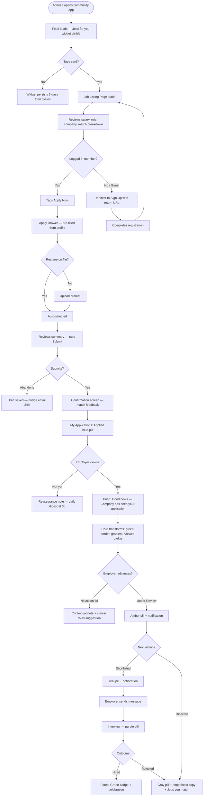
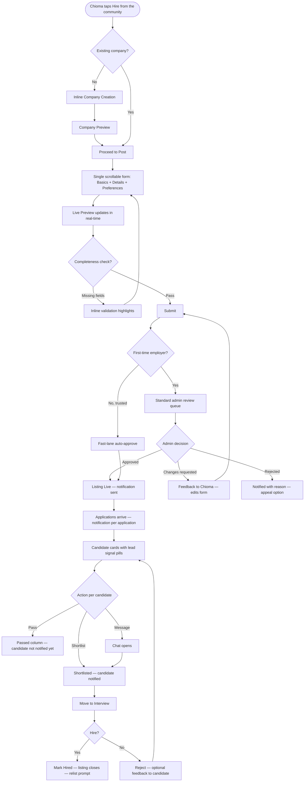
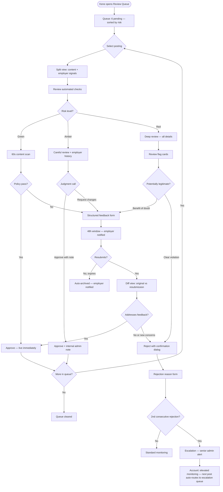
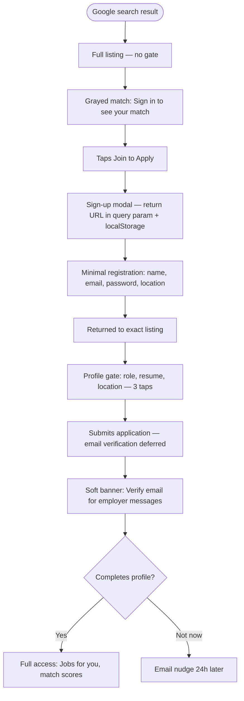
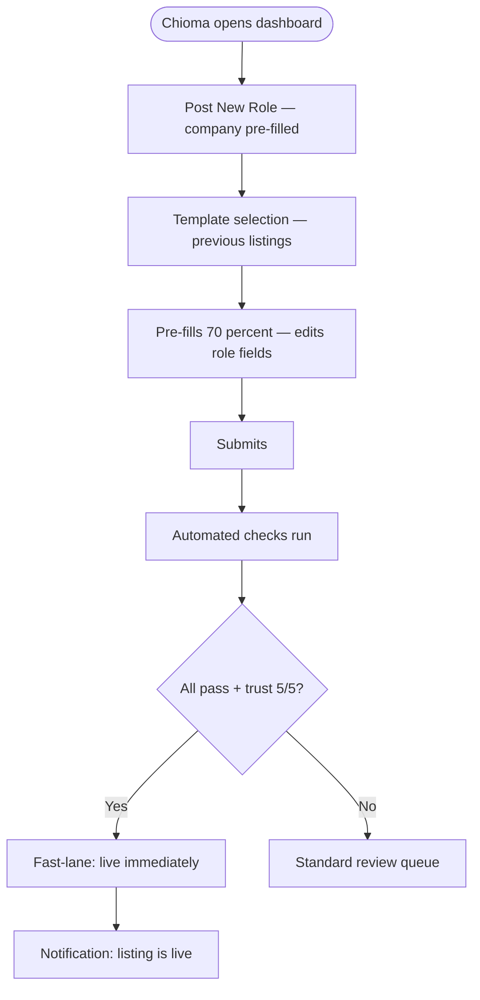
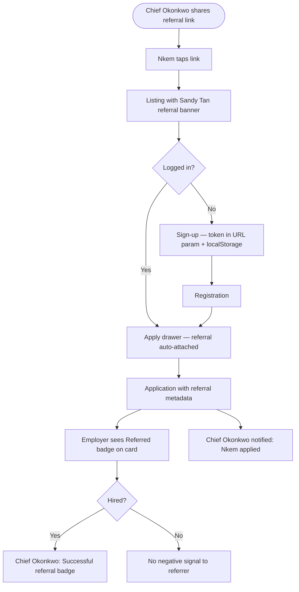

# UX Design Specification -- igbo Job Portal

**Author:** Dev
**Date:** 2026-03-31

---

## Executive Summary

### Project Vision

The igbo Job Portal is a community-exclusive employment marketplace at `job.[domain]` — a separate Next.js application sharing infrastructure (SSO, chat, DB, Redis, notifications) with the existing igbo community platform. The core thesis: **"Discovery is open. Participation is exclusive."** Anyone can find jobs via Google; only community members can apply, message, and be trusted.

The portal inverts the standard marketplace trust problem by *harvesting* trust from an existing verified community rather than building it from scratch. Pre-built identity, verification badges, engagement history, and named referrals create hiring signals that no generic job platform can replicate.

### Target Users

| Persona | Role | Priority | Primary Device | Tech Comfort |
|---------|------|----------|----------------|--------------|
| **Chioma** (Lagos, 38) | High-volume local employer | Tier 1 | Desktop + mobile | Medium |
| **Adaeze** (Lagos, 22) | Early career job seeker | Tier 1 | Mobile, variable bandwidth | Medium-High |
| **Job Admin Kene** (35) | Trust & safety gatekeeper | Tier 1 | Desktop | High |
| **Emeka** (Toronto, 42) | Diaspora employer, remote hiring | Tier 2 | Desktop + mobile | High |
| **Obinna** (Abuja, 34) | Experienced professional switcher | Tier 2 | Mobile | Medium-High |
| **Amara** (London, 29) | Diaspora remote seeker | Tier 3 | Mobile | Medium-High |

Plus: **Guest Visitors** (acquisition channel — discover via Google/shared links, convert on Apply) and **Passive Members** (browsers, sharers, referrers who drive organic growth).

### Key Design Challenges

1. **Two-Sided Device Split** — Job seekers are mobile-first (Adaeze on variable bandwidth in Lagos, Amara on the go in London) while employers need desktop-class ATS workflows (candidate review, pipeline management, multi-job dashboards). The same platform must feel native on both — thumb-friendly apply flow AND information-dense employer dashboard.

2. **WhatsApp Behavior Displacement** — The incumbent behavior is composing a WhatsApp message in 30 seconds. The portal must match WhatsApp's speed for posting and exceed it dramatically in what happens after posting — structured applications, visibility, tracking, and trust signals. If the "after" isn't decisively better, employers won't switch.

3. **Trust Signal Legibility & Decision Speed** — Community verification badges, engagement history, named referrals, and skill overlap indicators are the portal's structural advantage. These signals must be glanceable *and actionable* — enabling employers to move from "view" to "shortlist" in seconds, not minutes. If trust signals are buried or visually noisy, employers won't use them in shortlisting decisions.

4. **Cold Start Double Problem (Seekers)** — New seekers have no profile (progressive nudges needed) AND the marketplace may have few listings at launch. Empty states must feel like *opportunity loading*, not *dead platform*. The apprenticeship featured section must feel alive even with 5-10 listings.

5. **Guest-to-Member Conversion Friction** — Guests see everything (full listings, salary, company profiles) but hit a wall at "Apply." The transition from browsing to signup must feel like *unlocking*, not *gatekeeping*. The return-to-job-after-signup flow must be seamless.

6. **Admin Efficiency Under Volume** — Job Admins must review 6+ postings in < 20 minutes with high confidence. The review queue needs enough context at a glance (poster profile, salary plausibility signals, company history) to enable fast approve/reject without deep investigation for clean postings.

7. **Application Quality vs Quantity Tradeoff** — One-click apply lowers friction, but risks low-quality or mass applications. The system must balance ease of applying with subtle friction (e.g., profile completeness nudges, skill alignment feedback before submission) to maintain high-quality applications and avoid employer overwhelm.

8. **Employer Cold Start Experience** — First-time employers have no company profile or prior postings. The job posting flow must feel guided, lightweight, and confidence-building — inline company creation, salary guidance, field examples — avoiding the feeling of a complex form or compliance burden.

9. **Notification Signal vs Noise** — Real-time updates (new applications, messages, status changes) must feel valuable, not overwhelming. Over-notification reduces trust; under-notification kills responsiveness. The system must prioritize high-signal events and batch low-priority updates into daily digests.

### Design Opportunities

1. **"Viewed by Employer" as Emotional Differentiator** — No major African job board provides this. The simple passive signal "Viewed by employer — March 30" solves the black hole problem and creates an emotional moment that drives retention and word-of-mouth.

2. **Apprenticeship Section as Cultural Identity** — If designed as a living community bulletin board (mentor faces, skills being taught, progress indicators) rather than a filtered job list, this section becomes the portal's emotional heart and visual signature. No competitor has this.

3. **Explainability Tags as Trust Builders** — "Matches 4 of your skills," "Same city," "Experience fits" — human-readable pills instead of opaque percentages. This transparency pattern makes matching feel *fair and understandable*, building trust in the system itself.

4. **Community Context on Candidate Cards** — Showing verification badge, membership duration, and engagement level alongside skills and experience creates a hiring signal that LinkedIn can't replicate. This is the trust-harvested advantage made visible.

5. **One-Click Apply with Auto-Fill** — Community profile data (name, location, interests) pre-populates the job seeker profile. The path from "I'm interested" to "I've applied" can be shorter than any generic platform.

6. **Economic Identity Layer** — Over time, a user's profile evolves from social identity to economic identity — skills, work history, endorsements, referrals. The portal can make this progression visible, reinforcing long-term engagement and trust within the community. The job portal isn't just a feature; it's a new dimension of who members are.

## Core User Experience

### Defining Experience

The igbo Job Portal is a **two-sided marketplace** where the core loop is employer-side — post, receive applications, hire — but it only works if the seeker experience feeds it with quality applications. Both sides must feel effortless in their primary zone.

**The Core Loop:**
Employer posts job → Seekers discover and apply → Employer reviews with trust signals → Shortlist/hire → Both sides return

The Week 6 validation gate tests this loop explicitly: 20-30 seeded jobs, 5+ applications per job, >50% viewed. If this loop doesn't work, nothing else matters.

### Platform Strategy

**Design Priority:** Seeker mobile FIRST — employer desktop optimized for efficiency.

- **Seekers (Mobile-first):** Single-column layouts, thumb-friendly tap targets (44px+), fast page loads on variable bandwidth (Lagos, Enugu), skeleton loaders for slow connections. The entire browse-to-apply flow must work flawlessly on a phone held in one hand.
- **Employers (Desktop-optimized):** Information-dense layouts with tables, side panels, multi-column candidate views. Must still function on mobile for quick actions (read notifications, view applications, send messages) — but full ATS pipeline management is a desktop experience.
- **Job Admins (Desktop-primary, mobile-viewable):** Review queue designed for rapid throughput on large screens. Mobile must support viewing flagged postings and context (e.g., from a notification) — but approve/reject actions are desktop-primary.
- **Guests (Mobile + Desktop):** Full job listings, salary, company profiles visible without auth. SEO-optimized SSR pages. Apply triggers signup with seamless return-to-job.

**Breakpoints:** Mobile (< 768px), Tablet (768-1024px), Desktop (> 1024px) — consistent with main igbo platform.

**Network Resilience:** Skeleton loaders and fallback states during slow connections. Application submission failures show clear error with retry. No offline queueing in MVP.

**Emotional Context of Use:**

| Persona | When They Arrive | Emotional State | Design Implication |
|---------|-----------------|----------------|-------------------|
| **Adaeze** (seeker) | Evening after work/class, commute, idle moments | Anxious, hopeful, possibly discouraged from other platforms | Lead with reassurance — match quality, "viewed" signals, progress indicators. Don't open with empty states or cold search bars. |
| **Chioma** (employer) | Monday morning, kitchen short-staffed; or Sunday evening, planning the week | Rushed and urgent, OR deliberate and evaluative | Unread count and new application alerts front and center. Dashboard must answer "what needs my attention?" in 2 seconds. |
| **Emeka** (diaspora employer) | Between meetings, reviewing candidates on commute or after hours | Deliberate but time-constrained | Candidate cards must be self-contained — full decision context without drilling in. |
| **Kene** (Job Admin) | Morning routine, batch processing queue | Focused, efficiency-minded, pattern-scanning | Queue must enable flow state — minimal context switching, inline poster context, one-click approve for clean postings. |
| **Guest** | Clicked a Google result or WhatsApp link | Curious but uncommitted, evaluating whether to invest | Full transparency (salary, company, description) builds trust before the signup gate. No teasing or content hiding. |

### Effortless Interactions

**Seeker Effortless Zone — Discovery + Apply:**

- Smart matching surfaces relevant jobs automatically ("Jobs for you") — no manual searching required to find value
- Job listing cards show everything needed to decide: title, company, salary, location, match tags — one glance
- Apply flow: tap Apply → profile auto-filled from community data → default resume attached → submit. Target: < 30 seconds
- Skill alignment feedback before submission: "Matches 4 of 6 required skills" — helps seekers self-select quality applications
- Progressive profile: first apply requires only display name + location + 1 skill (all auto-fillable). Deeper profile grows over time through nudges, not gates

**Employer Effortless Zone — Decision-Making:**

- Candidate cards show trust signals at a glance: verification badge, skill overlap count, referral badge, engagement level — no clicking required to assess quality
- Shortlist action is accessible directly from the candidate card — minimal interaction to advance status
- ATS pipeline status advancement requires minimal interaction (single action per transition)
- Unread indicators and application counts surface what needs attention without scanning
- Returning employers: company pre-filled, previous posting as template, submit in < 2 minutes

**Admin Effortless Zone — Throughput:**

- Review queue shows poster context inline: community profile, engagement level, previous postings, company verification status
- Clean postings: approve in one click with no investigation needed
- Suspicious postings: red flag signals (new account, unusual salary, vague description) surfaced automatically
- Batch approve for trusted employer fast-lane postings

**Graceful Negative Outcomes:**

Negative moments are retention surfaces, not edge cases. Each must provide a clear emotional landing and a concrete next step.

| Negative Moment | What the User Sees | Design Response |
|----------------|-------------------|-----------------|
| **Application Rejected** | Status changes to "Rejected" | Empathetic tone ("This role has been filled / moved forward with other candidates"), not a bare red badge. Immediately followed by "Jobs you match" — related listings based on the same skills. Never a dead end. |
| **Empty Search Results** | No jobs match filters or search query | "No exact matches — here are recently posted jobs in [your location]" with option to broaden filters. If truly empty (cold start), show "Be the first to know" email alert signup + apprenticeship featured section. |
| **Expired/Closed Listing** | User clicks a shared link or bookmark to a closed job | "This position is no longer accepting applications" with company profile link ("See other jobs from [Company]") + similar active listings. Never a 404 — always a warm redirect. |
| **Zero "Jobs for You" Matches** | New seeker with sparse profile gets no smart matches | "Add more skills to unlock better matches" with inline skill tag input. Show trending jobs in their location as fallback. Frame as "your matches will improve" not "nothing for you." |
| **Application Not Viewed (Extended)** | 5+ days with no "Viewed by employer" signal | Subtle reassurance: "Employers typically review applications within a few days" — not a notification, just a contextual note on the status page. Prevents anxiety spiral. |

### Critical Success Moments

| Moment | Persona | What Happens | If We Nail It | If We Fail |
|--------|---------|-------------|---------------|------------|
| **First Apply** | Adaeze | Finds a job, taps Apply, profile auto-fills, submitted in seconds | "That was easier than anything I've used" | "Why do I need to fill out all this?" — abandons |
| **First Application Arrives** | Chioma | Gets notification, opens dashboard, sees candidate with trust signals | "I can already tell this person is worth talking to" | "This looks like every other job board" |
| **"Viewed by Employer"** | Adaeze | Passive signal appears on application status | "They actually saw me — this platform works" | Never appears → black hole → churn |
| **First Shortlist Decision** | Chioma | Scans candidate card, sees skill overlap + badge + referral, acts on Shortlist | "I made that decision in 10 seconds" | "I need to click through 5 screens to evaluate" |
| **First Message** | Both | Employer messages candidate through platform chat | "We're already talking — no email switching" | "I have to leave the platform to contact them" |
| **Guest Clicks Apply** | Guest | Sees full listing, clicks Apply, redirected to signup, returns to job after joining | "Joining was worth it for this opportunity" | "I lost the job I was looking at" — abandons |
| **First Job Post** | Chioma | Fills form with inline company creation, submits in < 5 min | "That was faster than I expected" | "This is a compliance form, not a job post" |
| **Admin Queue Morning** | Kene | Opens queue, reviews 6 postings in < 20 min with context at a glance | "I can trust my decisions at this speed" | "I need to investigate every posting" |
| **First "No Jobs" Experience** | Adaeze / Guest | Opens portal → few or no listings match their search | "There's not much yet, but I can see what's coming and I'll be first" — stays subscribed | "Empty. Dead platform." — leaves and doesn't return |
| **First Rejection** | Adaeze | Application status changes to "Rejected" | "At least I know — and here are other jobs I match" — applies again | "Rejected with no context, no next step" — churns |
| **Second Job Post** | Chioma | Returns to post another job after first successful hire | "Company pre-filled, template ready, posted in 2 minutes" — becomes habitual | "I have to set everything up again" — goes back to WhatsApp |
| **First High-Quality Match** | Adaeze / Chioma | Seeker sees a highly relevant job with strong match tags, OR employer sees a strong candidate with trust signals | "This system *understands* what I need" — trust in platform deepens | Generic results, no differentiation from Indeed — system feels dumb |
| **First Return Visit** | Adaeze | Comes back the next day — "Jobs for you" has updated, application status changed | "Things are happening — this platform is alive and working for me" — retention locked in | Nothing changed, no new activity — feels stale, stops returning |

### Experience Principles

1. **Speed-to-Value Over Completeness** — Users should experience value before they finish setting up. Seekers browse and find relevant jobs before completing a profile. Employers see their first application before they've optimized their company page. Don't gate value behind setup.

2. **Trust at a Glance** — Every trust signal (verification badge, referral, skill overlap, engagement level) must be readable in under 2 seconds without clicking. If an employer has to investigate to find trust, the advantage is lost.

3. **Guided, Not Gated** — Progressive disclosure over hard gates. Minimum requirements are minimal (1 skill to apply, company name to post). Everything else is nudged through contextual prompts ("Add more skills to improve your match score") not blocked by mandatory forms.

4. **Negative Moments Are Design Moments** — Rejection, empty states, and zero results are not edge cases — they are critical UX surfaces. Every negative moment must provide a clear next step: related jobs after rejection, expanding search after zero results, "be first when jobs arrive" after empty state.

5. **Return Speed Rewards Loyalty** — The second time is always faster than the first. Returning employers get pre-filled forms and templates. Returning seekers get smarter matches. The platform gets better at serving you the more you use it.

6. **Design for Primary, Support Secondary** — Seekers primarily discover and apply on mobile; employers primarily review and manage on desktop. Each experience is optimized for its primary device, while remaining fully functional on secondary devices.

7. **Quality Friction Is Invisible Friction** — The system makes quality applications feel effortless — not by removing friction, but by making friction feel like help. "You match 4 of 6 skills" isn't a gate, it's a confidence signal. "Add a headline to stand out" isn't a requirement, it's coaching. Subtle quality nudges that feel like guidance, not barriers.

## Desired Emotional Response

### Primary Emotional Goals

**Core Emotional Center: "Recognized and valued within the community."**

This is the emotional through-line that connects every persona and every interaction. The portal must make each user feel that their participation matters — not as a transaction on a generic platform, but as a contribution to a shared economic ecosystem.

| Persona | Primary Emotion | What Triggers It |
|---------|----------------|-----------------|
| **Adaeze** (seeker) | **Seen** — "Someone actually looked at my application" | "Viewed by employer" signal, status change notifications, match tags that show the system understands her skills |
| **Chioma** (employer) | **Empowered** — "I found the right person without going external" | Qualified applications from verified community members arriving within 48 hours |
| **Emeka** (diaspora employer) | **Proud** — "I'm giving back by hiring and mentoring from within" | Apprenticeship posting flow, seeing community context on candidates |
| **Kene** (Job Admin) | **Trusted** — "My judgment protects the community" | Efficient review queue, clear signals, pattern detection tools |
| **Guest** | **Intrigued** — "This is worth joining for" | Full transparency (salary, company, description) + the visible community layer they can't access yet |

**The Word-of-Mouth Emotion: Surprised trust + ownership.**

*"This actually works — and it's ours."*

Two emotions fused together:
- **Surprised trust** — "I didn't expect a community platform to work this well for hiring. Applications arrived. Employers responded. The matching was relevant." The surprise comes from exceeding expectations set by generic platforms and WhatsApp chaos.
- **Ownership** — "This isn't LinkedIn's job board filtered for Igbo people. This is *ours*. Built for us, governed by us, trusted because of us." The portal's community exclusivity isn't a limitation — it's the source of pride.

The moment users recommend the platform is when expectation meets reality faster than anticipated.

### Emotional Journey Mapping

| Stage | Seeker (Adaeze) | Employer (Chioma) | Guest |
|-------|----------------|-------------------|-------|
| **Discovery** | Curious → Hopeful ("Jobs for you shows relevant matches — maybe this is different") | Skeptical → Interested ("Let me try posting here instead of WhatsApp") | Intrigued → Evaluating ("Full salary visible, real company profiles — this is legitimate") |
| **First Action** | Nervous → Relieved ("Apply was instant — profile auto-filled, one tap") | Uncertain → Guided ("The form is simple, it's showing me examples, company creation is inline") | Motivated → Committed ("I want this job enough to join the community") |
| **Waiting** | Anxious → Reassured ("Viewed by employer — March 30" — someone is looking) | Anticipating → Satisfied ("3 applications already, with trust signals I can evaluate at a glance") | N/A — converted to member |
| **Outcome (Positive)** | Accomplished → Grateful ("I got shortlisted through my own community's platform") | Confident → Proud ("I hired from within — no external recruiter needed") | — |
| **Outcome (Negative)** | Disappointed → Resilient ("Rejected, but here are 4 other jobs I match — I'll try again") | Frustrated → Supported ("No strong candidates yet — system suggests broadening skills or extending deadline") | — |
| **Return** | Belonging → Invested ("My matches are better, my profile is stronger, this is working for me") | Efficient → Habitual ("Second post took 2 minutes — this is my default now") | — |

### Micro-Emotions

Ordered by priority — each pair represents a critical emotional boundary where design decisions determine whether the user stays or leaves.

**1. Trust vs. Skepticism** (Highest Priority)

The foundational emotional gate. If users don't trust the platform, nothing else matters.

- **Seekers:** "Will employers actually see my application?" → Trust built through "Viewed by employer" signal, transparent match scoring, status change notifications
- **Employers:** "Are these real candidates with real skills?" → Trust built through community verification badges, engagement history, skill overlap indicators
- **Guests:** "Is this a real job board or a community vanity project?" → Trust built through full salary transparency, company profiles, Google for Jobs indexing
- **Design implication:** Trust signals must be *visible by default*, not hidden behind clicks. Every page must answer the question "Can I trust this?" within 2 seconds.

**2. Confidence vs. Confusion**

The interaction gate. Users who feel confident take action; users who feel confused abandon.

- **Seekers:** "Do I qualify for this job?" → Confidence built through explainability tags ("Matches 4 of your skills"), skill alignment feedback before submission
- **Employers:** "Am I filling this form correctly? Will it get approved?" → Confidence built through inline guidance, field examples, progress indicators, clear approval criteria
- **Job Admins:** "Am I making the right call on this posting?" → Confidence built through inline poster context, salary benchmarks, red flag signals
- **Design implication:** Every input field must have context. Every action must have clear feedback. No user should wonder "what happens next?"

**3. Belonging vs. Isolation**

The emotional differentiator. This is what separates the portal from Indeed.

- **Seekers:** "This platform knows I'm Igbo and that matters here" → Belonging built through community context on job listings, cultural skill tags, apprenticeship stories, bilingual content
- **Employers:** "I'm hiring from my own people — this is community economics" → Belonging built through "Community Referral" badges, community verification context on candidates, apprenticeship program visibility
- **Design implication:** Community identity must be woven into the visual language — not as decoration, but as functional signals that carry meaning in hiring decisions.

**4. Accomplishment vs. Frustration**

The completion gate. How users feel after taking action determines whether they return.

- **Seekers:** "I applied and it felt meaningful" → Accomplishment built through confirmation with match quality feedback ("Strong match — you share 5 skills with this role"), profile completion progress
- **Employers:** "I posted a job and it's already working" → Accomplishment built through first application notification within 24-48 hours, dashboard showing activity
- **Design implication:** Every completed action must have positive feedback. Submission confirmations should reinforce value, not just confirm receipt.

**5. Agency vs. Powerlessness**

The control gate. Users must feel they can influence their outcomes — not that they're at the mercy of an opaque system. The system should never leave users in a passive state.

- **Seekers:** "I can improve my chances" → Agency built through actionable profile nudges ("Add 2 more skills to improve your match score"), transparent matching criteria, ability to delete applications, control over profile visibility
- **Employers:** "I control my hiring pipeline" → Agency built through ATS status management, ability to close/renew/mark as filled, fast-lane earned through good behavior, posting templates
- **Rejected seekers:** "I know why and I know what to do next" → Agency built through related job suggestions after rejection, skill gap visibility, "Jobs you match" immediately following negative status
- **Design implication:** Users must always have a visible next action. No dead ends. No "wait and hope." The system should make the path to a better outcome obvious.

### Design Implications

| Emotional Goal | UX Design Approach |
|---------------|-------------------|
| **Recognized and valued** | Personalized dashboard ("Jobs for you"), name-addressed communications, community context visible on all interactions |
| **Surprised trust** | "Viewed by employer" as passive signal (no generic platforms do this), transparent match scoring, salary visibility by default |
| **Ownership** | Community-exclusive Apply gate framed as value ("Join to apply" not "Login required"), cultural visual identity, apprenticeship as cultural program not job filter |
| **Trust over skepticism** | Trust signals visible by default on every surface — badges, engagement level, referral context. Never hidden behind clicks. |
| **Confidence over confusion** | Inline guidance on every form, field examples, progress indicators, clear "what happens next" at every stage |
| **Belonging over isolation** | Community identity in visual language, cultural skill tags, bilingual content toggle, apprenticeship success stories with faces and quotes |
| **Accomplishment over frustration** | Positive confirmation on every completed action, match quality feedback on apply, first-application notification for employers within 24-48 hours |
| **Agency over powerlessness** | Actionable nudges (not just status badges), transparent matching criteria, visible next steps after every outcome (positive or negative), user-controlled profile visibility and application deletion |

### Emotional Design Principles

1. **Trust Is Earned in 2 Seconds and Reinforced Continuously** — Every page must answer "Can I trust this?" before the user consciously asks, and every subsequent interaction must reinforce that trust through consistent behavior. Verification badges, salary ranges, company profiles, and match transparency are not features — they are trust infrastructure. If trust requires investigation, it doesn't exist.

2. **Recognition Before Transaction** — Users should feel recognized as community members before they feel processed as applicants or employers. "Welcome back, Adaeze — 3 new jobs match your skills" is recognition. "Enter your email to continue" is processing.

3. **Negative Emotions Get Design, Not Neglect** — Rejection, empty results, and long waits are emotionally charged moments. Each must be designed with the same care as success moments — empathetic language, concrete next steps, and a reason to stay. A well-designed rejection is worth more than a poorly designed success.

4. **Agency Is the Antidote to Anxiety** — Job seeking is inherently anxious. The portal reduces anxiety by giving users visible levers: transparent matching, actionable profile improvements, application status tracking, and control over their own data. Anxiety comes from powerlessness; agency comes from visibility.

5. **Pride Powers Retention** — The feeling of "this is ours" is not a marketing message — it's a retention mechanism. When users feel ownership of the platform (hiring from community, mentoring the next generation, building economic identity), they return not because the UX is good, but because leaving would mean losing something meaningful.

## UX Pattern Analysis & Inspiration

### Inspiring Products Analysis

**1. WhatsApp — The Incumbent Behavior**

| Dimension | What They Do Well | Why It Works |
|-----------|------------------|-------------|
| **Speed** | Message composed and sent in < 10 seconds. No forms, no fields, no validation. | Zero friction = default behavior. The portal must match this speed for job posting or lose to it. |
| **Instant feedback** | Blue ticks (sent → delivered → read). Typing indicator. Last seen. | Users always know where they stand. No black holes. The "Viewed by employer" signal is our blue tick. |
| **Group broadcasting** | Post once, reach everyone in the group instantly | The job posting replaces the WhatsApp group blast — but with structure, tracking, and persistence |
| **Notification discipline** | Only notifies for messages from people you know. Contextual preview (first line visible). Silent when nothing's happening. | High-signal, low-noise. Users trust WhatsApp notifications because every notification is worth the interruption. |

**Lesson for igbo:** WhatsApp wins on speed, feedback, and notification trust. We can't beat WhatsApp's posting speed (30 seconds vs. our 5 minutes), but we must *decisively* beat what happens after: structured applications vs. chaotic DMs, ATS tracking vs. lost threads, trust signals vs. anonymous messages. And we must adopt WhatsApp's notification discipline: only notify when the user would *want* to be interrupted.

**2. LinkedIn — Professional Identity Platform**

| Dimension | What They Do Well | Why It Works |
|-----------|------------------|-------------|
| **Structured identity** | Profile = professional CV always available. Endorsements, recommendations, work history. | Employers can evaluate candidates without asking for a resume. The profile IS the application. |
| **Network context** | "2nd connection," "3 mutual connections," "Your colleague works here" | Social proof at a glance. Our equivalent: community verification badge, engagement level, named referral badge. |
| **Easy Apply** | One-click apply with stored profile data | Reduces apply friction to near-zero. Our auto-fill + one-click apply follows this pattern. |

**Lesson for igbo:** LinkedIn proves that structured professional identity drives hiring efficiency. But LinkedIn fails on trust (anyone can claim anything), noise (hundreds of irrelevant notifications), and the black hole problem (apply and never hear back). We take the identity structure and add the community trust layer LinkedIn can't replicate.

**3. Airbnb — Trust-Harvested Marketplace**

| Dimension | What They Do Well | Why It Works |
|-----------|------------------|-------------|
| **Trust visibility** | Reviews, verified identity, Superhost badges visible at a glance on every listing | Trust precedes the transaction. Users make decisions based on trust signals before price. |
| **Progressive disclosure** | Key info (price, rating, photos) on card → full details on tap → booking flow | Information hierarchy matches decision flow: browse → evaluate → commit |
| **Host/guest mutual trust** | Both sides review each other. Both sides have profiles. Transparency is bidirectional. | Our equivalent: employer sees candidate trust signals, candidate sees "Viewed by employer" + company verification. Bidirectional transparency. |
| **Smart defaults** | Location-based suggestions, saved searches, "Homes you might like" | Reduces cognitive load. Our "Jobs for you" section follows this pattern. |
| **Card restraint** | Listing cards show exactly 4 things: photo, price, rating, location. Nothing more. | Sparse cards are scannable cards. Trust is built through *curated* signals, not exhaustive data. |

**Lesson for igbo:** Airbnb is the closest structural analog — a two-sided trust marketplace. Their key insight: trust signals must be *on the card*, not behind it — but the card must remain sparse. We apply this directly: verification badge, skill overlap, referral badge on the candidate card, but curated to ~4-5 primary signals. If we show everything, we show nothing.

**4. Content Moderation & Fraud Detection Tools — Admin Triage Pattern**

| Dimension | What They Do Well | Why It Works |
|-----------|------------------|-------------|
| **Inline risk signals** | Suspicious indicators (new account, unusual patterns, flagged keywords) surfaced directly in the review queue item — no separate investigation screen | Reviewers make faster, more confident decisions when risk context is embedded in the review surface |
| **One-action decisions** | Approve / Reject / Escalate as single-click actions with optional notes | Throughput scales with action simplicity. Every additional click reduces review velocity. |
| **Pattern detection** | System surfaces clusters ("3 similar postings from new accounts this week") automatically | Reviewers catch coordinated abuse that individual-item review would miss |
| **Confidence indicators** | Risk score or trust level displayed per item — "Low risk" items can be batch-processed | Enables differentiated review depth: quick approve for clean items, deep investigation for flagged items |

**Lesson for igbo:** Kene's Job Admin queue is a *triage interface*, not a dashboard. The closest UX analog isn't a job board — it's content moderation and fraud detection tooling. Inline context, one-action decisions, and automatic pattern surfacing are the patterns that enable 6 reviews in 20 minutes with high confidence.

**5. Jobberman — Regional Job Board (Anti-Inspiration)**

| Dimension | What They Do Poorly | What We Learn |
|-----------|-------------------|---------------|
| **Generic platform** | No community context, no trust signals, no differentiation from Indeed | Community identity is our moat — every surface must communicate "this is different" |
| **Application black hole** | Apply and never know if anyone looked | "Viewed by employer" is a direct antidote to this failure |
| **Poor mobile experience** | Desktop-first design retrofitted for mobile | Mobile-first seeker experience is non-negotiable |

**6. Google Pay — Instant Feedback UX**

| Dimension | What They Do Well | Why It Works |
|-----------|------------------|-------------|
| **Immediate confirmation** | Payment completes with visual + haptic + audio feedback in < 1 second | Every action gets instant, multimodal feedback. User never wonders "did it work?" |
| **Progressive status** | Processing → Sent → Received with visual progression | Our application pipeline mirrors this: Applied → Under Review → Shortlisted → each status change is a feedback moment |
| **Trust through simplicity** | Clean, minimal UI inspires confidence for high-stakes actions (money) | Job applications are high-stakes for seekers. Clean, confident UI reduces anxiety. |

**Lesson for igbo:** Apply flow confirmation should feel as decisive as a Google Pay transaction. Not a generic "Application submitted" toast — a rich confirmation with match quality feedback, next steps, and the feeling that something meaningful just happened.

**7. Uber Eats — Fast Actions + Status Tracking**

| Dimension | What They Do Well | Why It Works |
|-----------|------------------|-------------|
| **Real-time status tracking** | Order placed → Preparing → On the way → Delivered with live updates | Users feel in control because they can see the system working. Our application status tracking follows this emotional pattern. |
| **Card-based browsing** | Restaurant cards with photo, rating, delivery time, price range — all info at a glance | Our job listing cards should achieve the same: title, company, salary, location, match tags — full decision context on one card |
| **Fast reorder** | One-tap reorder from history | Our returning employer pattern: pre-filled company, posting templates, < 2 minute repost |

**Lesson for igbo:** Uber Eats proves that status visibility drives trust and retention. However, Uber Eats uses *optimistic status display* — "Preparing your order" is shown based on time elapsed, not a real signal from the kitchen. **We explicitly reject this pattern.** On a trust-first platform, "Under Review" must mean the employer actually changed the status. Fake progress is worse than no progress. Honest status + contextual reassurance ("Employers typically review within a few days") is our approach.

**8. Slack — Structured Communication**

| Dimension | What They Do Well | Why It Works |
|-----------|------------------|-------------|
| **Channel-based context** | Conversations organized by topic/project, not by person | Our application-linked messaging follows this: conversation threads tied to specific job applications for context |
| **Unread management** | Bold channels, badge counts, "All unreads" view | Employer dashboard needs the same: unread application indicators, new message badges, "what needs attention" summary |
| **Quick actions** | Emoji reactions, thread replies, slash commands — fast micro-interactions | ATS status changes should be equally lightweight — single-action status advancement, not multi-step forms |

**Lesson for igbo:** Slack's unread management pattern is directly applicable to the employer dashboard. "What needs my attention?" is the first question Chioma asks on Monday morning. Bold indicators, badge counts, and a summary view answer it in 2 seconds.

### Transferable UX Patterns

**Navigation Patterns:**

| Pattern | Source | Application in igbo Job Portal | Emotional Function |
|---------|--------|-------------------------------|-------------------|
| **Card-based browsing** | Airbnb, Uber Eats | Job listing cards with full decision context (title, company, salary, location, match tags, badges) — one glance per card | Confidence — "I can evaluate without clicking through" |
| **Progressive disclosure** | Airbnb | Card → full listing → apply flow. Information hierarchy matches the decision flow: browse → evaluate → commit | Control — "I go deeper only when I choose to" |
| **Unread management** | Slack | Employer dashboard: bold indicators for unread applications, badge counts per job, "what needs attention" summary view | Agency — "I know exactly what needs my attention" |
| **Tab-based role switching** | LinkedIn | Seeker dashboard vs. Employer dashboard — clear mode separation, not one cluttered view | Clarity — "I know which hat I'm wearing right now" |
| **Triage queue** | Content moderation tools | Job Admin review queue with inline context, risk signals, one-action decisions | Confidence — "I can trust my judgment at this speed" |

**Interaction Patterns:**

| Pattern | Source | Application in igbo Job Portal | Emotional Function |
|---------|--------|-------------------------------|-------------------|
| **One-click apply** | LinkedIn Easy Apply | Auto-filled profile + default resume → submit. Target: < 30 seconds | Relief — "That was easier than I expected" |
| **Blue tick feedback** | WhatsApp | "Viewed by employer" passive signal. Status change notifications. Application pipeline visibility. | Trust — "They actually saw me" |
| **Instant confirmation** | Google Pay | Apply confirmation with match quality feedback — rich, confident, not a dismissive toast | Accomplishment — "Something meaningful just happened" |
| **Fast reorder** | Uber Eats | Returning employer: pre-filled company, posting template, < 2 minute repost | Efficiency — "The system remembers me and rewards my return" |
| **Honest status tracking** | Uber Eats (adapted) | Application pipeline: Applied → Under Review → Shortlisted → visible progression. Status reflects *real* employer actions only — never assumed/optimistic states. | Trust — "This system tells me the truth, even when progress is slow" |
| **Notification discipline** | WhatsApp | Only notify when the user would want to be interrupted. Real-time for high-signal events (new application, status change, message). Silent otherwise. | Trust — "When this app notifies me, it matters" |

**Trust Patterns:**

| Pattern | Source | Application in igbo Job Portal | Emotional Function |
|---------|--------|-------------------------------|-------------------|
| **Trust signals on the card** | Airbnb (Superhost badge, ratings) | Verification badge, skill overlap, referral badge, engagement level — visible on the candidate card, not behind a click | Safety — "I can trust this person before I invest time" |
| **Bidirectional transparency** | Airbnb (host reviews + guest reviews) | Employer sees candidate trust signals; candidate sees "Viewed by employer" + company verification. Both sides have visibility. | Fairness — "Both sides are accountable" |
| **Network context** | LinkedIn ("2nd connection") | "Referred by Chief Okonkwo," "Member for 2 years," "Active in 3 groups" — community context as hiring signal | Belonging — "Our shared community is the foundation of this interaction" |
| **Inline risk signals** | Fraud detection tools | Job Admin sees new-account flags, unusual salary indicators, pattern clusters directly in review queue | Confidence — "The system is helping me protect the community" |

### Anti-Patterns to Avoid

| Anti-Pattern | Source | Why It Fails | Our Alternative |
|-------------|--------|-------------|-----------------|
| **Application black hole** | Indeed, Jobberman | Apply and never hear back. No "viewed" signal, no status updates. Destroys seeker trust and retention. | "Viewed by employer" signal + status change notifications + contextual reassurance for long waits |
| **Enterprise ATS complexity** | Workday, Taleo, Greenhouse | 15-field forms, multi-step workflows, dashboard overload. Designed for HR departments, not business owners. | Lightweight ATS: single-action status changes, inline candidate context, guided posting flow < 5 minutes |
| **LinkedIn notification noise** | LinkedIn | Hundreds of irrelevant notifications: "Congratulate X," "You appeared in 5 searches," recruiter spam. Signal buried in noise. | WhatsApp notification discipline: real-time for high-signal only, daily digest for low-priority. No vanity notifications. |
| **Login-wall content hiding** | Many job boards | "Sign in to see salary" or "Create account to view full listing." Punishes curiosity. | Full transparency for guests: salary, description, company profile all visible. Gate only at Apply — framed as unlocking, not blocking. |
| **Generic empty states** | Most job boards | "No results found. Try different keywords." Zero help, zero warmth. | Warm fallbacks: related jobs, location-based suggestions, "Be the first to know" alerts, apprenticeship section as always-populated anchor |
| **Form-first onboarding** | Workday application forms | 20 fields before you can do anything. "Upload resume, fill education, add 3 references" before you even know if you want the job. | Progressive profile: browse freely → Apply requires 3 fields (auto-filled) → deeper profile grows through nudges over time |
| **Card information overload** | Indeed job cards | Sponsored tags, "easy apply" badges, "new" badges, "urgently hiring" badges, company ratings, salary estimates, review counts — everything shown, nothing communicated. | Curated card hierarchy: 4-5 primary signals always visible, secondary info on expanded state, full detail on listing page. More badges ≠ more trust. Restraint = scannability. |
| **Fake progress / optimistic status** | Uber Eats (kitchen status) | Showing "Preparing" based on time elapsed, not actual kitchen activity. Creates false expectations. | Honest status only. "Under Review" means the employer *actually* changed the status. Trust-first means no manufactured reassurance. Contextual notes ("Employers typically review within a few days") fill the gap honestly. |

### Design Inspiration Strategy

**What to Adopt (Directly):**

| Pattern | Why |
|---------|-----|
| Airbnb trust-on-card | Trust signals visible on candidate/job cards without clicking — our structural advantage made visible |
| WhatsApp blue-tick feedback | "Viewed by employer" + status notifications — solves the black hole problem |
| WhatsApp notification discipline | Only notify when the user would want to be interrupted — builds trust in the notification system itself |
| LinkedIn Easy Apply auto-fill | One-click apply with community profile data — minimal friction to action |
| Google Pay instant confirmation | Apply confirmation as a rich, confident moment — not a dismissive toast |
| Slack unread management | Employer dashboard answers "what needs attention?" in 2 seconds |
| Content moderation triage queue | Job Admin review with inline context, risk signals, one-action decisions, pattern detection |

**What to Adapt (Modified for our context):**

| Pattern | Adaptation |
|---------|-----------|
| Uber Eats status tracking | Application pipeline as visual progression — but status reflects real employer actions only. Never optimistic/assumed states. Honest status + contextual reassurance instead. |
| LinkedIn network context | Replace "2nd connection" with community-specific signals: verification badge, engagement level, named referral, membership duration. Richer and more meaningful than generic social graph. |
| Airbnb progressive disclosure | Card → listing → apply. But our cards need more trust info upfront (badges, match tags) than Airbnb's minimal 4-element cards. Solve through curated hierarchy, not by showing everything. |
| Airbnb card restraint | Apply the principle of card sparsity, but calibrate for hiring context where trust signals are decision-critical. Target: 4-5 primary signals always visible, not 10. |

**What to Avoid (Explicitly):**

| Anti-Pattern | Why |
|-------------|-----|
| Indeed/Jobberman black hole | Directly contradicts our "seen and valued" emotional goal |
| Enterprise ATS complexity | Our employers are business owners, not HR departments. Complexity = WhatsApp wins. |
| LinkedIn notification spam | Destroys trust in the notification system itself. Once users learn to ignore notifications, high-signal events get missed too. |
| Login-wall content hiding | Contradicts "Discovery is open" thesis. Punishes the guest-to-member conversion funnel. |
| Indeed card noise / badge overload | More signals ≠ more trust. Scanning fatigue leads to ignoring everything, including the signals that matter. |
| Fake progress indicators | Trust-first means honest status. Manufactured reassurance undermines the platform's core emotional promise. |

### Open Design Decisions

**Card Information Hierarchy** (to resolve in Design System step):

The candidate card and job listing card must balance trust signal density against scannability. Airbnb succeeds with 4 elements per card; Indeed fails with 10+. Our cards carry more decision-critical information than Airbnb (trust signals are functional, not decorative), but must remain scannable.

**Decision to resolve:**

| Tier | Visibility | Candidate Card (Proposed) | Job Listing Card (Proposed) |
|------|-----------|--------------------------|----------------------------|
| **Always visible** | On card surface | Name, headline, skill overlap count, verification badge | Title, company, salary range, location, top match tag |
| **Secondary** | On hover / expanded | Referral badge, engagement level, membership duration, location | Job type, posted date, additional match tags, badges (Urgent, Apprenticeship) |
| **Detail page only** | On click-through | Full profile, resume, experience, education, community context | Full description, company profile, all requirements, apply flow |

This hierarchy must be validated against the "Trust at a Glance" principle (Principle 2) and the "10-second shortlist decision" critical success moment.

## Design System Foundation

### Design System Choice

**Option 2: Design Token Extension** — Extend the existing `@igbo/ui` shared design system with portal-specific semantic tokens and domain-specific component patterns, maintaining visual continuity with a contextual shift for the employment marketplace.

The portal is not a separate product — it's an economic layer on the same community platform. Users cross between `[domain]` and `job.[domain]` via SSO. The visual language must feel like the same family, not a different product. But the portal's context is different: professional hiring, not social engagement. The design system must acknowledge this through semantic tokens and purpose-built components without breaking the visual thread.

### Rationale for Selection

| Factor | Decision Driver |
|--------|----------------|
| **Existing infrastructure** | shadcn/ui + Tailwind CSS v4 + Radix UI already established across 4795+ tests and 12 epics. No reason to introduce a new foundation. |
| **Monorepo architecture** | PRD mandates `@igbo/ui` shared package. Portal inherits primitives, tokens, and layout components. Portal-specific components live in `apps/job-portal/`. |
| **Visual continuity** | SSO means users move between platforms seamlessly. A jarring visual shift would break the "same community" feeling. |
| **Contextual distinction** | Employment interactions (hiring, applying, reviewing) need semantic precision that social interactions don't. `--color-status-applied` communicates differently than generic `--color-primary`. |
| **Scalability** | Semantic tokens scale better than hardcoded values. When a third subdomain launches (e.g., marketplace, learning), the token extension pattern repeats cleanly. |
| **Team velocity** | Extending existing system = minimal learning curve. Developers already know shadcn/ui patterns. New tokens and components follow established conventions. |

### Implementation Approach

**Layer 1: Shared Foundation (from `@igbo/ui`)**

Inherited directly — no portal modifications:
- shadcn/ui primitives: Button, Input, Select, Dialog, Sheet, Tabs, Toast, Card, Badge, Avatar, Skeleton
- Layout components: Shell, TopNav, Sidebar, PageContainer, responsive grid
- Design tokens: base colors, typography scale, spacing scale, border radii, shadows
- Form patterns: validation styling, error states, label conventions
- Accessibility: focus rings, ARIA patterns, keyboard navigation, 44px tap targets

**Layer 2: Portal Semantic Tokens (new, in `apps/job-portal/globals.css`)**

Portal-specific semantic tokens extending the base system. Scoped to portal only — shared components in `@igbo/ui` never reference portal tokens.

```
/* Application Status */
--color-status-applied: /* neutral blue */
--color-status-under-review: /* amber */
--color-status-shortlisted: /* teal */
--color-status-interview: /* purple */
--color-status-offered: /* green */
--color-status-hired: /* success green */
--color-status-rejected: /* neutral gray — empathetic, not alarming */

/* Trust Signals */
--color-trust-verified: /* community brand accent */
--color-trust-referral: /* warm accent */
--color-trust-engagement: /* subtle indicator */

/* Match Quality */
--color-match-strong: /* confident green */
--color-match-moderate: /* neutral */
--color-match-weak: /* muted — visible but not discouraging */

/* Admin Signals (red reserved for admin risk only) */
--color-risk-high: /* alert red */
--color-risk-medium: /* amber */
--color-risk-low: /* green */
--color-fast-lane: /* trusted accent */

/* Portal Accent */
--color-portal-accent: /* slight contextual shift from main platform — professional warmth */
```

**Color Philosophy:** Red is reserved exclusively for admin risk signals (`--color-risk-high`). User-facing negative states (rejection, expired, closed) use neutral gray + empathetic language. The emotional weight is carried by words, not color. This aligns with Emotional Design Principle 3: "Negative Emotions Get Design, Not Neglect."

**Layer 3: Domain-Specific Components (new, in `apps/job-portal/src/components/`)**

Purpose-built components for marketplace UX. Each portal component *composes* shared primitives from `@igbo/ui` and applies portal semantic tokens at the composition layer. Portal components never extend or modify shared primitives — they wrap them.

**Critical Boundary Rule:** Shared components in `@igbo/ui` never reference portal tokens. Portal components import shared primitives (Badge, Card, Combobox) and apply portal-scoped styling. This prevents dependency inversion and keeps the shared package independent of any consuming app.

| Component | Composes (from `@igbo/ui`) | Purpose |
|-----------|---------------------------|---------|
| **JobCard** | Card + Badge | Job listing card with curated information hierarchy (title, company, salary, location, match tag) |
| **CandidateCard** | Card + Avatar + Badge | Candidate display with trust signals (verification, skill overlap, referral, engagement) |
| **StatusPill** | Badge (composed, not variant) | Application status with semantic colors — `applied`, `under-review`, `shortlisted`, `hired`, `rejected` (neutral gray) |
| **MatchTag** | Badge (composed, not variant) | Explainability pills — "Matches 4 of your skills," "Same city," "Experience fits" |
| **TrustBadge** | Badge (composed, not variant) | Verification badge, referral badge, engagement level indicator — glanceable trust signals |
| **SkillTagInput** | Combobox + Badge (composed) | Autocomplete skill selection with predefined library + custom tag visual distinction |
| **ATSPipeline** | Kanban board (desktop) / Tabs (mobile) | Pipeline visualization: Applied → Under Review → Shortlisted → Interview → Offered → Hired/Rejected. Kanban board with drag-and-drop on desktop for employer mental model and fast decisions. Tabs on mobile for accessibility (keyboard nav + ARIA free). Terminal states (Hired, Rejected, Withdrawn) in collapsible "Closed" section below the board. |
| **ReviewQueueItem** | Card + inline context | Job Admin triage card with poster context, risk signals, one-action decisions |
| **ApplyConfirmation** | Dialog/Sheet | Rich apply confirmation with match quality feedback — Google Pay-inspired confidence |
| **EmptyState** | Custom | Warm empty states with contextual fallbacks, CTAs, and never-dead-end messaging |
| **ProfileCompletionBar** | Progress | Progressive profile nudge with actionable next steps |

### Customization Strategy

**Visual Continuity Rules:**

1. **Same typography** — Portal uses the same font family, scale, and weight system as the main platform. No typographic drift.
2. **Same spacing** — Grid, padding, margins follow the shared spacing scale. Consistent rhythm across subdomains.
3. **Same primitives** — Buttons, inputs, dialogs look and behave identically. A user who knows how to use the main platform knows how to use the portal.
4. **Contextual accent** — Portal surfaces use a subtle accent shift (e.g., slightly warmer or more professional tone) to signal "you're in the job portal" without breaking visual continuity. Applied to page headers, active nav states, and portal-specific badges — not to shared primitives.
5. **Semantic over decorative** — All portal-specific colors carry meaning (status, trust, match quality, risk). No decorative color additions.

**Component Ownership Rules:**

- Portal-specific components start in `apps/job-portal/src/components/`
- Portal components *compose* shared primitives — they do not extend, variant-ify, or modify them
- No new Badge variants, Combobox variants, or Card variants added to `@igbo/ui` for portal needs — compose at the portal layer instead
- If a portal component is needed by both apps (e.g., SkillTagInput for profile editing on main platform), promote to `@igbo/ui` only when: tests pass in both apps, documentation complete, no portal-specific token dependencies
- Shared package changes trigger tests in ALL consuming apps (CI enforced per PRD)

**Token Governance:**

- Base tokens owned by `@igbo/ui` — changes affect all apps
- Portal semantic tokens owned by `apps/job-portal/` — scoped to portal only, defined in portal's `globals.css`
- No portal token should override a base token — extend, don't replace
- Token naming convention: `--color-{domain}-{concept}` (e.g., `--color-status-applied`, `--color-trust-verified`)
- Shared components must never import or reference portal tokens — this is the hard boundary

**Responsive Card Behavior Rules:**

The card information hierarchy adapts to screen real estate, not hover state. Hover is unreliable (fleeting on desktop, nonexistent on mobile).

| Tier | Desktop (> 1024px) | Mobile (< 768px) |
|------|-------------------|-------------------|
| **Tier 1 (Primary)** | Always visible on card surface | Always visible on card surface |
| **Tier 2 (Secondary)** | Always visible — desktop has the space | Hidden behind tap-to-expand affordance (chevron or "Show more") |
| **Tier 3 (Detail)** | Click-through to detail page | Click-through to detail page |

No design decision depends on hover state. Touch devices get tap-to-expand for secondary information. Desktop shows more by default because it has more space — not because of hover interaction.

**Testing Strategy:**

- **Visual snapshot tests** — All portal-specific components tested across all states via Storybook (or equivalent): every status variant (applied, under-review, shortlisted, hired, rejected), every trust level (verified, unverified, referred), every match quality (strong, moderate, weak), every risk level (high, medium, low)
- **Responsive behavior tests** — Card tier visibility verified at mobile and desktop breakpoints. Tap-to-expand functionality tested on touch viewports.
- **Token usage lint rule** — Portal components must use portal semantic tokens for domain-specific concepts (status, trust, match, risk), not base tokens. Enforced via code review convention (automated lint rule if feasible).
- **Cross-app regression gate** — Any component promoted from portal to `@igbo/ui` must pass both portal and main platform test suites before merge (CI enforced).

## Defining Experience (Deep Dive)

### The Defining Moment

**"I applied — and they actually saw me."**

The igbo Job Portal's defining experience is not the apply action (seeker-side) or the candidate evaluation (employer-side) — it is the *bridge* between them: the moment a seeker receives proof that their application was seen by a real person. This is the WhatsApp blue-tick moment transplanted into a hiring context where no competitor provides it.

This single signal solves the application black hole problem that plagues every generic job board. It transforms the seeker's emotional state from anxious uncertainty ("Did anyone even look?") to validated trust ("They saw me — this platform works"). It is the moment that drives word-of-mouth: *"I applied on igbo — and they actually saw me."*

**Competitive validation:** No major African job platform (Jobberman, MyJobMag, BrighterMonday, Careers24, Fuzu) nor global platforms (Indeed, Glassdoor) provide this signal. LinkedIn offers a limited version for Premium users only. The igbo Job Portal offers it for free to all community members — and the signal carries more weight because it comes from a verified community employer, not an anonymous company on a generic board. The feature itself is copyable; the community trust context around it is not.

### User Mental Model

Seekers arrive with two competing mental models:

- **WhatsApp model (blue ticks):** Send → delivered → read. Instant, honest feedback. Users *expect* to know when their message was seen. This is the aspirational model.
- **Job board model (black hole):** Apply → silence → maybe an email weeks later → probably nothing. Users *expect* to be ignored. This is the incumbent experience to defeat.

The portal leverages the WhatsApp mental model — users already understand "seen" signals — and delivers it in a context where it has never existed. No new pattern to teach; just a familiar trust signal in an unexpected place.

Employers arrive with the WhatsApp hiring model: post in a group → receive chaotic DMs → lose track. The structured dashboard with trust-signal-enriched candidate cards is the upgrade — and their *viewing* of applications quietly completes the feedback loop for seekers without requiring any additional action.

### Success Criteria

The defining experience succeeds when:

1. **Seekers never feel forgotten** — Every application has a visible, honest status. "Applied — March 31" with contextual reassurance fills the gap before "Viewed" appears. No silence, no black hole.
2. **"Viewed" feels like a moment** — The notification leads with warmth: *"Good news — [Company Name] has seen your application for [Job Title]."* Company name humanizes the signal; "Good news" frames it as progress. Simple, singular, emotionally significant.
3. **Employers trigger it naturally** — The "Viewed" signal fires after intentional engagement (configurable dwell threshold, starting at 2 seconds, measured and adjusted based on real usage data). Accidental scrolling does not trigger it — the client-side timer resets if the application card leaves the viewport (Intersection Observer / Visibility API). Employers are not explicitly told they trigger signals — the feature is implicit, avoiding view-avoidance behavior.
4. **Status is always honest** — Every status transition (Applied → Viewed → Under Review → Shortlisted → Interview → Offered → Hired/Rejected) reflects a real employer action. No optimistic states, no time-based assumptions. Trust-first means truth-first.
5. **Negative outcomes are designed moments** — Rejection shows as neutral gray with empathetic language and immediate "Jobs you match" suggestions. The system never leaves seekers at a dead end.
6. **The signal fires within a meaningful timeframe** — Time-to-viewed is a key platform health metric. If employers don't view applications, the defining experience never happens. Employer-side nudges ("You have 4 unreviewed applications — candidates are waiting") ensure the loop closes.

### Novel vs. Established Patterns

**Pattern Classification: Established pattern, novel context.**

The "seen" signal is deeply established — WhatsApp blue ticks, iMessage read receipts, email read receipts. Users immediately understand what "Viewed by [Company Name] — April 2" means without any education.

The novelty is the *context*: no major job platform provides this signal. Indeed, LinkedIn, Jobberman, and Glassdoor all leave applicants in the dark. The igbo Job Portal takes a pattern users trust from messaging and applies it to hiring — where the emotional stakes are higher and the signal is more valuable.

**Unique twist on established pattern:**

- **Honest waiting replaces silence** — Unlike messaging apps where "delivered but not read" creates anxiety, the portal fills the pre-Viewed gap with active context: "Employers typically review within a few days," profile improvement nudges, and alternative job suggestions. The wait is *populated*, not empty.
- **Post-Viewed anxiety gap addressed** — "Viewed" without follow-up can erode the trust it built. If an application remains "Viewed" with no status change for 7+ days, the system responds on both sides: seeker sees contextual reassurance ("Hiring decisions take time — here are similar roles"), employer sees the application surfaced in their "Needs Attention" dashboard section. The system nudges the loop forward, not just the seeker's emotions.
- **Implicit employer awareness** — Unlike email read receipts (where senders know the feature exists and recipients know they're being tracked), the portal's "Viewed" signal is implicit on the employer side. Employers are not told "candidates see when you view." Disclosure is handled through platform Terms of Service ("your viewing activity contributes to application status updates"), not UI messaging. Legal review required pre-launch for jurisdiction-specific GDPR/privacy compliance.
- **Community context as moat** — "Viewed by [Company Name]" where the company carries community verification context hits differently than a generic "Viewed by employer" on Indeed. The emotional power of the signal comes from the community wrapper — this person is *one of us*, reviewing *one of us*.

### Experience Mechanics

**Phase 1 — Initiation (The Apply):**

- Seeker taps Apply → community profile auto-fills (name, location, skills) → default resume attached → submit
- Target: < 30 seconds from tap to submitted
- Rich confirmation moment: match quality feedback ("Strong match — you share 4 of 6 required skills") + **"What happens next" journey timeline** showing Applied → Viewed → Under Review → Shortlisted as stages the seeker can expect. Pre-teaches the status journey to reduce anxiety during the wait.
- Status immediately visible: **Applied — [date]**

**Phase 2 — Honest Active Waiting (Pre-Viewed):**

- Application status page shows: **Applied — March 31**
- Contextual reassurance: *"Employers typically review applications within a few days"*
- The "My Applications" page is *alive during the wait*: alternative job suggestions, profile completion nudges ("Add 2 more skills to improve match scores"), match score updates if profile changes
- No fake progress. No "Under Review" until the employer explicitly changes status. Silence is replaced with honest context, not manufactured progress.

**Phase 3 — The Defining Moment (Viewed):**

- Employer opens a candidate's application and dwells for the configured threshold (starting at 2 seconds, server-configurable, measured against real usage data in first sprint)
- Client-side timer uses Intersection Observer — resets if application card scrolls out of viewport. Only fires on sustained, intentional engagement.
- **Viewed event is idempotent**: system records all views for analytics, but the seeker-facing signal is first-view-only. Chioma opening the same application three times = one "Viewed — April 2" for Adaeze, not three notifications.
- Seeker sees: **Viewed by [Company Name] — April 2**
- Notification delivered based on seeker's preferences: *"Good news — [Company Name] has seen your application for [Job Title]."*
- Simple, singular signal. One view date. No view counts. Company name included for community trust context.

**Phase 4 — Post-Viewed Response (Anxiety Gap Management):**

- If application status remains "Viewed" with no employer action for 7+ days:
  - **Seeker side:** Contextual reassurance on status page: *"Hiring decisions take time — here are similar roles you match."* Not a notification — a passive, in-context note. Prevents anxiety spiral without creating notification noise.
  - **Employer side:** Application surfaces in "Needs Attention" dashboard section: *"4 applications viewed but not actioned — candidates are waiting."* System nudges the loop forward.
- **Key metric:** Time-to-viewed measured as platform health indicator. Target: >70% of applications viewed within 5 days. If below target, employer onboarding and nudge strategies are adjusted.

**Phase 5 — Status Progression (What Follows):**

- Each subsequent status change is triggered by explicit employer action:
  - **Under Review** — employer moves application to review pipeline
  - **Shortlisted** — employer advances to shortlist
  - **Interview** — interview scheduled through platform
  - **Offered** — offer extended
  - **Hired** — offer accepted, position filled
  - **Rejected** — employer declines (neutral gray, empathetic language, immediate "Jobs you match" suggestions)
- Every transition is a real event, never an inferred or time-based assumption
- Each transition is a notification-worthy moment for the seeker

**Phase 6 — Employer Side (Implicit Loop Closure):**

- Employers are never explicitly told in the UI that "Candidates see when you view their application"
- Disclosure is handled through platform Terms of Service, not UI messaging — legal review required pre-launch
- Employers who are also seekers discover it organically through their own application experiences
- This design avoids: employers skipping applications to avoid triggering "Viewed," employers feeling surveilled, employer complaints about transparency obligations
- The quiet integrity of the signal is what makes it trustworthy

**Pre-Launch Legal Review Item:** GDPR and jurisdiction-specific privacy regulations may require explicit disclosure of employer viewing activity being surfaced to candidates. The design decision (implicit awareness) is sound from a UX perspective; the disclosure mechanism (Terms of Service vs. in-UI notice) requires legal sign-off.

## Visual Design Foundation

### Color System

**Base Palette:** Inherited from the igbo community platform (`@igbo/ui`). The portal shares the same visual DNA — no new brand colors introduced.

**Three-Channel Color Language:**

Every color in the portal carries semantic meaning. No decorative color usage.

| Channel | Color | Role | Usage |
|---------|-------|------|-------|
| **Identity/Trust** | Forest Green (`oklch(0.422 0.093 141)`) | Community, verification, brand | Verification badges, community signals, logos, global nav, primary brand presence |
| **Action/Energy** | Golden Amber (`oklch(0.646 0.118 75)`) | CTAs, primary actions | Apply, Post Job, Shortlist, all primary buttons |
| **Context/State** | Teal-shift Green (`oklch(0.45 0.09 160)`) | Active states, system indicators | Active tabs, selected states, pipeline indicators, match quality indicators |
| **Warmth/Community** | Warm Sandy Tan (`oklch(0.726 0.08 65)`) | Referral, secondary surfaces | Referral badges, secondary backgrounds, community warmth accents |

**Teal-Shift Rules:**

The teal-shift is a *shade* of the forest green, not a new color. It must feel like the same green family in a different light.

- USE for: active tab states, selected pipeline stages, match quality indicators, progress indicators
- NEVER for: primary buttons, logos, global navigation, trust badges, brand identity surfaces
- Test: if you removed the teal-shift and replaced it with forest green, the layout should still make sense — teal is emphasis, not identity

**Application Status Semantic Colors:**

| Status | Color | Token | Rationale |
|--------|-------|-------|-----------|
| Applied | Info Blue (`oklch(0.54 0.148 254)`) | `--color-status-applied` | Neutral, informational — "received, nothing happening yet" |
| Under Review | Warm Amber (`oklch(0.676 0.125 76)`) | `--color-status-under-review` | In-progress, attention — "active consideration" |
| Shortlisted | Teal-shift (`oklch(0.45 0.09 160)`) | `--color-status-shortlisted` | Positive + active — "advancing through the pipeline" |
| Interview | Purple (`oklch(0.55 0.12 300)`) | `--color-status-interview` | Distinct milestone — "personal engagement stage" |
| Offered | Success Green (`oklch(0.619 0.13 152)`) | `--color-status-offered` | Positive outcome approaching |
| Hired | Success Green (`oklch(0.619 0.13 152)`) | `--color-status-hired` | Definitive positive outcome |
| Rejected | Neutral Gray (`oklch(0.521 0.012 55)`) | `--color-status-rejected` | Non-punishing, empathetic — emotional weight carried by words, not color |

**Trust Signal Colors (Warm Only):**

Trust is community (warm), not system (cool). Trust badges never use teal or blue.

| Signal | Color | Token |
|--------|-------|-------|
| Verified Member | Golden Amber | `--color-trust-verified` |
| Community Referral | Warm Sandy Tan | `--color-trust-referral` |
| Engagement Level | Muted warm scale (tan → amber) | `--color-trust-engagement` |

**Match Quality Colors (Teal → Green Spectrum):**

"Closer to green = closer to trusted fit."

| Quality | Color | Token |
|---------|-------|-------|
| Strong Match | Success Green (`oklch(0.619 0.13 152)`) | `--color-match-strong` |
| Moderate Match | Teal-shift (`oklch(0.45 0.09 160)`) | `--color-match-moderate` |
| Weak Match | Muted Neutral (`oklch(0.7 0.01 75)`) | `--color-match-weak` |

**Admin Risk Signal Colors:**

Red is reserved exclusively for admin-facing risk signals. No user-facing surface uses red.

| Risk Level | Color | Token |
|------------|-------|-------|
| High Risk | Destructive Red (`oklch(0.472 0.178 28)`) | `--color-risk-high` |
| Medium Risk | Warning Amber (`oklch(0.676 0.125 76)`) | `--color-risk-medium` |
| Low Risk | Success Green (`oklch(0.619 0.13 152)`) | `--color-risk-low` |
| Fast Lane (Trusted Employer) | Golden Amber (`oklch(0.646 0.118 75)`) | `--color-fast-lane` |

### Typography System

**Typefaces:** Inter (body + headings) and JetBrains Mono (code/data) — inherited from the community platform. No new fonts introduced.

**Rationale:** Inter is clean, professional, highly legible at all sizes — works equally well for seeker job cards (mobile, variable bandwidth) and employer ATS dashboards (desktop, information-dense). Introducing a second display font would break visual continuity across subdomains and add bundle weight for no functional gain.

**Type Scale:** Inherited from the community platform:

| Token | Size | Usage |
|-------|------|-------|
| `--text-xs` | 12px | Metadata, timestamps, tertiary labels |
| `--text-sm` | 14px | Secondary text, table content, compact labels |
| `--text-base` | 16px | Body text, form inputs, card descriptions (minimum body size) |
| `--text-lg` | 18px | Card titles, section labels |
| `--text-xl` | 20px | Page subtitles, dashboard headers |
| `--text-2xl` | 24px | Page titles |
| `--text-3xl` | 30px | Hero headings, landing page |

**Density-Aware Line Heights:**

Three density modes to serve the three primary user contexts. Density affects line-height and vertical spacing — not font size or font weight.

| Mode | Line Height | Vertical Rhythm | Primary Context |
|------|------------|----------------|-----------------|
| **Comfortable** | 1.6 | Generous (16px gaps) | Seeker-facing: job listings, apply flow, "My Applications," profile pages. Mobile-first, reading-friendly, thumb-friendly. |
| **Compact** | 1.45 | Moderate (12px gaps) | Employer-facing: candidate cards, ATS pipeline, application review, job management dashboard. Desktop-optimized, scannable. |
| **Dense** | 1.3 | Tight (8px gaps) | Admin-facing: review queue, moderation queue, analytics tables, audit logs. Maximum information density for triage workflows. |

**Density Application Rules:**

- Density is determined by *surface context*, not user preference toggle (not user-configurable in MVP)
- Seeker pages always render in Comfortable mode
- Employer dashboard surfaces render in Compact mode
- Admin queue and table surfaces render in Dense mode
- A single page may contain multiple density zones (e.g., employer dashboard sidebar in Compact, candidate detail panel in Comfortable when expanded)
- Density never reduces font size below `--text-sm` (14px) — legibility floor is absolute

### Spacing & Layout Foundation

**Base Grid:** 8px — inherited from Tailwind's spacing scale. All spacing values are multiples of 8px (with 4px half-step for fine-tuning).

**Spacing Scale:**

| Token | Value | Usage |
|-------|-------|-------|
| `space-1` | 4px | Inline icon gaps, tight label spacing |
| `space-2` | 8px | Intra-component spacing (badge padding, tag gaps) |
| `space-3` | 12px | Card internal padding (compact/dense modes) |
| `space-4` | 16px | Card internal padding (comfortable mode), section gaps |
| `space-6` | 24px | Section separation, card-to-card gaps |
| `space-8` | 32px | Major section breaks, page section separation |
| `space-12` | 48px | Page-level vertical rhythm, hero spacing |

**Page Layout:**

| Dimension | Mobile (< 768px) | Tablet (768-1024px) | Desktop (> 1024px) |
|-----------|-------------------|---------------------|---------------------|
| Page padding | 16px (`--page-padding-mobile`) | 24px | 24px (`--page-padding-desktop`) |
| Content max-width | 100% | 100% | 1280px (centered) |
| Grid columns | 1 | 2 | 3 (listings) / 2+detail (dashboard) |
| Card gap | 12px | 16px | 16px |

**Progressive Density by Role:**

Spacing systematically tightens as the user role shifts from seeker → employer → admin, reflecting the shift from *browsing* to *decision-making* to *triage*.

| Surface | Card Padding | Card Gap | Line Height | Info Density |
|---------|-------------|----------|-------------|-------------|
| **Seeker job listings** | 16px | 16px | 1.6 | 4-5 signals per card, generous white space, thumb-friendly tap targets |
| **Employer candidate cards** | 12px | 12px | 1.45 | 5-6 signals per card, trust badges visible, compact but scannable |
| **Employer ATS pipeline** | 12px | 8px | 1.45 | Status columns, candidate counts, action buttons accessible |
| **Admin review queue** | 12px | 8px | 1.3 | Inline poster context, risk signals, one-action decisions, maximum throughput |
| **Admin tables/analytics** | 8px | 4px | 1.3 | Data tables, audit logs, dense rows with sort/filter |

**Scannability Floor:**

Even at maximum density (admin surfaces), these minimums are absolute:

- Tap target minimum: 44px (all interactive elements on all surfaces)
- Font size floor: 14px (`--text-sm`) — no text smaller than this in any density mode
- Card minimum height: sufficient to contain primary signals without truncation
- Row minimum height: 40px for table rows (44px on mobile)
- Badge minimum padding: 4px vertical, 8px horizontal — badges must be readable at a glance

### Accessibility Considerations

**Color Contrast:**

- All text on background must meet WCAG 2.1 AA (4.5:1 for body text, 3:1 for large text)
- Status colors against card backgrounds must meet 3:1 minimum for non-text indicators
- The existing high-contrast mode (`[data-contrast="high"]`) carries over to the portal unchanged
- Teal-shift must maintain sufficient contrast against both white cards and warm off-white backgrounds — validate during implementation

**Color Independence:**

- No information conveyed by color alone. Every status includes a text label alongside the color indicator.
- Match quality uses both color AND text ("Strong match — 4 of 6 skills" not just a green dot)
- Trust badges use both color AND icon/text (golden badge + "Verified" label, not just a gold circle)
- Admin risk signals use color + icon + label ("High Risk" with warning icon, not just red)

**Density Mode Accessibility:**

- Comfortable mode meets all accessibility standards by default (generous spacing, 44px tap targets, 1.6 line height)
- Compact and Dense modes maintain the accessibility floor (14px font minimum, 44px tap targets, sufficient contrast) — density reduces white space, not legibility
- Screen reader experience is identical across density modes — density is a visual optimization, not a content change

**Focus Management:**

- Focus ring: Forest Green at 40% opacity (`oklch(0.422 0.093 141 / 0.4)`) — inherited from community platform
- High-contrast mode: solid 3px Forest Green outline with 2px offset
- Tab order follows visual reading order in all density modes
- Pipeline/status components support keyboard navigation (arrow keys for status advancement)

**Reduced Motion:**

- All portal animations respect `prefers-reduced-motion: reduce`
- Status transitions use CSS transitions (not JavaScript animations) — collapsible to instant state changes
- The "Viewed" signal appearance uses a subtle fade-in (300ms) that collapses to instant display under reduced motion

## Design Direction Decision

### Design Directions Explored

Six design directions were generated as interactive HTML mockups (`ux-design-directions.html`), each addressing a distinct surface and density mode:

1. **Seeker Job Listings (Mobile)** — Comfortable density, thumb-friendly cards, tab-based navigation (Jobs for You / Browse All / Apprenticeships), bottom nav bar
2. **Employer Dashboard (Desktop)** — Compact density, sidebar with unread badges (Slack pattern), summary cards, candidate cards with trust signals
3. **Admin Review Queue (Dense)** — Maximum triage density, inline poster context (membership duration, posting history), risk flag pills, one-click Approve/Reject/Escalate
4. **"Viewed" Defining Moment** — Application status with honest progression timeline, the WhatsApp blue-tick signal adapted for hiring, notification mockups, post-viewed anxiety gap management
5. **Apply Confirmation** — Google Pay-inspired rich confirmation with match quality bar and "What happens next" journey timeline
6. **Empty States & Graceful Negatives** — Four scenarios: no search results (fallback suggestions), rejection (empathetic tone + alternative jobs), cold start (apprenticeship anchor), expired listing (warm redirect)

### Chosen Direction

All six directions were approved as a unified visual system with three targeted refinements:

**Refinement 1 — "Viewed" as Visual Centerpiece:**
- The "Viewed by employer" signal is elevated from an inline status row to the dominant visual element on the My Applications page
- Green border + gradient background on the viewed application card — eye lands there first
- Emotional microcopy: *"Good news — [Company Name] has seen your application"* replaces the terse *"Viewed by [Company]"*
- Pulsing dot enlarged (14px) with glowing box-shadow halo for living presence
- Timeline compressed to secondary context (reduced opacity, shortened labels) — supports but doesn't compete
- Notification toast elevated with stronger border, larger text, and green shadow

**Refinement 2 — Match Signal as Inline Pill:**
- Match quality indicator displayed as a compact bold pill (`4/6 skills`) positioned inline next to the salary on job cards
- Title and salary remain on separate lines (original hierarchy preserved)
- The pill provides at-a-glance match strength without expanding card height
- Color-coded: green (strong), teal (moderate), gray (weak) — consistent with the three-channel color language
- Secondary match context (Same city, Experience fits) remains as small tags below

**Refinement 3 — Candidate Card Scan-First Layout:**
- Lead signal promoted to a bold standalone pill below the headline: "Strong match — 4/6 skills" in green, "3/6 skills" in teal, "2/6 skills" in gray
- Creates a traffic light triage pattern — employers can shortlist greens, review teals, pass grays in 5-10 seconds
- Name row consolidates identity: Name + Verified badge + Referred badge on one line
- Headlines shortened for scan speed ("5 yrs kitchen mgmt" not "5 years kitchen management")
- Secondary signals (referrer name, membership duration) as compact pills below lead signal

### Design Rationale

The refinements address three validated concerns from stakeholder review and multi-agent evaluation:

1. **Strategic prominence alignment** — The "Viewed" signal is the portal's primary differentiator (no African competitor provides it). Visual prominence must match strategic importance. The previous design treated it as one of many equal status items; the refinement makes it the emotional centerpiece of the seeker experience.

2. **Scan speed over read depth** — Both job cards and candidate cards were slightly "read-heavy." The inline match pill and lead signal pill create instant visual triage — color-coded signals that enable decisions in 5-10 seconds without reading full text. This directly serves: Adaeze scanning jobs on a bus, Chioma triaging 7 applications before her kitchen opens.

3. **Card height discipline** — The match signal as a compact inline pill (rather than a hero block) preserves the original card height, ensuring 3 job cards remain visible above the fold on mobile. Card restraint (Airbnb principle) maintained.

**Party Mode feedback incorporated:**
- Viewed card as visual centerpiece (unanimous approval from UX, PM, Analyst, Design Thinking perspectives)
- Traffic light triage for candidate cards (PM + Analyst recommendation)
- Referral badge on name row for visibility (PM recommendation — to be A/B tested for promotion to co-equal lead signal in first 6 weeks)

**Party Mode feedback noted for future testing:**
- Non-viewed card anxiety gap — warm up reassurance notes to reduce contrast with glowing viewed cards (PM + Design Thinking concern)
- Weak-match job card variant — test whether suppressing match pill for weak matches reduces discouragement (Design Thinking recommendation)
- Timeline collapse to breadcrumb on mobile — test vertical timeline vs. single-line breadcrumb for space efficiency (UX recommendation)

### Implementation Approach

- Portal-specific components (`JobCard`, `CandidateCard`, `StatusPill`, `MatchPill`) compose shared `@igbo/ui` primitives (Card, Badge, Avatar) and apply portal semantic tokens
- `job-card-match-pill` is a composed Badge variant scoped to portal — not added to shared `@igbo/ui`
- `viewed-hero-signal` uses CSS-only animation (pulse keyframe on box-shadow) — collapses to static under `prefers-reduced-motion`
- Candidate `lead-signal` pill uses the same color tokens as match tags but at bold weight for scan dominance
- All card layouts tested at mobile (375px) and desktop (1280px) breakpoints
- Visual snapshot tests for every status variant, match quality level, and viewed/non-viewed state
- HTML design direction showcase at `ux-design-directions.html` serves as the interactive reference for implementation

## User Journey Flows

---

### Journey 1: Adaeze — Seeker Discovery & Apply Loop

**Persona:** Adaeze, 22, recent graduate in Lagos. Active community member with verified profile. Checks the platform on her commute and after work. Has never applied to a job on the portal before.

**Entry Point:** Community feed — "Jobs for you" widget surfaces a relevant listing via smart matching.

#### Narrative

Adaeze's journey begins not with a job search but with a discovery. The platform already knows her skills, location, and experience level — it surfaces something relevant before she even looks. The entry point is ambient: a card in her community feed, not a dedicated jobs page. Jobs are woven into community life.

She lands on a full listing page. Unlike most job boards, she can see everything: salary, company, culture tags, match breakdown explaining why this was surfaced. She is not hunting; she is being found.

When she taps Apply, the form is entirely pre-filled. Name, location, skills, default resume — pulled from her profile. No cover note field in the default flow (employer opt-in only — Party Mode finding: optional text fields create 15-20% completion drop). She submits in under 60 seconds.

Then comes the wait — treated as a first-class experience. Her application card shows the status pipeline: Applied → Viewed → Under Review → Shortlisted. It is quiet for a day. Then — the visual centerpiece — the card gets a green border, gradient background, and the microcopy: *"Good news — Zenith Fintech has seen your application."* This is the WhatsApp blue-tick moment. She feels seen.

#### Step-by-Step Flow

**Phase 1: Discovery**

| Step | Screen / Component | Action | Emotional Beat |
|------|-------------------|--------|----------------|
| 1 | Community Feed | "Jobs for you" widget at top of feed | Pleasant surprise — relevant without searching |
| 2 | Feed Card | Title, company, salary, match pill (green "4/6 skills"), employer verification badge | Credibility at a glance |
| 3 | Feed Card | Adaeze taps the card | Curiosity, low friction |
| 4 | Job Listing Page | Full listing: salary, company, skills, location, culture tags | Full transparency — no click-through gatekeeping |
| 5 | Match Breakdown | Explainability tags: "Matches 4 of your skills," "Same city," "Experience fits" | Confidence — she knows why this was surfaced |
| 6 | Trust Signals | Employer verification badge, company founding year, team size | Trust built through community signals |

**Phase 2: Application**

| Step | Screen / Component | Action | Emotional Beat |
|------|-------------------|--------|----------------|
| 7 | Job Listing | Taps "Apply Now" (Golden Amber CTA, full-width on mobile) | Commitment moment |
| 8 | Apply Drawer | Slides up — pre-filled: name, email, location, current role, years of experience | Relief — no re-entering her life story |
| 9 | Resume | "Resume on file" auto-selected. Option to swap or upload new. | Ease |
| 10 | Review Summary | "Applying as Adaeze Obi · CS Graduate · Lagos · Verified Member" | Identity affirmation |
| 11 | Submit | Taps "Submit Application" | Anticipation |
| 12 | Confirmation | Animated green checkmark, match quality feedback, "What happens next" timeline | Satisfaction + informed expectation-setting |
| 13 | My Applications | Application appears with "Applied" (blue pill), timestamp, company name | Control restored — she can track it |

**Phase 3: The Wait & Status Progression**

| Step | Screen / Component | Action | Emotional Beat |
|------|-------------------|--------|----------------|
| 14 | My Applications | Status: Applied (blue). Card is calm. | Patience — she knows it could take days |
| 15 | Push Notification | "Good news — Zenith Fintech has seen your application" | **The defining emotional peak.** She feels seen. |
| 16 | My Applications | Card transforms: green border, gradient bg, "Viewed" badge with date | She opens the app just to look at this |
| 17 | Status Change | "Under Review" (amber pill) | Progress. Hope. |
| 18 | Push Notification | "You've been shortlisted by Zenith Fintech" | Peak excitement |
| 19 | In-App Message | Employer: "Hi Adaeze, we'd like to schedule a call..." | Human contact. Real. |
| 20 | Interview | Status: "Interview" (purple pill) | Focused preparation |
| 21 | Hired | Status: "Hired" (Forest Green badge). Micro-animation. | Pride. Community celebration. |

#### Mermaid Flowchart



#### Decision Branches

**Branch A — Cold Start (incomplete profile):** Apply gate shows lightweight checklist: Add resume, Confirm location, Add 1 skill. Three single-tap actions. Progress-oriented, not a blocker.

**Branch B — Guest Discovery:** Full listing visible. Apply button reads "Join to Apply." Return URL preserved in query param AND localStorage (Party Mode finding: belt-and-suspenders for tab switching). After registration, returned to exact listing.

**Branch C — Application Abandoned:** Draft auto-saved after any field interaction. 24h email nudge. 72h: draft cleared.

**Branch D — Employer Takes No Action:** 7 days: soft message "This role is still active." 21 days: "Explore similar roles" prompt. Application never auto-withdrawn.

**Branch E — Job Closed Between Discovery and Apply:** Real-time status check on Apply tap. Toast: "This role was recently closed. See similar open roles." Carousel of 3 matched alternatives.

#### Error Recovery

| Failure | Recovery |
|---------|---------|
| Resume upload fails (size/format) | Inline error + format guide. Fallback to profile-linked resume. |
| Network failure on submit | Retry button with draft preserved. Toast: "Saved — tap retry." |
| Duplicate application | Redirect to existing application card. No duplicate created. |
| Job closed mid-apply | Toast + 3 similar roles carousel. Never a dead end. |

#### Success Criteria

- Feed discovery to submitted application: **under 90 seconds** for complete-profile member
- Apply drawer completion rate: **>85%** (no cover note friction)
- "Viewed" notification delivered within 24h of employer opening application
- Status changes reflected in app within 60 seconds of employer action

---

### Journey 2: Chioma — Employer Post & Hire Loop

**Persona:** Chioma, 38, restaurant chain owner in Lagos. 4 locations, 60+ employees. Constantly hiring. Currently uses WhatsApp. First time on the job portal.

**Entry Point:** "Hire from the community" CTA on Jobs homepage, or link shared from another founder.

#### Narrative

Chioma wants a job posting live as fast as possible. The platform needs to establish company identity first — positioned as a one-time setup that saves time on every future hire. Inline company creation: company name, size, industry, website, logo. Done in 3 minutes.

The job posting form is a single scrollable form with collapsible sections (Party Mode finding: wizards create "what's next" anxiety). Live preview panel updates in real-time as she types. She submits. Listing enters admin review with clear status and estimated approval time.

Applications arrive. Each candidate card is a triage instrument: bold lead signal pill ("Strong Match" green / "3/6 skills" teal / "2/6 skills" gray), verification badge, referral badge, one-tap Shortlist/Pass/Message. She processes 12 applications in 15 minutes.

#### Step-by-Step Flow

**Phase 1: Company Setup (one-time)**

| Step | Screen / Component | Action | Emotional Beat |
|------|-------------------|--------|----------------|
| 1 | Jobs Homepage | Taps "Hire from the community" (Golden Amber CTA) | Purpose-driven |
| 2 | Company Creation | Fields: name, industry, size, website, location, optional logo | Lightweight — not bureaucratic |
| 3 | Company Preview | Live card preview: logo, name, size tag, industry, location | She sees the output immediately |
| 4 | Company Submitted | Pending verification — but she can proceed to posting immediately | No friction imposed |

**Phase 2: Job Posting (single scrollable form)**

| Step | Screen / Component | Action | Emotional Beat |
|------|-------------------|--------|----------------|
| 5 | Section 1: Basics | Title (autocomplete), type (Full-time/Part-time/Contract/Apprenticeship), salary range (min/max + currency), location | Clarity |
| 6 | Section 2: Role Details | Description (rich text + template suggestions), required skills (tag input), nice-to-have skills, deadline | Templates reduce blank-page anxiety |
| 7 | Section 3: Preferences | Min experience, education (optional), community member priority toggle | Control over who she targets |
| 8 | Live Preview | Right panel (desktop) / collapsible bottom sheet (mobile): real-time rendering as candidates see it | Confidence before submitting |
| 9 | Submit | Summary checklist: Salary ✓, Skills ✓, Description length ✓. Taps Submit. | Ready. |
| 10 | Confirmation | "Under Review — typically approved within 4 business hours." What happens next accordion. | Managed expectation — not a black box |

**Phase 3: Admin Review Wait**

| Step | Screen / Component | Action | Emotional Beat |
|------|-------------------|--------|----------------|
| 11 | Dashboard | Posting shows "Under Review" badge. Edits locked. | Slight impatience — addressed proactively |
| 12 | Notification | "Your job posting is live — 3 people have already viewed it." | Relief + excitement |

**Phase 4: Receiving & Triaging Applications**

| Step | Screen / Component | Action | Emotional Beat |
|------|-------------------|--------|----------------|
| 13 | Dashboard | Application count increments. "First application received." | Validation |
| 14 | Applications Tab | Cards sorted by match score. Default: descending. | Efficiency mindset |
| 15 | Candidate Card | Bold lead signal: "Strong Match — 4/6 skills" (green). Name + Verified + Referred badges. Shortened headline. | **5-second triage decision** |
| 16 | Actions | Shortlist (teal) / Pass (gray) / Message — single tap each | Decision rhythm |
| 17 | Candidate Detail | Full profile, resume, experience, engagement score, referral chain | Depth when needed — not forced |
| 18 | Message | Platform chat opens. Pre-filled template: "Hi [Name], thank you for applying..." — editable | Professionalism without effort |
| 19 | Interview | Moves candidate to "Interview." Optional scheduling link. | Progress |
| 20 | Hired | "Mark as Hired" → confirmation dialog → listing closes | Satisfaction. Loop closes. |
| 21 | Relist Prompt | "Post another role?" + company pre-filled + previous listing as template | Return cycle begins |

#### Mermaid Flowchart



#### Decision Branches

**Branch A — No Applications After 5 Days:** Automated insight: "47 views, 0 applications. Tips: add salary range / reduce experience / add remote option." Edits don't re-trigger full review.

**Branch B — Apprenticeship Type:** Selecting "Apprenticeship" triggers additional fields: duration, mentorship format, conversion intent, stipend range. Auto-tagged for featured section.

**Branch C — Salary Disclosure Toggle:** If hidden: listing shows "Salary: Competitive" with note to candidates. Reduces drop-off for salary-flexible employers.

**Branch D — MVP vs. Phase 1.5 (Party Mode finding):** Live preview renders the listing template (MVP). Match rate estimate ("38 community members match") deferred to Phase 1.5 — heavyweight query, don't block posting flow.

#### Error Recovery

| Failure | Recovery |
|---------|---------|
| Logo upload fails | Auto-fallback to company initial lettermark. No blocking. |
| Description too short (<100 words) | Inline counter "87/100 words" + highlight before submit |
| Duplicate listing (same title + company in 30 days) | Warning: "Post new or reactivate previous?" |
| Session expires mid-form | Draft auto-saved every 60s. On return: "Your draft is waiting." |

#### Success Criteria

- First-time employer: CTA to submitted listing in **under 10 minutes**
- Admin review to live: **under 4 business hours** (standard), **under 30 minutes** (fast-lane)
- Application triage: **10+ applications in under 20 minutes** using signal cards
- Employer return rate: **60%+** post a second listing within 90 days

---

### Journey 3: Kene — Admin Review & Triage Loop

**Persona:** Kene, 35, dedicated Job Admin. Economic gatekeeper with business judgment. Works from the admin dashboard on desktop.

**Entry Point:** Admin panel — notification badge: "6 job postings pending review."

#### Narrative

Kene's work is pattern recognition, not form-filling. The review interface gives him every relevant signal in a single glance — employer community history, risk flag score, automated content flags — before he reads a word of the description.

Two modes: fast-approve for clean postings from known employers, deep-review for anything flagged. The interface weights the queue by risk score. Four clean postings: approved in under 2 minutes each. Fifth posting: red flags — new account, unusual salary, vague description. He requests changes with structured feedback. Sixth posting: borderline — approved with an internal admin note.

The suspicious employer resubmits. The diff view shows the original vs. resubmission side-by-side. Salary changed significantly — a red flag. Kene rejects. Two consecutive rejections trigger an escalation flag. The platform learns.

#### Step-by-Step Flow

**Phase 1: Queue Entry & Triage**

| Step | Screen / Component | Action | Emotional Beat |
|------|-------------------|--------|----------------|
| 1 | Admin Dashboard | Badge: "6 pending reviews." Opens Queue. | Purposeful |
| 2 | Queue Overview | Rows: company, title, trust score, submission time, risk flag count. Traffic light: green/amber/red per row. | Instant prioritization |
| 3 | Sort Toggle | Default: cleanest-first (volume-clearing) or riskiest-first (safety focus) | Kene's choice |

**Phase 2: Clean Postings (4 of 6)**

| Step | Screen / Component | Action | Emotional Beat |
|------|-------------------|--------|----------------|
| 4 | Review Panel | Split view: posting content (left) + employer signal panel (right) | Efficient workspace |
| 5 | Employer Signals | Member since, engagement score, previous postings + approval history, company verification, trust score | He reads the employer, not just the posting |
| 6 | Automated Checks | Checklist: Description length ✓, Salary plausible ✓, No prohibited keywords ✓, Contact present ✓ | Automaton did the first pass |
| 7 | Content Scan | 60-90 second description review | Practiced rhythm |
| 8 | Approve | Forest Green button. "Posting goes live. Employer notified." | Satisfying output |
| 9 | Queue Decrements | "5 remaining." Repeat 3 more. | Flow state |

**Phase 3: Suspicious Posting (5th)**

| Step | Screen / Component | Action | Emotional Beat |
|------|-------------------|--------|----------------|
| 10 | Red Flag Row | Red traffic light, 3 flags badge. Visually distinct. | Attention shifts |
| 11 | Employer Signals | "Account 3 days old. No prior postings. No engagement. No website." | Suspicion confirmed by data |
| 12 | Automated Flags | (1) New account <30d (moderate), (2) Salary >95th percentile (high), (3) Description <150 words (moderate) | Structured brief — he didn't have to find these |
| 13 | Content Review | "Senior Investment Manager — Excellent compensation. Apply now." 80 words. No specifics. | Gut confirms data |
| 14 | Request Changes | Structured feedback: "Expand description (min 150 words)," "Provide company website," "Clarify salary basis." 48h window. | Procedural fairness — one chance |

**Phase 4: Borderline Posting (6th)**

| Step | Screen / Component | Action | Emotional Beat |
|------|-------------------|--------|----------------|
| 15 | Amber Flag | 1 flag: description thin. But employer has 2 prior approvals, trust 4/5. | Judgment call |
| 16 | Approve with Note | Approves + internal admin note: "Thin description. Monitor for candidate complaints." | Institutional memory |

**Phase 5: Resubmission & Escalation**

| Step | Screen / Component | Action | Emotional Beat |
|------|-------------------|--------|----------------|
| 17 | Next Day | "1 resubmitted posting." Opens it. | Will they have addressed feedback? |
| 18 | Diff View | Side-by-side: original vs. resubmission. Salary changed from ₦15M–₦20M to ₦8M–₦12M. New flag: "Salary changed significantly." | Pattern is clear |
| 19 | Reject | **Confirmation dialog** (Party Mode finding: reject is high-damage, needs asymmetric friction). Reason: "Inconsistent information across submissions." | Firm, documented |
| 20 | Escalation | 2 consecutive rejections → "Flag for pattern review" → senior admin alert. Account enters elevated monitoring. | Systemic response. Platform learns. |

#### Mermaid Flowchart



#### Decision Branches

**Branch A — Fast-Lane Employer:** Trust score 5/5, 3+ approved listings, 0 flags → auto-approved. Kene sees "Fast-lane approved" in activity log. If any automated check fails, routes to standard queue.

**Branch B — Override Flag:** Kene can "Approve — override flag" with mandatory note. Creates audit trail, feeds back into automated model.

**Branch C — Employer Appeal:** Post-rejection, employer can submit appeal with documentation. Routes to senior admin team (not Kene). Separation prevents bias.

**Branch D — Post-Approval Report:** Candidate reports a live listing. Listing suspended pending re-review. If substantiated: removed, trust score decreased. If frivolous: reinstated, reporter flagged.

**Automated Checks Checklist (Party Mode finding — must be concrete):**
1. Content policy keyword scan (prohibited terms, discriminatory language)
2. Salary percentile check (flagged if >95th or <5th for role category + location)
3. Description length threshold (minimum 150 words)
4. Duplicate detection (same title + company in 30 days)
5. Contact method present
6. Company profile completeness (name + industry minimum)

#### Error Recovery

| Failure | Recovery |
|---------|---------|
| Accidental Approve | 10-second undo window. After that: manually set to "Under Review." |
| Accidental Reject | **Confirmation dialog prevents this** (asymmetric friction — Party Mode finding). |
| 48h expires without resubmission | Auto-archived. Employer can start fresh. |
| Queue backlog >20 | Senior admin alert. Option to surface fast-lane criteria to additional reviewers. |

#### Success Criteria

- Clean posting review: **under 2 minutes**
- Flagged posting review: **under 10 minutes**
- False negative rate (scams that pass): **<0.5%**
- 90% of standard queue reviewed within **4 business hours**

---

### Journey 4: Guest-to-Member Conversion

**Persona:** Obiora, 26, developer in Abuja. Finds a listing via Google search. Not a community member.

**Entry Point:** Organic search — listing appears with salary and title in Google snippet (structured data markup).

#### Step-by-Step

| Step | Action |
|------|--------|
| 1 | Google result with salary, title, company in snippet. Clicks through. |
| 2 | Full listing loads — no gate. Salary, company, description, skills all visible. |
| 3 | Match indicator grayed: "Sign in to see your match" (curiosity hook). |
| 4 | Taps "Apply Now" — reads "Join to Apply" for guests. |
| 5 | Sign-up modal. Return URL preserved in **query param AND localStorage** (Party Mode finding: survives tab switching). |
| 6 | Minimal registration: name, email, password, location. |
| 7 | **Email verification deferred** — application submits immediately. Soft banner: "Verify your email to ensure you receive employer messages." (Party Mode finding: real app, verification for communication not gatekeeping.) |
| 8 | Returned to exact listing (return URL), not homepage. |
| 9 | Lightweight profile gate: current role, resume, confirm location. Three taps. |
| 10 | Standard apply flow. Pre-fill limited to registration data. |
| 11 | Submission + onboarding nudge: "Complete your profile to stand out." Progress bar at 35%. |

#### Mermaid Flowchart



#### Key Decision Points

- **Return URL preservation is critical.** Query param AND localStorage — both required. If user opens sign-up in new tab, localStorage catches it.
- **Email verification deferred.** Application is real and delivered to employer. Verification ensures communication, not gatekeeping.
- **Match score as carrot.** Grayed "Sign in to see your match" drives sign-up via curiosity.
- **Profile gate: 3 fields maximum.** More = abandonment.

---

### Journey 5: Repeat Employer Fast Lane

**Persona:** Chioma, 3 months later. 4 jobs posted, all approved, 2 hires. Trust score 5/5.

**Entry Point:** Employer dashboard — "Post a New Role."

#### Step-by-Step

| Step | Action |
|------|--------|
| 1 | Company profile pre-filled — no setup. |
| 2 | Template selection: previous listings shown. Selects one, adjusts title/salary/skills. |
| 3 | 70% of form pre-filled. Edits role-specific fields only. |
| 4 | Live preview. Submits. |
| 5 | Automated checks pass. Trust score 5/5, history clean. |
| 6 | **Fast-lane: listing goes live immediately.** No manual review. |
| 7 | Push notification: "Your listing is live." |
| 8 | Dashboard: "Live" badge + "Fast-lane approved" indicator. |

#### Mermaid Flowchart



#### Key Decision Points

- **Fast-lane criteria:** Trust 5/5, minimum 2 prior approved listings, 0 unresolved flags, no active warnings.
- **Guardrail:** 2 consecutive post-approval flags/reports → fast-lane revoked. Standard review until 2 clean postings restore trust.
- **Template as habit-former:** Each use makes the next posting faster, deepening platform lock-in.
- **Audit trail:** Fast-lane approvals logged. Kene can review any time without queue burden.

---

### Journey 6: Referred Candidate Entry

**Persona:** Nkem, 27, developer in Abuja. Not actively looking. Chief Okonkwo shares a job link with named referral via WhatsApp.

**Entry Point:** Shared referral link: `job.[domain]/listings/abc123?ref=chief-okonkwo-id`

#### Step-by-Step

| Step | Action |
|------|--------|
| 1 | Nkem taps shared link in WhatsApp. |
| 2 | Listing loads with Sandy Tan referral banner: "Chief Okonkwo has referred you for this role" — name, photo, community role visible. |
| 3 | Full listing visible. Reads salary, description, company. |
| 4 | Taps Apply. Referral token captured from URL param AND persisted in localStorage. |
| 5 | If logged in: apply drawer with referral auto-attached. If not: sign-up with token preserved. |
| 6 | Application submitted with metadata: "Referred by Chief Okonkwo." |
| 7 | Employer sees: Sandy Tan "Referred by Chief Okonkwo" badge on candidate card — alongside lead signal pill. |
| 8 | Chief Okonkwo notified: "Nkem applied using your referral." Can see status (not private content). |
| 9 | If hired: Chief Okonkwo receives "Successful referral" badge on profile. |

#### Mermaid Flowchart



#### Key Decision Points

- **Referral token durability:** URL param AND localStorage — survives sign-up, tab switching, session resets.
- **Referrer visibility limited:** Sees status (Applied, Viewed, Shortlisted) but not application content or private messages.
- **Graceful referral cap (Party Mode finding):** First 10 referrals/month: full Sandy Tan badge. After 10: lighter "frequent referrer" treatment. Signal degrades rather than disappearing. Prevents inflation without punishing engagement.
- **Token expiry:** 30 days. After expiry, link loads listing without referral banner.

---

### Journey Patterns

Seven cross-cutting patterns extracted from all six flows. These are design constraints, not preferences — they should become acceptance criteria on relevant implementation stories.

**Pattern 1 — Discovery Is Open, Participation Is Selective**
Full listings (salary, company, description) visible to guests in every journey. The gate appears only at the participation action (Apply, Post, Refer). Removing salary from guest view would kill SEO and word-of-mouth growth vectors.

**Pattern 2 — Trust Is Layered, Not Binary**
No journey presents a single trust signal. Employers see: verification + engagement + referral + match. Admins see: trust score + history + automated flags + diff view. The compound signal creates genuine confidence; any single signal can be misleading in isolation.

**Pattern 3 — Status Changes Are Emotional Events**
Every status transition is designed as a moment — notification, visual transformation, microcopy acknowledging the human on the other side. The "Viewed" moment is the clearest example, but the same principle applies to Chioma's first application and Kene clearing the queue.

**Pattern 4 — Pre-Fill Is the Primary Retention Mechanism**
Every form-entry flow (Apply, Post, Repeat Post) aggressively pre-fills from existing data. First-time users get guided minimum viable data. Return users experience near-zero friction. Pre-fill is not convenience — it is the core retention mechanic.

**Pattern 5 — Error States Are Recovery Paths**
In every journey, failure states redirect. Abandoned draft → 24h nudge. Rejected posting → structured feedback. Failed upload → fallback to existing file. Closed listing → similar roles carousel. The platform never strands the user.

**Pattern 6 — Community Context Is the Differentiation**
Referral badges, "community members who work here," engagement scores, trust scores — none exist on LinkedIn. Every surface that removes community context degrades the core proposition. This pattern must be enforced as acceptance criteria on every card, listing, and profile component.

**Pattern 7 — Admin Actions Are Documented**
Every approval, rejection, escalation, and fast-lane bypass creates an audit entry. This is institutional memory — when patterns emerge (recurring scam type), the audit log enables recognition across time and reviewers.

---

### Flow Optimization Principles

**Principle 1 — Time-to-First-Value Under 3 Minutes**
Seekers: submitted application. Employers: live listing. Admins: cleared queue item. Every design decision tested against: does this reduce or increase time to that moment?

**Principle 2 — Emotional Peaks Must Be Designed**
The "Viewed" card transformation, hiring confirmation, successful referral badge — these are the moments users remember and return for. Each flow must have at least one designed emotional peak. No peak = no memory = no retention.

**Principle 3 — Match Explainability Builds Trust**
"Matches 4 of your skills" is actionable and credible. "92% match" is abstract. Every place a match score appears should link to its human-readable explanation.

**Principle 4 — Guardrails Are Progressive**
No single suspicious action causes immediate suspension. Pattern: flag → feedback request → re-review → escalation → action. This prevents false positives from causing irreversible harm.

**Principle 5 — Referral Tokens Must Survive Friction**
URL param AND localStorage. A referral lost because the user had to create an account is a failed referral — and damages trust in the platform's most engaged connectors.

**Principle 6 — The Pipeline View Is the Product**
For seekers, the application pipeline IS the product during the wait. For employers, the triage view IS the product after posting. Both must perform at native-app speed — no skeleton loaders longer than 200ms.

**Principle 7 — Apprenticeship Is First-Class**
Own featured section, own posting fields (duration, mentorship format, conversion intent), own success metrics (conversion rate, not just hire rate). Not a filtered subset of jobs.

**Principle 8 — Review Speed Is a Health Metric**
Admin turnaround affects employer confidence and candidate interest. Target: 90% of standard queue reviewed within 4 business hours. Requires tooling that enables 2-minute clean reviews.

**Party Mode Findings Incorporated:**
- No cover note in default apply flow — employer opt-in only (15-20% completion drop avoided)
- Single scrollable posting form with sections — no wizard anxiety
- Reject confirmation dialog (asymmetric friction — reject is high-damage, approve is low-risk)
- Guest email verification deferred — app submits immediately, verification for communication
- Referral cap: graceful degradation (full badge → lighter "frequent referrer" treatment after 10/month)
- Return URL + referral token: query param AND localStorage (belt-and-suspenders)
- Automated checks defined as concrete checklist (keyword scan, salary percentile, length, duplicate, contact, company completeness)
- Live match rate estimate deferred to Phase 1.5 — MVP shows static listing preview
- Posting diff view requires schema versioning — architecture decision to confirm pre-implementation

## Component Strategy

This section defines the component architecture for the igbo Job Portal, organized by layer, phase, and dependency. All components are portal-scoped and consume tokens from the shared `@igbo/ui` design system while remaining outside that library's public API.

---

### Component Architecture

The portal uses a three-layer model that enforces a strict composition hierarchy. Each layer depends only on layers below it, preventing circular dependencies and making each component testable in isolation.

#### Layer 1 — Semantic (Tokens Made Interactive)

Semantic components convert raw design tokens into interactive, stateful UI primitives. They carry no domain knowledge — they do not know what "Applied" means in a business sense, only that a given status maps to a specific color token and label. These components are the atoms of the system.

- Compose directly from design tokens (color, typography, spacing)
- Accept enum values or string literals as props; derive visual treatment internally
- Accept a `context` prop (`"inline" | "lead" | "standalone"`) for contextual sizing when embedded in domain components (Party Mode finding F-3)
- Have no opinions about layout or composition
- Are fully accessible in isolation (role, aria-label, keyboard behavior)

Components in this layer: `StatusPill`, `MatchPill`, `TrustBadge`

#### Layer 2 — Domain (Semantics Composed into Cards and Blocks)

Domain components assemble semantic primitives into meaningful units that represent real portal concepts — a job listing, a candidate record, an application state block. They encode the portal's information architecture and visual hierarchy.

- Import only from the Semantic layer and from `@igbo/ui` primitives
- Consume density from `DensityContext` via `useDensity()` hook (Party Mode finding F-11)
- Own their density variants (Comfortable / Compact / Dense)
- Contain the portal's primary business logic for display (what to show, in what order)
- Each component defines an inline empty/loading state contract — not deferred to `EmptyStateCard` (Party Mode finding F-14)
- Are the primary unit of visual regression testing

Components in this layer: `JobCard`, `CandidateCard`, `ApplicationStatusBlock`, `StatusTimeline`, `ReviewQueueRow`, `NotificationItem`, `ReferralBanner`, `EmptyStateCard`, `MatchBreakdown`, `RiskFlagCard`, `AdminSignalPanel`

#### Layer 3 — Flow (Domains Composed into Complete Interactions)

Flow components orchestrate multiple domain components into complete user interactions across a task — applying to a job, posting a listing, confirming an action. They manage multi-step state, form orchestration, and transition animations. They are the primary unit of end-to-end interaction testing.

- Import from both Domain and Semantic layers
- Own local UI state for their interaction (step index, loading, error)
- Do not own server state; receive handlers and async state as props
- Coordinate focus management and transition choreography

Components in this layer: `ApplyDrawer`, `PostingForm`, `ConfirmationPanel`, `DiffView`, `ProfileGate`, `TemplateSelector`, `PostingPreview`

#### Density Propagation (Party Mode Finding F-11)

Density is propagated via React context, not per-component props:

```tsx
// src/components/portal/DensityContext.tsx
const DensityContext = createContext<"comfortable" | "compact" | "dense">("comfortable");
export const useDensity = () => useContext(DensityContext);
```

- Provider location: portal layout wrapper (e.g., `PortalLayout`)
- Seeker pages: `comfortable`
- Employer dashboard: `compact`
- Admin surfaces: `dense`
- Individual components never accept a `density` prop — they read from context
- Components rendered outside a provider default to `comfortable`

---

### Design System Coverage

#### What shadcn/ui Provides

The following primitives are imported directly from `@igbo/ui` (which re-exports shadcn/ui with portal theme tokens applied) and are used as building blocks without modification:

| Primitive | Usage in Portal |
|---|---|
| `Button` | Primary CTA, secondary actions, icon-only variants |
| `Card` | Base surface for JobCard, CandidateCard, ReviewQueueRow |
| `Badge` | Base for TrustBadge before semantic extension |
| `Avatar` | Candidate photos, employer logos |
| `Dialog` | Modal confirmations, match breakdown overlays |
| `Sheet` | ApplyDrawer slide-up panel (bottom sheet on mobile) |
| `Tabs` | Seeker dashboard tabs, employer queue tabs |
| `Table` | Admin review queue, bulk action surfaces |
| `Input` | PostingForm fields, search/filter inputs |
| `Select` | Role type, location, experience level filters |
| `Separator` | Card section dividers |
| `Skeleton` | Loading states for all card types |
| `ScrollArea` | StatusTimeline overflow, notification list |
| `Tooltip` | TrustBadge hover context, match score explanation |
| `Progress` | ProfileGate completion meter |
| `Checkbox` | Bulk select in ReviewQueue |
| `Textarea` | Cover letter in ApplyDrawer, posting description |
| `Label` | Form field labeling in PostingForm |
| `Switch` | Notification preference toggles |
| `DropdownMenu` | Card action menus (save, share, report) |
| `Popover` | Inline MatchBreakdown tooltip trigger, TrustBadge extended variant |
| `HoverCard` | Employer trust context on CandidateCard hover |

#### What Is Missing / Portal-Specific

| Gap | Why Needed |
|---|---|
| `StatusPill` | Status-to-color mapping with semantic intent; Badge does not encode status semantics |
| `StatusDot` | Lightweight dot primitive for StatusTimeline nodes — StatusPill dot-only carries unnecessary DOM weight (Party Mode finding F-6) |
| `MatchPill` | Compact inline score pill with directional icon; no shadcn equivalent |
| `TrustBadge` | Multi-type badge with icon + level encoding; Badge is too generic |
| `StatusTimeline` | Vertical pipeline visualization with connector lines and active-state animation |
| `ApplicationStatusBlock` | Viewed-moment hero treatment with gradient, pulse, and emotional microcopy |
| `ReferralBanner` | Sandy Tan referral attribution strip with origin chain |
| `RiskFlagCard` | Admin-only risk signal display with severity encoding |
| `AdminSignalPanel` | Employer trust signal panel for admin review context |
| `DiffView` | Side-by-side or inline diff of posting versions |
| `TemplateSelector` | Returning employer template grid with preview |
| `MatchBreakdown` | Skill-by-skill match explanation with gap indicators |
| `PostingPreview` | Live right-panel preview of in-progress job posting |
| `EmptyStateCard` | Guided recovery card with context-aware CTAs |
| `ProfileGate` | Inline profile completion checklist before apply |
| `NotificationItem` | Status-aware notification row with unread indicator |

---

### Core Components (Phase 1)

These eight components must be built first. The Semantic layer components (1–3) are prerequisites for all Domain and Flow components. Within the Domain layer, `JobCard` and `CandidateCard` are the primary visual surfaces and unblock usability testing earliest.

---

#### 1. StatusPill

**Layer:** Semantic

**Purpose:** Encodes application status as a color-coded, labeled pill. This is the single source of truth for status-to-color mapping across all portal surfaces.

**Content:**
- Status label (string, from status enum)
- Optional leading dot indicator (10px circle, matching status color)
- Icon discriminator per status to ensure deuteranopia accessibility (Party Mode finding F-8): Applied (circle), Under Review (clock), Shortlisted (star), Interview (calendar), Offered (gift), Hired (checkmark), Rejected (minus), Withdrawn (arrow-left)

**Actions:**
- None by default
- Accepts optional `onClick` for filter-trigger use cases

**States:**

| State | Visual Treatment | Icon |
|---|---|---|
| Applied | Blue (`--portal-status-applied-bg/text`) | `Circle` |
| Under Review | Amber (`--portal-status-review-bg/text`) | `Clock` |
| Shortlisted | Teal (`--portal-status-shortlisted-bg/text`) | `Star` |
| Interview | Purple (`--portal-status-interview-bg/text`) | `Calendar` |
| Offered | Green (`--portal-status-offered-bg/text`) | `Gift` |
| Hired | Deep green | `CheckCircle` |
| Rejected | Neutral gray (`--portal-status-rejected-bg/text`) | `Minus` |
| Withdrawn | Muted gray, italic label | `ArrowLeft` |

**Variants:**

| Variant | Description |
|---|---|
| `default` | Filled background, colored text, icon + label — primary use |
| `outline` | Border only, no fill — use in dense tables |
| `dot-only` | 10px dot, no label — for inline text contexts (NOT for timeline — use `StatusDot`) |
| `compact` | Reduced padding (`px-1.5 py-0.5`), 11px font — Dense density mode |

**Context prop:** Accepts `context="inline" | "lead" | "standalone"` for sizing when embedded in domain components (F-3).

**Accessibility:**
- Root: `<span>` with `role="status"` (live indicator) or `role="img"` with `aria-label="Status: [label]"` (static)
- Icon + label ensure color-independence (WCAG 1.4.1) — no information conveyed by color alone (F-8)
- `dot-only` variant requires `aria-label` at call site

---

#### 2. MatchPill

**Layer:** Semantic

**Purpose:** Communicates skill match quality between a candidate's profile and a job's requirements. Positioned inline with salary on job cards (not as a hero element). On CandidateCards, appears as the lead signal pill.

**Content:**
- Match quality label: "Strong Match", "Moderate Match", "Weak Match"
- Optional score detail (e.g., "4/6 skills") — shown only when `showDetail` prop is true
- Directional icon: `TrendingUp` (Strong), `Minus` (Moderate), `TrendingDown` (Weak)

**Actions:**
- Optional `onClick` or `onMouseEnter` to trigger `MatchBreakdown` popover

**States:**

| Quality | Color | Icon |
|---|---|---|
| Strong | Forest green (`--portal-match-strong`) | `TrendingUp` |
| Moderate | Teal-shift (`--portal-match-moderate`) | `Minus` |
| Weak | Muted gray (`--portal-match-weak`) | `TrendingDown` |

**Variants:**

| Variant | Description |
|---|---|
| `inline` | Compact pill next to salary on JobCard — `text-xs px-2 py-0.5` |
| `lead` | Larger pill for CandidateCard header — `text-sm px-3 py-1` |
| `with-detail` | Shows skill count after label — "Strong Match · 4/6 skills" |

**Context prop:** Accepts `context="inline" | "lead" | "standalone"` (F-3).

**Accessibility:**
- `role="img"` with `aria-label="[quality] skill match[, detail]"`
- When used as popover trigger: `aria-expanded`, `aria-haspopup="dialog"`, `tabindex="0"`, keyboard Enter/Space

---

#### 3. TrustBadge

**Layer:** Semantic

**Purpose:** Signals trust context through three badge types: Verified identity (golden amber), Referral origin (sandy tan), and Engagement quality (warm scale).

**Badge Types:**

| Type | Color | Icon | Meaning |
|---|---|---|---|
| `verified` | Golden amber (`--portal-trust-verified`) | `BadgeCheck` | Identity verified |
| `referral` | Sandy tan (`--portal-trust-referral`) | `Users` | Community referral |
| `engagement` | Warm amber scale by tier | `Flame` / `Star` | Active participation |

**Variants:**

| Variant | Description |
|---|---|
| `compact` | Icon only with tooltip — tight card layouts |
| `labeled` | Icon + short label — default |
| `extended` | Icon + full attribution label, rendered as Radix Popover on click/focus (Party Mode finding F-5 — explicit contract: extended uses Popover, not inline expand) |
| `stacked` | Vertical stack — profile sidebars |

**States:** Default, hover (subtle shadow lift), focused (forest green focus ring). No "unverified" state — component simply not rendered.

**Accessibility:**
- `role="img"` with `aria-label="[type]: [label]"`
- `compact` variant: tooltip on focus + hover with full label
- `extended` variant: Popover with `role="dialog"`, focus trap, Escape to close
- Badge rows: `<ul aria-label="Trust signals">`, each badge as `<li>`

---

#### 4. JobCard

**Layer:** Domain

**Purpose:** The primary browsing unit for job seekers. Scannable summary for quick triage — seeker decides "apply / save / skip" within 3 seconds.

**Content (in visual order):**
1. Employer logo (Avatar, 40px) + Employer name + TrustBadge row (verified/referral)
2. Job title (`text-lg font-semibold`, forest green on hover)
3. Location chip + Job type chip + Posted date (muted)
4. Salary range — and inline MatchPill (`context="inline"`) immediately to the right of salary
5. Skill tags (up to 4, overflow "+N more" chip)
6. Action row: "Apply" Button (golden amber), "Save" icon button, "Share" icon button

**Actions:**
- Card click → job detail page (entire card is link except action buttons)
- "Apply" → triggers ApplyDrawer
- "Save" → toggle saved state, optimistic UI
- "Share" → native share sheet (mobile), copy-link dropdown (desktop)

**States:** Default, Hover (lifted shadow), Saved (golden amber left border), Applied (teal left border, "Applied" chip), New (<24h, green label), Featured (golden amber top border), Expired (desaturated, overlay chip), Loading (Skeleton)

**Empty state (F-14):** When match data unavailable (engine not yet run), MatchPill not rendered — salary row shows salary only. No broken/placeholder state.

**Variants:** `comfortable` (full padding — seeker feed default), `compact` (reduced padding — mobile list), `saved` (adds saved date footer), `recommended` (adds "Recommended for you" header strip)

**Accessibility:**
- Root: `<article aria-label="[Job title] at [Employer]">`
- Apply: `aria-label="Apply to [Job title] at [Employer]"`
- Save: `aria-label="Save [Job title]"`, `aria-pressed={saved}`
- Card link: `<a>` wrapping title only — action buttons are separate focusable elements

---

#### 5. CandidateCard

**Layer:** Domain

**Purpose:** The primary browsing unit for employers reviewing applicants. Optimized for rapid candidate triage.

**Content (in visual order):**
1. Lead signal pill row: MatchPill (`context="lead"`) at far left, StatusPill at far right
2. Name row: Avatar (32px) + Candidate name (font-semibold) + TrustBadge row inline
3. Current role / location (muted, single line)
4. Top 3 matching skills (green chip matched, gray chip unmatched)
5. Application date + cover letter indicator (paperclip icon if present)
6. Action row: "View Application" Button, "Shortlist" icon button, "Pass" icon button

**Actions:**
- Card click → candidate application detail
- "Shortlist" → moves to Shortlisted, optimistic StatusPill update
- "Pass" → lightweight confirmation (reason optional), moves to Rejected

**States:** Default, Shortlisted (teal left border), Interview (purple left border), New/Unread (8px golden amber dot on Avatar), Selected/Bulk (checkbox visible, golden amber border), Loading (Skeleton)

**Empty state (F-14):** When no applicants, parent surface renders EmptyStateCard — CandidateCard itself is never rendered empty.

**Variants:** `comfortable` (full content, 2-column skill grid — added per F-2), `compact` (single-line name row, skills collapsed), `table-row` (minimal — name, match, status, date only, for admin bulk view)

**Accessibility:**
- Root: `<article aria-label="Application from [Candidate name]">`
- Shortlist: `aria-label="Shortlist [name]"`, `aria-pressed`
- Pass: `aria-label="Pass on [name]"`
- Unread dot: `aria-label="New application"`

---

#### 6. ApplicationStatusBlock

**Layer:** Domain

**Purpose:** The seeker's primary status communication surface. Encodes the complete status story — current status, employer engagement signal (the "Viewed" moment), and the most recent timeline event. The `ViewedHeroSignal` concept is fully merged into this component.

**Content — Two display modes:**

**Standard mode** (status has not reached "Viewed by Employer"):
- StatusPill (large variant, current status)
- Last updated timestamp
- Brief status description copy (i18n key: `Jobs.applicationStatus.[status].description`)
- Link to full StatusTimeline

**Viewed Hero mode** (employer has opened the application — the defining emotional moment):
- Green gradient background (`from-green-50 to-emerald-50`) with green border (`border-green-200`)
- Pulsing dot: 14px circle, forest green fill, glowing halo (CSS `@keyframes pulse` + box-shadow)
- Hero headline: i18n key `Jobs.applicationStatus.viewed.headline` — "Good news — {employerName} has seen your application" (F-9: all microcopy through i18n pipeline, both EN and IG)
- Supporting copy: i18n key `Jobs.applicationStatus.viewed.subtext`
- StatusPill below (outline variant)
- Viewed timestamp
- Dismiss control (ghost `X`)

**Viewed Hero Persistence (Party Mode Finding F-1):**
- `firstView` state: pulse animation plays, gradient at full intensity — triggered ONCE per status change, tracked via `localStorage` key `viewed-ack-{applicationId}`
- `persistent` state: static green indicator (no pulse, gradient at 50% intensity) — renders on all subsequent visits after acknowledgment
- Dismiss collapses to standard mode with "Viewed" StatusPill, persists in localStorage

**States:**

| State | Trigger | Visual |
|---|---|---|
| Applied | Initial | Standard, blue StatusPill |
| Under Review | Employer opens queue | Standard, amber StatusPill |
| Viewed (hero, first) | Employer opens application, first render | Hero mode — full gradient, pulse |
| Viewed (hero, persistent) | Subsequent renders | Hero mode — muted gradient, no pulse |
| Viewed (dismissed) | User taps dismiss | Standard, teal StatusPill with "Viewed" label |
| Shortlisted | Employer acts | Standard, teal StatusPill, encouraging copy |
| Interview | Scheduled | Standard, purple StatusPill |
| Hired | Accepted | Standard, deep green StatusPill, celebratory copy |
| Rejected | Decided | Standard, gray StatusPill, constructive copy |

**Variants:** `card` (self-contained surface — dashboard list), `inline` (no border — inside detail page), `compact` (status + timestamp only)

**Accessibility:**
- Hero mode: `role="alert"` with `aria-live="polite"` — triggers announcement on first appearance
- Pulsing dot: `aria-hidden="true"` (decorative, content is in headline)
- Dismiss: `aria-label="Dismiss employer viewed notification"`
- Animation test strategy (R-2): test presence of `data-testid="status-block-pulse"` class, not the animation itself; `prefers-reduced-motion: reduce` disables pulse in CI

---

#### 7. StatusTimeline

**Layer:** Domain

**Purpose:** Visualizes sequential progression of an application through the hiring pipeline.

**Content — Vertical timeline structure:**
- Each node: `StatusDot` (NOT StatusPill dot-only — F-6) + event label + timestamp + optional detail
- Connector line between nodes (2px, dashed for future, solid for completed)
- Active/current node: larger dot (16px), label font-semibold, connector below is dashed
- Future/pending nodes: gray dot, muted label, no timestamp

**StatusDot primitive (Party Mode finding F-6):**
- Lightweight `<span>` element, not a pill container
- Props: `size` (10 | 12 | 16), `status` (enum), `active` (boolean — triggers glow ring)
- No label, no container padding — pure positioned dot
- Used exclusively by StatusTimeline

**Event types:** Application submitted, Application viewed, Status change, Interview scheduled, Message received, Offer extended, Application withdrawn

**States:** Completed step (solid dot, solid connector), Active step (larger dot, glow, bold label), Pending step (gray dot, dashed connector, muted label), Loading (skeleton 4 nodes), Empty (single "Application submitted" node — F-14)

**Variants:** `vertical` (full height, default), `horizontal` (compact chips row, truncates to 4), `condensed` (last 2 events + "View all" link)

**Accessibility:**
- Root: `<ol aria-label="Application status timeline">`
- Each step: `<li>`, active node gets `aria-current="step"`
- Connector lines: `aria-hidden="true"` (decorative)
- Timestamps: `<time datetime="ISO8601">`
- Connector line visual testing: explicitly out of scope for unit tests — validated via Playwright screenshot assertion (R-6)

---

#### 8. ApplyDrawer

**Layer:** Flow

**Purpose:** The complete apply interaction contained in a bottom sheet (mobile) or right-panel sheet (desktop). The most critical flow component for seeker conversion.

**Layout Mode (Party Mode finding R-1):**
Two conditionally rendered components (mobile Sheet, desktop side panel) sharing a single state machine and focus trap controller. NOT a single DOM tree with CSS layout switching — avoids conflicting ARIA patterns.

**Steps:**

**Step 0 — Profile Gate (Phase 1 MVP — Party Mode finding R-5):**
- Phase 1: inline banner inside Step 1 if profile incomplete (`!bio || !location`). Link to profile page. "Continue anyway" allowed with warning.
- Phase 3: full `ProfileGate` component replaces inline banner (no throwaway stub)

**Step 1 — Apply:**
- Job summary header (title, employer, salary — read-only)
- Resume selector: pre-filled with default, dropdown for alternate
- Cover letter textarea (optional, 500 char, live count)
- ReferralBanner (sandy tan) if referral detected
- Availability date selector
- "Submit Application" Button (golden amber, full width)
- "Save as Draft" ghost button

**Step 2 — Confirmation (ConfirmationPanel):**
- Success animation (CSS checkmark, forest green)
- "Application submitted to {employer}" headline
- Next-step guidance
- StatusTimeline pre-populated with "Applied" step
- "View My Applications" Button + "Find Similar Jobs" ghost button

**Error Recovery (Party Mode finding R-3):**
- On API failure: drawer stays open on Step 1, form data preserved, error banner below submit button with `role="alert"`
- Retry button in error banner
- No automatic retry — user-initiated only

**States:** Idle (closed), Opening (slide animation + focus trap), Step 1 active, Submitting (loading spinner, inputs disabled, no dismiss), Success (Step 2), Error (inline banner, form active), Saving draft (ghost loading, toast on success)

**Variants:** `full` (all steps — default), `quick` (skips profile gate), `reapply` (prefills from previous application)

**Accessibility:**
- `role="dialog"`, `aria-modal="true"`, `aria-labelledby` → drawer title
- Focus: on open → first interactive element; on close → return to trigger
- Escape: closes unless `submitting` state
- Step transitions: `aria-live="polite"` announces step change
- Submit: `aria-busy="true"` during submission
- No nested Dialog inside Sheet — avoids vaul + Radix focus trap conflict (F-12)

---

### Supporting Components (Phase 2)

These six components depend on Phase 1 and expand coverage to notification, recovery, and detail surfaces.

---

#### NotificationItem

**Layer:** Domain

**Purpose:** Single item in notification list, carrying status encoding via StatusPill and visual unread state.

**Content:** Unread dot (8px, golden amber) | Avatar or icon | Headline | Supporting copy (1 line, truncated) | Relative timestamp | StatusPill (compact, when status-related)

**Actions:** Click → navigate to context. Mark read on click (optimistic).

**States:** Unread (golden amber left border, elevated bg), Read (default), Loading (skeleton), Hover (bg lift)

**Variants:** `default` (full), `compact` (headline + timestamp only), `grouped` (count badge for collapsed same-type notifications)

---

#### ReviewQueueRow

**Layer:** Domain

**Purpose:** Admin moderation queue row with entity, risk signal, and review controls inline.

**Content:** Entity icon | Title | Submitter + TrustBadge | StatusPill | Risk dot (red/amber/green) | "Review" Button | Checkbox | Timestamp

**Actions:** "Review" → detail panel. Checkbox → bulk select. Row click → same as Review.

**States:** Unreviewed, In Review (amber border), Approved (green, faded), Rejected (gray, faded), Flagged (red border)

**Variants:** `posting-review`, `report-review`, `bulk-selected`

---

#### ReferralBanner

**Layer:** Domain

**Purpose:** Sandy Tan attribution strip surfacing referral context.

**Content:** Users icon | "Referred by {name}" | Optional chain depth | Dismiss control

**States:** Default (sandy tan bg), Dismissed (not rendered), Loading (skeleton)

**Variants:** `seeker-apply` (in ApplyDrawer, compact), `seeker-card` (JobCard footer), `employer-review` (CandidateCard when referred)

---

#### EmptyStateCard

**Layer:** Domain

**Purpose:** Context-aware recovery surface for zero-result states. Guided next action, never a dead end.

**Content:** Icon/illustration | Headline (empathetic, specific) | Supporting copy (actionable) | Primary CTA | Optional secondary link

**Variants by context:** `no-jobs`, `no-applications`, `no-candidates`, `no-notifications`, `no-search-results`, `queue-empty`

---

#### ConfirmationPanel

**Layer:** Flow

**Purpose:** Rich confirmation after apply submission or job posting. Emotional closure + next-step orientation.

**Content:** Animated checkmark (CSS) | Headline | Body copy (what happens next) | StatusTimeline (first step) | Primary CTA | Secondary ghost CTA

**Variants:** `application-submitted`, `posting-published`, `posting-saved-draft` (lighter, no animation)

---

#### MatchBreakdown

**Layer:** Domain

**Purpose:** Skill-by-skill explanation of match score. Triggered from MatchPill via popover or inline on detail pages.

**Content:** Overall MatchPill (large) | Score + explanation | Skill table (name, match icon, level comparison) | Gap skills section

**Variants:** `popover` (from MatchPill, max-width 320px), `section` (inline on detail page)

---

### Enhancement Components (Phase 3)

Seven components addressing employer posting, admin, and advanced interactions. Depend on Phase 1 and Phase 2.

---

#### PostingForm

**Layer:** Flow — Multi-section job posting form with live preview panel. Auto-save every 30s, publish triggers confirmation dialog.

**Variants:** `new`, `edit`, `from-template`

#### DiffView

**Layer:** Flow — Side-by-side posting version comparison for admin review. Change summary + field-by-field diff with red/green highlighting.

**Variants:** `side-by-side` (desktop), `inline` (mobile)

#### ProfileGate

**Layer:** Flow — Full profile completion checklist (replaces Phase 1 inline banner in ApplyDrawer). Progress bar + incomplete items + "Complete Profile" link + "Continue Anyway" option.

**States:** `blocking` (<50% — Continue disabled), `advisory` (50–79% — Continue enabled), `clear` (≥80% — not rendered)

#### TemplateSelector

**Layer:** Flow — Returning employer template picker. Grid of previous postings as selectable templates.

**Variants:** `grid` (desktop), `list` (mobile), `empty` (no history)

#### RiskFlagCard

**Layer:** Domain — Admin risk signal display with severity encoding.

**States:** `high-risk` (red), `medium-risk` (amber), `low-risk` (green), `scanning` (skeleton), `clear`

#### AdminSignalPanel

**Layer:** Domain — Employer trust context for admin review. Account age, post/reject ratio, moderation history, verification status.

**Variants:** `sidebar` (280px fixed), `inline` (collapsible)

#### PostingPreview

**Layer:** Flow — Live preview of in-progress posting rendered as read-only JobCard. Placeholder text for empty fields.

**States:** `empty`, `partial`, `complete`

---

### Component Implementation Strategy

#### Ownership and Boundaries

All components are **portal-scoped** at `src/components/portal/`. They are NOT contributed to `@igbo/ui`. The boundary:

- `@igbo/ui` owns: generic primitives with no domain knowledge
- Portal owns: any component encoding job portal concepts, status semantics, or portal workflows

#### Import Strategy (Party Mode Finding F-4)

Direct imports matching the shadcn/ui pattern — no barrel files (`index.ts`). Every consumer imports the specific component file:

```tsx
import { StatusPill } from "@/components/portal/semantic/StatusPill/StatusPill";
import { JobCard } from "@/components/portal/domain/JobCard/JobCard";
```

This ensures tree-shaking works without `sideEffects: false` configuration.

#### Code Splitting (Party Mode Finding F-7)

All portal page entry points use `next/dynamic` for portal components. Portal components are NOT included in the community platform's initial JS bundle.

```tsx
// In portal page files only:
const JobCard = dynamic(() => import("@/components/portal/domain/JobCard/JobCard"));
```

Bundle-size audit required before Phase 1 ships.

#### Directory Structure

```
src/components/portal/
  DensityContext.tsx
  semantic/
    StatusPill/StatusPill.tsx
    StatusPill/StatusPill.test.tsx
    StatusDot/StatusDot.tsx
    MatchPill/MatchPill.tsx
    TrustBadge/TrustBadge.tsx
  domain/
    JobCard/JobCard.tsx
    CandidateCard/CandidateCard.tsx
    ApplicationStatusBlock/ApplicationStatusBlock.tsx
    StatusTimeline/StatusTimeline.tsx
    NotificationItem/NotificationItem.tsx
    ReviewQueueRow/ReviewQueueRow.tsx
    ReferralBanner/ReferralBanner.tsx
    EmptyStateCard/EmptyStateCard.tsx
    MatchBreakdown/MatchBreakdown.tsx
    RiskFlagCard/RiskFlagCard.tsx
    AdminSignalPanel/AdminSignalPanel.tsx
  flow/
    ApplyDrawer/ApplyDrawer.tsx
    ConfirmationPanel/ConfirmationPanel.tsx
    PostingForm/PostingForm.tsx
    PostingPreview/PostingPreview.tsx
    DiffView/DiffView.tsx
    ProfileGate/ProfileGate.tsx
    TemplateSelector/TemplateSelector.tsx
```

#### Testing Strategy

**Three test categories per component:**

1. **Structural snapshot (Vitest):** One snapshot per component at default props — validates DOM structure, not visual appearance. Limit to 1 snapshot per component to prevent churn (Party Mode finding F-13).

2. **Accessibility (axe-core):** Every component runs `axe()` assertions. Mandatory checks: color contrast (WCAG AA), role presence, label completeness, keyboard reachability. Flow components additionally require focus management assertions.

3. **Interaction tests:** Flow components require complete happy-path + primary error-path tests. Domain components require tests for stateful actions (save, apply, shortlist, dismiss). Semantic components require only render + accessibility — no interaction tests.

**Animation testing (Party Mode finding R-2):** Test presence of animation class via `data-testid`, not the animation itself. `prefers-reduced-motion: reduce` disables animations in CI.

**Connector line testing (Party Mode finding R-6):** StatusTimeline connector lines explicitly out of scope for Vitest. Validated via Playwright visual screenshot assertion in portal E2E suite.

**Visual regression:** Delegated to Playwright screenshot tests or Storybook Chromatic — NOT Vitest snapshots. This prevents the 100+ snapshot explosion from variant × density × state combinations (F-13).

#### Token Governance

Portal tokens extend shared tokens via namespace prefix. No hardcoded color values anywhere.

| Token Tier | Location | Example |
|---|---|---|
| Shared (`--color-*`) | `@igbo/ui` | `--color-primary`, `--color-border` |
| Portal semantic (`--portal-*`) | `src/styles/portal-tokens.css` | `--portal-status-applied-bg`, `--portal-match-strong` |
| Component-scoped (`--component-*`) | Component CSS module | `--job-card-hover-shadow` |

Portal token files:
```
src/styles/
  portal-tokens.css        # Status, match, trust semantic colors
  portal-density.css       # Comfortable / Compact / Dense spacing scales
  portal-animations.css    # Pulse halo, checkmark draw, transition timings
```

#### i18n Strategy (Party Mode Finding F-9)

All user-facing component text — including "emotional microcopy" — goes through `messages/en.json` + `messages/ig.json` from day 1. Key structure:

```json
{
  "Jobs": {
    "applicationStatus": {
      "viewed": {
        "headline": "Good news — {employerName} has seen your application",
        "subtext": "This is a positive signal. Employers typically review shortlisted candidates next."
      },
      "applied": { "description": "Your application is in the employer's review queue" },
      "shortlisted": { "description": "You've been shortlisted — the employer is moving forward with you" }
    }
  }
}
```

No hardcoded English strings in any component.

---

### Implementation Roadmap

#### Phase 1 — Core 8 Components

**Story breakdown (Party Mode finding F-10):**
- **Story A — Semantic Layer:** StatusPill, StatusDot, MatchPill, TrustBadge + DensityContext + portal token files
- **Story B — Domain + Flow Layer (blocked by Story A):** JobCard, CandidateCard, ApplicationStatusBlock, StatusTimeline, ApplyDrawer

| Order | Component | Layer | Depends On |
|---|---|---|---|
| 1 | `DensityContext` | Infrastructure | Portal tokens |
| 2 | `StatusPill` | Semantic | Portal tokens |
| 3 | `StatusDot` | Semantic | Portal tokens |
| 4 | `MatchPill` | Semantic | Portal tokens |
| 5 | `TrustBadge` | Semantic | Portal tokens |
| 6 | `StatusTimeline` | Domain | StatusDot |
| 7 | `ApplicationStatusBlock` | Domain | StatusPill, StatusTimeline |
| 8 | `JobCard` | Domain | StatusPill, MatchPill, TrustBadge |
| 9 | `CandidateCard` | Domain | StatusPill, MatchPill, TrustBadge |
| 10 | `ApplyDrawer` | Flow | JobCard, ApplicationStatusBlock, StatusTimeline |

**Milestone:** Seeker apply flow and employer review surfaces functional end-to-end.

#### Phase 2 — Supporting 6 Components

| Order | Component | Layer | Depends On |
|---|---|---|---|
| 11 | `NotificationItem` | Domain | StatusPill |
| 12 | `ReferralBanner` | Domain | Portal tokens only |
| 13 | `EmptyStateCard` | Domain | None |
| 14 | `MatchBreakdown` | Domain | MatchPill |
| 15 | `ConfirmationPanel` | Flow | StatusTimeline, MatchBreakdown |
| 16 | `ReviewQueueRow` | Domain | StatusPill, TrustBadge |

**Milestone:** Notification list, recovery surfaces, admin queue row functional.

#### Phase 3 — Enhancement 7 Components

| Order | Component | Layer | Depends On |
|---|---|---|---|
| 17 | `ProfileGate` | Flow | Progress (shadcn) |
| 18 | `PostingPreview` | Flow | JobCard |
| 19 | `TemplateSelector` | Flow | JobCard (read-only) |
| 20 | `PostingForm` | Flow | PostingPreview, TemplateSelector |
| 21 | `AdminSignalPanel` | Domain | TrustBadge |
| 22 | `RiskFlagCard` | Domain | None |
| 23 | `DiffView` | Flow | ReviewQueueRow, AdminSignalPanel, RiskFlagCard |

**Milestone:** Employer posting flow and full admin review tooling functional end-to-end.

---

### Party Mode Findings Incorporated

The following findings from the multi-agent review (Sally/UX, Winston/Architect, Amelia/Dev, Quinn/QA, Bob/Scrum Master) were incorporated into this section:

**Critical findings addressed:**
- **F-1**: "Viewed" hero persistence — `firstView` vs `persistent` states with localStorage tracking (ApplicationStatusBlock)
- **F-3**: Contextual token override — `context` prop on semantic components for sizing when embedded in domain cards
- **F-7**: Code splitting — `next/dynamic` lazy loading for portal page entries
- **F-8**: Deuteranopia accessibility — icon discriminators added to every StatusPill state (checkmark, star, clock, etc.)
- **F-10**: Story breakdown — Phase 1 split into Story A (Semantic) → Story B (Domain + Flow) with explicit dependency
- **F-11**: Density propagation — `DensityContext` with `useDensity()` hook, provider in portal layout
- **F-14**: Empty states — inline empty state contracts on all Phase 1 components
- **R-1**: ApplyDrawer layout — two conditionally rendered components sharing one state machine
- **R-5**: Phase 1 ProfileGate — inline banner in Step 1, not a throwaway stub

**Important findings addressed:**
- **F-2**: CandidateCard `comfortable` variant added
- **F-4**: Direct imports, no barrel files
- **F-5**: TrustBadge `extended` uses Radix Popover (explicit contract)
- **F-6**: `StatusDot` extracted as lightweight primitive for StatusTimeline
- **F-9**: All microcopy through i18n pipeline (EN + IG) from day 1
- **F-12**: No nested Dialog inside Sheet — avoids vaul + Radix focus trap conflict
- **F-13**: One Vitest structural snapshot per component; visual regression via Playwright/Chromatic
- **R-2**: Animation tested via class presence, not animation state
- **R-3**: ApplyDrawer error recovery defined (drawer stays open, data preserved, inline error)
- **R-6**: Connector line testing delegated to Playwright, not Vitest

## UX Consistency Patterns

This section defines behavioral rules for how the igbo Job Portal responds to common interaction situations. These patterns ensure every surface — seeker, employer, admin, guest — behaves predictably and reinforces the established emotional design principles.

---

### Button Hierarchy

**Three-Tier Action System:**

Every screen has at most one primary action. All other actions are secondary or tertiary. No exceptions.

| Tier | Visual Treatment | Usage | Example |
|------|-----------------|-------|---------|
| **Primary** | Golden Amber fill (`--portal-action-primary`), white text, `font-semibold`, 44px min height, full-width on mobile | The one action the page exists to drive | "Apply Now", "Post Job", "Submit", "Approve" |
| **Secondary** | Forest Green outline, transparent fill, Forest Green text, 44px min height | Important but not the primary conversion | "Save", "Shortlist", "Message", "Edit" |
| **Tertiary / Ghost** | No border, no fill, muted text (`--color-muted-foreground`), underline on hover | Escape hatches, dismissals, navigation | "Cancel", "Skip", "Save as Draft", "View all" |

**Destructive Actions:**

Destructive buttons use neutral gray fill + destructive red text — never a red-filled button. Destructive red is reserved for admin risk signals, not user-facing actions. Destructive actions map to a **confirmation severity** based on emotional stakes and reversibility (Party Mode finding F-1):

| Action | Visual | Confirmation Severity | Pattern | Rationale |
|--------|--------|----------------------|---------|-----------|
| Withdraw Application | Gray outline + "Withdraw" label | **High** — Dialog | Dialog with empathetic copy: "You won't be able to reapply to this role. Are you sure?" | Irreversible, emotionally high-stakes for seeker |
| Close Listing | Gray outline + "Close" label | **High** — Dialog | Confirmation dialog with "Mark as Filled" vs "Close without hiring" options | Affects all applicants, irreversible |
| Admin Reject Posting | Red outline (admin-only surface) | **High** — Dialog | Mandatory reason field in dialog | Affects employer, requires explanation |
| Reject Candidate | Gray ghost + "Pass" label | **Medium** — Inline confirm | Inline expandable: optional reason textarea, confirm/cancel buttons | Reversible (can re-shortlist), but meaningful |
| Delete Draft | Gray ghost + "Delete" label | **Low** — Undo toast | Immediate action + undo toast: "Draft deleted · Undo" (5s window) | Low-stakes, easily recreated |
| Remove Saved Job | Ghost icon button | **Low** — Undo toast | Immediate toggle + undo toast: "Removed from saved · Undo" | Trivially reversible |

**Icon-Only Buttons:**

Used only when the action is universally recognizable (Save/bookmark, Share, Close/X, More/ellipsis). Every icon-only button requires `aria-label`. On mobile, icon-only buttons maintain 44px tap target with padding — never smaller.

**Button Loading State:**

- Primary: spinner replaces label text, button remains full-width, disabled, `aria-busy="true"`
- Secondary: spinner appears inline left of label, button disabled
- All buttons: no layout shift during loading — dimensions remain constant

**Button Placement Rules:**

| Context | Primary Position | Secondary Position |
|---------|-----------------|-------------------|
| Mobile full-screen flow | Sticky bottom bar, full-width | Above primary, full-width |
| Desktop side panel / drawer | Bottom-right of panel | Bottom-left of panel |
| Card inline actions | Right side of action row | Left of primary |
| Dialog / confirmation | Right side of button row | Left of primary |

**Multi-Action Card Pattern:**

Cards (JobCard, CandidateCard, ReviewQueueRow) have an action row at the bottom. The primary action is the rightmost button (Golden Amber). Secondary actions are icon buttons to the left. The entire card surface (except action buttons) is a click/tap target to the detail page.

---

### Feedback Patterns

**Four Feedback Channels:**

The portal uses four distinct feedback mechanisms, each for a specific purpose. No overlap — every feedback moment maps to exactly one channel.

| Channel | Mechanism | Duration | Purpose | Example |
|---------|-----------|----------|---------|---------|
| **Toast** | Floating notification (shadcn Toast) | 5 seconds, auto-dismiss | Confirmation of completed action | "Application submitted", "Job saved", "Draft saved" |
| **Inline Banner** | Full-width banner inside the current container, `role="alert"` | Persistent until resolved or dismissed | Error requiring user action, or contextual warning | Form validation summary, API failure with retry, profile completion nudge |
| **Status Change** | Component state update (StatusPill, card border, badge) | Persistent (reflects data state) | Data-driven state communication | "Viewed by employer", "Under Review", "Approved" |
| **Push Notification** | System push + in-app NotificationItem | Until read | Async events the user needs to know about | "New application received", "You've been shortlisted" |

**Toast Rules:**

- Maximum 1 toast visible at a time — new toast replaces previous
- Always include an icon: checkmark (success), info circle (info), warning triangle (warning)
- Never use toast for errors that require action — those are inline banners
- Toast text is a single sentence, no links, no actions beyond "Dismiss" (exception: undo toasts include an "Undo" action button)
- Success toasts use Forest Green icon. Info toasts use teal icon. Warning toasts use amber icon
- Toast position: **top-center on mobile** when bottom sheet or bottom nav is active (prevents vertical collision with ApplyDrawer and bottom nav — Party Mode finding F-2); bottom-right on desktop
- **Testability (Party Mode finding F-10):** All toasts render with `data-testid="toast-{type}"` (e.g., `toast-success`, `toast-error`). Toast component accepts a `duration` prop (default 5000ms). Unit tests pass `duration={0}` to test presence without timer manipulation. E2E tests (Playwright) use real timers.

**Inline Banner Rules:**

- Appears immediately below the triggering form or section header
- Error banners: red-tinted background (`bg-destructive/10`) with destructive red left border — admin surfaces only. On user-facing surfaces, error banners use amber background with amber left border (empathetic, not alarming)
- Warning banners: amber background (`bg-warning/10`) with amber left border
- Info banners: blue background (`bg-info/10`) with blue left border
- All banners include: icon (left), message text, optional action button (right), dismiss X (if not blocking)
- `role="alert"` on error banners, `role="status"` on info/warning banners
- Error banners are never auto-dismissible — user must resolve or dismiss

**Optimistic UI Pattern:**

Actions that modify state (Save job, Shortlist candidate, Mark as read) update the UI immediately without waiting for server confirmation.

**Implementation contract (Party Mode finding F-5):** All optimistic mutations use React Query's `useMutation` with a consistent three-callback pattern:

```tsx
useMutation({
  mutationFn: updateFn,
  onMutate: async (newValue) => {
    await queryClient.cancelQueries({ queryKey });
    const snapshot = queryClient.getQueryData(queryKey);
    queryClient.setQueryData(queryKey, optimisticUpdate);
    return { snapshot };
  },
  onError: (_err, _newValue, context) => {
    queryClient.setQueryData(queryKey, context?.snapshot); // rollback
    toast.error("Couldn't save — please try again");       // user feedback
  },
  onSettled: () => {
    queryClient.invalidateQueries({ queryKey });            // re-sync
  },
});
```

This pattern is mandatory for every optimistic action — Save, Shortlist, Mark Read, Toggle Bookmark. No ad-hoc state management for optimistic updates.

**Optimistic rollback test helper (Party Mode finding F-12):** A shared test utility `testOptimisticRollback({ renderHook, triggerAction, assertOptimisticState, simulateServerError, assertRolledBackState, assertErrorToast })` encapsulates the 5-step sequence: (1) trigger mutation, (2) assert optimistic UI appears immediately, (3) simulate server failure, (4) assert rollback to previous state, (5) assert error toast. Prevents duplicated test setup across every optimistic action test.

Actions that create records (Submit application, Post job, Send message) are NOT optimistic — they show a loading state and wait for server confirmation before updating UI.

**Error Severity Hierarchy:**

| Severity | Visual | Channel | User Action Required |
|----------|--------|---------|---------------------|
| **Blocking** | Inline banner, form disabled until resolved | Inline Banner | Fix the issue (validation error, auth expired) |
| **Recoverable** | Inline banner with retry button, form data preserved | Inline Banner | Retry or modify input |
| **Degraded** | Toast + fallback content | Toast | None — system handles gracefully |
| **Silent** | No user-facing feedback | Logging only | None — monitoring catches it |

**Form Submission Feedback Sequence:**

1. Button enters loading state (spinner, disabled, `aria-busy`)
2. On success: toast confirmation + navigation or state update
3. On failure: button re-enables, inline error banner appears below submit button with `role="alert"`, form data fully preserved
4. On network timeout (10s): "This is taking longer than expected — please wait" inline message, with cancel option after 20s

---

### Form Patterns

**Form Architecture:**

The portal uses two form patterns based on complexity:

| Pattern | Structure | Use Case |
|---------|-----------|----------|
| **Single-Section** | All fields visible, vertical stack, submit at bottom | ApplyDrawer, filters, quick actions, report dialog |
| **Collapsible-Section** | Multiple sections, all expanded by default, collapsible headers, sticky submit | PostingForm, company profile, admin settings |

No wizard/stepper pattern. Party Mode finding: wizards create "what's next" anxiety. All form content is visible and scrollable. Users can complete sections in any order.

**Anti-Wizard Contract (Party Mode finding F-9):** Collapsible-section forms (PostingForm, company profile) enforce these rules explicitly: (1) all sections are expanded by default on first load, (2) sections can be collapsed/expanded by the user in any order, (3) completing sections in any order is valid — no sequential dependency, (4) the submit button is always visible (sticky bottom bar on mobile, sticky bottom-right on desktop) regardless of which sections are collapsed, (5) section headers show a completion indicator (checkmark when all required fields in that section are valid). This is the explicit anti-wizard contract — collapsible sections must never feel like sequential steps.

**Field Anatomy:**

Every form field follows this structure (top to bottom):

1. **Label** — `font-medium`, `text-sm`, above field. Required fields: no asterisk — instead, optional fields are labeled "(optional)". This inverts the pattern: most fields are required, so marking the exceptions is less noisy.
2. **Helper text** — `text-xs`, `text-muted-foreground`, below label, above field. Provides context or examples. Always present for non-obvious fields (e.g., salary range: "Enter monthly range in NGN or annual in USD").
3. **Input** — 44px min height, `text-base` (16px — prevents iOS zoom on focus), full-width on mobile
4. **Validation message** — `text-xs`, appears below field on blur or submit. Error: amber text + warning icon. Success: green text + check icon (only for async validation like "Username available")
5. **Character count** — `text-xs`, right-aligned below field, for textareas with limits. Shows `{current}/{max}`. Turns amber at 90%, red at 100%.

**Validation Strategy:**

| Timing | Type | Example |
|--------|------|---------|
| **On blur** | Field-level format validation | Email format, salary range (min < max), URL format |
| **On change** (debounced 300ms) | Character count, real-time feedback | Description length, skill tag count |
| **On submit** | Complete form validation, server-side checks | Required field completeness, duplicate detection, content policy |
| **Async (on blur, debounced 500ms)** | Server-side uniqueness checks | Company name uniqueness, slug availability |

**Validation Message Rules:**

- Show one error per field — the most specific applicable error
- Error messages are actionable sentences, not codes: "Salary minimum must be less than maximum" not "Invalid range"
- On submit with errors: scroll to first error field, set focus, show inline banner summary at top of form ("3 fields need attention")
- Successful fields show no indicator (clean state = valid) — green checks only for async validation results

**Auto-Save Pattern (PostingForm only):**

- Auto-save triggers 30 seconds after last keystroke (debounced)
- Visual indicator: subtle "Saved" timestamp in form header, fades in/out
- Manual save via "Save as Draft" ghost button
- **`beforeunload` flush (Party Mode finding F-7):** On page leave with unsaved changes, the `beforeunload` handler first flushes any pending auto-save synchronously via `navigator.sendBeacon(saveEndpoint, formDataJSON)` before the browser shows the confirmation dialog. This prevents the race condition where a user navigates away at second 28 of the 30-second debounce — the save fires immediately via beacon, the user sees "unsaved changes?" only if the beacon cannot be sent (offline). Without this, users see false "unsaved changes" warnings for data that was about to be saved.
- Draft recovery: on return, form populates from draft with "You have an unsaved draft from {date}" banner + "Resume" / "Start fresh" options

**Skill Tag Input Pattern:**

- Combobox with autocomplete from predefined skill library
- Type-ahead filtering with keyboard navigation (arrow keys + Enter to select)
- Selected skills render as removable Badge chips below input
- Custom skills allowed (not in library) — visually distinguished with dashed border
- Maximum tag limit per context (e.g., 10 required skills, 5 nice-to-have) — counter shows remaining
- On mobile: full-screen overlay for skill selection (prevents keyboard-obscured dropdown issues)

**Filter Form Pattern (Job Search, Candidate Filters):**

- Horizontal bar on desktop (inline with results), collapsible bottom sheet on mobile ("Filter" button with active filter count badge)
- Applied filters show as removable chips above results
- "Clear all" ghost button when any filter is active
- Filter changes trigger immediate re-fetch (no "Apply filters" button) — debounced 300ms for text inputs
- **Stale overlay during re-fetch (Party Mode finding F-8):** During filter re-fetch, current results dim to 50% opacity with a small spinner in the results header ("Updating..."). This is faster-feeling than skeleton replacement for filter refinements where the user expects structurally similar results. Skeleton loading is reserved for initial page load only.
- Results show count update: "Showing 23 of 147 jobs" — updates live
- When results reach zero: show empty state immediately with "Clear filters" CTA — don't wait for user to notice
- Filter persistence: active filters persist across page navigation within the same session (URL params). Cleared on new search.

---

### Navigation Patterns

**Global Navigation:**

The portal uses a shared navigation shell inherited from `@igbo/ui`, with portal-specific context:

| Element | Mobile | Desktop |
|---------|--------|---------|
| **Top Nav** | Logo (link to portal home) + hamburger menu + notification bell + avatar | Logo + horizontal nav links + notification bell + avatar + "Post a Job" CTA (Golden Amber, if employer) |
| **Bottom Nav** | 4-5 tabs: Home / Jobs / My Applications / Messages / Profile (seekers) OR Home / Dashboard / Messages / Profile (employers) | Not present — desktop uses top nav + sidebar |
| **Sidebar** | Not present | Employer dashboard: collapsible left sidebar with job list, application counts, unread badges (Slack pattern) |

**Navigation State Indicators:**

- Active tab/link: Forest Green text + teal-shift underline (top nav) or filled icon (bottom nav)
- Unread badge: Golden Amber dot (8px) on notification bell, numeric badge on bottom nav items
- Current page: `aria-current="page"` on active nav link

**Breadcrumb Pattern:**

Used on detail pages (job detail, candidate detail, admin review detail) — not on dashboard or feed pages.

```
Jobs > Frontend Developer at Zenith Fintech
Dashboard > Applications > Adaeze Obi
Admin > Review Queue > Posting #4823
```

- Mobile: shows only immediate parent as back link ("← Applications")
- Desktop: full breadcrumb trail
- Each segment is a link except the current page (plain text)

**Role-Based Navigation:**

The portal renders different navigation based on the user's active role context:

| Role | Primary Nav Items | Dashboard Landing |
|------|------------------|-------------------|
| **Seeker** | Jobs for You, Browse All, Apprenticeships, My Applications, Saved Jobs | "Jobs for You" feed with match-sorted listings |
| **Employer** | Dashboard, My Jobs, Applications, Messages, Company Profile | Summary cards: active jobs, new applications, messages |
| **Admin** | Review Queue, Reports, Analytics, Settings | Queue count + flagged items + approval rate |
| **Guest** | Browse Jobs, Apprenticeships, About | Job listings feed (identical to seeker, minus personalization) |

Users who are both seekers and employers see a role switcher in the top nav (icon toggle or dropdown). Role switch is persistent per session.

**Page Transition Pattern:**

- All navigations use Next.js App Router `Link` with prefetching
- Page transitions: instant swap with skeleton loading for data-dependent content
- No full-page loading spinners — layout shell (nav, sidebar) remains stable during transitions
- Back navigation preserves scroll position and filter state (via URL search params)
- Deep links (shared job URLs, notification links) work for both authenticated and guest users — guests see full content, gated at action point (Apply)

**Guest Navigation & Conversion Gate:**

Guests navigate freely — no login wall on any browse page. The gate appears only at action points:

| Action | Gate Behavior |
|--------|--------------|
| Apply to job | "Join to Apply" button (replaces "Apply Now"). Redirects to signup with return URL preserved in query param + localStorage |
| Save job | "Join to Save" tooltip on hover/tap. Same redirect pattern. |
| Message employer | "Join to Message" — same pattern |
| Browse / Search / Filter / View detail | No gate. Full access. |

After signup/login, the user is returned to the exact page and scroll position. If the triggering action was "Apply", the ApplyDrawer opens automatically on return.

---

### Modal and Overlay Patterns

**Three Overlay Types:**

| Type | Component | Trigger | Purpose | Mobile | Desktop |
|------|-----------|---------|---------|--------|---------|
| **Drawer** | Sheet (shadcn) | Primary flow action | Multi-step task flow | Bottom sheet (slides up, 90vh max) | Right-side panel (slides in, 480px width) |
| **Dialog** | Dialog (shadcn) | Confirmation or focused input | Single-decision moment | Centered modal (full-width, 90% max-width) | Centered modal (480px max-width) |
| **Popover** | Popover (shadcn) | Hover/focus on trigger element | Contextual detail expansion | Full-width bottom popover or inline expand | Anchored to trigger, 320px max-width |

**Drawer Rules (ApplyDrawer, PostingForm mobile):**

- Opens with slide animation (300ms ease-out)
- Focus trap: first interactive element receives focus on open
- Dismiss: swipe down (mobile), Escape key, click outside (unless submitting)
- During submission: dismiss disabled, Escape disabled, backdrop click disabled
- On close: focus returns to trigger element
- Scroll: internal scroll, not page scroll — drawer content scrolls independently
- `role="dialog"`, `aria-modal="true"`, `aria-labelledby` pointing to drawer title
- Never nest a Dialog inside a Drawer — avoids focus trap conflicts (vaul + Radix)

**Dialog Rules (Confirmations, Destructive actions):**

- Centered overlay with backdrop blur (`backdrop-blur-sm`)
- Max 3 actions: Primary (right), Secondary (left), Cancel (ghost, far left or X button)
- Content: headline + supporting copy + optional input (e.g., rejection reason) + action buttons
- Focus trap: primary action button receives focus on open (for confirmations) or first input (for input dialogs)
- Escape always closes (no blocking dialogs — even destructive confirmations can be escaped)
- `role="alertdialog"` for destructive confirmations, `role="dialog"` for standard

**Popover Rules (MatchBreakdown, TrustBadge extended):**

- Triggered by click/focus (not hover-only — hover supplements but click is primary)
- On mobile: renders as bottom sheet if content exceeds 200px height, otherwise inline expand
- On desktop: anchored popover with arrow, max 320px width
- Dismiss: click outside, Escape, or click trigger again (toggle)
- No focus trap — focus stays in natural DOM order, popover is supplementary
- `aria-expanded` on trigger, `aria-haspopup="dialog"` if interactive content inside

**Overlay Stacking Rule:**

Maximum one overlay at a time. Opening a new overlay closes the previous one. Exception: toast notifications can appear over any overlay. Keyboard shortcuts are automatically deactivated while any overlay is open.

**Backdrop Behavior:**

- Drawer: semi-transparent backdrop (`bg-black/50`), click to close
- Dialog: semi-transparent backdrop with blur (`bg-black/50 backdrop-blur-sm`), click to close (except during submission)
- Popover: no backdrop — lives alongside page content

---

### Empty States and Loading States

**Loading State Hierarchy:**

| State | Visual | Duration Threshold | Usage |
|-------|--------|-------------------|-------|
| **Skeleton** | Shimmer placeholder matching component layout | 0-3 seconds | Initial page load, data fetch, component hydration |
| **Spinner** | Inline circular spinner (16px) with label | 0-10 seconds | Button submission, action in progress |
| **Progress** | Determinate progress bar | >3 seconds for known-length operations | File upload, bulk operations |
| **Stale overlay** | Content visible, dimmed (50% opacity), spinner in header | >0 seconds for refresh of existing content | Filter change on existing results, pull-to-refresh |

**Skeleton Rules:**

- Every data-driven component has a matching skeleton variant (defined in component spec)
- Skeletons match the component's layout geometry exactly — same heights, widths, spacing
- Skeleton shimmer: left-to-right sweep, 1.5s duration, ease-in-out, `prefers-reduced-motion: reduce` disables shimmer (static gray blocks instead)
- Skeleton count: render 3 skeleton cards for list views (not 1, not 10 — 3 communicates "list loading" without over-promising)
- Page-level skeleton: nav shell renders immediately (stable), content area shows skeletons for each section

**Empty State Pattern:**

Every empty state follows this structure (implemented via `EmptyStateCard` component):

1. **Illustration or icon** — contextual, not generic. Each empty state variant has a specific icon.
2. **Headline** — empathetic, specific to context. Never "No results" or "Nothing here."
3. **Supporting copy** — actionable. Tells the user what to do next.
4. **Primary CTA** — the most logical next action
5. **Secondary link** — alternative path (optional)

**Emotional Tone Spectrum (Party Mode finding F-3):**

Empty states are not emotionally uniform. Each variant maps to a specific tone on the spectrum, ensuring implementation never mismatches tone to context:

| Tone | When | Headline Style | Icon Style | Examples |
|------|------|---------------|-----------|---------|
| **Celebratory** | User has completed everything | Light, rewarding, accomplished | Checkmark, sparkle, thumbs-up | "Queue clear — all caught up", "You're all caught up" (notifications) |
| **Instructional** | User hasn't taken an action yet | Explanatory, guiding | Arrow, bookmark, lightbulb | "Save jobs to review them later", "Set up your company profile to start posting" |
| **Reassuring** | User is waiting for something external | Patience-building, expectation-setting | Clock, hourglass, paper plane | "Applications typically arrive within 48 hours", "Your next opportunity is waiting" |
| **Optimistic** | Platform is new or content is sparse | Forward-looking, community-building | Seedling, sunrise, megaphone | "New opportunities are being added daily", "Be the first to know" |
| **Practical** | User's filters/search are too narrow | Direct, solution-oriented | Filter, magnifying glass | "No exact matches — try broadening your search", "No results for '{query}'" |

Implementation rule: every `EmptyStateCard` variant must declare its `tone` as a prop. This prevents a developer from accidentally using celebratory copy ("All caught up!") for an anxious context (no jobs found).

**Empty State Variants:**

| Context | Headline | CTA | Tone |
|---------|----------|-----|------|
| **No jobs match filters** | "No exact matches — try broadening your search" | "Clear filters" + "Browse all jobs" | Practical |
| **No jobs at all (cold start)** | "New opportunities are being added daily" | "Set up job alerts" + "Explore apprenticeships" | Optimistic |
| **No applications yet (seeker)** | "Your next opportunity is waiting" | "Browse jobs" | Reassuring |
| **No applications received (employer)** | "Applications typically arrive within 48 hours" | "Share your listing" + "Edit posting" | Reassuring |
| **No candidates match (employer filter)** | "No candidates match these filters" | "Clear filters" + "View all applications" | Practical |
| **Empty review queue (admin)** | "Queue clear — all caught up" | "View approved postings" + "Check reports" | Celebratory |
| **No notifications** | "You're all caught up" | "Browse jobs" (seeker) / "Check dashboard" (employer) | Celebratory |
| **No saved jobs** | "Save jobs to review them later" | "Browse jobs" | Instructional |
| **Search no results** | "No results for '{query}'" | "Try different keywords" + "Browse all" | Practical |

**Cold Start Strategy:**

During platform launch when listings are sparse:

- "Jobs for you" section: if < 3 matches, backfill with trending/recent jobs in same location, labeled "Recently posted near you"
- Apprenticeships section: always visible, even with 3-5 listings — styled as featured community program, not a sparse list
- "Be the first to know" email alert CTA prominent on empty/sparse states
- Guest landing page: total job count badge ("42 open positions") — updates dynamically, creates social proof even at modest numbers

---

### Search and Filtering Patterns

**Search Architecture:**

| Surface | Search Type | Behavior |
|---------|-------------|----------|
| **Job Search (Seeker)** | Full-text + structured | Search bar (top of listings page) searches title, company, description. Filters refine by location, type, salary, skills, posted date. |
| **Candidate Search (Employer)** | Structured only | No free-text search on candidates. Filter by match score, status, skills, date applied. Sorted by match score (default) or date. |
| **Admin Queue Search** | Structured + keyword | Keyword search on posting title/company. Filter by status (pending/approved/rejected/flagged), risk level, employer trust tier, date. |

**Search Bar Behavior:**

- Single input field, full-width, with search icon (left) and clear button (right, appears when non-empty)
- Placeholder text: "Search jobs by title, company, or skill..." (seeker), "Search postings..." (admin)
- Triggers search on Enter (mobile) or debounced 300ms after typing stops (desktop)
- Recent searches: dropdown showing last 5 searches (localStorage, per-device)
- No auto-complete suggestions in MVP — deferred to post-launch iteration

**FilterParams URL Contract (Party Mode finding F-4):**

All filter surfaces serialize state to URL search params using a shared schema. This ensures filters are shareable, bookmarkable, back-button friendly, and deep-linkable from notifications.

**Serialization format:**

```
?context={scope}&q={search}&type={csv}&salary={min}-{max}&currency={code}&skills={csv}&exp={level}&posted={range}&remote={mode}&status={csv}&sort={field}&order={asc|desc}
```

**Rules:**

- Arrays use comma-delimited values: `?type=full-time,contract&skills=react,node`
- Ranges use hyphen delimiter: `?salary=50000-100000`
- Context dimension scopes filters: `?context=job-abc123` (employer viewing applications for a specific job), `?context=browse` (seeker browsing all jobs), `?context=review` (admin queue)
- Notification deep links use context + filters: `?context=job-abc123&status=new` (employer tapped "3 new applications for Frontend Developer")
- Empty/default values are omitted — clean URLs when no filters active
- All three filter surfaces (job search, candidate filter, admin queue) use this shared schema via a `useFilterParams()` hook that reads/writes URL params

**Filter Architecture:**

| Platform | Layout | Interaction |
|----------|--------|-------------|
| **Desktop** | Horizontal filter bar below search, inline with results | Click filter chip → dropdown with options. Applied filters shown as removable chips. |
| **Mobile** | "Filter" button (top-right of results) with active count badge | Opens full-screen bottom sheet with all filter groups. "Show {n} results" primary button at bottom. "Clear all" ghost button. |

**Filter Groups (Job Search):**

| Filter | Type | Options |
|--------|------|---------|
| Location | Combobox (city/state autocomplete) | Top cities pre-populated + type-ahead |
| Job Type | Multi-select chips | Full-time, Part-time, Contract, Apprenticeship |
| Salary Range | Dual slider + manual input | Min/max with currency toggle (NGN/USD/GBP/EUR) |
| Experience Level | Single-select chips | Entry, Mid, Senior, Lead |
| Skills | Tag input (same as PostingForm) | Autocomplete from skill library |
| Posted Date | Single-select chips | Last 24h, Last 7 days, Last 30 days, Any time |
| Remote | Toggle | On-site / Remote / Hybrid |

**Filter Interaction Rules:**

- Filter changes trigger immediate results update (no "Apply filters" button) — debounced 300ms
- During re-fetch: stale overlay pattern (current results dim to 50% opacity, small spinner in results header) — not skeleton replacement
- URL search params encode all active filters via the `FilterParams` contract — shareable, bookmarkable, back-button friendly
- Results show count update: "Showing 23 jobs" → "Showing 8 jobs" as filters narrow — updates live
- When results reach zero: show empty state immediately with "Clear filters" CTA — don't wait for user to notice
- Filter persistence: active filters persist across page navigation within the same session (URL params). Cleared on new search.

**Sort Pattern:**

| Surface | Default Sort | Options | UI |
|---------|-------------|---------|-----|
| Job listings (seeker) | Relevance (match score) | Relevance, Newest, Salary (high-low), Salary (low-high) | Dropdown, top-right of results |
| Applications (employer) | Match score (descending) | Match score, Date applied, Status | Dropdown, top-right of list |
| Review queue (admin) | Date submitted (oldest first — FIFO) | Date, Risk level, Employer trust tier | Column header sort (table pattern) |

**Sort + Filter Interaction:**

- Sort selection reorders current filtered results — does not reset filters
- Active sort shown in dropdown label: "Sort: Relevance ▾"
- Sort preference persists per session (not per page load)

**Admin Queue Filter Pattern (Dense Mode):**

Admin queue uses a table-header filter pattern instead of the chip bar:

- Each column header is sortable (click to toggle asc/desc, indicator arrow)
- Status column: dropdown filter inline with header
- Risk column: dropdown filter inline with header
- Bulk select: checkbox column (leftmost), "Select all on page" header checkbox
- Bulk actions bar: appears fixed at bottom when ≥1 item selected — "Approve ({n})", "Reject ({n})", "Escalate ({n})"

---

### Additional Patterns

#### Notification Dot & Badge Pattern

Unread indicators follow a consistent visual language across all surfaces:

| Indicator | Visual | Where Used |
|-----------|--------|-----------|
| **Dot** (8px, Golden Amber) | Small circle, no number | Notification bell, bottom nav icon, avatar (new application) |
| **Count badge** (min 20px, Golden Amber fill, white text) | Numeric count (max "99+") | Sidebar nav items, bottom nav items, dashboard summary cards |
| **Left border accent** (3px, Golden Amber) | Vertical left border on card/row | NotificationItem (unread), CandidateCard (new application) |

All indicators clear on view/interaction — "read" state is tracked server-side.

#### Responsive Image Pattern

- Employer logos: `Avatar` component with fallback to company initial letter (Forest Green bg, white text)
- Candidate photos: `Avatar` component with fallback to name initials
- All images: `loading="lazy"`, `next/image` with appropriate `sizes` attribute for responsive srcset
- Broken image: graceful fallback to initial-letter Avatar — never a broken image icon

#### Date & Time Display Pattern

| Context | Format | Example |
|---------|--------|---------|
| Relative (< 7 days) | "Xh ago", "Xd ago" | "2h ago", "3d ago" |
| Absolute (≥ 7 days) | "MMM DD, YYYY" | "Mar 30, 2026" |
| Timestamp (detail views) | "MMM DD, YYYY at HH:MM" | "Mar 30, 2026 at 14:23" |
| Salary period | Context-dependent | "/month" (NGN), "/year" (USD/GBP/EUR) |

All dates rendered via `<time datetime="ISO8601">` for accessibility. Relative dates update on page focus (not live ticker — avoids layout shift).

#### Bilingual Content Pattern

- Language toggle: visible on all content pages (job listings, articles, company profiles)
- Toggle position: top-right of content area, below page header
- Toggle component: segmented control ("EN" | "IG"), persistent per session via `languagePreference`
- Missing translation: fall back to English with subtle indicator "(Igbo translation unavailable)"
- Form inputs: single-language per field. Bilingual content (job descriptions) uses paired fields: "Description (English)" + "Description (Igbo) — optional"

#### Keyboard Shortcut Pattern (Desktop)

**Registration hook (Party Mode findings F-6, F-11):** All keyboard shortcuts are registered through a centralized `useKeyboardShortcuts(scope, bindings, options)` hook:

```tsx
useKeyboardShortcuts("admin-queue", {
  "j": { action: navigateDown, description: "Next item" },
  "k": { action: navigateUp, description: "Previous item" },
  "a": { action: approveSelected, description: "Approve" },
  "r": { action: rejectSelected, description: "Open reject dialog" },
}, { enabled: isQueueActive });
```

**Auto-deactivation rules:**

- Shortcuts are disabled when any `<input>`, `<textarea>`, or `[contenteditable]` element is focused
- Shortcuts are disabled when any overlay is open (drawer, dialog, popover) — respects the overlay stacking rule
- Shortcuts are disabled when the scope's `enabled` option is `false` (enables test isolation — tests can mount the hook with `enabled: true` without rendering the full page layout)
- Scope changes (page navigation) automatically deregister previous scope's shortcuts

**Power-user shortcuts:**

| Surface | Shortcut | Action |
|---------|----------|--------|
| Admin queue | `j` / `k` | Navigate up/down in queue |
| Admin queue | `a` | Approve selected |
| Admin queue | `r` | Reject selected (opens reason field) |
| Employer applications | `j` / `k` | Navigate candidates |
| Employer applications | `s` | Shortlist selected |
| Global | `?` | Show keyboard shortcut overlay |

Shortcuts are announced via `?` overlay (modal listing all active shortcuts for current scope), not discoverable through UI chrome.

---

### Cross-Cutting Behavioral Rules

These five rules are **invariants** — they override any pattern in this section if a conflict arises. They encode the portal's core promises to users.

#### Rule 1: Viewed Integrity

The "Viewed by Employer" signal is the portal's defining emotional moment and its primary trust differentiator. It must never lie.

- **"Viewed" fires only when an employer opens the specific application detail** — not when they scroll past the candidate card in a list, not when they load the applications tab, not when an automated system processes the application
- The trigger is an explicit `application.viewed` event emitted by the candidate detail page load, gated by `session.role === 'employer'` and `session.userId === job.employerId`
- Admin views do not trigger "Viewed" — only the hiring employer's view counts
- The signal is **irreversible** — once fired, it cannot be un-fired. There is no "Employer un-viewed your application"
- If the employer views the same application multiple times, only the first view generates the notification and hero treatment. Subsequent views update the `lastViewedAt` timestamp silently
- **Degradation rule:** If the viewed event fails to persist (DB error, network), the system must retry (queue-based) rather than silently drop. A missed "Viewed" signal is worse than a delayed one — the user is waiting for proof they were seen
- **Anti-gaming:** Bot/automated access to application detail pages must be detectable (rate limiting, session validation) — a fake "Viewed" signal would permanently damage platform trust

#### Rule 2: Notification Throttling

Notifications are a trust budget. Over-notification trains users to ignore; under-notification kills engagement. The system spends this budget deliberately.

- **Per-user rate ceiling:** Maximum 5 push notifications per day per user. Beyond this, remaining notifications batch into a single daily digest (delivered at user's preferred time or 18:00 local default)
- **Cooldown per source:** Same job/application can trigger at most 1 push notification per 4-hour window. Status changes within the window batch into the next notification: "Your application to Zenith Fintech has been shortlisted" (not three separate notifications for viewed → under review → shortlisted in rapid succession)
- **Priority override:** Three notification types bypass throttling: (1) "You've been hired" — always immediate, (2) Direct message from employer/candidate — always immediate, (3) Account security (password reset, suspicious login) — always immediate
- **Employer application batching:** New applications batch into a single notification per job per window: "3 new applications for Frontend Developer" — not 3 separate pushes
- **Quiet hours:** User-configured quiet hours (default: 22:00–07:00 local) suppress all non-security push notifications. Suppressed notifications appear in-app on next visit
- **In-app notifications are never throttled** — only push delivery is rate-limited. The notification list in-app always shows the complete, unthrottled feed

#### Rule 3: Decision Speed

Every surface has a target decision time. If a user cannot complete the surface's primary decision within the target, the information architecture is wrong.

| Surface | Primary Decision | Target Time | What This Demands |
|---------|-----------------|-------------|-------------------|
| **JobCard (seeker)** | Apply / Save / Skip | **3 seconds** | Title, salary, location, match pill, employer trust — all visible without scrolling or tapping |
| **CandidateCard (employer)** | Shortlist / Pass / Investigate | **5 seconds** | Match score, verification badge, top skills, referral signal — all in the lead row, no card expansion needed |
| **ReviewQueueRow (admin)** | Approve / Reject / Escalate | **10 seconds** | Poster context (membership duration, posting history, risk flag) inline — no drill-through for clean postings |
| **ApplyDrawer (seeker)** | Submit application | **60 seconds** | Profile auto-fill, default resume, no mandatory cover letter, one-tap submit |
| **PostingForm (employer)** | Publish job listing | **5 minutes** | Inline company creation, template suggestions, live preview, collapsible sections |
| **Notification item** | Navigate or dismiss | **2 seconds** | Headline + context must communicate full intent — no "You have a new update" vagueness |

**Enforcement:** Decision speed targets are validated during usability testing (pre-launch) and through analytics (post-launch: time-on-surface metrics). If a surface consistently exceeds its target by >50%, it triggers a UX review.

#### Rule 4: Trust Visibility

Trust signals are the portal's structural advantage over generic job boards. They must be visible by default on every relevant surface — never hidden behind clicks, hovers, or expansions.

- **Tier 1 trust signals (always visible on card surface):** Verification badge, match quality pill, referral badge. These appear on JobCard, CandidateCard, and ReviewQueueRow without any user interaction required
- **Tier 2 trust signals (visible on detail page without scrolling):** Engagement level, membership duration, community endorsements, company verification status. These appear in the top section of detail pages, above the fold
- **Tier 3 trust signals (available on demand):** Full referral chain, endorsement details, engagement history, posting approval rate. These appear in expandable sections or popovers (TrustBadge `extended` variant, AdminSignalPanel)
- **No trust signal may be gated behind authentication.** Guests see verification badges and company trust indicators on job listings — this is part of the conversion strategy (trust builds before signup)
- **Trust signal absence is not displayed.** If a user is not verified, no "Unverified" badge appears. If no referral exists, no "No referral" indicator. Absence is silence, not a negative signal — this prevents stigmatizing newer members
- **Trust signals render independently of match data.** If the matching engine is down or hasn't run, trust badges still render. If trust data is unavailable, match pills still render. These are orthogonal systems with independent degradation

#### Rule 5: Loading Honesty

Loading states must never deceive. The user's mental model of what's happening must match reality.

- **No fake progress bars.** Indeterminate operations (API calls, search queries) use spinners or shimmer skeletons — never a progress bar that fills at an arbitrary rate. Progress bars are reserved exclusively for operations with measurable completion (file upload percentage, bulk action N-of-M)
- **No artificial delays.** If data loads in 50ms, render it in 50ms. Never add synthetic delay to "feel more substantial." Fast is good. The user knows fast is good
- **Skeleton geometry must match real content.** A skeleton JobCard must have the same height, spacing, and section layout as a loaded JobCard. If skeletons are visually different from loaded content, the transition feels like a bait-and-switch. Skeleton width may vary (randomized between 60-90% to avoid uncanny uniformity)
- **Stale data is labeled.** If a cached result is displayed while fresh data loads (stale-while-revalidate), no explicit label is needed for sub-1-second refreshes. For stale data older than 30 seconds (e.g., dashboard stats, match scores), show a subtle "Updated Xm ago" timestamp. Never present stale data as if it were live
- **Error states are immediate.** If an operation fails, show the error immediately — never show a loading state that silently stops. The transition from "loading" to "error" must be instantaneous (no fade-out of spinner, fade-in of error — instant swap)
- **Offline is stated, not hidden.** If the user loses connectivity, a persistent top banner appears: "You're offline — some features may be unavailable." Actions that require network show disabled state with tooltip "Requires internet connection." Never silently queue actions that may fail

---

### Party Mode Findings Incorporated

| ID | Severity | Finding | Section Modified |
|----|----------|---------|-----------------|
| F-1 | Critical | Destructive action confirmation severity: Dialog (high-stakes) vs undo toast (low-stakes) | Button Hierarchy |
| F-2 | Important | Toast position top-center on mobile when bottom sheet/nav present | Feedback Patterns |
| F-3 | Important | Emotional tone spectrum for empty state variants | Empty States |
| F-4 | Critical | `FilterParams` URL serialization contract with context dimension for deep links | Search/Filter |
| F-5 | Important | Optimistic UI via `useMutation` with onMutate/onError/onSettled contract | Feedback Patterns |
| F-6 | Important | `useKeyboardShortcuts(scope, bindings, options)` hook with auto-deactivation | Additional Patterns |
| F-7 | Critical | Auto-save flush via `navigator.sendBeacon` on `beforeunload` | Form Patterns |
| F-8 | Important | Stale overlay (dim + spinner) during filter re-fetch, not skeletons | Form Patterns, Search/Filter |
| F-9 | Important | Explicit anti-wizard contract for collapsible-section forms | Form Patterns |
| F-10 | Critical | Toasts expose `duration` prop + `data-testid` for testability | Feedback Patterns |
| F-11 | Important | `useKeyboardShortcuts` accepts `enabled` boolean for test isolation | Additional Patterns |
| F-12 | Important | Shared `testOptimisticRollback` test helper for 5-step mutation sequence | Feedback Patterns |

## Responsive Design & Accessibility

This section consolidates the responsive and accessibility foundations established across earlier sections (Visual Design Foundation, Component Strategy, UX Consistency Patterns) and fills the remaining gaps: tablet strategy, component adaptation rules, screen reader flow contracts, network resilience, and the testing pipeline.

---

### Responsive Strategy

**Device Priority Model:**

The portal serves three device contexts with distinct optimization priorities. Each context has a primary device and a secondary device that must remain fully functional.

| Context | Primary Device | Secondary Device | Optimization Priority |
|---------|---------------|-----------------|----------------------|
| **Seeker** | Mobile (Lagos commute, evening browsing) | Desktop (home research sessions) | Speed, thumb reachability, data efficiency |
| **Employer** | Desktop (office, candidate review) | Mobile (notification triage, quick actions) | Information density, multi-panel workflows |
| **Admin** | Desktop (morning queue processing) | Tablet (notification follow-up) | Throughput, batch operations, inline context |
| **Guest** | Mobile (Google result click, WhatsApp link) | Desktop (research-mode browsing) | First paint speed, SEO content visibility, conversion path clarity |

**Design approach:** Mobile-first CSS with progressive enhancement. Base styles target mobile (< 768px). Media queries add complexity for larger viewports — never the reverse. This ensures the lowest-bandwidth, most constrained device gets the lightest payload.

---

### Breakpoint Strategy

**Three breakpoints inherited from the community platform:**

| Breakpoint | Range | Tailwind | Layout Model |
|------------|-------|----------|-------------|
| **Mobile** | < 768px | Default (no prefix) | Single column, bottom nav, full-width cards, sticky bottom CTAs |
| **Tablet** | 768px – 1023px | `md:` | Two-column where beneficial, top nav, side-by-side panels on detail pages |
| **Desktop** | ≥ 1024px | `lg:` | Multi-column grids, sidebar navigation (employer/admin), detail panels, max-width 1280px centered |

**No additional breakpoints.** The portal does not define breakpoints beyond these three. Component-level adaptation uses container queries for card-level responsiveness within grid cells — not viewport breakpoints. This prevents the "breakpoint explosion" problem where 5 breakpoints × 3 density modes = 15 layout variants.

**Container Query Strategy:**

Cards (JobCard, CandidateCard, ReviewQueueRow) adapt to their container width, not the viewport. This means a CandidateCard renders in `compact` layout when placed in a narrow sidebar panel on desktop, even though the viewport is wide.

Use Tailwind CSS v4's native `@container` variant syntax (e.g., `@container-sm:flex-col`) rather than raw CSS `@container` queries, maintaining consistency with the existing Tailwind-first approach and ensuring JIT compilation handles variants correctly (Party Mode finding F-11).

**Orthogonal Axes Resolution (Party Mode finding F-2):**

Density context and container queries are orthogonal adaptation mechanisms that control different aspects:

- **Density context** (from `DensityContext`) controls **visual weight**: spacing, padding, line-height, typography scale. A Dense CandidateCard has tight padding and 1.3 line-height regardless of container width.
- **Container queries** control **spatial arrangement**: column count, stack vs horizontal layout, content visibility tiers. A card in a 300px container stacks vertically regardless of density mode.

These never conflict because they control different axes. A CandidateCard can be Dense (tight spacing) AND horizontal (wide container) or Dense AND stacked (narrow container). Density is never overridden by container width, and layout geometry is never overridden by density.

---

### Tablet Strategy

Tablets occupy the space between mobile's single-column simplicity and desktop's information density. The portal treats tablet as **"mobile with room to breathe"** — not as a shrunken desktop.

**Tablet Layout Rules:**

| Surface | Mobile (< 768px) | Tablet (768–1023px) | Desktop (≥ 1024px) |
|---------|-------------------|---------------------|---------------------|
| **Job listings** | Single column, full-width cards | Two-column card grid (2 cards per row) | Three-column card grid |
| **Job detail** | Full-width stacked sections | Side-by-side: content (60%) + apply panel (40%) | Same as tablet but with more padding |
| **Employer dashboard** | Single column, tab-based sections | Two-column: summary cards left, candidate list right | Sidebar + main + optional detail panel |
| **Candidate review** | Full-screen card stack, swipe navigation | Split view: candidate list (40%) + detail (60%) | Same as tablet with wider detail panel |
| **Admin queue** | Card list (not table) | Table with horizontal scroll for overflow columns | Full table, all columns visible |
| **ApplyDrawer** | Bottom sheet (90vh) | Bottom sheet (70vh, max 600px width, centered) | Right-side panel (480px) |
| **PostingForm** | Full-width, collapsible sections | Two-column field layout within sections + right preview panel | Same as tablet |

**Tablet-Specific Decisions:**

- **No sidebar on tablet.** Employer/admin sidebar appears only at ≥ 1024px. On tablet, sidebar content moves to a top tab bar or hamburger menu. Sidebars on 768px screens consume too much horizontal space for the portal's information-dense cards.
- **Tables convert to cards below 768px.** Admin queue renders as a table on tablet and desktop, card list on mobile. The table → card transformation preserves all data fields but stacks them vertically with label:value pairs.
- **Split views start at 768px.** Job detail and candidate review use side-by-side panels on tablet. The split is 40/60 (list/detail) — not 50/50, because the detail panel needs more room for trust signals and content.
- **Touch targets remain 44px on tablet.** Tablet users alternate between touch and keyboard (particularly iPad with Magic Keyboard). All interactive elements maintain the 44px minimum regardless of viewport.

**Tablet Split View Accessibility (Party Mode finding F-5):** When a user selects a candidate from the left list panel, the right detail panel updates. For screen reader users, the detail panel content change must be announced. The detail panel includes a summary region with `aria-live="polite"` containing the candidate name and match score. This region announces on content change: "Adaeze Obi — Strong Match, 4 of 6 skills." The full detail content below is not inside the live region — only the summary line announces, preventing verbose re-reading of the entire panel.

---

### Component Adaptation Rules

Each component tier (from the Component Strategy) follows specific adaptation rules when the viewport or container changes.

#### Semantic Layer (StatusPill, MatchPill, TrustBadge)

No responsive adaptation. These components render identically at all viewport sizes. Their size is controlled by the `context` prop (`inline` / `lead` / `standalone`) set by the parent domain component — not by the viewport.

#### Domain Layer (JobCard, CandidateCard, ReviewQueueRow, etc.)

Domain components are the primary responsive adaptation surface. They adapt via density context (from `DensityContext`) and container queries.

**JobCard Adaptation:**

| Viewport | Layout | What Changes |
|----------|--------|-------------|
| Mobile | Single column, full-width | Logo + employer name on one line. Title below. Salary + MatchPill on one line. Skills truncated to 3 + "+N". Action row: Apply full-width, Save and Share as icon buttons. |
| Tablet (in 2-col grid) | Container ≤ 400px triggers compact | Same as mobile but without full-width Apply — Apply becomes standard-width button in action row. |
| Desktop (in 3-col grid) | Container ~380px, compact | Same as tablet compact. |
| Desktop (single-column list view) | Container > 500px, comfortable | Horizontal layout: logo left, content center, actions right. Skills show up to 5. Salary and match on separate lines. |

**CandidateCard Adaptation:**

| Viewport | Layout | What Changes |
|----------|--------|-------------|
| Mobile | Full-width stacked | Lead signal row (MatchPill + StatusPill) on top. Avatar + name + badges below. Skills as horizontal scroll chips. Actions as bottom row. |
| Tablet (in split view, 40% panel) | Compact | Name + match score on one line. Skills collapsed to count ("4 skills match"). Actions as icon-only buttons. |
| Desktop (in split view or list) | Comfortable | Full two-column skill grid. Cover letter indicator. All actions labeled. |
| Desktop (table-row variant) | Dense | Single row: checkbox, name, match score, status pill, date, action icons. Used in admin bulk view. |

**ReviewQueueRow Adaptation:**

| Viewport | Render As | Content |
|----------|-----------|---------|
| Mobile | Card | Vertical stack: title, submitter + badges, status pill, risk dot, timestamp. Actions as bottom row. |
| Tablet | Table row | All columns visible, but poster context collapsed to badge-only (hover/tap for detail popover). |
| Desktop | Table row | Full inline: entity, submitter + trust badge + posting history count, status, risk, timestamp, actions. |

**EmptyStateCard Adaptation:**

| Viewport | Layout |
|----------|--------|
| Mobile | Centered, illustration above text, full-width CTA below |
| Tablet/Desktop | Horizontal: illustration left (120px), text + CTAs right |

#### Flow Layer (ApplyDrawer, PostingForm, ConfirmationPanel)

Flow components render as entirely different DOM structures per viewport (Party Mode finding R-1 from Component Strategy). They share a state machine but render conditionally.

**ApplyDrawer:**

| Viewport | Component | Behavior |
|----------|-----------|----------|
| Mobile | `<Sheet>` (bottom sheet via vaul) | Slides up, 90vh, swipe-down to dismiss, internal scroll |
| Tablet | `<Sheet>` (bottom sheet, centered) | 70vh max, 600px max-width, centered horizontally |
| Desktop | Side panel (custom, not Sheet) | Fixed right panel, 480px, slide-in from right, page content shifts left |

**PostingForm:**

| Viewport | Layout |
|----------|--------|
| Mobile | Single column, collapsible sections, sticky submit at bottom |
| Tablet | Two-column field layout within each section (e.g., title + type side-by-side, salary min + max side-by-side). Preview panel as collapsible bottom sheet. |
| Desktop | Same two-column fields. Preview panel as persistent right panel (PostingPreview, 360px). |

#### Content Visibility Tiers

Every piece of information on a card is classified into a visibility tier. These tiers determine what's shown at each viewport:

| Tier | Rule | Examples |
|------|------|---------|
| **T1 — Always visible** | Shown on all viewports, all density modes | Job title, salary, employer name, candidate name, match pill, status pill, primary CTA |
| **T2 — Collapse on narrow** | Hidden on mobile, shown on tablet+. On mobile: accessible via "Show more" tap or on detail page | Skills list (beyond 3), cover letter indicator, posting history count, engagement level, employer team size |
| **T3 — Detail page only** | Never on cards. Only on detail/expanded views | Full job description, complete skill breakdown, referral chain, endorsement details, match explanation |

**Implementation rule:** T2 content on mobile collapses behind a `<details>` / chevron affordance or is omitted entirely from the card. It must never cause the card to exceed one screen-height on a 375px viewport (iPhone SE baseline). If T1 content alone exceeds one screen-height, the card layout must be revisited.

---

### Screen Reader Flow Contracts

#### Page Landmark Structure

Every portal page follows this landmark hierarchy. Screen reader users navigate by landmarks (`rotor` on VoiceOver, `D` key on NVDA).

```
<header>          → Top navigation (role="banner")
  <nav>           → Primary navigation (aria-label="Main navigation")
<main>            → Page content (role="main")
  <nav>           → Breadcrumb (aria-label="Breadcrumb", only on detail pages)
  <section>       → Primary content area (aria-label="{Page title}")
  <aside>         → Sidebar or secondary panel (aria-label="Dashboard sidebar" / "Job details")
<footer>          → Portal footer (role="contentinfo")
<nav>             → Bottom navigation on mobile (aria-label="Quick navigation", only mobile)
```

**Rules:**
- Every page has exactly one `<main>` element
- Every `<nav>` has a unique `aria-label` — no two navs with the same label on a page
- `<section>` elements inside `<main>` use `aria-label` or `aria-labelledby` pointing to a visible heading
- Sidebar/aside panels use `aria-label` that describes their content, not their position

#### Heading Hierarchy

Every page follows a strict heading hierarchy. No skipped levels.

```
<h1> → Page title (one per page, e.g., "Frontend Developer at Zenith Fintech")
  <h2> → Section headings (e.g., "Job Details", "Required Skills", "About the Company")
    <h3> → Subsection headings (e.g., "Responsibilities", "Benefits")
```

**Card headings in lists:** JobCards, CandidateCards in a list use `<h2>` for the card title (job title, candidate name). The list page `<h1>` is the page title ("Jobs for You", "Applications"). This creates a navigable heading structure: `h1: Jobs for You → h2: Frontend Developer → h2: Backend Engineer → h2: UX Designer`.

#### Skip Links (Party Mode finding F-6)

Two skip links, both visible only on focus:

1. **"Skip to main content"** — first focusable element on every page. Targets `<main>`.
2. **"Skip to job results"** — present on filter-heavy listing pages (job search, candidate list, admin queue). Targets the first `<article>` in the results area. This allows keyboard users to bypass search bar, filter bar, sort dropdown, and result count to reach the actual content after filter changes.

Both skip links use `sr-only` + `focus:not-sr-only` pattern (visible only when focused via Tab).

#### Live Region Strategy

Live regions announce dynamic content changes to screen readers. The portal uses three live region patterns:

| Pattern | `aria-live` | `aria-atomic` | Usage |
|---------|-------------|---------------|-------|
| **Status update** | `polite` | `true` | Filter result count changes ("Showing 8 jobs"), form validation summary, toast announcements |
| **Alert** | `assertive` | `true` | Error banners, "Viewed by employer" hero moment (first appearance only), submission failures |
| **Feed update** | `polite` | `false` | New items added to notification list, new applications badge count |

**Rules:**
- `assertive` is used sparingly — only for errors and the "Viewed" defining moment. Overuse of `assertive` creates a jarring experience where every update interrupts the user
- Toast notifications announce via a persistent `aria-live="polite"` container in the DOM (not via the toast element itself, which mounts/unmounts)
- Status pill changes (Applied → Under Review → Shortlisted) announce via `role="status"` on the pill — polite, non-interrupting
- Filter result count: the "Showing N jobs" text is inside an `aria-live="polite"` region. Only the count announces — not the full sentence on every keystroke. Debounced 500ms to prevent rapid-fire announcements during filter typing

#### Focus Management Contracts

| Interaction | Focus Destination | Return Focus |
|-------------|------------------|-------------|
| Drawer opens | First interactive element inside drawer | Trigger element that opened the drawer |
| Dialog opens | Primary action button (confirmation) or first input (input dialog) | Trigger element |
| Popover opens | First interactive element inside popover (if any), else popover content | Trigger element |
| Toast appears | No focus change (announced via live region) | N/A |
| Page navigation | `<h1>` of new page (via `tabindex="-1"` + programmatic focus) | N/A |
| Filter applied | Result count live region announces; focus stays on filter control | N/A |
| Form submission error | First errored field | N/A |
| Card action (Shortlist/Pass) | Next card in list (maintains flow during triage) | N/A |
| **Last card action in list** | Results summary region: "{N} shortlisted, {M} passed, {K} remaining" + "Review Shortlist" CTA | N/A |
| Bulk action completed | Inline banner confirmation; focus returns to table | N/A |
| Tablet split view selection | Detail panel summary announces via `aria-live="polite"`; focus stays in list panel | N/A |

**End-of-list triage focus (Party Mode finding F-4):** When the employer acts on the last candidate card in a list (Shortlist or Pass), focus moves to a persistent results summary region below the list: "{N} shortlisted, {M} passed, {K} remaining" with a "Review Shortlist" primary CTA. Focus does not loop back to the first card (disorienting) and does not drop to the page footer (breaks triage flow). The summary region has `tabindex="-1"` for programmatic focus.

**Page navigation focus (Party Mode finding F-12):** In the Next.js App Router, client-side route changes do not reset focus like full page loads. The portal's `PortalLayout` component includes a `usePathname()` effect that focuses the new page's `<h1>` on route change:

```tsx
const pathname = usePathname();
useEffect(() => {
  const h1 = document.querySelector("h1");
  if (h1) { h1.setAttribute("tabindex", "-1"); h1.focus(); }
}, [pathname]);
```

This effect is portal-scoped (in `PortalLayout`), not global — the community platform has its own focus management in the shared shell.

#### Screen Reader Announcement for Key Moments

| Moment | Announcement | Method |
|--------|-------------|--------|
| "Viewed by employer" (first) | "Good news — {employer} has seen your application" | `aria-live="assertive"` on ApplicationStatusBlock hero mode |
| Application submitted | "Application submitted to {employer}" | Toast live region (`polite`) |
| Status change | "Application status changed to {status}" | `role="status"` on StatusPill |
| New application received (employer) | "New application from {candidate}" | NotificationItem live region (`polite`) |
| Bulk approve completed | "{N} postings approved" | Inline banner (`polite`) |
| Filter results update | "Showing {N} jobs" | Live region (`polite`, debounced) |
| Tablet split view selection | "{candidate name} — {match quality}, {skill count} skills" | `aria-live="polite"` on detail panel summary |

---

### Network Resilience

**Context:** Primary seeker persona (Adaeze, Lagos) operates on variable-bandwidth mobile connections (3G–4G, intermittent). The portal must feel responsive on a 1.5 Mbps connection and remain functional on 500 Kbps.

#### Performance Budgets

Per-route budgets reflect different performance contexts (Party Mode finding F-3):

| Route | JS Budget (gzipped) | Context |
|-------|---------------------|---------|
| `/jobs` (guest, unauthenticated) | **< 150KB** | Guest landing, Google entry point. Lightest possible — no auth provider, no React Query, no sidebar. |
| `/jobs/[id]` (guest, unauthenticated) | **< 150KB** | SEO-critical detail page. ISR-rendered HTML is the primary payload. |
| `/dashboard` (authenticated employer) | **< 200KB** | Includes React Query provider, auth session, sidebar, candidate cards. |
| `/admin/queue` (authenticated admin) | **< 200KB** | Table components, bulk action bar, review tools. |
| `/apply` flow (authenticated seeker) | **< 180KB** | Includes ApplyDrawer, form validation, resume selector. |

| Metric | Target | Measured On |
|--------|--------|------------|
| **First Contentful Paint (FCP)** | < 1.5s | Fast 3G (1.5 Mbps), mobile device simulation |
| **Largest Contentful Paint (LCP)** | < 2.5s | Same |
| **Cumulative Layout Shift (CLS)** | < 0.1 | All viewports |
| **Time to Interactive (TTI)** | < 3.5s | Same |
| **First Input Delay (FID)** | < 100ms | Same |

#### Data Loading Strategy

| Data Type | Strategy | Rationale |
|-----------|----------|-----------|
| **Job listings (page)** | SSR + ISR (revalidate 60s) | SEO for guest discovery via Google. Stale-while-revalidate keeps pages fast. |
| **Job detail** | SSR + ISR (revalidate 60s) | Full content visible to guests. Salary, description, trust signals in initial HTML. |
| **Dashboard data** | Client-side fetch (React Query, staleTime 30s) | Authenticated, personalized. No SSR benefit. Skeleton loading on first visit. |
| **Application status** | Client-side fetch (React Query, staleTime 10s) | Real-time-ish. Short stale time ensures "Viewed" signal appears quickly. |
| **Filter results** | Client-side fetch (React Query, keepPreviousData) | Stale overlay pattern during re-fetch. Previous results visible while new results load. |
| **Images (logos, avatars)** | `next/image` with `loading="lazy"`, `sizes` attribute, AVIF/WebP with JPEG fallback | Largest bandwidth consumer. Lazy loading prevents above-the-fold images from blocking. |
| **Portal components** | `next/dynamic` (code splitting per Component Strategy F-7) | Portal JS never loads on community platform pages. |

**"Viewed" hero is always client-rendered (Party Mode finding F-1):** The ApplicationStatusBlock hero treatment (green gradient, pulse, "Good news — {employer} has seen your application") is never part of ISR-rendered HTML. Job detail pages are ISR-cached for guest SEO — calling `auth()` or fetching per-user application status in the Server Component would defeat ISR (per `docs/decisions/isr-pattern.md`). The hero renders exclusively via a client-side `useQuery` with `staleTime: 10000` that fetches the seeker's application status after hydration. This means: (1) guests never see the hero (no application), (2) authenticated seekers see skeleton → hero transition on page load, (3) the "Viewed" signal appears within 10 seconds of the employer's view action (staleTime + server propagation).

#### Degraded Connection Behavior

| Connection State | Detection | User Experience |
|-----------------|-----------|----------------|
| **Slow (> 3s for any fetch)** | `PerformanceObserver` long-task detection | Skeleton states render. No change to UX — system handles gracefully. |
| **Intermittent (fetch fails, retries succeed)** | React Query retry (3 attempts, exponential backoff) | User sees skeleton slightly longer. No error shown if retry succeeds within 10s total. |
| **Offline (no connectivity)** | `navigator.onLine` + fetch failure without retry success | Persistent top banner: "You're offline — some features may be unavailable." Cached pages (ISR) remain viewable. Actions show disabled state. |
| **Timeout (fetch fails all retries)** | React Query `onError` after 3 retries | Inline error banner with "Try again" button. Cached stale data shown if available (stale-while-revalidate). |

**No offline queueing in MVP.** Actions that require network (Apply, Post, Message) show a clear disabled state when offline. No background sync, no optimistic offline mutations. This is a deliberate scope decision — offline queueing introduces complex conflict resolution that is not justified for MVP.

#### Image Optimization

- All images served via `next/image` with automatic format negotiation (AVIF > WebP > JPEG)
- **`PortalAvatar` wrapper component (Party Mode finding F-10):** A wrapper component renders `next/image` when `src` is present and a styled fallback `<div>` (with initial letter, Forest Green bg, white text) when `src` is null or `onError` fires. Both render paths produce identical outer dimensions (enforced by the wrapper's fixed-size container, not by `next/image` layout). This avoids the flash of broken-image-icon that occurs when relying on `next/image`'s `onError` to swap.
- Employer logos: 40px display → `sizes="40px"`, served at 80px (2x) and 40px (1x)
- Candidate avatars: 32px display → `sizes="32px"`, served at 64px and 32px
- Company banner: responsive `sizes="(max-width: 768px) 100vw, 50vw"`
- `placeholder="blur"` with 10px blurred data URL for above-the-fold images (logos in job cards)
- Below-the-fold images: `loading="lazy"` (browser native, no IntersectionObserver needed)

#### Font Loading

- Inter and JetBrains Mono loaded via `next/font` (automatic subsetting, `font-display: swap`)
- Critical subset: Latin + Latin Extended (covers English + Igbo diacritics)
- No FOIT (Flash of Invisible Text) — swap ensures text renders immediately in fallback font, then swaps to Inter when loaded
- Font files preloaded for above-the-fold content via `<link rel="preload">`

---

### Accessibility Strategy

**Compliance Target:** WCAG 2.1 Level AA — the industry standard for inclusive web applications. Level AAA is not targeted globally but specific AAA criteria are adopted where they benefit the portal's user base (e.g., 7:1 contrast ratio in high-contrast mode).

**Accessibility Principles (portal-specific):**

1. **Trust signals must be accessible without vision.** Every verification badge, match score, and referral indicator has a text equivalent that screen readers announce. No trust information is conveyed exclusively through color, icon, or position.

2. **Density modes must not reduce accessibility.** Compact and Dense modes reduce whitespace and line height but never reduce font size below 14px, tap target below 44px, or contrast below WCAG AA ratios. Screen reader experience is identical across density modes.

3. **The "Viewed" moment must be accessible.** The ApplicationStatusBlock hero mode announces via `aria-live="assertive"` on first render. The pulsing animation is decorative (`aria-hidden`). The emotional payload is carried by the headline text, not the visual treatment.

4. **Two-handed operations are never required.** All portal interactions can be completed with one hand on mobile (no pinch-zoom required for core flows, no mandatory two-finger gestures). This supports Adaeze's commute use case (phone in one hand, holding a bus rail with the other).

---

### Gesture Patterns (Light)

Touch gestures are supplementary — every gesture has a visible button alternative.

| Gesture | Surface | Alternative | Notes |
|---------|---------|-------------|-------|
| Swipe down | ApplyDrawer (mobile) | X button / backdrop tap | Dismiss drawer |
| Pull to refresh | Job listings, notifications | Browser native or refresh button | Re-fetches current view |
| Long press | JobCard (mobile) | "..." overflow menu button | Opens save/share/report menu |

No swipe-to-action (swipe-to-shortlist, swipe-to-reject) in MVP. These require careful UX tuning for accidental activation and accessibility alternatives — deferred to post-launch iteration.

---

### RTL Readiness (Light)

English and Igbo are both LTR languages. No RTL support is required for launch. However, the portal follows RTL-safe practices to avoid future rework:

- Use `margin-inline-start` / `padding-inline-end` (logical properties) instead of `margin-left` / `padding-right` where Tailwind supports it
- Icon placement: use `start` / `end` terminology in component props, not `left` / `right`
- No layout decisions hardcoded to physical direction

This is a low-effort practice, not a testing requirement. No RTL testing in MVP.

---

### Testing Strategy

#### Automated Accessibility Testing (CI Pipeline)

**Layer 1 — axe-core in Vitest (every component test):**

Every portal component test file includes at least one axe-core assertion. This catches ~57% of WCAG violations automatically (per Deque's published detection rates).

```tsx
import { axe, toHaveNoViolations } from "jest-axe";
expect.extend(toHaveNoViolations);

it("has no accessibility violations", async () => {
  const { container } = render(<JobCard {...defaultProps} />);
  const results = await axe(container);
  expect(results).toHaveNoViolations();
});
```

**Required axe assertions per component tier:**

| Tier | Minimum axe Tests | Additional A11y Tests |
|------|-------------------|----------------------|
| Semantic (StatusPill, MatchPill, TrustBadge) | 1 per component (default props) | `aria-label` present, role correct |
| Domain (JobCard, CandidateCard, etc.) | 1 per variant × state combination (e.g., JobCard default, saved, applied, expired) | Heading hierarchy, interactive element labels, card landmark structure |
| Flow (ApplyDrawer, PostingForm) | 1 per step/state + **post-interaction scans** | Focus trap active, focus return on close, `aria-modal`, step announcement via live region, `aria-busy` during submission |

**Post-interaction axe scans (Party Mode finding F-7):** Flow component axe tests must include at least one scan *after* a user interaction changes the DOM state. Static-render-only axe catches structural violations but misses dynamic state issues (missing `aria-modal` after drawer opens, broken focus trap, dialog without `aria-labelledby`):

```tsx
// Not sufficient:
expect(await axe(container)).toHaveNoViolations();

// Required for Flow components:
fireEvent.click(applyButton);
await waitFor(() => expect(screen.getByRole("dialog")).toBeVisible());
expect(await axe(container)).toHaveNoViolations(); // axe AFTER interaction
```

**Layer 2 — Playwright a11y assertions (E2E suite):**

Playwright E2E tests include accessibility scans on critical pages using `@axe-core/playwright`:

```ts
import AxeBuilder from "@axe-core/playwright";

test("job listings page passes a11y", async ({ page }) => {
  await page.goto("/jobs");
  const results = await new AxeBuilder({ page })
    .withTags(["wcag2a", "wcag2aa"])
    .analyze();
  expect(results.violations).toEqual([]);
});
```

**Pages scanned in E2E:**
- Job listings (guest + authenticated)
- Job detail
- Apply flow (drawer open)
- Employer dashboard
- Candidate review
- Admin review queue
- Empty states (cold start simulation)

**Keyboard-only E2E tests (Party Mode finding F-8):** One Playwright E2E test per critical flow that completes the entire flow using only keyboard (Tab, Enter, Escape, arrow keys, shortcuts). No mouse/touch events. These catch focus traps that don't release, unreachable buttons, broken tab order after dynamic content changes.

| Flow | Steps Tested |
|------|-------------|
| **Seeker: Browse → Apply** | Tab to job card → Enter to detail → Tab to Apply → Enter → Tab through form → Submit → Verify confirmation focus |
| **Employer: Review → Shortlist → Message** | Tab to candidate card → Enter → Tab to Shortlist → Enter → Tab to Message → Enter → Verify chat focus |
| **Admin: Queue → Approve/Reject** | Tab to queue row → Enter → Tab to Approve → Enter → Verify next row receives focus |
| **Guest: Browse → Join → Apply (return)** | Tab to Apply → Enter "Join to Apply" → Complete signup via keyboard → Verify return to job detail → Verify ApplyDrawer auto-opens with focus inside |

The guest conversion flow (flow 4) is the highest-risk keyboard chain — it involves a redirect, signup form, return navigation, and auto-opening drawer with focus management across all transitions.

**Layer 3 — Manual testing (pre-launch, per-epic):**

| Test Type | Tool | Frequency | Owner |
|-----------|------|-----------|-------|
| VoiceOver walkthrough (macOS/iOS) | Manual | Pre-launch + each epic with new components | QA |
| NVDA walkthrough (Windows) | Manual | Pre-launch | QA |
| Keyboard-only navigation | Manual | Pre-launch + each epic | Dev (during component development) |
| Color contrast audit | Stark (browser extension) | Pre-launch + when tokens change | UX |
| Color blindness simulation | Sim Daltonism (macOS) | Pre-launch | UX |
| Zoom 200% layout integrity | Browser zoom | Pre-launch | QA |

#### Responsive Testing

**Automated (CI):**

- Playwright viewport testing at 3 breakpoints: 375px (iPhone SE), 768px (iPad), 1280px (desktop)
- Visual regression via Playwright screenshot comparison on critical pages at each breakpoint
- CLS assertion: `expect(cls).toBeLessThan(0.1)` on page load at each viewport

**Manual (pre-launch):**

| Device | Browser | Priority |
|--------|---------|----------|
| iPhone SE (375px) | Safari | Critical — smallest supported mobile |
| iPhone 14 (390px) | Safari | Critical — most common iOS |
| Samsung Galaxy A14 (412px) | Chrome | Critical — popular Android in Nigeria |
| iPad 10th gen (810px) | Safari | High — tablet breakpoint validation |
| MacBook Air 13" (1280px) | Chrome + Safari | High — primary desktop |
| Windows laptop (1366px) | Chrome + Edge | Medium — common Windows resolution |

**Network simulation:**

- Playwright `--slow-mo` not sufficient — use Chrome DevTools network throttling profiles:
  - "Fast 3G" (1.5 Mbps down, 750 Kbps up, 40ms RTT) — primary test profile for Lagos user simulation
  - "Offline" — verify offline banner and disabled action states
- Lighthouse CI (already in pipeline per Story 12.1) with `--throttling.rttMs=40 --throttling.throughputKbps=1500`

#### Performance Testing

| Metric | Tool | Threshold | Gate |
|--------|------|-----------|------|
| FCP | Lighthouse CI | < 1.5s (mobile) | Warning at 2s, fail at 3s |
| LCP | Lighthouse CI | < 2.5s (mobile) | Warning at 3s, fail at 4s |
| CLS | Lighthouse CI | < 0.1 | Fail at 0.25 |
| TTI | Lighthouse CI | < 3.5s (mobile) | Warning at 4s, fail at 5s |
| JS bundle size | Webpack bundle analyzer | Per-route budgets (see above) | Fail if exceeded |
| Accessibility score | Lighthouse CI | ≥ 95 | **Warning at 95, fail at 90** (Party Mode finding F-9) |

All thresholds run on every PR via Lighthouse CI (configured in Story 12.1). Mobile throttling profile applied by default. The accessibility score threshold (fail at 90) is set higher than a generic application because the portal's trust-and-community value proposition demands inclusive design — a platform built on trust that fails basic accessibility undermines its own thesis.

---

### Implementation Guidelines

**For Developers:**

1. **Mobile-first media queries.** Write base styles for mobile. Add `md:` and `lg:` for tablet and desktop. Never write desktop-first and subtract.

2. **Use `rem` for typography, `px` for borders/shadows, spacing scale for gaps.** `rem` ensures text scales with user font-size preferences. `px` is appropriate for decorative elements that shouldn't scale (1px borders, box-shadow offsets). Tailwind spacing classes (`p-4`, `gap-6`) use the 8px grid.

3. **Tailwind `@container` variants for card adaptation (Party Mode finding F-11).** Don't use viewport breakpoints to style cards. Cards live in grid cells of varying widths — use Tailwind's native `@container` variant syntax (e.g., `@container-sm:flex-col`) to adapt card layout to available space. This maintains consistency with the Tailwind-first approach and ensures JIT compilation handles variants correctly.

4. **Test every component with axe — including post-interaction states.** The axe assertion is as mandatory as the render test. A component without an axe test is not done. Flow components additionally require axe scans after interactions (drawer open, form error, step change).

5. **Focus management is explicit.** Every overlay, page transition, and multi-step flow must have a documented focus destination (see Focus Management Contracts). Never rely on browser default focus behavior for dynamic content. Use the `usePathname()` focus effect in `PortalLayout` for page navigation focus (Party Mode finding F-12).

6. **`PortalAvatar` for all images with fallback (Party Mode finding F-10).** No raw `` tags. Use `PortalAvatar` wrapper: `next/image` when `src` present, styled fallback `<div>` when null/error. Both paths produce identical outer dimensions. Every image has `alt` text (descriptive for content images, empty `alt=""` for decorative).

7. **Reduced motion is always respected.** Every CSS animation/transition must have a `prefers-reduced-motion: reduce` override that either disables the animation or reduces it to a simple opacity fade. Test by enabling "Reduce motion" in system settings.

8. **Density is context, not prop.** Components read density from `DensityContext`, never from a `density` prop. If a component renders differently in Compact vs Comfortable, the difference is driven by context — the consuming page sets the provider, the component adapts.

---

### Party Mode Findings Incorporated

| ID | Severity | Finding | Section Modified |
|----|----------|---------|-----------------|
| F-1 | Critical | "Viewed" hero always client-rendered, never ISR HTML | Network Resilience |
| F-2 | Important | Density (visual weight) and container queries (spatial arrangement) are orthogonal axes | Breakpoint Strategy |
| F-3 | Important | Per-route JS budgets: `/jobs` < 150KB, `/dashboard` < 200KB | Performance Budgets |
| F-4 | Critical | End-of-list triage focus → results summary region, not loop/drop | Focus Management |
| F-5 | Important | Tablet split view detail panel: `aria-live="polite"` summary announces on selection | Tablet Strategy |
| F-6 | Important | "Skip to job results" secondary skip link on filter-heavy pages | Screen Reader |
| F-7 | Critical | Flow component axe tests must include post-interaction scans | Testing Strategy |
| F-8 | Important | Keyboard-only E2E tests for 4 critical flows including guest conversion | Testing Strategy |
| F-9 | Important | Lighthouse a11y fail threshold: 90 (not 85), warning at 95 | Performance Testing |
| F-10 | Important | `PortalAvatar` wrapper: `next/image` when src present, fallback div when null | Image Optimization, Implementation |
| F-11 | Important | Tailwind `@container` variant syntax, not raw CSS container queries | Breakpoint Strategy, Implementation |
| F-12 | Important | `usePathname()` focus-on-navigation effect in `PortalLayout`, portal-scoped | Focus Management, Implementation |
