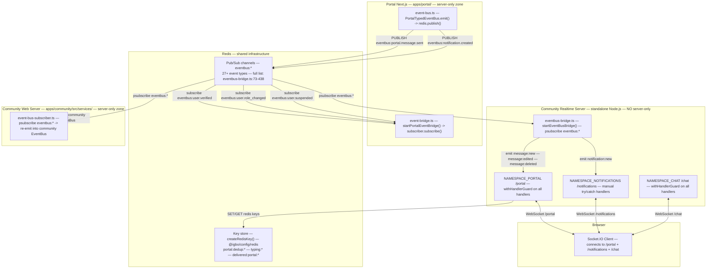

# Cross-Container Architecture Diagram

> **Last verified against source:** 2026-04-26

## Reading Guide

This document describes how the Portal Next.js container and the Community Realtime Server communicate via Redis pub/sub, and how the `server-only` boundary between them works. Read the Mermaid diagram first for the data-flow overview, then use the reference tables below for per-channel and per-event detail. Refer back to this document whenever you add a new Redis channel, Socket.IO namespace, or cross-container event type.

---

## Data Flow Diagram

---

## § Redis Pub/Sub Channels

The bridge subscribes via `psubscribe("eventbus:*")` and handles 27+ event types. The tables below cover the representative portal-scoped subset. Full routing logic lives in `apps/community/src/server/realtime/subscribers/eventbus-bridge.ts:73-438`.

**Portal → Redis (outbound):**

| Channel                           | Publisher                                                             | Consumer(s)                                                | Purpose                                                   |
| --------------------------------- | --------------------------------------------------------------------- | ---------------------------------------------------------- | --------------------------------------------------------- |
| `eventbus:portal.message.sent`    | `apps/portal` EventBus (`event-bus.ts`)                               | Community Realtime Bridge, Community Web Server Subscriber | Deliver new message to `/portal` namespace                |
| `eventbus:portal.message.edited`  | `apps/portal` EventBus                                                | Community Realtime Bridge                                  | Notify participants of edit                               |
| `eventbus:portal.message.deleted` | `apps/portal` EventBus                                                | Community Realtime Bridge                                  | Notify participants of deletion                           |
| `eventbus:notification.created`   | `apps/portal` notification-service via `publishNotificationCreated()` | Community Realtime Bridge                                  | Deliver in-app notification to `/notifications` namespace |

**Community → Redis → Portal (inbound via `event-bridge.ts`):**

These events originate in the community container and are consumed by the portal via a point-to-point `subscribe()` (not `psubscribe`). On receipt, `event-bridge.ts` calls `portalEventBus.emitLocal()` — this re-emits into the portal's local EventBus **without** re-publishing to Redis (no infinite loop).

| Channel                      | Publisher                 | Consumer                 | Purpose                                 |
| ---------------------------- | ------------------------- | ------------------------ | --------------------------------------- |
| `eventbus:user.verified`     | `apps/community` EventBus | Portal `event-bridge.ts` | Sync user verification status to portal |
| `eventbus:user.role_changed` | `apps/community` EventBus | Portal `event-bridge.ts` | Sync role changes to portal             |
| `eventbus:user.suspended`    | `apps/community` EventBus | Portal `event-bridge.ts` | Sync suspension status to portal        |

Two subscriber patterns are in use:

- **`psubscribe("eventbus:*")`** — used by `eventbus-bridge.ts` (realtime container) and `event-bus-subscriber.ts` (community web container) to receive all event types
- **`subscribe("eventbus:user.verified", ...)`** — used by portal `event-bridge.ts` to receive only the three community cross-app events defined in `COMMUNITY_CROSS_APP_EVENTS` (`@igbo/config/events`)

---

## § Redis Key Domains (Portal)

All portal Redis keys are constructed via `createRedisKey()` from `@igbo/config/redis` — this is the canonical source of truth after AI-26. The key format is `{app}:{domain}:{id...}`. Exception: `delivered:portal:*` and `typing:*` predate the convention and use a different prefix order.

| Key Pattern                                                    | TTL                     | Mechanism     | Purpose                                                                                              |
| -------------------------------------------------------------- | ----------------------- | ------------- | ---------------------------------------------------------------------------------------------------- |
| `portal:dedup:notif:{type}:{entityId}`                         | 900 s                   | SET NX EX     | Prevent duplicate notification delivery on event replay                                              |
| `portal:dedup:email:{name}`                                    | TTL set at call site    | SET NX        | Prevent duplicate email delivery                                                                     |
| `portal:dedup:push:{userId}:{tag}`                             | TTL set at call site    | SET NX        | Prevent duplicate push notification delivery                                                         |
| `portal:throttle:msg:{senderId}:{recipientId}:{applicationId}` | 30 s                    | INCR + EXPIRE | Suppress burst notification spam within a conversation                                               |
| `delivered:portal:{messageId}:{userId}`                        | 86400 s (24 h)          | SET NX EX     | Write-once delivery receipt; set by `/portal` namespace on `message:delivered`                       |
| `typing:{conversationId}:{userId}`                             | `TYPING_EXPIRE_SECONDS` | SET EX        | Auto-expiring typing indicator; set/deleted by `/portal` namespace on `typing:start` / `typing:stop` |

> **Source:** `packages/config/src/redis.ts` — `createRedisKey()` and domain constants.

---

## § Socket.IO `/portal` Events

All handlers in `/portal` and `/chat` namespaces are wrapped with `withHandlerGuard` (AI-29), which catches errors, logs structured JSON, and calls the `ack` callback on failure. The `/notifications` namespace predates AI-29 and uses manual try/catch.

**Bridge → Client (server pushes to browser, triggered by Redis pub/sub):**

| Event             | Trigger                                              | Key Payload Fields                                                                                                                                |
| ----------------- | ---------------------------------------------------- | ------------------------------------------------------------------------------------------------------------------------------------------------- |
| `message:new`     | `eventbus:portal.message.sent` received by bridge    | `messageId`, `conversationId`, `senderId`, `content`, `contentType`, `createdAt`, `parentMessageId`, `senderRole`, `applicationId`, `attachments` |
| `message:edited`  | `eventbus:portal.message.edited` received by bridge  | `messageId`, `conversationId`, `senderId`, `content`, `editedAt`                                                                                  |
| `message:deleted` | `eventbus:portal.message.deleted` received by bridge | `messageId`, `conversationId`, `senderId`, `deletedAt`                                                                                            |

**Client → Server (browser sends to realtime server):**

| Event               | Handler                                       | Redis Side Effect                                       | Broadcast                                                                   |
| ------------------- | --------------------------------------------- | ------------------------------------------------------- | --------------------------------------------------------------------------- |
| `message:delivered` | `portal:message:delivered` (withHandlerGuard) | `SET delivered:portal:{messageId}:{userId} NX EX 86400` | Emits `message:delivered` to `ROOM_CONVERSATION` (excluding sender)         |
| `typing:start`      | `portal:typing:start` (withHandlerGuard)      | `SET typing:{convId}:{userId} EX TYPING_EXPIRE_SECONDS` | Emits `typing:start` to `ROOM_CONVERSATION` (excluding sender)              |
| `typing:stop`       | `portal:typing:stop` (withHandlerGuard)       | `DEL typing:{convId}:{userId}`                          | Emits `typing:stop` to `ROOM_CONVERSATION` (excluding sender)               |
| `message:read`      | `portal:message:read` (withHandlerGuard)      | DB `markConversationRead()`                             | Emits `message:read` to ALL members in `ROOM_CONVERSATION` (including self) |
| `sync:request`      | `portal:sync:request` (withHandlerGuard)      | None                                                    | Emits `sync:replay` or `sync:full_refresh` to requesting socket only        |

**Server → Client (direct push from realtime server, not via bridge):**

| Event                 | Trigger                                                                    |
| --------------------- | -------------------------------------------------------------------------- |
| `message:delivered`   | Broadcast from `message:delivered` handler to conversation room            |
| `typing:start`        | Broadcast from `typing:start` handler to conversation room                 |
| `typing:stop`         | Broadcast from `typing:stop` handler to conversation room                  |
| `message:read`        | Broadcast from `message:read` handler to all room members (including self) |
| `sync:replay`         | Response to `sync:request` — missed messages within 24 h window            |
| `sync:full_refresh`   | Response to `sync:request` when gap > 24 h or timestamp is invalid         |
| `conversation:joined` | Emitted on connect after `autoJoinPortalConversations()`                   |

**On connect:**

- Socket joins `ROOM_USER(userId)` so the bridge can target the user by ID
- `autoJoinPortalConversations()` joins all active portal conversation rooms; emits `conversation:joined` per room

---

## § Why `server-only` Matters Here

The `server-only` npm package activates React's `react-server` export condition. When imported, it throws at module-load time in any non-Next.js Node.js process with the message `"This module cannot be imported from a Client Component module."` This mechanism ensures that database queries, authentication secrets, and Redis clients are never bundled into the browser or loaded in incompatible processes.

**Where `server-only` is imported:**

- `apps/portal/src/` — service files and API routes import `server-only` directly
- `packages/db/src/queries/*.ts` — every individual query file imports `server-only` (NOTE: `packages/db/src/index.ts` itself does **not** import `server-only` — only the query files do)
- `packages/auth/` — all `@igbo/auth` modules import `server-only`

**The realtime server constraint:**

`apps/community/src/server/realtime/` is a **standalone Node.js process** — it is not started by Next.js and does not run in the React server context. It MUST NOT import modules that transitively import `server-only`. Concretely:

- It **cannot** import `@igbo/db` query files (each one imports `server-only`)
- It **cannot** import `@igbo/auth` modules
- The deliberate exception (P-5.1A decision): `db.execute()` raw SQL is used in portal namespace handlers because `db.execute()` operates on the Postgres connection object directly and does **not** import Drizzle schema types (which would pull in `server-only` transitively)
- Both `event-bus.ts` and `event-bridge.ts` in the portal container are annotated `// ci-allow-no-server-only` because they are shared with the standalone realtime context

**CI enforcement:**

AI-25 added a CI scanner (`scripts/ci-checks/check-realtime-server-only.ts`) that walks the full import graph from `apps/community/src/server/realtime/index.ts` and fails the build if any reachable module imports `server-only`. This is checked on every PR.

---

## When to Update This Document

Update `docs/architecture-cross-container.md` when any of the following changes:

- **New Redis pub/sub channel** — add a row to the § Redis Pub/Sub Channels table and update the diagram if the new channel crosses a container boundary
- **New Socket.IO namespace** — add a new subgraph node to the Mermaid diagram and a new events section
- **New container** — add a subgraph and all relevant edges
- **New cross-app event type** — add a row to the inbound or outbound channel table
- **New Redis key domain** — add a row to the § Redis Key Domains table
- **`server-only` boundary changes** — update the § Why `server-only` Matters section with any new packages that import `server-only` or new exceptions
- **`withHandlerGuard` pattern changes** (AI-29) — update the handler column in the events table
- Update the **Last verified against source** date at the top of the file after verifying against current code

### Source Files (all verified at 2026-04-26)

| Component                  | Source Path                                                                |
| -------------------------- | -------------------------------------------------------------------------- |
| EventBus publish           | `apps/portal/src/services/event-bus.ts`                                    |
| Event bridge subscribe     | `apps/portal/src/services/event-bridge.ts`                                 |
| Notification publish       | `apps/portal/src/services/notification-service.ts:33-55`                   |
| Realtime bridge            | `apps/community/src/server/realtime/subscribers/eventbus-bridge.ts:73-438` |
| Portal namespace           | `apps/community/src/server/realtime/namespaces/portal.ts`                  |
| Chat namespace             | `apps/community/src/server/realtime/namespaces/chat.ts`                    |
| Notifications namespace    | `apps/community/src/server/realtime/namespaces/notifications.ts`           |
| Realtime entry             | `apps/community/src/server/realtime/index.ts`                              |
| Community web subscriber   | `apps/community/src/services/event-bus-subscriber.ts`                      |
| `withHandlerGuard`         | `packages/config/src/handler-guard.ts`                                     |
| Redis key convention       | `packages/config/src/redis.ts`                                             |
| Realtime constants         | `packages/config/src/realtime.ts`                                          |
| Community cross-app events | `packages/config/src/events.ts` — `COMMUNITY_CROSS_APP_EVENTS`             |
| CI server-only scanner     | `scripts/ci-checks/check-realtime-server-only.ts`                          |
| Cross-container smoke test | `packages/integration-tests/portal-cross-container-smoke.test.ts`          |
