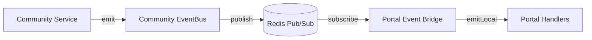

# Monorepo Playbook v1

This playbook documents the frozen patterns for working in the igbo monorepo. Follow these conventions for every new feature, package, and migration. If you encounter a gap, apply the **"second time = standardize"** rule: implement once freely, but the second time a pattern appears, freeze and name it here.

## 1. Injection Patterns

Shared packages (`@igbo/auth`, `@igbo/db`) cannot import app-specific modules. Instead, apps inject dependencies at startup via setter functions called in `instrumentation.ts`.

### 1.1 Frozen API

Three injection points exist. Do not invent new variations — extend these or add a new one here first.

| Setter                           | Package               | Purpose                                                    |
| -------------------------------- | --------------------- | ---------------------------------------------------------- |
| `initAuthRedis(client)`          | `@igbo/auth`          | Provides Redis client for session cache + auth operations  |
| `setPermissionDeniedHandler(cb)` | `@igbo/auth`          | Wires EventBus callback for permission denied analytics    |
| `setPublisher(getter)`           | Portal `event-bus.ts` | Injects Redis publisher for cross-container event delivery |

### 1.2 Pattern Rules

- **Setter stores on `globalThis`** — survives Next.js Turbopack hot-reload.
- **Getter throws if uninitialized** — fail fast, never silently return null.
- **Reset function for tests** — `_resetAuthRedis()` etc. Prefixed with underscore to signal test-only.
- **Call in `instrumentation.ts`** — the `register()` function runs once on Node.js startup.

### 1.3 Template for New Injections

```typescript
// packages/<pkg>/src/<dependency>.ts
import "server-only";

const _global = globalThis as unknown as { __igbo<Name>?: T | null };

export function init<Name>(value: T): void {
  _global.__igbo<Name> = value;
}

export function get<Name>(): T {
  const v = _global.__igbo<Name>;
  if (!v) throw new Error("<Name> not initialized. Call init<Name>() at app startup.");
  return v;
}

export function _reset<Name>(): void {
  _global.__igbo<Name> = null;
}
```

### 1.4 Startup Wiring Example

```typescript
// apps/<app>/instrumentation.ts
export async function register() {
  if (process.env.NEXT_RUNTIME === "nodejs") {
    const { initAuthRedis } = await import("@igbo/auth");
    const { getRedisClient } = await import("@/lib/redis");
    initAuthRedis(getRedisClient());

    const { setPermissionDeniedHandler } = await import("@igbo/auth/permissions");
    const { eventBus } = await import("@/services/event-bus");
    setPermissionDeniedHandler((event) => {
      eventBus.emit("member.permission_denied", event);
    });
  }
}
```

---

## 2. Package Boundaries

### 2.1 Import Rules

| From → To            | Allowed?         | Mechanism                                          |
| -------------------- | ---------------- | -------------------------------------------------- |
| App → Shared package | Yes              | `@igbo/config`, `@igbo/db`, `@igbo/auth`           |
| Shared package → App | **No**           | Use injection (Section 1)                          |
| Package → Package    | Yes (config, db) | `@igbo/auth` imports `@igbo/db` and `@igbo/config` |
| App → App            | **No**           | Use Redis pub/sub via EventBus                     |

### 2.2 Server-Only Enforcement

All server-side modules in shared packages import `"server-only"` at the top. This prevents accidental client-side bundling.

```typescript
// First line of any server module
import "server-only";
```

### 2.3 Environment Variables

Shared packages read `process.env` directly — they do **not** import `@/env` (that's app-specific). Zod schemas in `@igbo/config/env` validate at app startup.

### 2.4 Stale Import Detection

The CI pipeline runs `scripts/check-stale-imports.ts` to catch imports that bypass package boundaries:

- `@/db/` outside `packages/db` → should be `@igbo/db/...`
- `@/auth/` outside `packages/auth` → should be `@igbo/auth/...`
- `@/config/` outside `packages/config` → should be `@igbo/config/...`

---

## 3. Test Conventions

### 3.1 Environment Directive

Every server-side test file starts with:

```typescript
// @vitest-environment node
```

Client component tests use the default `jsdom` environment (no directive needed).

### 3.2 Server-Only Mock

Every Vitest config aliases `server-only` to a no-op mock:

```typescript
// src/test/mocks/server-only.ts (or src/test-utils/server-only.ts)
export {};
```

```typescript
// vitest.config.ts → resolve.alias
{ find: "server-only", replacement: path.resolve(__dirname, "./src/test/mocks/server-only.ts") }
```

### 3.3 Package Alias Strategy

Use **regex aliases** for packages with many subpath exports:

```typescript
// Covers all @igbo/db/* imports (80+ subpaths)
{ find: /^@igbo\/db\/(.+)$/, replacement: path.resolve(__dirname, "../../packages/db/src/$1") }
{ find: /^@igbo\/db$/,       replacement: path.resolve(__dirname, "../../packages/db/src/index") }
```

Use **individual aliases** only for packages with few exports (e.g., `@igbo/config/env`).

### 3.4 DB Query Mock Pattern

Mock the chained Drizzle query builder. Return arrays directly — **not** `{ rows: [...] }`:

```typescript
const mockSelect = vi.fn();

vi.mock("../index", () => ({
  db: { select: (...args: unknown[]) => mockSelect(...args) },
}));

// In test:
const mockWhere = vi.fn().mockResolvedValue([{ id: "u1", email: "a@b.com" }]);
const mockFrom = vi.fn().mockReturnValue({ where: mockWhere });
mockSelect.mockReturnValue({ from: mockFrom });
```

### 3.5 `db.execute()` Mock Format

Raw SQL via `db.execute()` returns a plain array:

```typescript
// Correct
vi.fn().mockResolvedValue([{ id: "u1" }, { id: "u2" }]);

// Wrong — source uses Array.from(rows), not rows.rows
vi.fn().mockResolvedValue({ rows: [{ id: "u1" }] });
```

### 3.6 HMR Singleton Reset

For modules using `globalThis` singletons (EventBus, etc.), reset between tests:

```typescript
beforeEach(() => {
  const g = globalThis as unknown as { __portalEventBus?: unknown };
  delete g.__portalEventBus;
  vi.resetModules();
});

async function getBus() {
  const { portalEventBus } = await import("./event-bus");
  return portalEventBus;
}
```

### 3.7 File Location

Tests are co-located with source — no `__tests__/` directories:

```
src/services/event-bus.ts
src/services/event-bus.test.ts
```

### 3.8 Infra Test ROOT Pattern

Infrastructure tests at the app root use:

```typescript
const ROOT = resolve(__dirname, "../.."); // repo root
const APP_ROOT = resolve(__dirname, "."); // apps/<app>
```

---

## 4. Migration Checklist

See [Migration Runbook](./migration-runbook.md) for the full step-by-step procedure.

### 4.1 Quick Reference

1. Write SQL file in `packages/db/src/migrations/`
2. **Run `pnpm --filter @igbo/db db:journal-sync`** to auto-generate the journal entry
3. Update Drizzle schema TypeScript if needed
4. Run `pnpm --filter @igbo/db test` to verify
5. Run full app test suite

### 4.2 Naming Convention

- **Numbered** (legacy): `0000_description.sql` through `0050_*.sql` — sequential, zero-padded
- **Timestamp** (new): `20260404120000_description.sql` — `YYYYMMDDHHMMSS` format

The `sync-journal.ts` script handles both formats. Numbered migrations sort first, then timestamp migrations sort chronologically.

### 4.3 Critical Rule

Every `.sql` migration file **must** have a corresponding entry in `_journal.json`. Without the journal entry, drizzle-kit silently skips the file. The `db:journal-sync` script handles this — run it after creating any migration file.

---

## 5. EventBus Architecture

### 5.1 Event Envelope

All events include three base fields from `@igbo/config/events`:

```typescript
interface BaseEvent {
  eventId: string; // UUID — unique per emission, used for dedup
  version: number; // Schema version — bump on breaking changes
  timestamp: string; // ISO 8601
}
```

### 5.2 Emit from Services, Never from Routes

API routes call services. Services emit events. Routes never call `eventBus.emit()` directly.

### 5.3 Cross-App Event Flow



- Community publishes to `eventbus:<eventName>` Redis channel
- Portal bridge subscribes to channels listed in `COMMUNITY_CROSS_APP_EVENTS`
- Bridge uses `emitLocal()` to re-emit without republishing (prevents infinite loop)

### 5.4 Cross-App Event Contract

Define shared event types in the `@igbo/config/events` module (apps import via `@igbo/config/events`, not the raw file path). Each app's event map extends `BaseEvent`. Cross-app event lists are explicit — only listed events are forwarded.

---

## 6. Decision Triggers

### 6.1 "Second Time = Standardize"

If you implement a pattern a second time, freeze it:

1. Name the pattern
2. Add it to this Playbook
3. Reference the Playbook in code comments

### 6.2 Velocity-Debt vs Structural-Debt

Every deferred decision must be labeled:

| Label               | Definition                                            | Rule                           |
| ------------------- | ----------------------------------------------------- | ------------------------------ |
| **Velocity-debt**   | Acceptable shortcut with known trigger for revisiting | Document the trigger condition |
| **Structural-debt** | Must fix before scaling — compounds over time         | Fix before next epic starts    |

### 6.3 Decision Trigger Template

When deferring a decision, document it in the retro or story spec:

```markdown
**Debt Item:** [What was deferred]
**Type:** Velocity-debt | Structural-debt
**Decision Trigger:** [Specific condition that forces revisiting]
**Current Workaround:** [What we're doing now]
```

---

## 7. Frontend Safety & Readiness

> **Why this section exists.** Portal Epic 1 retrospective (2026-04-05) identified that implicit requirements — i18n key usage, XSS sanitization, accessibility patterns, and component dependency awareness — account for roughly half of all review findings (~7.3/story). Rules existed in memory files and retro docs but were not encoded as automated enforcement. Per "Second Time = Standardize" (§6.1), this section codifies the rules and links them to automated gates.

### 7.1 i18n Rule

Every user-facing string **must** go through `useTranslations()` or `<Trans>` — never hardcoded in JSX. The CI scanner `check-hardcoded-jsx-strings` enforces this automatically.

**Gate split:**

- **SN-5 (Readiness):** SM enumerates all user-facing strings with English copy and key names. Igbo translations are NOT required at this gate.
- **SN-1 (Dev Completion):** Dev confirms all i18n keys are wired in `en.json` and adds Igbo translations to `ig.json`.

**Opt-out:** `// ci-allow-literal-jsx` on the same line or the immediately-preceding line. Requires a justification comment on the line above.

### 7.2 Sanitization Rule

Any `dangerouslySetInnerHTML` **must** call `sanitizeHtml()` on the same `__html:` expression, starting at the leading position:

```tsx
// ✅ Compliant — expression starts with sanitizeHtml(
<div dangerouslySetInnerHTML={{ __html: sanitizeHtml(html) }} />

// ✅ Compliant — wrap the whole ternary
<div dangerouslySetInnerHTML={{ __html: sanitizeHtml(cond ? a : b) }} />

// ❌ Violation — expression starts with maybeSafe, not sanitizeHtml
<div dangerouslySetInnerHTML={{ __html: maybeSafe(html) || sanitizeHtml("") }} />

// ❌ Violation — sanitizeHtml without parens (bare reference)
<div dangerouslySetInnerHTML={{ __html: sanitizeHtml }} />
```

The CI scanner `check-unsanitized-html` enforces strict leading-call compliance (`/^sanitizeHtml\s*\(/`).

**Opt-out:** `// ci-allow-unsanitized-html` in the **3 lines immediately above** the `dangerouslySetInnerHTML` occurrence (4+ lines above does NOT suppress). The line immediately above the `// ci-allow-unsanitized-html` comment becomes the justification in the allowlist registry. Every allowlist entry must cite a concrete sanitize call site or pre-sanitize pipeline — "trusted" justifications without a code path reference are rejected in review.

### 7.3 Accessibility Rule (review-enforced, 6-item checklist)

Reviewers work through the following checklist for every story touching UI:

1. **Keyboard reachable** — every interactive element is reachable via Tab / Shift+Tab without a pointer.
2. **Focus visible** — every focused element has a visible focus indicator (`:focus-visible` styles or equivalent).
3. **Focus trapped in modals** — modal / dialog / popover traps focus inside while open and restores focus to the trigger on close.
4. **ARIA labels on icon-only controls** — every button / link rendered as only an icon has an `aria-label` or `aria-labelledby`.
5. **Live regions for async state** — loading, success, and error state changes that don't move focus are announced via `aria-live` or `role="status"` / `role="alert"`.
6. **axe-core assertions pass in component tests** — every new component has at least one axe-core assertion in its Vitest test.

No automated scanner for a11y — review-enforced only.

### 7.4 Component Dependency Rule

Before implementation starts, verify that every shadcn/ui or other vendored component needed by the story already exists in `apps/<app>/src/components/ui/`. If missing, add it as a **Task 0 subtask** (e.g., "Install shadcn/ui `<ComponentName>`"). Discovering missing components mid-implementation blocks progress and causes unplanned delays.

### 7.5 How to Use the Story Template Gates

- **SN-5 Readiness Checklist** — filled by SM before story enters development. Each sub-section has a `[N/A] — Justification: _______` escape hatch for stories with no UI / no HTML rendering / no interactive elements.
- **SN-1 Dev Completion items** — checked by dev before PR. The five new Dev Completion bullets cover: i18n key wiring, Igbo translations, CI sanitization check, a11y axe assertions, component dependencies.

See `_bmad/bmm/workflows/4-implementation/create-story/template.md` for the full template.

### 7.6 Allowlist Registry

Every `// ci-allow-<reason>` comment across the codebase is captured in `docs/ci-check-allowlist.md`, auto-generated by `pnpm ci-checks`. If the on-disk registry differs from the generated content, `pnpm ci-checks` exits non-zero with an `allowlist-registry-drift` violation.

Known reasons:

- `ci-allow-process-env` — direct `process.env` access in an exempt file
- `ci-allow-no-server-only` — server module exempt from `server-only` requirement
- `ci-allow-literal-jsx` — hardcoded JSX string that is genuinely non-user-facing
- `ci-allow-unsanitized-html` — `dangerouslySetInnerHTML` with server-sanitized or JSON-only content

### 7.7 Kill-Switch Policy (Anti-Pattern Warning)

`CI_CHECKS_DISABLE=<check-names>` env var bypasses specific scanners **locally only**. When `CI=true` (set automatically by GitHub Actions and most CI providers), the env var is **silently ignored with a warning banner**. This structurally prevents the kill-switch from becoming a CI bypass path.

**Anti-pattern:** Setting `CI_CHECKS_DISABLE` to "unblock velocity" without Winston (Architect) approval documented in the PR description. That is exactly the phantom-enforcement failure mode §6.1 (Lesson 2) prohibits.

### 7.8 Scanner Limitations & Revisit Triggers

- **Hardcoded-string scanner:** uses regex-over-JSX (not AST). Template-literal attribute values (`placeholder={\`${foo} bar\`}`) are not scanned (documented gap). Word-boundary i18n suppression may produce rare false negatives when an element has both a literal text node and a sibling `t(...)` call.
- **Unsanitized-HTML scanner:** expression extractor uses a brace/paren counter, not a full TypeScript parser. If it encounters exotic syntax it cannot resolve, it fails closed (`unsanitized-html-extraction-failed`).
- **Revisit trigger:** if `unsanitized-html-extraction-failed` rate exceeds 3 across the repo OR any confirmed sanitization bypass is discovered, migrate the expression extractor to `@babel/parser` or the TypeScript compiler API.

**Signed off: Winston (Architect) — 2026-04-06**

---

## 8. Common Gotchas

| Gotcha                                              | Fix                                                                                 |
| --------------------------------------------------- | ----------------------------------------------------------------------------------- |
| `server-only` error during `drizzle-kit generate`   | Hand-write SQL migrations — never use drizzle-kit generate                          |
| Zod validation: `parsed.issues[0]` is undefined     | Use `parsed.error.issues[0]` (Zod v4 `import from "zod/v4"`)                        |
| `withApiHandler` doesn't pass route params          | Extract from URL: `new URL(req.url).pathname.split("/").at(-N)`                     |
| Test mock returns `{ rows: [] }`                    | Return plain array — source uses `Array.from(rows)` directly                        |
| XHR-based upload tests mock `fetch`                 | `FileUpload.tsx` uses XHR, not fetch — mock `XMLHttpRequest`                        |
| `errorResponse()` called with string                | `errorResponse()` accepts `ProblemDetails` object only — use `throw new ApiError()` |
| Missing `_journal.json` entry                       | Run `pnpm --filter @igbo/db db:journal-sync` after adding any `.sql` file           |
| Pre-existing test failure in `ProfileStep.test.tsx` | Known pre-existing failure, tracked separately                                      |
