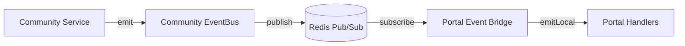

# Monorepo Playbook v1

This playbook documents the frozen patterns for working in the igbo monorepo. Follow these conventions for every new feature, package, and migration. If you encounter a gap, apply the **"second time = standardize"** rule: implement once freely, but the second time a pattern appears, freeze and name it here.

## 1. Injection Patterns

Shared packages (`@igbo/auth`, `@igbo/db`) cannot import app-specific modules. Instead, apps inject dependencies at startup via setter functions called in `instrumentation.ts`.

### 1.1 Frozen API

Three injection points exist. Do not invent new variations — extend these or add a new one here first.

| Setter                           | Package               | Purpose                                                    |
| -------------------------------- | --------------------- | ---------------------------------------------------------- |
| `initAuthRedis(client)`          | `@igbo/auth`          | Provides Redis client for session cache + auth operations  |
| `setPermissionDeniedHandler(cb)` | `@igbo/auth`          | Wires EventBus callback for permission denied analytics    |
| `setPublisher(getter)`           | Portal `event-bus.ts` | Injects Redis publisher for cross-container event delivery |

### 1.2 Pattern Rules

- **Setter stores on `globalThis`** — survives Next.js Turbopack hot-reload.
- **Getter throws if uninitialized** — fail fast, never silently return null.
- **Reset function for tests** — `_resetAuthRedis()` etc. Prefixed with underscore to signal test-only.
- **Call in `instrumentation.ts`** — the `register()` function runs once on Node.js startup.

### 1.3 Template for New Injections

```typescript
// packages/<pkg>/src/<dependency>.ts
import "server-only";

const _global = globalThis as unknown as { __igbo<Name>?: T | null };

export function init<Name>(value: T): void {
  _global.__igbo<Name> = value;
}

export function get<Name>(): T {
  const v = _global.__igbo<Name>;
  if (!v) throw new Error("<Name> not initialized. Call init<Name>() at app startup.");
  return v;
}

export function _reset<Name>(): void {
  _global.__igbo<Name> = null;
}
```

### 1.4 Startup Wiring Example

```typescript
// apps/<app>/instrumentation.ts
export async function register() {
  if (process.env.NEXT_RUNTIME === "nodejs") {
    const { initAuthRedis } = await import("@igbo/auth");
    const { getRedisClient } = await import("@/lib/redis");
    initAuthRedis(getRedisClient());

    const { setPermissionDeniedHandler } = await import("@igbo/auth/permissions");
    const { eventBus } = await import("@/services/event-bus");
    setPermissionDeniedHandler((event) => {
      eventBus.emit("member.permission_denied", event);
    });
  }
}
```

---

## 2. Package Boundaries

### 2.1 Import Rules

| From → To            | Allowed?         | Mechanism                                          |
| -------------------- | ---------------- | -------------------------------------------------- |
| App → Shared package | Yes              | `@igbo/config`, `@igbo/db`, `@igbo/auth`           |
| Shared package → App | **No**           | Use injection (Section 1)                          |
| Package → Package    | Yes (config, db) | `@igbo/auth` imports `@igbo/db` and `@igbo/config` |
| App → App            | **No**           | Use Redis pub/sub via EventBus                     |

### 2.2 Server-Only Enforcement

All server-side modules in shared packages import `"server-only"` at the top. This prevents accidental client-side bundling.

```typescript
// First line of any server module
import "server-only";
```

### 2.3 Environment Variables

Shared packages read `process.env` directly — they do **not** import `@/env` (that's app-specific). Zod schemas in `@igbo/config/env` validate at app startup.

### 2.4 Stale Import Detection

The CI pipeline runs `scripts/check-stale-imports.ts` to catch imports that bypass package boundaries:

- `@/db/` outside `packages/db` → should be `@igbo/db/...`
- `@/auth/` outside `packages/auth` → should be `@igbo/auth/...`
- `@/config/` outside `packages/config` → should be `@igbo/config/...`

---

## 3. Test Conventions

### 3.1 Environment Directive

Every server-side test file starts with:

```typescript
// @vitest-environment node
```

Client component tests use the default `jsdom` environment (no directive needed).

### 3.2 Server-Only Mock

Every Vitest config aliases `server-only` to a no-op mock:

```typescript
// src/test/mocks/server-only.ts (or src/test-utils/server-only.ts)
export {};
```

```typescript
// vitest.config.ts → resolve.alias
{ find: "server-only", replacement: path.resolve(__dirname, "./src/test/mocks/server-only.ts") }
```

### 3.3 Package Alias Strategy

Use **regex aliases** for packages with many subpath exports:

```typescript
// Covers all @igbo/db/* imports (80+ subpaths)
{ find: /^@igbo\/db\/(.+)$/, replacement: path.resolve(__dirname, "../../packages/db/src/$1") }
{ find: /^@igbo\/db$/,       replacement: path.resolve(__dirname, "../../packages/db/src/index") }
```

Use **individual aliases** only for packages with few exports (e.g., `@igbo/config/env`).

### 3.4 DB Query Mock Pattern

Mock the chained Drizzle query builder. Return arrays directly — **not** `{ rows: [...] }`:

```typescript
const mockSelect = vi.fn();

vi.mock("../index", () => ({
  db: { select: (...args: unknown[]) => mockSelect(...args) },
}));

// In test:
const mockWhere = vi.fn().mockResolvedValue([{ id: "u1", email: "a@b.com" }]);
const mockFrom = vi.fn().mockReturnValue({ where: mockWhere });
mockSelect.mockReturnValue({ from: mockFrom });
```

### 3.5 `db.execute()` Mock Format

Raw SQL via `db.execute()` returns a plain array:

```typescript
// Correct
vi.fn().mockResolvedValue([{ id: "u1" }, { id: "u2" }]);

// Wrong — source uses Array.from(rows), not rows.rows
vi.fn().mockResolvedValue({ rows: [{ id: "u1" }] });
```

### 3.6 HMR Singleton Reset

For modules using `globalThis` singletons (EventBus, etc.), reset between tests:

```typescript
beforeEach(() => {
  const g = globalThis as unknown as { __portalEventBus?: unknown };
  delete g.__portalEventBus;
  vi.resetModules();
});

async function getBus() {
  const { portalEventBus } = await import("./event-bus");
  return portalEventBus;
}
```

### 3.7 File Location

Tests are co-located with source — no `__tests__/` directories:

```
src/services/event-bus.ts
src/services/event-bus.test.ts
```

### 3.8 Infra Test ROOT Pattern

Infrastructure tests at the app root use:

```typescript
const ROOT = resolve(__dirname, "../.."); // repo root
const APP_ROOT = resolve(__dirname, "."); // apps/<app>
```

---

## 4. Migration Checklist

See [Migration Runbook](./migration-runbook.md) for the full step-by-step procedure.

### 4.1 Quick Reference

1. Write SQL file in `packages/db/src/migrations/`
2. **Run `pnpm --filter @igbo/db db:journal-sync`** to auto-generate the journal entry
3. Update Drizzle schema TypeScript if needed
4. Run `pnpm --filter @igbo/db test` to verify
5. Run full app test suite

### 4.2 Naming Convention

- **Numbered** (legacy): `0000_description.sql` through `0050_*.sql` — sequential, zero-padded
- **Timestamp** (new): `20260404120000_description.sql` — `YYYYMMDDHHMMSS` format

The `sync-journal.ts` script handles both formats. Numbered migrations sort first, then timestamp migrations sort chronologically.

### 4.3 Critical Rule

Every `.sql` migration file **must** have a corresponding entry in `_journal.json`. Without the journal entry, drizzle-kit silently skips the file. The `db:journal-sync` script handles this — run it after creating any migration file.

---

## 5. EventBus Architecture

### 5.1 Event Envelope

All events include three base fields from `@igbo/config/events`:

```typescript
interface BaseEvent {
  eventId: string; // UUID — unique per emission, used for dedup
  version: number; // Schema version — bump on breaking changes
  timestamp: string; // ISO 8601
}
```

### 5.2 Emit from Services, Never from Routes

API routes call services. Services emit events. Routes never call `eventBus.emit()` directly.

### 5.3 Cross-App Event Flow



- Community publishes to `eventbus:<eventName>` Redis channel
- Portal bridge subscribes to channels listed in `COMMUNITY_CROSS_APP_EVENTS`
- Bridge uses `emitLocal()` to re-emit without republishing (prevents infinite loop)

### 5.4 Cross-App Event Contract

Define shared event types in the `@igbo/config/events` module (apps import via `@igbo/config/events`, not the raw file path). Each app's event map extends `BaseEvent`. Cross-app event lists are explicit — only listed events are forwarded.

---

## 6. Decision Triggers

### 6.1 "Second Time = Standardize"

If you implement a pattern a second time, freeze it:

1. Name the pattern
2. Add it to this Playbook
3. Reference the Playbook in code comments

### 6.2 Velocity-Debt vs Structural-Debt

Every deferred decision must be labeled:

| Label               | Definition                                            | Rule                           |
| ------------------- | ----------------------------------------------------- | ------------------------------ |
| **Velocity-debt**   | Acceptable shortcut with known trigger for revisiting | Document the trigger condition |
| **Structural-debt** | Must fix before scaling — compounds over time         | Fix before next epic starts    |

### 6.3 Decision Trigger Template

When deferring a decision, document it in the retro or story spec:

```markdown
**Debt Item:** [What was deferred]
**Type:** Velocity-debt | Structural-debt
**Decision Trigger:** [Specific condition that forces revisiting]
**Current Workaround:** [What we're doing now]
```

---

## 7. Frontend Safety & Readiness

> **Why this section exists.** Portal Epic 1 retrospective (2026-04-05) identified that implicit requirements — i18n key usage, XSS sanitization, accessibility patterns, and component dependency awareness — account for roughly half of all review findings (~7.3/story). Rules existed in memory files and retro docs but were not encoded as automated enforcement. Per "Second Time = Standardize" (§6.1), this section codifies the rules and links them to automated gates.

### 7.1 i18n Rule

Every user-facing string **must** go through `useTranslations()` or `<Trans>` — never hardcoded in JSX. The CI scanner `check-hardcoded-jsx-strings` enforces this automatically.

**Gate split:**

- **SN-5 (Readiness):** SM enumerates all user-facing strings with English copy and key names. Igbo translations are NOT required at this gate.
- **SN-1 (Dev Completion):** Dev confirms all i18n keys are wired in `en.json` and adds Igbo translations to `ig.json`.

**Opt-out:** `// ci-allow-literal-jsx` on the same line or the immediately-preceding line. Requires a justification comment on the line above.

### 7.2 Sanitization Rule

Any `dangerouslySetInnerHTML` **must** call `sanitizeHtml()` on the same `__html:` expression, starting at the leading position:

```tsx
// ✅ Compliant — expression starts with sanitizeHtml(
<div dangerouslySetInnerHTML={{ __html: sanitizeHtml(html) }} />

// ✅ Compliant — wrap the whole ternary
<div dangerouslySetInnerHTML={{ __html: sanitizeHtml(cond ? a : b) }} />

// ❌ Violation — expression starts with maybeSafe, not sanitizeHtml
<div dangerouslySetInnerHTML={{ __html: maybeSafe(html) || sanitizeHtml("") }} />

// ❌ Violation — sanitizeHtml without parens (bare reference)
<div dangerouslySetInnerHTML={{ __html: sanitizeHtml }} />
```

The CI scanner `check-unsanitized-html` enforces strict leading-call compliance (`/^sanitizeHtml\s*\(/`).

**Opt-out:** `// ci-allow-unsanitized-html` in the **3 lines immediately above** the `dangerouslySetInnerHTML` occurrence (4+ lines above does NOT suppress). The line immediately above the `// ci-allow-unsanitized-html` comment becomes the justification in the allowlist registry. Every allowlist entry must cite a concrete sanitize call site or pre-sanitize pipeline — "trusted" justifications without a code path reference are rejected in review.

### 7.3 Accessibility Rule (review-enforced, 6-item checklist)

Reviewers work through the following checklist for every story touching UI:

1. **Keyboard reachable** — every interactive element is reachable via Tab / Shift+Tab without a pointer.
2. **Focus visible** — every focused element has a visible focus indicator (`:focus-visible` styles or equivalent).
3. **Focus trapped in modals** — modal / dialog / popover traps focus inside while open and restores focus to the trigger on close.
4. **ARIA labels on icon-only controls** — every button / link rendered as only an icon has an `aria-label` or `aria-labelledby`.
5. **Live regions for async state** — loading, success, and error state changes that don't move focus are announced via `aria-live` or `role="status"` / `role="alert"`.
6. **axe-core assertions pass in component tests** — every new component has at least one axe-core assertion in its Vitest test.

No automated scanner for a11y — review-enforced only.

### 7.4 Component Dependency Rule

Before implementation starts, verify that every shadcn/ui or other vendored component needed by the story already exists in `apps/<app>/src/components/ui/`. If missing, add it as a **Task 0 subtask** (e.g., "Install shadcn/ui `<ComponentName>`"). Discovering missing components mid-implementation blocks progress and causes unplanned delays.

### 7.5 How to Use the Story Template Gates

- **SN-5 Readiness Checklist** — filled by SM before story enters development. Each sub-section has a `[N/A] — Justification: _______` escape hatch for stories with no UI / no HTML rendering / no interactive elements.
- **SN-1 Dev Completion items** — checked by dev before PR. The five new Dev Completion bullets cover: i18n key wiring, Igbo translations, CI sanitization check, a11y axe assertions, component dependencies.

### 7.6 Codebase Verification Rule

Every field name, file path, TypeScript type/interface, API route, and component name referenced in a story's Dev Notes or Tasks **must** be verified against the current codebase before the story enters development. This prevents the "field doesn't exist" class of errors that consumed review/fix cycles in Portal Epic 2 (P-2.7 referenced non-existent `posting?.createdByUserId`, P-2.9 referenced wrong file path, P-2.10 specified `Dialog` instead of `AlertDialog`).

**Verification targets:**

- DB field names → check Drizzle schema files in `packages/db/src/schema/`
- File paths → confirm file exists or mark as "new — created in Task N"
- TypeScript types/interfaces → check export exists in referenced file
- API routes → check `route.ts` exists at expected path
- Component names → check `apps/<app>/src/components/`

**If a reference doesn't exist:** correct it to the actual name, or explicitly mark it as created by this story with the task number. Do not leave stale references for the dev agent to discover mid-implementation.

**Gate:** SN-5 (Readiness). SM verifies at story creation time. The create-story workflow step 4b automates this check.

See `_bmad/bmm/workflows/4-implementation/create-story/template.md` for the full template.

### 7.7 Allowlist Registry

Every `// ci-allow-<reason>` comment across the codebase is captured in `docs/ci-check-allowlist.md`, auto-generated by `pnpm ci-checks`. If the on-disk registry differs from the generated content, `pnpm ci-checks` exits non-zero with an `allowlist-registry-drift` violation.

Known reasons:

- `ci-allow-process-env` — direct `process.env` access in an exempt file
- `ci-allow-no-server-only` — server module exempt from `server-only` requirement
- `ci-allow-literal-jsx` — hardcoded JSX string that is genuinely non-user-facing
- `ci-allow-unsanitized-html` — `dangerouslySetInnerHTML` with server-sanitized or JSON-only content
- `ci-allow-next-link-import` — `next/link` import in portal where next-intl `Link` cannot be used

### 7.8 Kill-Switch Policy (Anti-Pattern Warning)

`CI_CHECKS_DISABLE=<check-names>` env var bypasses specific scanners **locally only**. When `CI=true` (set automatically by GitHub Actions and most CI providers), the env var is **silently ignored with a warning banner**. This structurally prevents the kill-switch from becoming a CI bypass path.

**Anti-pattern:** Setting `CI_CHECKS_DISABLE` to "unblock velocity" without Winston (Architect) approval documented in the PR description. That is exactly the phantom-enforcement failure mode §6.1 (Lesson 2) prohibits.

### 7.9 Scanner Limitations & Revisit Triggers

- **Hardcoded-string scanner:** uses regex-over-JSX (not AST). Template-literal attribute values (`placeholder={\`${foo} bar\`}`) are not scanned (documented gap). Word-boundary i18n suppression may produce rare false negatives when an element has both a literal text node and a sibling `t(...)` call.
- **Unsanitized-HTML scanner:** expression extractor uses a brace/paren counter, not a full TypeScript parser. If it encounters exotic syntax it cannot resolve, it fails closed (`unsanitized-html-extraction-failed`).
- **Revisit trigger:** if `unsanitized-html-extraction-failed` rate exceeds 3 across the repo OR any confirmed sanitization bypass is discovered, migrate the expression extractor to `@babel/parser` or the TypeScript compiler API.
- **Next-link-import scanner:** Static ESM only — does not detect `require("next/link")` or `await import("next/link")`. These are extremely rare in a strict TypeScript Next.js codebase (same class as the hardcoded-string scanner's template-literal gap).
- **Next-link-import `import type` skip:** Line-scoped — a multiline `import\ntype { ... }` split across lines would not be caught. Autoformatters (Prettier) prevent this in practice.
- **Next-link-import `KNOWN_VIOLATIONS` orphan detection:** If a file is renamed/deleted, its entry becomes inert. If fixed but not removed from the list, no warning is emitted. Mitigation: when fixing known violations, verify the list is emptied completely. Future enhancement: add orphan detection that verifies each path still exists and still contains a `next/link` import.

**Signed off: Winston (Architect) — 2026-04-06**

---

## 8. Async Safety Requirements

> **Why this section exists.** Portal Epic 1 retrospective (2026-04-05) identified that idempotency was treated as an optional "pattern" rather than an enforced requirement. With P-2.5A introducing the first portal async handlers (application submission → notifications, status change side-effects), this section codifies idempotency as a **mandatory requirement** for every async handler, with standardized dedup keys, mandatory test cases, graceful degradation rules, and observability standards. Per PREP-B action item.

### 8.1 Idempotency Is a Requirement, Not a Pattern

Every async event handler — whether registered via `eventBus.on()`, `portalEventBus.on()`, or triggered by a Redis pub/sub message — **must** be idempotent. This is not optional. A handler that cannot safely process the same event twice has a bug.

**Implementation:** Use the canonical `EVENT_DEDUP_KEY` from `@igbo/config/events` with Redis `SET NX`:

```typescript
import { EVENT_DEDUP_KEY, EVENT_DEDUP_TTL_SECONDS } from "@igbo/config/events";
import { getRedisClient } from "@/lib/redis";

async function withDedup(eventId: string, fn: () => Promise<void>): Promise<void> {
  const redis = getRedisClient();
  const acquired = await redis.set(
    EVENT_DEDUP_KEY(eventId),
    "1",
    "EX",
    EVENT_DEDUP_TTL_SECONDS,
    "NX",
  );
  if (acquired !== "OK") return; // duplicate — silently skip
  await fn();
}
```

Handlers that predate this requirement (community notification-service, points-engine, moderation-service) are grandfathered but tracked as velocity-debt (VD-6). All **new** handlers must use `withDedup` from day one.

### 8.2 Dedup Key Naming Convention

All Redis dedup keys follow a strict naming scheme to prevent collisions and enable debugging:

| Scope                | Key Format                                         | Example                                            |
| -------------------- | -------------------------------------------------- | -------------------------------------------------- |
| Event envelope dedup | `event:dedup:{eventId}`                            | `event:dedup:550e8400-e29b-41d4-a716-446655440000` |
| Business-logic dedup | `dedup:{domain}:{action}:{composite}`              | `dedup:portal:job-view:job123:user456`             |
| Email dedup          | `dedup:email:{template}:{recipientId}:{contextId}` | `dedup:email:application-received:user789:app123`  |
| Job/cron dedup       | `dedup:job:{jobName}:{runId}`                      | `dedup:job:expire-postings:2026-04-08`             |

Rules:

- **Event envelope dedup** uses `EVENT_DEDUP_KEY(eventId)` from `@igbo/config/events`. This is the default for all event handlers.
- **Business-logic dedup** is for cases where the same logical operation can arrive via different events or retries with different `eventId`s (e.g., job-view counting). Use the narrowest composite key that captures uniqueness.
- All dedup keys **must** have a TTL. Default: `EVENT_DEDUP_TTL_SECONDS` (24h). Shorter TTLs are acceptable with justification in a code comment.
- Never use timestamps in dedup keys unless the key explicitly represents a time window (e.g., daily job runs).

### 8.3 Mandatory Test Cases per Async Handler

Every async event handler **must** have these three test cases. PRs missing any of the three are blocked in review.

**Test 1 — Happy path:** Handler receives a valid event, performs expected side effects (DB write, email enqueue, status change), and returns successfully.

**Test 2 — Failure-retry:** Handler fails mid-execution (mock a DB or external service error), then receives the same event again. The retry must either complete successfully or fail with an actionable error — never leave data in a partial/corrupt state. Verify:

- No partial writes persisted from the first attempt (use transactions or dedup to prevent)
- The retry produces the same end state as a first-time success

**Test 3 — Duplicate invocation:** Handler receives the same event twice (same `eventId`). The second invocation must be a no-op. Verify:

- Side effects (DB writes, emails, counter increments) occur exactly once
- No error is thrown on the duplicate
- Dedup key was checked via `EVENT_DEDUP_KEY`

```typescript
// Example test structure for an application.status_changed handler
describe("handleApplicationStatusChanged", () => {
  it("processes valid status change event", async () => {
    // Test 1: happy path
    await handler(validEvent);
    expect(mockDb.insert).toHaveBeenCalledOnce();
    expect(mockEmail.send).toHaveBeenCalledOnce();
  });

  it("retries cleanly after mid-execution failure", async () => {
    // Test 2: failure-retry
    mockDb.insert.mockRejectedValueOnce(new Error("connection lost"));
    await expect(handler(validEvent)).rejects.toThrow();

    mockDb.insert.mockResolvedValueOnce(undefined);
    mockRedis.set.mockResolvedValueOnce("OK"); // dedup key expired or was not set
    await handler(validEvent);
    expect(mockDb.insert).toHaveBeenCalledTimes(2);
    expect(mockEmail.send).toHaveBeenCalledOnce(); // only on success
  });

  it("skips duplicate event without error", async () => {
    // Test 3: duplicate invocation
    mockRedis.set.mockResolvedValueOnce("OK"); // first: acquired
    await handler(validEvent);

    mockRedis.set.mockResolvedValueOnce(null); // second: already exists
    await handler(validEvent);
    expect(mockDb.insert).toHaveBeenCalledOnce(); // side effect happened once
  });
});
```

### 8.4 Email Failure Graceful Degradation

Email delivery is **never** on the critical path. An email send failure must not cause the parent operation to fail or roll back.

Rules:

1. **Wrap email sends in try/catch** — log the error, do not re-throw.
2. **Dedup email sends** using the `dedup:email:{template}:{recipientId}:{contextId}` key pattern. Retried events must not send duplicate emails.
3. **No silent swallowing** — failed email sends must emit a structured log entry (see §8.6) with enough context to retry manually or investigate.
4. **No inline email sends in DB transactions** — email calls happen AFTER the transaction commits. If the transaction rolls back, no email is sent.
5. **Circuit-breaker awareness** — if the email provider returns 5xx or rate-limit errors, log at `warn` level and continue. Do not retry in the same handler invocation; the next event delivery will retry naturally.

```typescript
// ✅ Correct — email after commit, caught, logged
await db.transaction(async (tx) => {
  await tx.update(portalApplications).set({ status: "under_review" }).where(...);
  await tx.insert(portalApplicationTransitions).values({ ... });
});
// Outside transaction — fire-and-forget with dedup
try {
  await sendApplicationEmail("status-changed", seekerUserId, applicationId);
} catch (err) {
  logger.warn("email_send_failed", { template: "status-changed", seekerUserId, applicationId, error: String(err) });
}

// ❌ Wrong — email inside transaction, failure causes rollback
await db.transaction(async (tx) => {
  await tx.update(...);
  await emailService.send(...); // if this throws, the DB update rolls back
});
```

### 8.5 Upload Pipeline Error States

File uploads progress through a defined state machine. Every state transition must be persisted to the `file_uploads.status` column.

| Status           | Meaning                                       | Terminal? | Next States                                    |
| ---------------- | --------------------------------------------- | --------- | ---------------------------------------------- |
| `pending_upload` | Upload initiated, not yet received by storage | No        | `uploaded`, `upload_failed`                    |
| `uploaded`       | Stored in S3, awaiting processing             | No        | `pending_scan`, `ready` (if no scan required)  |
| `pending_scan`   | Queued for ClamAV + magic byte verification   | No        | `ready`, `quarantined`, `scan_failed`          |
| `ready`          | Passed all checks, served to users            | Yes       | —                                              |
| `quarantined`    | Failed virus scan or magic byte mismatch      | Yes       | —                                              |
| `upload_failed`  | S3 PutObject failed                           | Yes       | —                                              |
| `scan_failed`    | Scanner unavailable after max retries         | No        | `pending_scan` (retry), `quarantined` (manual) |

Rules:

1. **Never serve files in non-`ready` status** — queries that surface files to users must filter `WHERE status = 'ready'`.
2. **`scan_failed` is retriable** — the file-processing job retries `scan_failed` files up to 3 times. After 3 failures, an admin alert is logged and the file remains in `scan_failed` for manual triage.
3. **CV uploads** follow the same state machine. The TODO in `cvs/route.ts` ("portal/cvs/\* keys are not yet processed by the scanner job") is tracked as velocity-debt (VD-7) and must be resolved before P-2.5A go-live.
4. **Upload route error handling** — if S3 `PutObject` fails, the route returns 502 and logs the error. No `file_uploads` record is created for failed uploads (no dangling records).

### 8.6 Observability Standards

Every async handler must produce structured log entries at key points. Use the project logger (not `console.log`).

**Required log points per handler:**

| Point                      | Level   | Required Fields                                          |
| -------------------------- | ------- | -------------------------------------------------------- |
| Handler invoked            | `debug` | `eventName`, `eventId`, `handler`                        |
| Dedup skip (duplicate)     | `info`  | `eventName`, `eventId`, `handler`, `reason: "duplicate"` |
| Handler succeeded          | `info`  | `eventName`, `eventId`, `handler`, `durationMs`          |
| Handler failed (retriable) | `warn`  | `eventName`, `eventId`, `handler`, `error`, `attempt`    |
| Handler failed (terminal)  | `error` | `eventName`, `eventId`, `handler`, `error`, `context`    |
| Email send failed          | `warn`  | `template`, `recipientId`, `contextId`, `error`          |
| File state transition      | `info`  | `fileUploadId`, `fromStatus`, `toStatus`, `reason`       |

**Correlation:** All log entries within a single handler invocation must include the `eventId` for correlation. For request-scoped operations, include `requestId` if available.

**Metric hooks (future-ready):** Handlers should be structured so that a timing wrapper can be added later without modifying handler logic. The `withDedup` helper already provides a natural instrumentation point.

**Signed off: Winston (Architect) — 2026-04-08**

---

## 9. Security Invariants

> **Why this section exists.** P-2.6 established the 404-not-403 ownership check pattern, which was then enforced across P-2.7–P-2.11. Without a canonical reference, the invariant drifts back to 403 in new stories.

### 9.1 Ownership Check: 404, Not 403

When a user requests a resource they don't own, return **404 Not Found** — not 403 Forbidden. A 403 reveals that the resource exists, which is an information leak.

```typescript
// ✅ Correct — 404 prevents information leakage
const profile = await getSeekerProfileById(id);
if (!profile || profile.userId !== session.user.id) {
  throw new ApiError({ title: "Not Found", status: 404 });
}

// ❌ Wrong — 403 reveals the resource exists to unauthorized users
if (profile.userId !== session.user.id) {
  throw new ApiError({ title: "Forbidden", status: 403 });
}
```

**When 403 IS correct:** Use 403 only for role-based access control (e.g., non-admin accessing an admin route). The resource's _existence_ is not sensitive — the user simply lacks the role. For _ownership_ checks on user-scoped resources (profiles, applications, CVs), always use 404.

**Signed off: Winston (Architect) — 2026-04-13**

---

## 10. Common Gotchas & TypeScript Pitfalls

### 10.1 Quick Reference Table

| Gotcha                                              | Fix                                                                                                      |
| --------------------------------------------------- | -------------------------------------------------------------------------------------------------------- |
| `server-only` error during `drizzle-kit generate`   | Hand-write SQL migrations — never use drizzle-kit generate                                               |
| Zod validation: `parsed.issues[0]` is undefined     | Use `parsed.error.issues[0]` (Zod v4 `import from "zod/v4"`)                                             |
| `withApiHandler` doesn't pass route params          | Extract from URL: `new URL(req.url).pathname.split("/").at(-N)`                                          |
| Test mock returns `{ rows: [] }`                    | Return plain array — source uses `Array.from(rows)` directly                                             |
| XHR-based upload tests mock `fetch`                 | `FileUpload.tsx` uses XHR, not fetch — mock `XMLHttpRequest`                                             |
| `errorResponse()` called with string                | `errorResponse()` accepts `ProblemDetails` object only — use `throw new ApiError()`                      |
| Missing `_journal.json` entry                       | Run `pnpm --filter @igbo/db db:journal-sync` after adding any `.sql` file                                |
| Pre-existing test failure in `ProfileStep.test.tsx` | Known pre-existing failure, tracked separately                                                           |
| `ApiError.toProblemDetails()` flat spread           | Extensions are spread flat onto top-level — access `body.code`, not `body.extensions.code` (see §10.2.7) |
| `db.execute()` returns plain array                  | Returns `[row1, row2]`, NOT `{ rows: [...] }` — source uses `Array.from(rows)` directly                  |

### 10.2 TypeScript Deep Dives

#### 10.2.1 Zod v4 Import & Error Access

Always import from `"zod/v4"` (not `"zod"`). Access validation errors via `parsed.error.issues[0]`, not `parsed.issues[0]` (which is undefined in Zod v4).

```typescript
import { z } from "zod/v4";

const result = schema.safeParse(input);
if (!result.success) {
  // ✅ Correct
  const message = result.error.issues[0]?.message ?? "Validation failed";
  // ❌ Wrong — result.issues does not exist
  const wrong = result.issues[0]; // undefined
}
```

#### 10.2.2 JSONB Columns

Use `.$type<MyType>()` for type-safe JSONB columns in Drizzle schema definitions:

```typescript
portfolioLinksJson: jsonb("portfolio_links_json").$type<string[]>(),
```

#### 10.2.3 `db.transaction` Mock Widening

When a new schema is added to `packages/db/src/index.ts`, the `PgTransaction` generic widens. Existing test mocks of `db.transaction` using typed callbacks will fail. Fix by typing the callback as `any`:

```typescript
vi.mocked(db.transaction).mockImplementation(async (cb: any) => cb(mockTx));
```

#### 10.2.4 `db.execute()` Return Format

Raw SQL via `db.execute()` returns a plain array, not `{ rows: [] }`. Source code uses `Array.from(rows)` and `rows.map()` directly on the resolved value.

```typescript
// ✅ Correct mock
vi.fn().mockResolvedValue([{ id: "u1" }, { id: "u2" }]);
// ❌ Wrong — source doesn't access .rows
vi.fn().mockResolvedValue({ rows: [{ id: "u1" }] });
```

#### 10.2.5 `useSession()` Destructuring

The `update` function is on the hook result, NOT on the session data object:

```typescript
// ✅ Correct — update is destructured from the hook return
const { data: session, update } = useSession();
await update({ trigger: "update" });

// ❌ Wrong — session.update does not exist
const { data: session } = useSession();
await session.update({ trigger: "update" }); // TypeError
```

#### 10.2.6 `successResponse` 3-Argument Form

`successResponse(data, status, headers)` — the second argument is the HTTP status code, the third is optional headers:

```typescript
return successResponse({ id: created.id }, 201);
return successResponse(data, 200, { "X-Custom": "value" });
```

#### 10.2.7 `ApiError.toProblemDetails()` Flat Extension Spread

Extensions passed to `ApiError` are spread flat onto the top-level response object via `Object.assign()`. They are NOT nested under an `extensions` key. This matches RFC 7807 §3.2.

```typescript
const err = new ApiError({
  title: "Conflict",
  status: 409,
  extensions: { code: "DUPLICATE" },
});
const body = err.toProblemDetails();
// body = { type: "about:blank", title: "Conflict", status: 409, code: "DUPLICATE" }

// ✅ body.code → "DUPLICATE"
// ❌ body.extensions.code → undefined
```

#### 10.2.8 `AlertDialogAction` Conditional Close

`AlertDialogAction` always closes the dialog on click. For conditional close (e.g., after async validation), use `event.preventDefault()` + manual `setOpen(false)` after validation succeeds. Do NOT replace with a plain `Button` — that loses the dialog's accessibility semantics.

```tsx
<AlertDialogAction
  onClick={async (e) => {
    e.preventDefault();
    const ok = await validate();
    if (ok) setOpen(false);
  }}
>
  Confirm
</AlertDialogAction>
```

#### 10.2.9 `issues[0]` in Strict TypeScript

In strict mode, `issues[0]` may be `undefined` even after a `!result.success` guard. Use conditional access in routes, non-null assertion in tests:

```typescript
// Routes — safe for strict TS
const message = result.error.issues[0]?.message ?? "Validation failed";

// Tests — safe after !result.success guard
expect(result.error.issues[0]!.message).toBe("Expected string");
```

---

## 11. Agent Model Selection

> **Why this section exists.** P-2 retrospective identified that model choice was ad-hoc — some complex stories (P-2.9 kanban DnD, P-2.10 bulk ops) were under-powered with sonnet, while simple CRUD stories didn't need opus. This section provides a decision framework.

### 11.1 Default: `claude-sonnet-4-6`

Sonnet handles standard stories well — CRUD forms, API routes, query+test cycles, i18n wiring, simple component composition. It handled 10 out of 12 P-2 stories on first pass.

### 11.2 Upgrade Criteria: `claude-opus-4-6`

Upgrade to opus when the story involves **one or more** of these complexity indicators:

- Complex multi-component interactive UIs (3+ components with shared state)
- Drag-and-drop with optimistic updates
- Bulk operations with side panels and multi-select state management
- State machines spanning 3+ components
- Kanban/pipeline views with real-time updates

### 11.3 Evidence Table

| Story                     | Model  | Outcome                    | Notes                                                           |
| ------------------------- | ------ | -------------------------- | --------------------------------------------------------------- |
| P-2.9 (ATS kanban DnD)    | opus   | High quality on first pass | Sonnet struggled with DnD state + optimistic update interaction |
| P-2.10 (bulk ops + notes) | opus   | High quality on first pass | Multi-select state + side panel + batch API coordination        |
| P-2.1–P-2.8, P-2.11       | sonnet | Adequate                   | Standard CRUD/form/route stories — sonnet sufficient            |

### 11.4 Decision Point

SM decides model selection with dev input **at story creation time** (SN-5 gate). The decision is recorded in the story spec. If the wrong model was selected, the dev agent or dev can escalate — but the default should be a conscious choice, not an afterthought.

**Signed off: Winston (Architect) — 2026-04-13**
